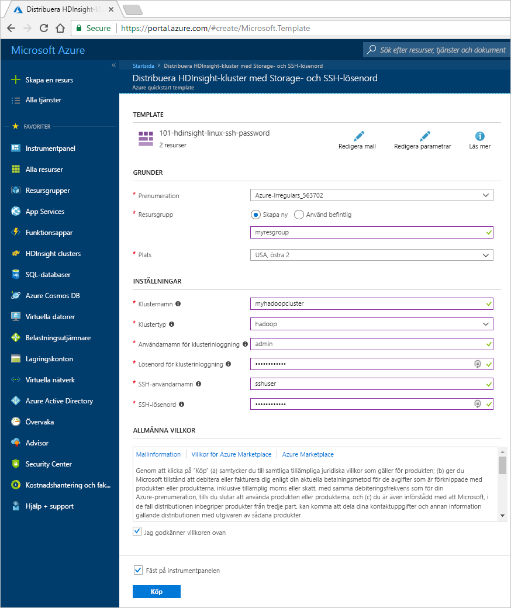
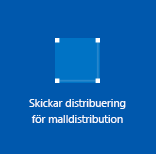
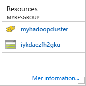
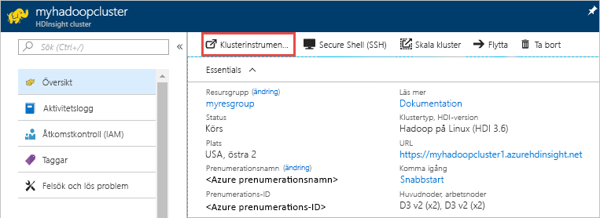
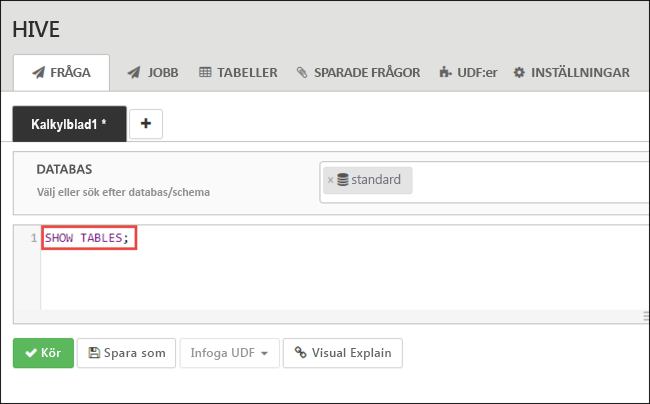
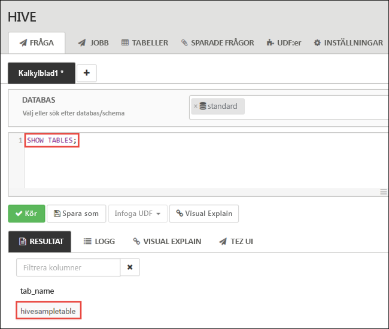
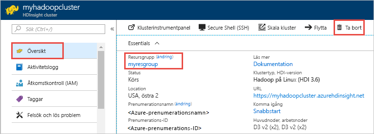

# Snabbstart: Komma igång med Hadoop och Hive i Azure HDInsight med Resource Manager-mall

I den här artikeln får du lära dig hur du skapar [Hadoop](http://hadoop.apache.org/)-kluster i HDInsight med en Resource Manager-mall och sedan kör Hive-jobb i HDInsight. De flesta Hadoop-jobb är batchjobb. Du skapar ett kluster, kör vissa jobb och tar sedan bort klustret. I den här artikeln utför du alla tre aktiviteterna.

I den här snabbstarten använder du en Resource Manager-mall för att skapa ett HDInsight Hadoop-kluster. Du kan även skapa ett kluster med [Azure Portal](apache-hadoop-linux-create-cluster-get-started-portal.md).

För närvarande innehåller HDInsight [sju olika klustertyper](./apache-hadoop-introduction.md#cluster-types-in-hdinsight). Varje typ av kluster har stöd för olika komponentuppsättningar. Samtliga klustertyper stöder Hive. En lista över stödda komponenter som hanteras i HDInsight finns i [Vad är nytt i de Hadoop-klusterversioner som tillhandahålls av HDInsight?](../hdinsight-component-versioning.md)  

Om du inte har en Azure-prenumeration kan du [skapa ett kostnadsfritt konto ](https://azure.microsoft.com/free/) innan du börjar.

## Skapa ett Hadoop-kluster

I det här avsnittet skapar du ett Hadoop-kluster i HDInsight med en Azure Resource Manager-mall. Du behöver inte ha någon erfarenhet av Resource Manager-mallar för att kunna följa den här artikeln. 

1. Klicka på knappen **Distribuera till Azure** om du vill logga in på Azure och öppna Resource Manager-mallen i Azure Portal. 
   
    

2. Ange eller välj de värde som föreslås i följande skärmbild:

    > [!NOTE]
    > De värden som du anger måste vara unika och bör följa riktlinjerna för namngivning. Mallen utför inte några verifieringskontroller. Om de värden som du anger redan används, eller inte följer riktlinjerna, får du ett felmeddelande när du har skickat mallen.       
    > 
    >
    
    

    Ange eller välj följande värden:
    
    |Egenskap  |Beskrivning  |
    |---------|---------|
    |**Prenumeration**     |  Välj din Azure-prenumeration. |
    |**Resursgrupp**     | Skapa en resursgrupp eller välj en befintlig resursgrupp.  En resursgrupp är en behållare med Azure-komponenter.  I det här fallet innehåller resursgruppen HDInsight-klustret och det beroende Azure Storage-kontot. |
    |**Plats**     | Välj en Azure-plats där du vill skapa klustret.  Välj en plats närmare så får du bättre prestanda. |
    |**Klustertyp**     | Välj **Hadoop**. |
    |**Klusternamn**     | Ange ett namn för Hadoop-klustret. Eftersom alla kluster i HDInsight delar samma DNS-namnområde måste namnet vara unikt. Namnet kan bestå av upp till 59 tecken, inklusive bokstäver, siffror och bindestreck. De första och sista tecknen i namnet får inte vara bindestreck. |
    |**Inloggningsnamn och lösenord för klustret**     | Standardinloggningsnamnet är **admin**. Lösenordet måste bestå av minst 10 tecken och måste innehålla åtminstone en siffra, en versal, en gemen, ett alfanumeriskt tecken (förutom tecknen ' " ` \). Se till att du **inte anger** vanliga lösenord som Pass@word1.|
    |**SSH-användarnamn och lösenord**     | Standardanvändarnamnet är **sshuser**.  Du kan byta namn på SSH-användarnamn.  SSH-användarlösenordet har samma krav som lösenordet för klusterinloggning.|
       
    Vissa egenskaper har hårdkodats i mallen.  Du kan konfigurera dessa värden från mallen. Fler förklaringar av dessa egenskaper finns i [Skapa Hadoop-kluster i HDInsight](../hdinsight-hadoop-provision-linux-clusters.md).

3. Välj **Jag godkänner villkoren som anges ovan**, **Fäst på instrumentpanelen** och sedan **Köp**. Du ser en ny panel som heter **Skicka distribution** på portalens instrumentpanel. Det tar cirka 20 minuter att skapa ett kluster.

    

4. När klustret skapas, ändras namnet i rubriktexten på panelen till det resursgruppsnamn som du har angett. Panelen visar även det HDInsight-kluster som skapas i resursgruppen. 
   
    
    
5. Panelen visas också den standardlagring som associeras med klustret. Varje kluster är beroende av ett [Azure Storage-konto](../hdinsight-hadoop-use-blob-storage.md) eller ett [Azure Data Lake-konto](../hdinsight-hadoop-use-data-lake-store.md). Det kallas Storage-konto av standardtyp. HDInsight-kluster och Storage-kontot av standardtyp måste finnas i samma Azure-region. Lagringskontot tas inte bort om du tar bort kluster.
    

> [!NOTE]
> Mer information om andra metoder för att skapa kluster och förstå de egenskaper som tillämpas i de här självstudierna finns i [Skapa HDInsight-kluster](../hdinsight-hadoop-provision-linux-clusters.md).       
> 
>

## Köra Hive-frågor

[Apache Hive](hdinsight-use-hive.md) är den populäraste komponenten som används i HDInsight. Det finns många sätt att köra Hive-jobb i HDInsight. I den här självstudiekursen ska du använda Ambari Hive-vyn från portalen. Andra metoder för att skicka Hive-jobb beskrivs i [Använda Hive-data i HDInsight](hdinsight-use-hive.md).

1. Öppna Ambari genom att välja **Klusterinstrumentpanel** i föregående skärmbild.  Du kan också gå till  **https://&lt;Klusternamn>.azurehdinsight.net**, där &lt;Klusternamn> är klustret du skapade i föregående avsnitt.

    

2. Ange det Hadoop-användarnamn och -lösenord som du angav när du skapade klustret. Standardanvändarnamnet är **admin**.

3. Öppna **Hive-vy** så som det visas på följande skärmbild:
   
    

4. På fliken **FRÅGA** klistrar du in följande HiveQL-instruktioner i kalkylbladet:
   
        SHOW TABLES;

    
   
   > [!NOTE]
   > Hive kräver semikolon.       
   > 
   > 

5. Välj **Kör**. Fliken **RESULTAT** visas under fliken **FRÅGA** och visar information om jobbet. 
   
    När frågan har slutförts visas resultatet av åtgärden på fliken **FRÅGA**. En tabell med namnet **hivesampletable** bör visas. Detta exempel på en Hive-tabell kommer med alla HDInsight-kluster.
   
    

6. Upprepa steg 4 och 5 för att köra följande fråga:
   
        SELECT * FROM hivesampletable;
   
7. Du kan också spara frågans resultat. Välj menyknappen till höger och ange om du vill ladda ned resultatet som en CSV-fil eller lagra den på lagringskontot som är associerat till klustret.

    

När du har slutfört ett Hive-jobb kan du [exportera resultaten till Azure SQL Database eller SQL Server-databasen](apache-hadoop-use-sqoop-mac-linux.md) och även [visualisera resultat i Excel](apache-hadoop-connect-excel-power-query.md). Mer information om hur du använder Hive i HDInsight finns i [Använda Hive och HiveQL med Hadoop i HDInsight för att analysera ett exempel på en Apache log4j-fil](hdinsight-use-hive.md).

## Felsöka

Om du får problem med att skapa HDInsight-kluster läser du [åtkomstkontrollkrav](../hdinsight-administer-use-portal-linux.md#create-clusters).

## Rensa resurser
När du är klar med artikeln kanske du vill ta bort klustret. Med HDInsight lagras dina data i Azure Storage så att du på ett säkert sätt kan ta bort ett kluster när det inte används. Du debiteras också för ett HDInsight-kluster, även när det inte används. Eftersom avgifterna för klustret är flera gånger större än avgifterna för lagring är det ekonomiskt sett bra att ta bort kluster när de inte används. 

> [!NOTE]
> Om du *omedelbart* fortsätter till nästa kurs för att lära dig hur man kör ETL-åtgärder med Hadoop på HDInsight vill du kanske låta klustret köra vidare. Anledningen till detta är att du i den här självstudiekursen måste skapa ett Hadoop-kluster igen. Men om du inte tänker göra nästa kurs direkt måste du ta bort klustret nu.
> 
> 

**Ta bort klustret och/eller Storage-kontot av standardtyp**

1. Gå tillbaka till webbläsarfliken där du har Azure-portalen. Du bör vara på översiktssidan för klustret. Om du endast vill ta bort klustret men behålla standardlagringskontot kan du klicka på **Ta bort**.

    

2. Om du vill ta bort klustret och standardlagringskontot öppnar du resursgruppssidan genom att välja resursgruppens namn (markerat i föregående skärmbild).

3. Ta bort resursgruppen som innehåller klustret och standardlagringskontot genom att välja **Ta bort resursgrupp**. Tänk på att lagringskontot tas bort om du tar bort resursgruppen. Välj att bara ta bort klustret om du vill behålla Storage-kontot.

## Nästa steg
I den här artikeln har du fått veta hur du skapar ett Linux-baserat HDInsight-kluster med en Resource Manager-mall och hur du utför grundläggande Hive-frågor. I nästa artikel får du lära dig hur du utför en extraktions-, transformations- eller inläsningsåtgärd (ETL) med Hadoop på HDInsight.

> [!div class="nextstepaction"]
>[Extrahera, transformera och läsa in data med Apache Hive på HDInsight ](../hdinsight-analyze-flight-delay-data-linux.md)

Om du är redo att börja arbeta med dina egna data och vill veta mer om hur data lagras i HDInsight eller om att hämta data till HDInsight, hittar du mer information i följande artiklar:

* Mer information om hur HDInsight använder Azure Storage finns i [Använda Azure Storage med HDInsight](../hdinsight-hadoop-use-blob-storage.md).
* Mer information om hur du överför data till HDInsight finns i [Överföra data till HDInsight](../hdinsight-upload-data.md).

Mer information om att analysera data med HDInsight finns i följande artiklar:

* Mer information om att använda Hive med HDInsight, inklusive hur du utför Hive-frågor från Visual Studio, finns i [Använda Hive med HDInsight](hdinsight-use-hive.md).
* Du kan läsa mer om Pig, ett språk som används för att omvandla data, i [Använda Pig med HDInsight](hdinsight-use-pig.md).
* Du kan läsa mer om MapReduce, ett sätt att skriva appar som bearbetar data i Hadoop, i [Använda MapReduce med HDInsight](hdinsight-use-mapreduce.md).
* Du kan läsa mer om hur du använder HDInsight Tools för Visual Studio för att analysera data i HDInsight i [Komma igång med Visual Studio Hadoop-verktyg för HDInsight](apache-hadoop-visual-studio-tools-get-started.md).

Mer information om att skapa eller hantera HDInsight-kluster hittar du i följande artiklar:

* Mer information om att hantera ditt Linux-baserade HDInsight-kluster finns i [Hantera HDInsight-kluster med Ambari](../hdinsight-hadoop-manage-ambari.md).
* Mer information om de alternativ som du kan välja när du skapar ett HDInsight-kluster finns i [Skapa HDInsight i Linux med anpassade alternativ](../hdinsight-hadoop-provision-linux-clusters.md).

[1]: ../HDInsight/apache-hadoop-visual-studio-tools-get-started.md

[hdinsight-provision]: hdinsight-provision-linux-clusters.md
[hdinsight-upload-data]: hdinsight-upload-data.md
[hdinsight-use-hive]: hdinsight-use-hive.md
[hdinsight-use-pig]: hdinsight-use-pig.md

