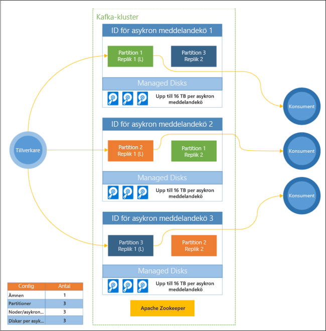

# Introduktion till Apache Kafka på HDInsight

[Apache Kafka](https://kafka.apache.org) är en distribuerad direktuppspelningsplattform med öppen källkod som kan användas för att skapa realtidsuppspelade datapipelines och program. Kafka tillhandahåller även funktionen för asynkron meddelandekö som liknar en meddelandekö där du kan publicera och prenumerera på namngivna dataströmmar. Kafka på HDInsight erbjuder en hanterad, maximalt skalbar och högtillgänglig tjänst i Microsoft Azure-molnet.

## Varför använda Kafka på HDInsight?

Kafka på HDInsight har följande två funktioner:

* __99.9 % serviceavtal (SLA) för Kafka-drifttid__: mer information finns i dokumentet [SLA information for HDInsight](https://azure.microsoft.com/support/legal/sla/hdinsight/v1_0/) (SLA-information för HDInsight).

* __Feltolerans__: Kafka utformades med en endimensionell vy av ett rack, vilket fungerar bra i vissa miljöer. I miljöer som Azure är rack däremot uppdelade i två dimensioner – uppdateringsdomäner (UD) och feldomäner (FD). Microsoft tillhandahåller verktyg som balanserar om Kafka-partitioner och -repliker mellan uppdateringsdomäner och feldomäner. 

    Mer information finns i [Hög tillgänglighet med Kafka i HDInsight](apache-kafka-high-availability.md).

* **Integrering med Azure Managed Disks**: Managed Disks ger högre skala och genomströmning för diskar som används av Kafka i HDInsight, upp till 16 TB per nod i klustret.

    Se [Ökad skalbalhet med Kafta på HDInsight](apache-kafka-scalability.md) för mer information om att konfigurera hanterade diskar med Kafka på HDInsight.

    För mer information om hanterade diskar, se [Hanterade Azure-diskar](../../virtual-machines/windows/managed-disks-overview.md).

* **Aviseringar, övervakning och förutsägande underhåll**: Azure Log Analytics kan användas till att övervaka Kafka i HDInsight. I Log Analytics kan du se information på virtuell dator-nivå, som diskar, nätverksmått och JMX-mått, från Kafka.

    Mer information finns i [Analysera loggar för Kafka i HDInsight](apache-kafka-log-analytics-operations-management.md).

* **Replikering av Kafka-data**: Kafka innehåller verktyget MirrorMaker som replikerar data mellan olika Kafka-kluster.

    Information om hur du använder MirrorMaker finns i [Replicate Kafka topics with Kafka on HDInsight](apache-kafka-mirroring.md) Replikera Kafka-ämnen med Kafka i HDInsight.

* **Skalning av klustret**: i HDInsight kan du ändra antalet arbetarnoder (som är värd för Kafkas asynkrona meddelandekö) när klustret har skapats. Skala upp ett kluster när arbetsbelastningen ökar eller skala ned det för att minska kostnaderna. Du kan utföra skalningen från Azure-portalen, Azure PowerShell och andra Azure-hanteringsgränssnitt. För Kafka bör du balansera om partitionsrepliker efter eventuell skalning. När du balanserar om partitionerna kan Kafka dra nytta av nya antalet arbetarnoder.

    Mer information finns i [Hög tillgänglighet med Kafka i HDInsight](apache-kafka-high-availability.md).

* **Meddelandemönster av typen publicera-prenumerera**: Kafka innehåller ett producent-API för publicering av poster till ett Kafka-ämne. Konsument-API används när det finns en prenumererar på ett ämne.

    Mer information finns i [Kom igång med Kafka i HDInsight](apache-kafka-get-started.md).

* **Dataströmsbearbetning**: Kafka används ofta med Apache Storm eller Spark för bearbetning av dataströmmar i realtid. Kafka 0.10.0.0 (HDInsight version 3.5 och 3.6) införde en strömmande API som gör att du kan skapa direktuppspelade lösningar utan Storm eller Spark.

    Mer information finns i [Kom igång med Kafka i HDInsight](apache-kafka-get-started.md).

* **Vågrät skala**: Kafka partitionerar dataströmmar mellan noderna i HDInsight-klustret. Konsumentprocesser kan associeras med enskilda partitioner för att ge belastningsutjämning när poster används.

    Mer information finns i [Kom igång med Kafka i HDInsight](apache-kafka-get-started.md).

* **Leverans i ordning**: Inom varje partition lagras posterna i strömmen i den ordning som de togs emot. Genom att associera en konsumentprocess per partition bearbetas posterna garanterat i ordning.

    Mer information finns i [Kom igång med Kafka i HDInsight](apache-kafka-get-started.md).

## Användningsfall

* **Meddelanden**: Eftersom den stöder meddelandemönstret publicera-prenumerera används Kafka ofta som en asynkron meddelandekö.

* **Aktivitetsspårning**: Eftersom Kafka innehåller i ordningsbaserad loggning av poster kan den användas för att spåra och återskapa aktiviteter. Till exempel användaråtgärder på en webbplats eller i ett program.

* **Sammanställning**: Med hjälp av strömbearbetning kan du sammanställa information från olika strömmar för att kombinera och centralisera information till användningsdata.

* **Omvandling**: Med dataströmsbearbetning kan du kombinera och utöka data från flera inkommande avsnitt i ett eller flera utdataämnen.

## Arkitektur

Det här diagrammet visar en typisk Kafka-konfiguration som använder konsumentgrupper, partitionering och replikering för att erbjuda parallell läsning av händelser med feltolerans. Apache ZooKeeper är byggt för samtidiga och elastiska transaktioner med låg latens, eftersom det hanterar Kafka-klusters tillstånd. Kafka lagrar poster i *ämnen*. Poster produceras av *producenter*, och används av *konsumenter*. Producenter hämtar poster från asynkrona Kafka-*meddelandeköer*. Varje arbetsnod i HDInsight-klustret är en asynkron Kafka-meddelandekö. En partition skapas för varje konsument, vilket möjliggör parallell bearbetning av strömmade data. Replikering används för att sprida partitionerna mellan noder, vilket skyddar mot nodavbrott. En partition som är markerad med *(L)* är ledande för den angivna partitionen. Producenttrafik dirigeras till varje ledande nod med det tillstånd som hanteras av ZooKeeper.

Alla Kafka-meddelandeköer använder Azure Managed Disks. Antalet diskar anges av användaren och dessa kan ge upp till 16 TB lagring per meddelandekö.

> [!IMPORTANT]
> Kafka har ingen information om den underliggande maskinvaran (rack) i Azure-datacentret. För att kontrollera att partitionerna är rätt balanserade över den underliggande maskinvaran kan du läsa dokumentet [Konfigurera hög tillgänglighet för data (Kafka)](apache-kafka-high-availability.md).

## Nästa steg

Använd följande länkar om du vill veta om hur du använder Apache Kafka på HDInsight:

* [Kom igång med Kafka på HDInsight](apache-kafka-get-started.md)

* [Använd MirrorMaker för att skapa en replik av Kafka på HDInsight](apache-kafka-mirroring.md)

* [Använda Apache Storm med Kafka på HDInsight](../hdinsight-apache-storm-with-kafka.md)

* [Använda Apache Spark med Kafka på HDInsight](../hdinsight-apache-spark-with-kafka.md)

* [Ansluta till Kafka via ett trådlöst Azure-nätverk](apache-kafka-connect-vpn-gateway.md)