# Snabbstart: Testa en molnbaserad lösning för att hantera mina industriella IoT-enheter

Den här snabbstarten visar hur du distribuerar Azure IoT-lösningsacceleratorn Ansluten fabrik för att köra en molnbaserad övervaknings- och hanteringssimulering för industriella IoT-enheter. När du distribuerar lösningsacceleratorn Ansluten fabrik är den förfylld med simulerade resurser som hjälper dig genom ett vanligt IoT-industriscenario. Flera simulerade fabriker är anslutna till det här scenariot. De rapporterar de datavärden som behövs för att beräkna övergripande utrustningseffektivitet (Overall Equipment Efficiency, OEE) och KPI:er (Key Performance Indicators). Den här snabbstarten visar hur du använder lösningsinstrumentpanelen för att:

* Övervaka fabrik, produktionslinjer, stations-OEE och KPI-värden.
* Analysera telemetridata som genereras av dessa enheter.
* Svara på larm.

Du behöver en aktiv Azure-prenumeration för att kunna utföra den här snabbstarten.

Om du inte har en Azure-prenumeration kan du skapa ett [kostnadsfritt konto](https://azure.microsoft.com/free/?WT.mc_id=A261C142F) innan du börjar.

## Distribuera lösningen

När du distribuerar lösningsacceleratorn till Azure-prenumerationen måste du ange några konfigurationsalternativ.

Logga in på [azureiotsolutions.com](https://www.azureiotsolutions.com/Accelerators) med dina Azure-kontouppgifter.

Klicka på **Testa nu** i panelen **Ansluten fabrik**.

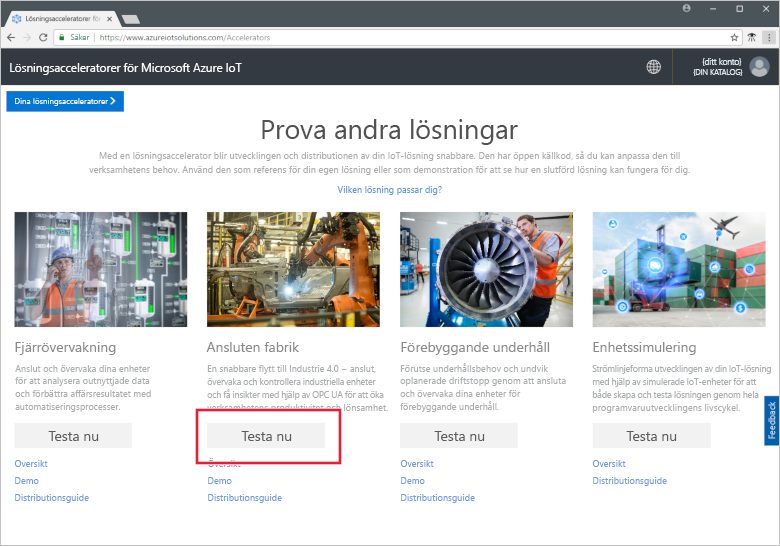

På sidan **Skapa lösningen Ansluten fabrik** anger du ett unikt **lösningsnamn** för lösningsacceleratorn Ansluten fabrik. Det här namnet är namnet på den Azure-resursgrupp som innehåller alla acceleratorresurser för lösningen. I den här snabbstarten kallar vi den för **MyDemoConnectedFactory**.

Välj den **prenumeration** och den **region** du vill använda för att distribuera lösningsacceleratorn. Normalt väljer du regionen närmast dig. I den här snabbstarten använder vi **Visual Studio Enterprise** och **USA, östra**. Du måste vara [global administratör eller användare](iot-accelerators-permissions.md) i prenumerationen.

Klicka på **Skapa lösning** för att inleda distributionen. Processen tar minst fem minuter att köra:

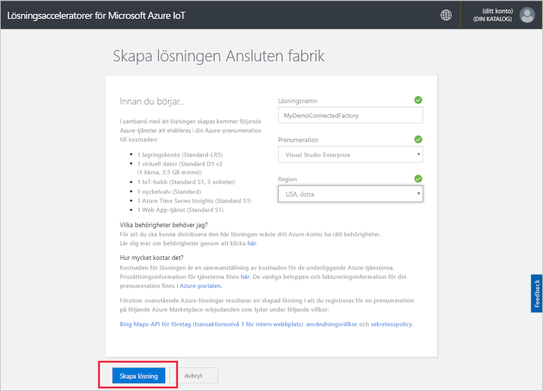

## Logga in på lösningen

När distributionen till Azure-prenumerationen är klar visas en grön bockmarkering och **Redo** på lösningspanelen. Du kan nu logga in på instrumentpanelen för lösningsacceleratorn Ansluten fabrik.

På sidan **Etablerade lösningar** klickar du på den nya lösningsacceleratorn Ansluten fabrik:

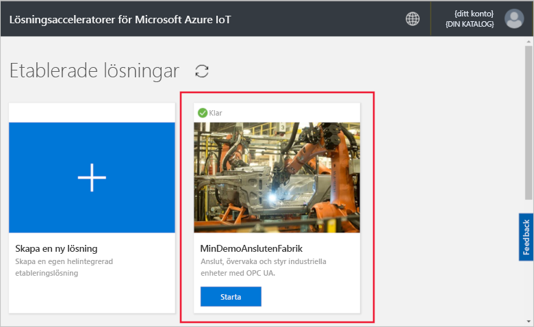

Du kan visa information om lösningsacceleratorn Ansluten fabrik på panelen som visas. Välj **Lösningens instrumentpanel** för att visa lösningsacceleratorn Ansluten fabrik:

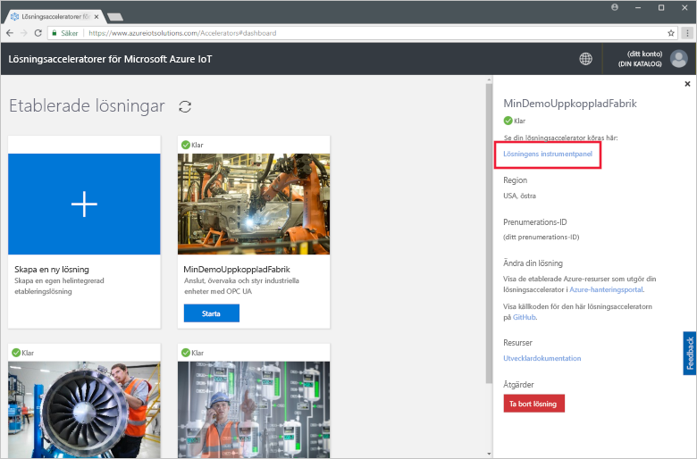

Klicka på **Acceptera** för att acceptera begäran om behörigheter som instrumentpanelen för lösningen Ansluten fabrik visar i webbläsaren. Den visar en uppsättning simulerade fabriker, produktionslinjer och stationer.

## Visa instrumentpanelen

Standardvyn är *instrumentpanelen*. Du kan navigera till andra delar av portalen via menyn till vänster på sidan:

[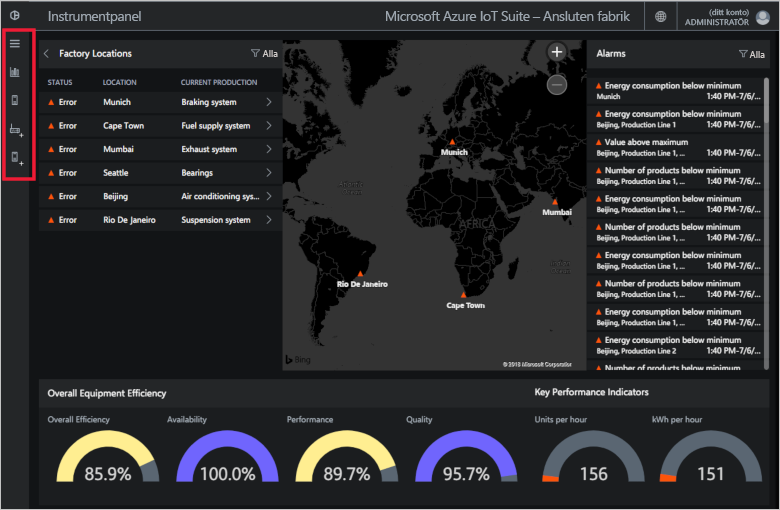](./media/quickstart-connected-factory-deploy/dashboard-expanded.png#lightbox)

Du kan använda instrumentpanelen för att hantera dina industriella IoT-enheter. Ansluten fabrik använder en hierarki för att visa en global fabrikskonfiguration. På den högsta nivån i hierarkin finns det företag som innehåller en eller flera fabriker. Varje fabrik innehåller produktionslinjer, och varje produktionslinje består av stationer. På varje nivå kan du se OEE och KPI:er, publicera nya noder för telemetri och svara på larm.

På instrumentpanelen kan du se:

## Övergripande utrustningseffektivitet

Panelen **Övergripande utrustningseffektivitet** visar OEE-värdena för hela företaget eller den fabrik, produktionslinje eller station du tittar på. Det här värdet sammanställs från stationsvyn till företagsnivån. OEE-bilden och dess beståndsdelar kan analyseras ytterligare.

[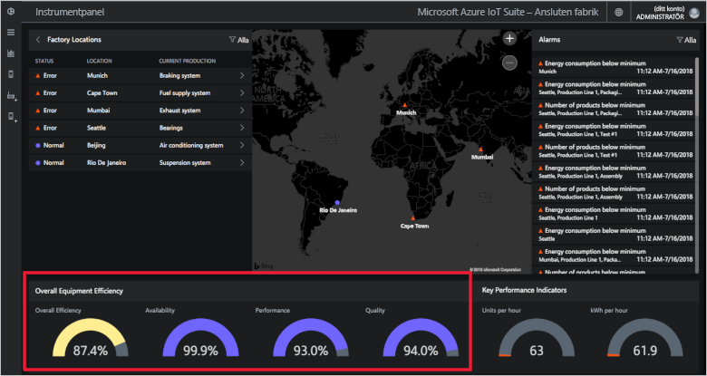](./media/quickstart-connected-factory-deploy/oee-expanded.png#lightbox)

OEE mäter produktionseffektiviteten med hjälp av produktionsrelaterade driftsparametrar. OEE är ett branschstandardmått som beräknas genom att multiplicera tillgänglighet, anläggningsutnyttjande och kvalitetsutbyte: OEE = tillgänglighet x anläggningsutnyttjande x kvalitetsutbyte.

Du kan ytterligare analysera OEE för vilken nivå som helst i hierarkidata. Klicka på reglaget för OEE, tillgänglighet, prestanda eller kvalitetsprocent. En kontextpanel visas med visualiseringar som visar data över olika tidsskalor:

[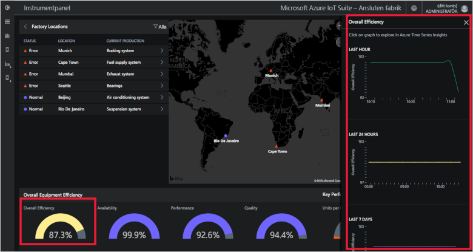](./media/quickstart-connected-factory-deploy/oeedetail-expanded.png#lightbox)

Du kan klicka på ett diagram för att göra vidare analyser av data.

### KPI:er

Panelen för **KPI:er** visar antalet enheter som produceras per timme och energi (kWh) som förbrukas av hela företaget eller av den fabrik, produktionslinje eller station som du visar. Dessa värden sammanställs från stationsvyn till företagsnivån.

[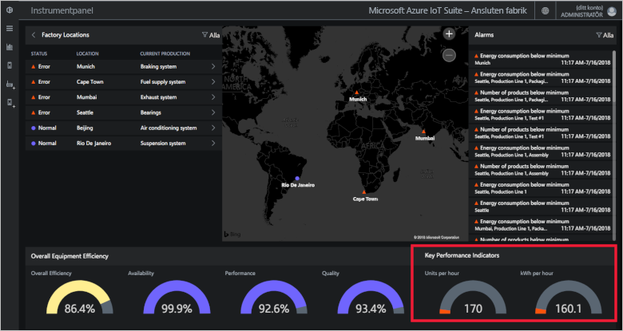](./media/quickstart-connected-factory-deploy/kpis-expanded.png#lightbox)

Du kan ytterligare analysera KPI:er för vilken nivå som helst i hierarkidata. Klicka på reglaget för OEE, tillgänglighet, prestanda eller kvalitetsprocent. En kontextpanel visas med visualiseringar som visar data över olika tidsskalor:

[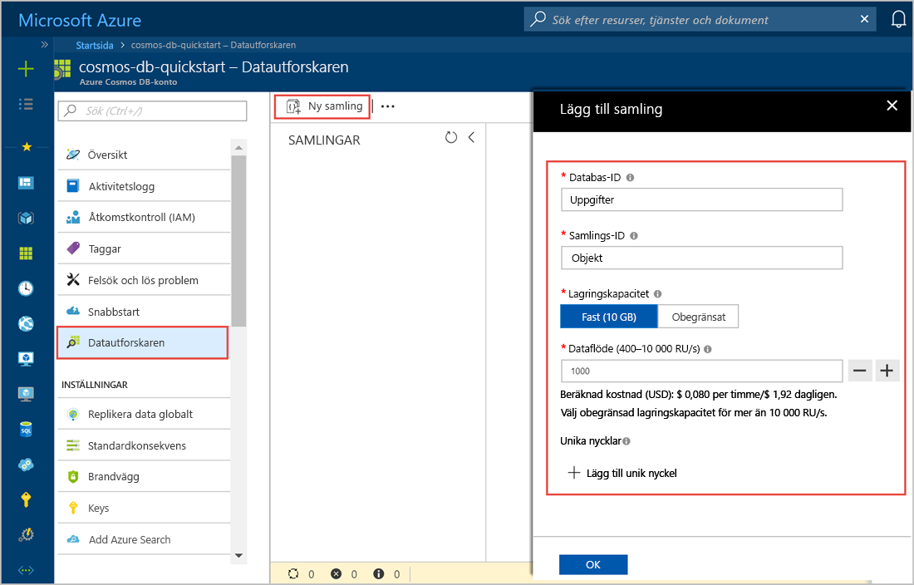](./media/quickstart-connected-factory-deploy/kpidetail-expanded.png#lightbox)

Du kan klicka på ett diagram för att göra vidare analyser av data.

### Fabriksplatser

En panel med **fabriksplatser** som visar status, plats och aktuell produktionskonfiguration i lösningen. Första gången du kör lösningsacceleratorn visar instrumentpanelen en simulerad uppsättning fabriker. Varje produktionslinjesimulering består av tre verkliga OPC UA-servrar som kör simulerade uppgifter och delar data. Mer information om OPC UA finns i [Vanliga frågor och svar om Ansluten fabrik](iot-accelerators-faq-cf.md):

[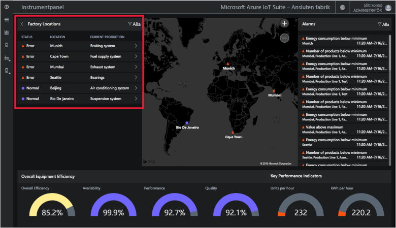](./media/quickstart-connected-factory-deploy/factorylocations-expanded.png#lightbox)

Du kan navigera genom lösningshierarkin och visa OEE-värden och KPI:er på varje nivå:

1. I **Fabriksplatser** klickar du på **Mumbai**. Du ser produktionslinjerna på den här platsen.

1. Klicka på **Produktionslinje 1**. Du ser stationerna på den här produktionslinjen.

1. Klicka på **Packaging** (Paketering). Du ser OPC UA-noder som publicerats av denna station.

1. Klicka på **EnergyConsumption** (Energiförbrukning). Du ser vissa diagram som ritar det här värdet över olika tidsskalor. Du kan klicka på ett diagram för att göra vidare analyser av data.

[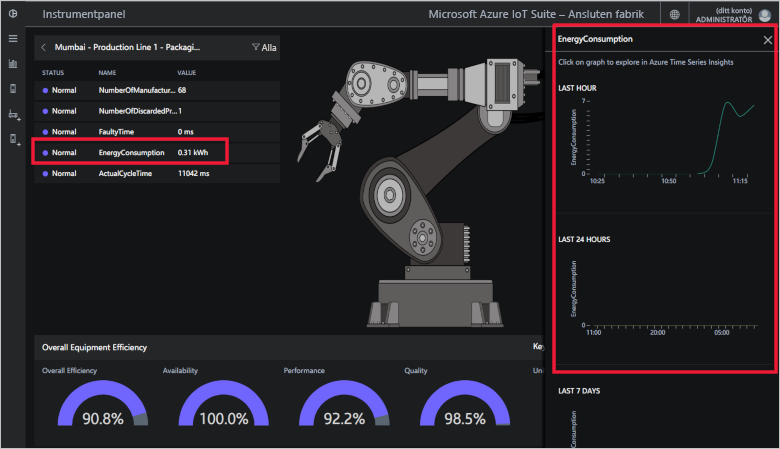](./media/quickstart-connected-factory-deploy/explorelocations-expanded.png#lightbox)

### Karta

Om din prenumeration ger åtkomst till [Bing Maps-API:t](iot-accelerators-faq-cf.md) visar *fabrikskartan* geografisk plats och status för alla fabriker i lösningen. Klicka på platserna som visas på kartan om du vill visa mer detaljerad information om platsen.

[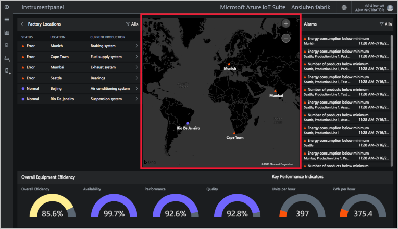](./media/quickstart-connected-factory-deploy/map-expanded.png#lightbox)

### Larm

**Larmpanelen** visar de larm som genereras när ett rapporterat värde eller ett beräknat OEE/KPI-värde överstiger det konfigurerade tröskelvärdet. Den här panelen visar larm på varje nivå i hierarkin, från stationsnivå till företagsnivå. Varje larm innehåller en beskrivning, datum, tid, plats och antal förekomster:

[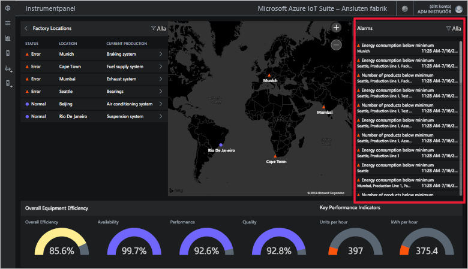](./media/quickstart-connected-factory-deploy/alarms-expanded.png#lightbox)

Du kan analysera de data som orsakade larmet från instrumentpanelen. Om du är administratör kan du vidta standardåtgärder på larmen, till exempel:

* Stäng larmet.
* Bekräfta larmet.

Klicka på något av larmen. I listrutan **Välj åtgärd** väljer du **Bekräfta avisering** och klickar sedan på **Tillämpa**:

[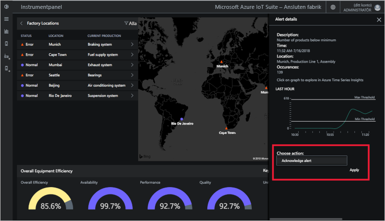](./media/quickstart-connected-factory-deploy/acknowledge-expanded.png#lightbox)

Om du vill analysera larmdata mer i detalj klickar du på diagrammet på larmpanelen.

Larmen genereras av regler som anges i en konfigurationsfil i lösningsacceleratorn. Dessa regler kan generera larm när OEE- eller KPI-värden eller OPC UA-nodvärden överskrider de angivna tröskelvärdena.

## Rensa resurser

Om du vill utforska ytterligare låter du lösningsacceleratorn Ansluten fabrik förbli distribuerad.

Om du inte längre behöver lösningsacceleratorn tar du bort den från sidan [Etablerade lösningar](https://www.azureiotsolutions.com/Accelerators#dashboard) genom att välja den och sedan klicka på **Ta bort lösningen**:

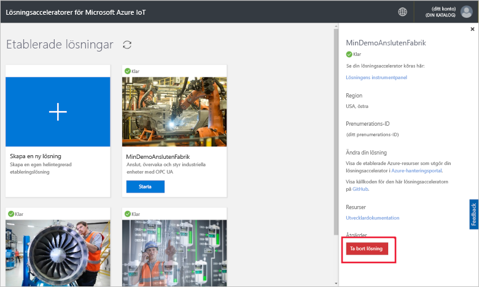

## Nästa steg

I den här snabbstarten distribuerade du lösningsacceleratorn Ansluten fabrik och lärde dig hur du navigerar i dina fabriker, produktionslinjer och stationer. Du såg även hur du visar OEE och KPI-värden på alla nivåer i hierarkin och hur du svarar på larm.

Information om hur du använder andra funktioner i instrumentpanelen för att hantera dina industriella IoT-enheter finns i följande instruktionsguide:

> [!div class="nextstepaction"]
> [Använda instrumentpanelen Ansluten fabrik](iot-accelerators-connected-factory-dashboard.md)