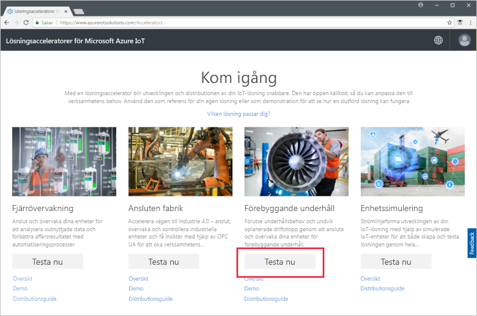
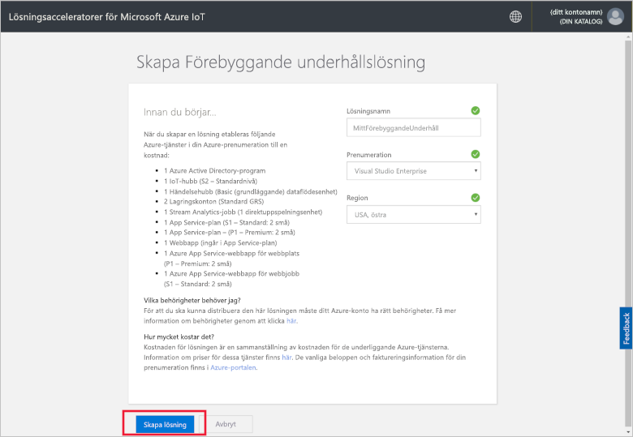
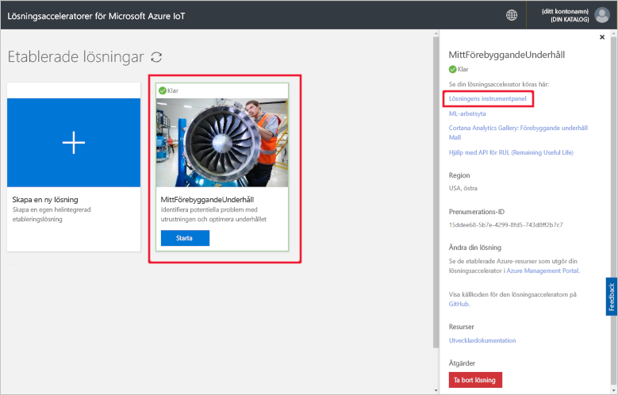
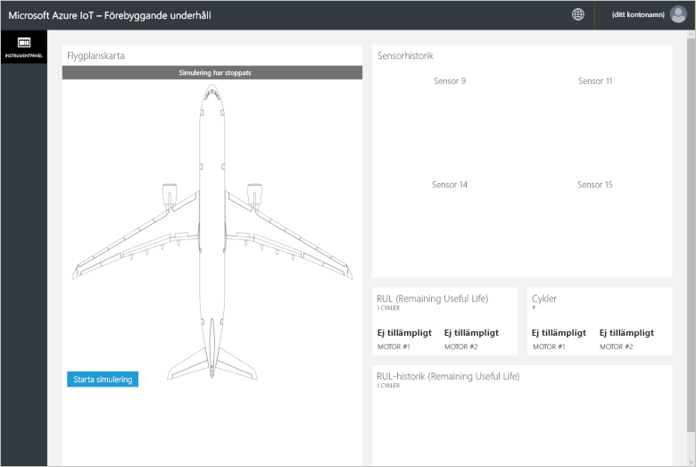
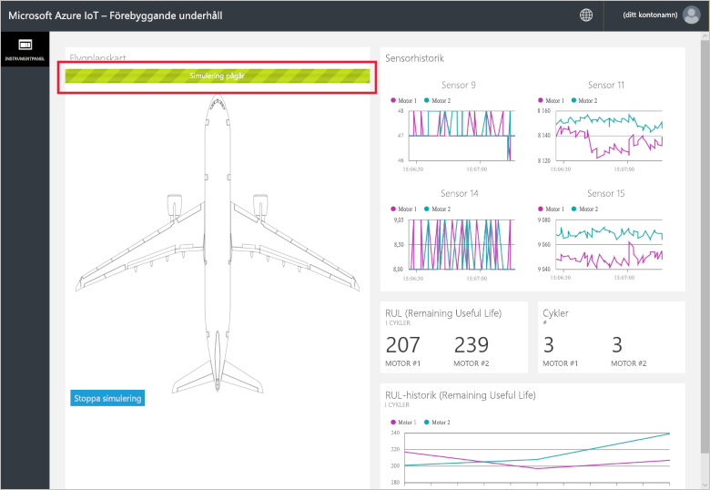
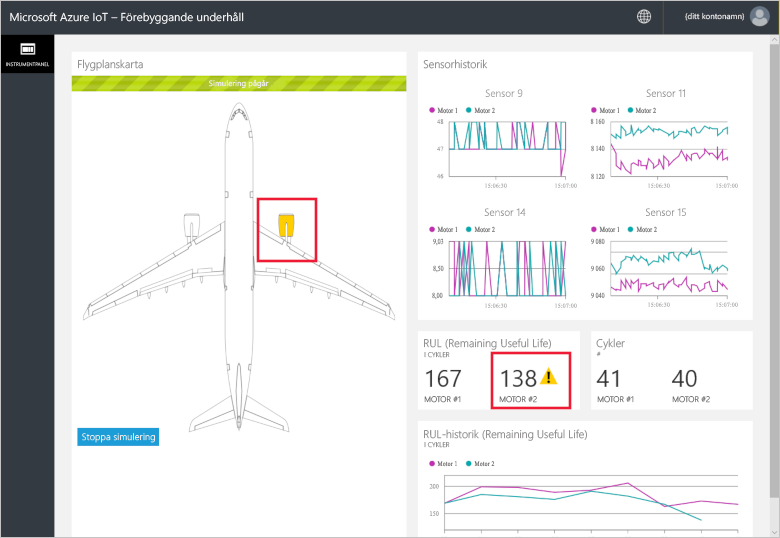
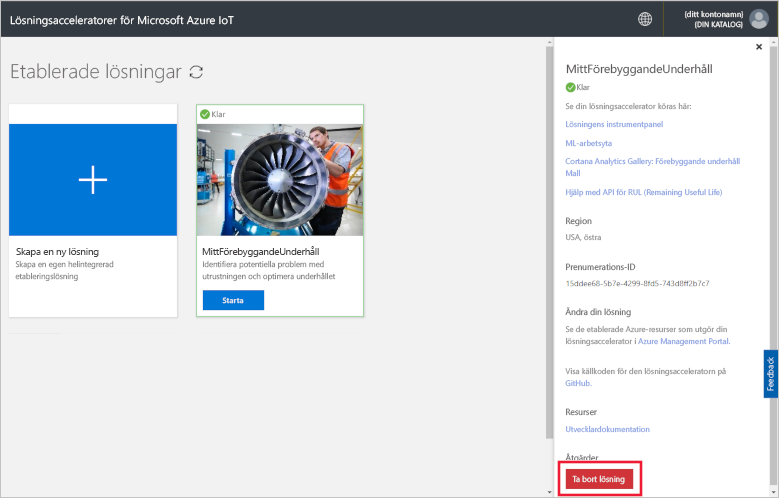

# Snabbstart: Distribuera en molnbaserad lösning för att köra en analys av förutsägande underhåll på anslutna enheter

Den här snabbstarten beskriver hur du distribuerar Azure IoT-lösningsacceleratorn för förutsägande underhåll för att använda den som en molnbaserad lösning för förutsägande underhåll för dina IoT-enheter. När du har distribuerat lösningsacceleratorn kan du köra en simulering med data för flygplansmotorer med hjälp av lösningens **instrumentpanel**.

Fabrikam är ett regionalt flygbolag som fokuserar på bra kundupplevelser till konkurrenskraftiga priser. En orsak till flygförseningar är underhållsproblem, och flygplansmotorernas underhåll är särskilt krävande. Fabrikam måste till vilket pris som helst förhindra motorfel under flygningar och inspekterar därför regelbundet sina motorer och schemalägger underhåll med utgångspunkt i en plan. Flygplansmotorer slits dock inte alltid likadant. En del onödigt underhåll utförs på motorer. Dessutom kan det uppstå problem som gör att planet blir stående tills underhåll har utförts. Dessa problem bli extra kostsamma om ett flygplan finns på en plats där rätt tekniker eller reservdelar inte är tillgängliga.

Motorerna i Fabrikams flygplan är utrustade med sensorer som övervakar motortillståndet under flygning. Fabrikams dataspecialister har under flera år samlat in data om motorernas drift och eventuella fel och har tagit fram en modell som kan förutse flygplansmotorernas återstående livslängd. Modellen använder en korrelation mellan data från fyra av motorsensorerna och motorförslitningar som med tiden leder till motorfel. Fabrikam fortsätter att utföra regelbundna inspektioner för att säkerställa säkerheten, men nu kan man använda modeller för att beräkna varje motors återstående livslängd efter varje flygning. Fabrikam kan nu förutsäga framtida driftstopp och planera för underhåll för att minimera flygplanens marktid och minska driftkostnaderna samtidigt som man säkerställer passagerarnas och flygplansbesättningens säkerhet.

## Nödvändiga komponenter

Du behöver en aktiv Azure-prenumeration för att kunna utföra den här snabbstarten.

Om du inte har en Azure-prenumeration kan du skapa ett [kostnadsfritt konto](https://azure.microsoft.com/free/?WT.mc_id=A261C142F) innan du börjar.

## Distribuera lösningen

När du distribuerar lösningsacceleratorn till Azure-prenumerationen måste du ange några konfigurationsalternativ.

Logga in på [azureiotsolutions.com](https://www.azureiotsolutions.com/Accelerators) med dina Azure-kontouppgifter.

Klicka på **Testa nu** på panelen **Förutsägande underhåll**.

På sidan **Create Predictive Maintenance solution** (Skapa lösning för förutsägande underhåll) anger du ett unikt **lösningsnamn** för utvecklingsacceleratorn för förutsägande underhåll.

Välj den **prenumeration** och **region** du vill använda för att distribuera lösningsacceleratorn. Normalt väljer du regionen närmast dig. Du måste vara [global administratör eller användare](iot-accelerators-permissions.md) i prenumerationen.

Klicka på **Skapa lösning** för att inleda distributionen. Processen tar minst fem minuter att köra:

## Logga in till lösningen

När distributionen till din Azure-prenumeration är klar kan du logga in på instrumentpanelen för lösningsacceleratorn för förutsägande underhåll.

Klicka på den nya lösningsacceleratorn för förutsägande underhåll på sidan **Etablerade lösningar**. Du kan visa information om lösningsacceleratorn på panelen som visas. Välj **Lösningens instrumentpanel** för att visa lösningsacceleratorn för förutsägande underhåll:

Acceptera behörighetsförfrågan genom att klicka på **Acceptera**. Nu visas instrumentpanelen för lösningen för förutsägande underhåll i webbläsaren:

Starta simuleringen genom att klicka på **Starta simulering**. Instrumentpanelen fylls med sensorhistorik, RUL-värden, cykler och RUL-historik:

Om RUL-värdet är mindre än 160 (ett godtyckligt tröskelvärde som valts som exempel) visas en varningssymbol på lösningsportalen bredvid RUL-värdet. Dessutom markeras flygplansmotorn i gult på lösningsportalen. Lägg märke till att RUL-värdena har en nedåtgående trend generellt, men med många upp- och nedgångar. Detta mönster beror på de olika cykellängderna och modellens precision.

Den fullständiga simuleringen tar 35 minuter för att slutföra 148 cykler. RUL-tröskelvärdet på 160 nås för första gången vid cirka 5 minuter och båda motorerna når tröskelvärdet ungefär vid 8 minuter.

Simuleringen kör igenom den fullständiga datauppsättningen i 148 cykler och bestämmer den slutliga återstående användbara livslängden och cykelvärdena.

Du kan stoppa simuleringen när du vill, men om du klickar på **Starta simulering** spelas simuleringen upp igen från början av datauppsättningen.

## Rensa resurser

Om du vill utforska ytterligare låter du lösningsacceleratorn för förutsägande underhåll förbli distribuerad.

Om du inte längre behöver lösningsacceleratorn tar du bort den från sidan [Etablerade lösningar](https://www.azureiotsolutions.com/Accelerators#dashboard):

## Nästa steg

I den här snabbstarten har du distribuerat lösningsacceleratorn för förutsägande underhåll och kört en simulering.

Mer information om lösningsacceleratorn finns i artikeln.

> [!div class="nextstepaction"]
> [Översikt över lösningsaccelerator för förutsägande underhåll](iot-accelerators-predictive-walkthrough.md)
