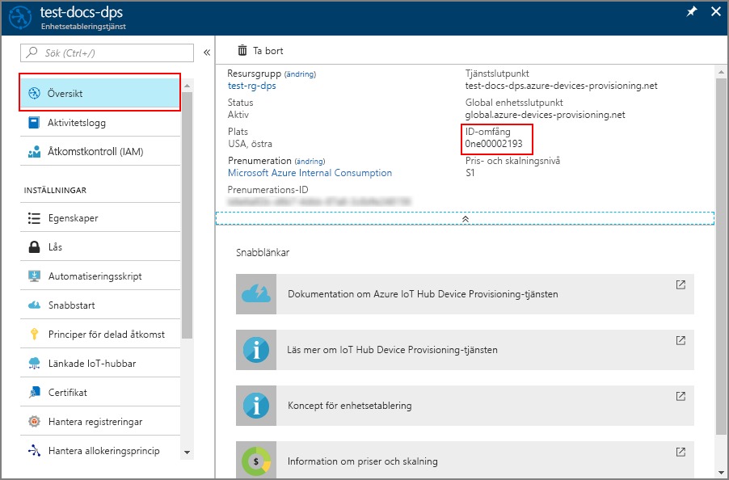
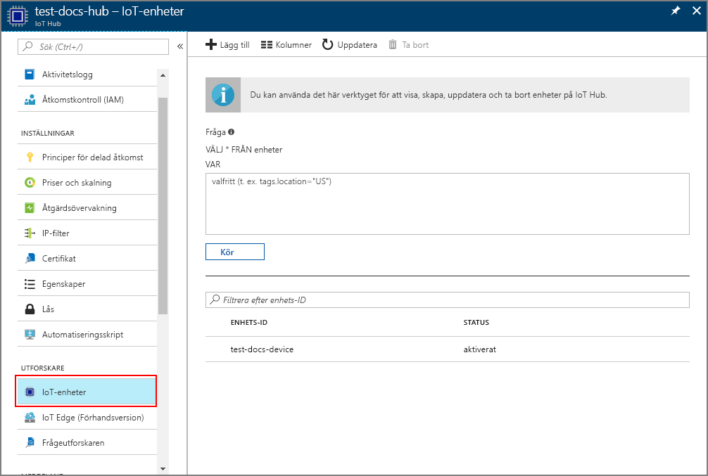

# <a name="quickstart-provision-an-x509-simulated-device-using-the-azure-iot-c-sdk"></a>Snabbstart: Etablera en simulerad X.509-enhet med Azure IoT C SDK

[!INCLUDE [iot-dps-selector-quick-create-simulated-device-x509](../../includes/iot-dps-selector-quick-create-simulated-device-x509.md)]

I den här snabbstarten får lära dig att skapa och köra en X.509-enhetssimulator på en Windows-utvecklingsdator. Du konfigurerar denna simulerade enhet för att tilldelas till en IoT-hubb med hjälp av en registrering med en instans av enhetsetableringstjänst. Exempelkoden från [Azure IoT C SDK](https://github.com/Azure/azure-iot-sdk-c) används för att simulera en startsekvens för enheten. Enheten identifieras baserat på registrering med etableringstjänsten och tilldelas till IoT-hubben.

Om du inte känner till processen för automatisk etablering bör du gå igenom [Begrepp inom automatisk etablering](concepts-auto-provisioning.md). Se även till att slutföra stegen i [Set up IoT Hub Device Provisioning Service with the Azure portal](./quick-setup-auto-provision.md) (Konfigurera IoT Hub-enhetsetableringstjänsten med Azure-portalen) innan du fortsätter med den här snabbstarten. 

[!INCLUDE [quickstarts-free-trial-note](../../includes/quickstarts-free-trial-note.md)]


## <a name="prerequisites"></a>Nödvändiga komponenter

* Visual Studio 2015 eller [Visual Studio 2017](https://www.visualstudio.com/vs/) med arbetsbelastningen [”Desktop development with C++”](https://www.visualstudio.com/vs/support/selecting-workloads-visual-studio-2017/) (Skrivbordsutveckling med C++) aktiverad.
* Senaste versionen av [Git](https://git-scm.com/download/) installerad.


<a id="setupdevbox"></a>

## <a name="prepare-a-development-environment-for-the-azure-iot-c-sdk"></a>Förbereda en utvecklingsmiljö för Azure IoT C SDK

I det här avsnittet förbereder du en utvecklingsmiljö som används för att skapa [Azure IoT C SDK](https://github.com/Azure/azure-iot-sdk-c) som innehåller exempelkoden för X.509-startsekvensen.

1. Ladda ned den senaste versionen av [CMake-byggesystemet](https://cmake.org/download/). Från samma webbplats söker du fram den kryptografiska hashen för den version av binär distribution som du valde. Kontrollera den hämta binära filen med hjälp av det motsvarande kryptografiska hashvärdet. I följande exempel används Windows PowerShell för att verifiera den kryptografisk hashen för version 3.11.4 av x64 MSI-distributionen:

    ```PowerShell
    PS C:\Users\wesmc\Downloads> $hash = get-filehash .\cmake-3.11.4-win64-x64.msi
    PS C:\Users\wesmc\Downloads> $hash.Hash -eq "56e3605b8e49cd446f3487da88fcc38cb9c3e9e99a20f5d4bd63e54b7a35f869"
    True
    ```

    Det är viktigt att förutsättningarna för Visual Studio (Visual Studio och arbetsbelastningen ”Desktop development with C++” (Skrivbordsutveckling med C++)) är installerade på datorn **innan** installationen av `CMake` påbörjas. När förutsättningarna är uppfyllda och nedladdningen har verifierats installerar du CMake-byggesystemet.

2. Öppna en kommandotolk eller Git Bash-gränssnittet. Kör följande kommando för att klona [Azure IoT C SDK](https://github.com/Azure/azure-iot-sdk-c) GitHub-lagringsplatsen:
    
    ```cmd/sh
    git clone https://github.com/Azure/azure-iot-sdk-c.git --recursive
    ```
    Storleken på den här lagringsplatsen är för närvarande cirka 220 MB. Den här åtgärden kan förväntas ta flera minuter att slutföra.


3. Skapa en `cmake`-underkatalog i rotkatalogen på git-lagringsplatsen och navigera till den mappen. 

    ```cmd/sh
    cd azure-iot-sdk-c
    mkdir cmake
    cd cmake
    ```

4. I kodexemplet används ett X.509-certifikat för att tillhandahålla attestering via X.509-autentisering. Kör följande kommando som skapar en version av SDK:t som är specifik för plattformen för din utvecklingsklient. En Visual Studio-lösning för den simulerade enheten genereras i `cmake`-katalogen. 

    ```cmd
    cmake -Duse_prov_client:BOOL=ON ..
    ```
    
    Om `cmake` inte hittar din C++-kompilerare kan du få kompileringsfel när du kör kommandot ovan. Om det händer ska du försöka köra det här kommandot i [kommandotolken i Visual Studio](https://docs.microsoft.com/dotnet/framework/tools/developer-command-prompt-for-vs). 

    När bygget är klart ser de sista utdataraderna ut ungefär som följande utdata:

    ```cmd/sh
    $ cmake -Duse_prov_client:BOOL=ON ..
    -- Building for: Visual Studio 15 2017
    -- Selecting Windows SDK version 10.0.16299.0 to target Windows 10.0.17134.
    -- The C compiler identification is MSVC 19.12.25835.0
    -- The CXX compiler identification is MSVC 19.12.25835.0

    ...

    -- Configuring done
    -- Generating done
    -- Build files have been written to: E:/IoT Testing/azure-iot-sdk-c/cmake
    ```


<a id="portalenroll"></a>

## <a name="create-a-self-signed-x509-device-certificate"></a>Skapa ett självsignerat X.509-enhetscertifikat

I det här avsnittet använder du ett självsignerat X.509-certifikat. Det är viktigt att tänka på följande:

* Självsignerade certifikat är endast till för testning och ska inte användas i produktion.
* Standardutgångsdatumet för ett självsignerat certifikat är 1 år.

Du kommer att använda exempelkoden från Azure IoT C SDK för att skapa det certifikat som ska användas med posten för enskild registrering för den simulerade enheten.

1. Starta Visual Studio och öppna den nya lösningsfilen med namnet `azure_iot_sdks.sln`. Den här lösningsfilen finns i den `cmake`-mapp som du tidigare skapade i roten på azure-iot-sdk-c git-lagringsplatsen.

2. I Visual Studio-menyn väljer du **Build (Skapa)** > **Build Solution (Skapa lösning)** för att skapa alla projekt i lösningen.

3. I fönstret *Solution Explorer* i Visual Studio går du till mappen **Provision (Etablera)\_Verktyg**. Högerklicka på projektet **dice\_device\_enrollment** (dice-enhetsregistrering) och markera **Set as Startup Project** (Ange som startprojekt). 

4. I Visual Studio-menyn väljer du **Felsökning** > **Starta utan felsökning** för att köra lösningen. I utdatafönstret anger du **i** för individuell registrering när du blir uppmanad till det. 

    I utdatafönstret visas ett lokalt genererat, självsignerat X.509-certifikat för din simulerade enhet. Kopiera utdata till Urklipp som börjar på **-----BEGIN CERTIFICATE-----** och slutar på den första **-----END CERTIFICATE-----**, och se till att du får med båda raderna. Observera att du behöver bara det första certifikatet från fönstret Utmatning.
 
5. Använd en textredigerare och spara certifikatet till en ny fil med namnet **_X509testcert.pem_**. 


## <a name="create-a-device-enrollment-entry-in-the-portal"></a>Skapa en post för enhetsregistrering i portalen

1. Logga in på Azure-portalen, klicka på knappen **Alla resurser** i den vänstra menyn och öppna Device Provisioning-tjänsten.

2. Välj fliken **Hantera registreringar** och klicka sedan på knappen **Lägg till enskild registrering** längst upp. 

3. På **Lägg till registrering** anger du följande information och klickar på knappen **Spara**.

    - **Mekanism:** Välj **X.509** som identitetsattesterings*mekanism*.
    - **Primär .pem- eller .cer-fil:** klicka på **Välj en fil** för att välja certifikatfilen X509testcert.pem, som du skapade tidigare.
    - **Enhets-ID för IoT Hub:** ange **test-docs-cert device** för att ge enheten ett ID.

    [](./media/quick-create-simulated-device-x509/individual-enrollment.png#lightbox)

    Om registreringen har lyckats visas din X.509-enhet som **riot-device-cert** under kolumnen *Registrerings-ID* på fliken *Enskilda registreringar*. 


<a id="firstbootsequence"></a>

## <a name="simulate-first-boot-sequence-for-the-device"></a>Simulera första startsekvens för enheten

I det här avsnittet uppdaterar du exempelkoden för att skicka enhetens startsekvens till din instans av enhetsetableringstjänsten. Den här startsekvensen medför att enheten identifieras och tilldelas till en IoT-hubb som är länkad till instansen av enhetsetableringstjänsten.


1. I Azure-portalen väljer du fliken **Översikt** för enhetsetableringstjänsten och noterar värdet för **_ID-omfång_**.

     

2. I fönstret *Solution Explorer* i Visual Studio går du till mappen **Provision (Etablera)\_Exempel**. Expandera exempelprojektet som heter **prov\_dev\_client\_sample**. Expandera **Källfiler** och öppna **prov\_dev\_client\_sample.c**.

3. Hitta konstanten `id_scope` och ersätt värdet med ditt värde för **ID-omfång** som du kopierade tidigare. 

    ```c
    static const char* id_scope = "0ne00002193";
    ```

4. Hitta definitionen för funktionen `main()` i samma fil. Kontrollera att variabeln `hsm_type` anges till `SECURE_DEVICE_TYPE_X509` i stället för `SECURE_DEVICE_TYPE_TPM` enligt nedan.

    ```c
    SECURE_DEVICE_TYPE hsm_type;
    //hsm_type = SECURE_DEVICE_TYPE_TPM;
    hsm_type = SECURE_DEVICE_TYPE_X509;
    ```

5. Högerklicka på projektet **prov\_dev\_client\_sample** och välj **Set as Startup Project** (Ange som startprojekt). 

6. I Visual Studio-menyn väljer du **Felsökning** > **Starta utan felsökning** för att köra lösningen. I meddelandet för att omkompilera projektet klickar du på **Ja**, för att omkompilera projektet innan du kör.

    Följande utdata är ett exempel på när etableringsenhetens klientprov lyckas med starten och ansluter till etableringstjänstinstansen för att hämta IoT-hubbinformation och registrera:

    ```cmd
    Provisioning API Version: 1.2.7

    Registering... Press enter key to interrupt.

    Provisioning Status: PROV_DEVICE_REG_STATUS_CONNECTED
    Provisioning Status: PROV_DEVICE_REG_STATUS_ASSIGNING
    Provisioning Status: PROV_DEVICE_REG_STATUS_ASSIGNING

    Registration Information received from service: 
    test-docs-hub.azure-devices.net, deviceId: test-docs-cert-device    
    ```

7. I portalen går du till den IoT-hubb som är kopplad till din etableringstjänst och klickar på fliken **IoT-enheter**. Vid lyckad etablering av den simulerade X.509-enheten till hubben visas dess enhets-ID på bladet **IoT-enheter** med *STATUS* **aktiverad**. Observera att du kan behöva klicka på knappen **Uppdatera** längst upp. 

     


## <a name="clean-up-resources"></a>Rensa resurser

Om du vill fortsätta att arbeta med och utforska enhetsklientexemplet ska du inte rensa de resurser som har skapats i den här snabbstarten. Om du inte planerar att fortsätta kan du använda stegen nedan för att ta bort alla resurser som har skapats i den här snabbstarten.

1. Stäng utdatafönstret för enhetsklientexemplet på datorn.
1. Klicka på **Alla resurser** på menyn till vänster på Azure-portalen och välj din Device Provisioning-tjänst. Öppna **Hantera registreringar** för tjänsten och klicka på fliken **Enskilda registreringar**. Välj *REGISTRERINGS-ID* för enheten du har registrerat i den här snabbstarten och klicka på knappen **Ta bort** högst upp. 
1. Klicka på **Alla resurser** på menyn till vänster på Azure-portalen och välj din IoT-hubb. Öppna **IoT-enheter** för din hubb, välj *ENHETS-ID* för den enhet som du har registrerat i den här snabbstarten och klicka på knappen **Ta bort** högst upp.

## <a name="next-steps"></a>Nästa steg

I den här snabbstarten har du skapat en X.509-simulerad enhet på Windows-datorn och etablerat den på IoT-hubben med hjälp av Azure IoT Hub Device Provisioning-tjänsten på portalen. Information om hur du registrerar X.509-enheten programmässigt får du om du fortsätter till snabbstarten för programmässig registrering av X.509-enheter. 

> [!div class="nextstepaction"]
> [Azure snabbstart – Registrera X.509-enheter på Azure IoT Hub Device Provisioning-tjänsten](quick-enroll-device-x509-java.md)
