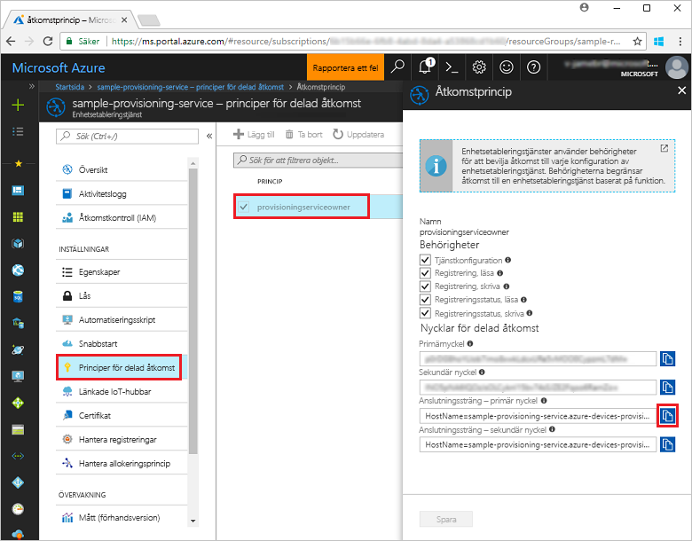
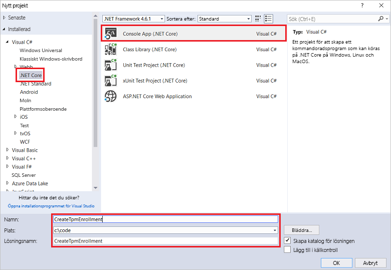
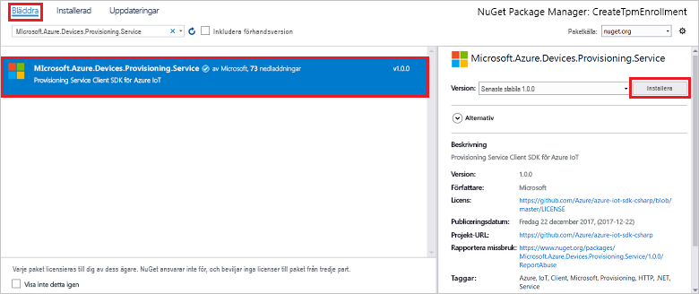
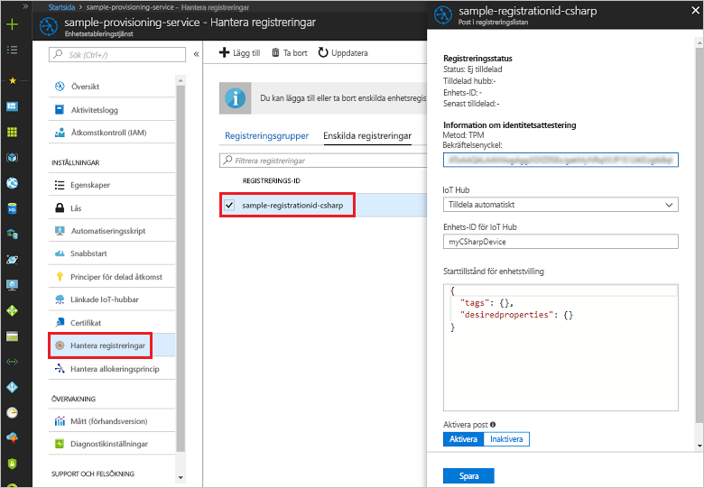

# <a name="enroll-tpm-device-to-iot-hub-device-provisioning-service-using-c-service-sdk"></a>Registrera TPM-enhet på IoT Hub Device Provisioning-tjänsten med C#-tjänst-SDK

[!INCLUDE [iot-dps-selector-quick-enroll-device-tpm](../../includes/iot-dps-selector-quick-enroll-device-tpm.md)]


De här stegen visar hur du programmässigt skapar en enskild registrering för en TPM-enhet i Azure IoT Hub Device Provisioning-tjänsten med [C#-tjänst-SDK](https://github.com/Azure/azure-iot-sdk-csharp) och ett C#.Net Core-exempelprogram. Om du vill kan du registrera en simulerad TPM-enhet för etableringstjänsten med den här posten för enskild registrering. Även om de här stegen fungerar både med Windows- och Linux-datorer använder vi en Windows-utvecklingsdator i den här artikeln.

## <a name="prepare-the-development-environment"></a>Förbereda utvecklingsmiljön

1. Kontrollera att du har [Visual Studio 2017](https://www.visualstudio.com/vs/) installerat på datorn. 
2. Kontrollera att du har [.Net Core SDK](https://www.microsoft.com/net/download/windows) installerat på datorn. 
3. Se till att slutföra stegen i [Set up the IoT Hub Device Provisioning Service with the Azure portal](./quick-setup-auto-provision.md) (Konfigurera IoT Hub Device Provisioning-tjänsten med Azure-portalen) innan du fortsätter.
4. (Valfritt) Om du vill registrera en simulerad enhet i slutet av den här snabbstarten ska du följa instruktionerna om att [skapa och etablera en simulerad TPM-enhet med C#-enhets-SDK ](quick-create-simulated-device-tpm-csharp.md) tills du kommer till steget där du får en bekräftelsenyckel för enheten. Anteckna bekräftelsenyckeln, registrerings-ID:t och enhets-ID:t (valfritt). Du behöver dem senare i snabbstarten. **Följ inte stegen för att skapa en enskild registrering med Azure-portalen.**

## <a name="get-the-connection-string-for-your-provisioning-service"></a>Hämta anslutningssträngen för etableringstjänsten

För exemplet i den här snabbstarten behöver du anslutningssträngen för etableringstjänsten.
1. Logga in på Azure-portalen, klicka på knappen **Alla resurser** i den vänstra menyn och öppna Device Provisioning-tjänsten. 
2. Klicka på **Policyer för delad åtkomst** och sedan på den åtkomstprincip du vill använda för att öppna dess egenskaper. I fönstret **Åtkomstprincip** kopierar du och antecknar primärnyckelns anslutningssträng. 

    

## <a name="create-the-individual-enrollment-sample"></a>Skapa ett exempel på enskild registrering 

Stegen i det här avsnittet visar hur du skapar en .NET Core-konsolapp som lägger till en enskild registrering för en TPM-tjänst till din etableringstjänst. Med vissa ändringar kan du även följa de här stegen för att skapa en [Windows IoT Core](https://developer.microsoft.com/en-us/windows/iot)-konsolapp för att lägga till den enskilda registreringen. Mer information om hur du utvecklar med IoT Core i finns i [Windows IoT Core-dokumentationen för utvecklare](https://docs.microsoft.com/windows/iot-core/).
1. I Visual Studio lägger du till ett Visual C# .NET Core-konsolprogramprojekt i den nya lösningen med hjälp av projektmallen **Konsolapp (.NET Core)**. Kontrollera att .NET Framework-versionen är 4.5.1 eller senare. Ge projektet namnet **CreateTpmEnrollment**.

    

2. Högerklicka i Solution Explorer på projektet **CreateTpmEnrollment** och klicka sedan på **Hantera NuGet-paket**.
3. Välj **Bläddra** i fönstret för **NuGet-pakethanteraren**, leta upp **Microsoft.Azure.Devices.Provisioning.Service**, välj **Installera** för att installera **Microsoft.Azure.Devices.Provisioning.Service**-paketet och godkänn användningsvillkoren. Denna procedur hämtar, installerar och lägger till en referens för NuGet-paketets [klient-SDK för etableringstjänst i Azure IoT](https://www.nuget.org/packages/Microsoft.Azure.Devices.Provisioning.Service/) och dess beroenden.

    

4. Lägg till följande `using`-satser efter andra `using`-satser överst i filen **Program.cs**:
   
   ```csharp
   using System.Threading.Tasks;
   using Microsoft.Azure.Devices.Provisioning.Service;
   ```
    
5. Lägg till följande fält i klassen **Program**.  
   - Ersätt värdet för platshållaren **ProvisioningConnectionString** med anslutningssträngen för etableringstjänsten du vill skapa registreringen för.
   - Om du vill kan du ändra registrerings-ID:t, bekräftelsenyckeln, enhets-ID:t och etableringsstatusen. 
   - Om du använder den här snabbstarten tillsammans med [Skapa och etablera en simulerad TPM-enhet med C#-enhets-SDK](quick-create-simulated-device-tpm-csharp.md) för att etablera en simulerad enhet ersätter du bekräftelsenyckeln och registrerings-ID:t med värdena du antecknade i snabbstarten. Du kan ersätta enhets-ID:t med värdet som föreslås i snabbstarten, använda ditt eget värde eller använda standardvärdet i det här exemplet.
        
   ```csharp
   private static string ProvisioningConnectionString = "{Your provisioning service connection string}";
   private const string RegistrationId = "sample-registrationid-csharp";
   private const string TpmEndorsementKey =
       "AToAAQALAAMAsgAgg3GXZ0SEs/gakMyNRqXXJP1S124GUgtk8qHaGzMUaaoABgCAAEMAEAgAAAAAAAEAxsj2gUS" +
       "cTk1UjuioeTlfGYZrrimExB+bScH75adUMRIi2UOMxG1kw4y+9RW/IVoMl4e620VxZad0ARX2gUqVjYO7KPVt3d" +
       "yKhZS3dkcvfBisBhP1XH9B33VqHG9SHnbnQXdBUaCgKAfxome8UmBKfe+naTsE5fkvjb/do3/dD6l4sGBwFCnKR" +
       "dln4XpM03zLpoHFao8zOwt8l/uP3qUIxmCYv9A7m69Ms+5/pCkTu/rK4mRDsfhZ0QLfbzVI6zQFOKF/rwsfBtFe" +
       "WlWtcuJMKlXdD8TXWElTzgh7JS4qhFzreL0c1mI0GCj+Aws0usZh7dLIVPnlgZcBhgy1SSDQMQ==";
       
   // Optional parameters
   private const string OptionalDeviceId = "myCSharpDevice";
   private const ProvisioningStatus OptionalProvisioningStatus = ProvisioningStatus.Enabled;
   ```
    
6. Lägg till följande metod i klassen **Program**.  Den här koden skapar en enskild registreringspost och anropar sedan metoden **CreateOrUpdateIndividualEnrollmentAsync** på **ProvisioningServiceClient** för att lägga till den enskilda registreringen till etableringstjänsten.
   
   ```csharp
   public static async Task RunSample()
   {
       Console.WriteLine("Starting sample...");

       using (ProvisioningServiceClient provisioningServiceClient =
               ProvisioningServiceClient.CreateFromConnectionString(ProvisioningConnectionString))
       {
           #region Create a new individualEnrollment config
           Console.WriteLine("\nCreating a new individualEnrollment...");
           Attestation attestation = new TpmAttestation(TpmEndorsementKey);
           IndividualEnrollment individualEnrollment =
                   new IndividualEnrollment(
                           RegistrationId,
                           attestation);

           // The following parameters are optional. Remove them if you don't need them.
           individualEnrollment.DeviceId = OptionalDeviceId;
           individualEnrollment.ProvisioningStatus = OptionalProvisioningStatus;
           #endregion

           #region Create the individualEnrollment
           Console.WriteLine("\nAdding new individualEnrollment...");
           IndividualEnrollment individualEnrollmentResult =
               await provisioningServiceClient.CreateOrUpdateIndividualEnrollmentAsync(individualEnrollment).ConfigureAwait(false);
           Console.WriteLine("\nIndividualEnrollment created with success.");
           Console.WriteLine(individualEnrollmentResult);
           #endregion
        
       }
   }
   ```
       
7. Ersätt till sist brödtexten i metoden **Main** med följande rader:
   
   ```csharp
   RunSample().GetAwaiter().GetResult();
   Console.WriteLine("\nHit <Enter> to exit ...");
   Console.ReadLine();
   ```
        
8. Skapa lösningen.

## <a name="run-the-individual-enrollment-sample"></a>Köra exemplet på enskild registrering
  
1. Kör exemplet i Visual Studio för att skapa den enskilda registreringen för din TPM-enhet.
 
2. När gruppen har skapats visas egenskaperna för den nya enskilda registreringen i kommandofönstret.

    

3. Om du vill kontrollera att den individuella registreringen har skapats väljer du **Hantera registreringar** på sammanfattningsbladet Enhetsetableringstjänst i Azure Portal och väljer sedan fliken **Individuella registreringar**. Du bör se en ny registreringspost som motsvarar det registrerings-ID som du använde i exemplet. Klicka på posten för att verifiera bekräftelsenyckeln och andra egenskaper för posten.

    
 
4. (Valfritt) Om du har följt stegen i snabbstarten för att [skapa och etablera en simulerad TPM-enhet med C#-enhets-SDK](quick-create-simulated-device-tpm-csharp.md) kan du fortsätta med återstående steg i snabbstarten för att registrera din simulerade enhet. Hoppa över stegen för att skapa en enskild registrering med Azure-portalen.

## <a name="clean-up-resources"></a>Rensa resurser
Om du tänker utforska C#-tjänstexemplet ska du inte rensa resurserna som har skapats i den här snabbstarten. Om du inte planerar att fortsätta kan du använda stegen nedan för att ta bort alla resurser som har skapats i den här snabbstarten.

1. Stäng utdatafönstret för C#-exemplet på datorn.
2. Navigera till Device Provisioning-tjänsten i Azure Portal, klicka på **Hantera registreringar** och välj sedan fliken **Enskilda registreringar**. Välj *Registrerings-ID* för registreringsposten du har skapat med den här snabbstarten och klickar på knappen **Ta bort** högst upp på bladet. 
3. Om du har följt stegen i snabbstarten för att [skapa och etablera en simulerad TPM-enhet med C#-enhets-SDK](quick-create-simulated-device-tpm-csharp.md) för att skapa en simulerad TPM-enhet: 

    1. Stäng TPM-simulatorfönstret och exempelutdatafönstret för den simulerade enheten.
    2. I Azure-portalen går du till den IoT Hub där din enhet etablerades. På den vänstra menyn under **Utforskare** klickar du på **IoT-enheter**, markerar kryssrutan bredvid enheten och klickar sedan på **Ta bort** högst upp i fönstret.
 
## <a name="next-steps"></a>Nästa steg
I den här snabbstarten har du programmässigt skapat en individuell registreringspost för en TPM-enhet, och eventuellt skapat en TPM-simulerad enhet på datorn och etablerat den på IoT-hubben med hjälp av Azure IoT Hub Device Provisioning-tjänsten. Om du vill ha mer djupgående information om enhetsetablering kan du fortsätta till självstudien om konfiguration av Device Provisioning-tjänsten i Azure-portalen. 
 
> [!div class="nextstepaction"]
> [Självstudier om Azure IoT Hub Device Provisioning-tjänsten](./tutorial-set-up-cloud.md)

