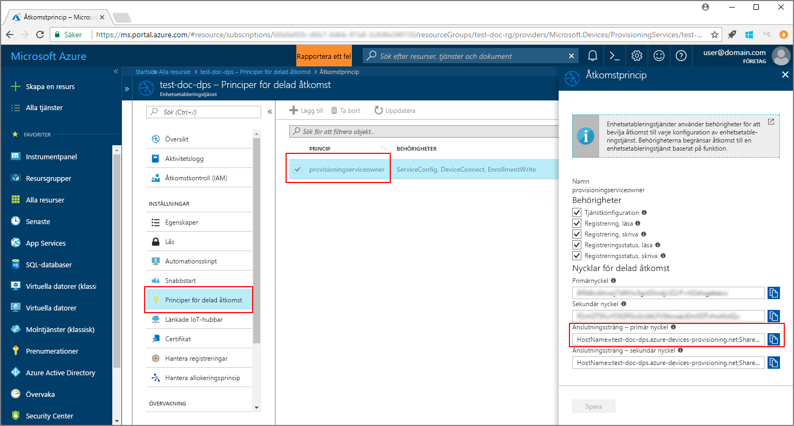
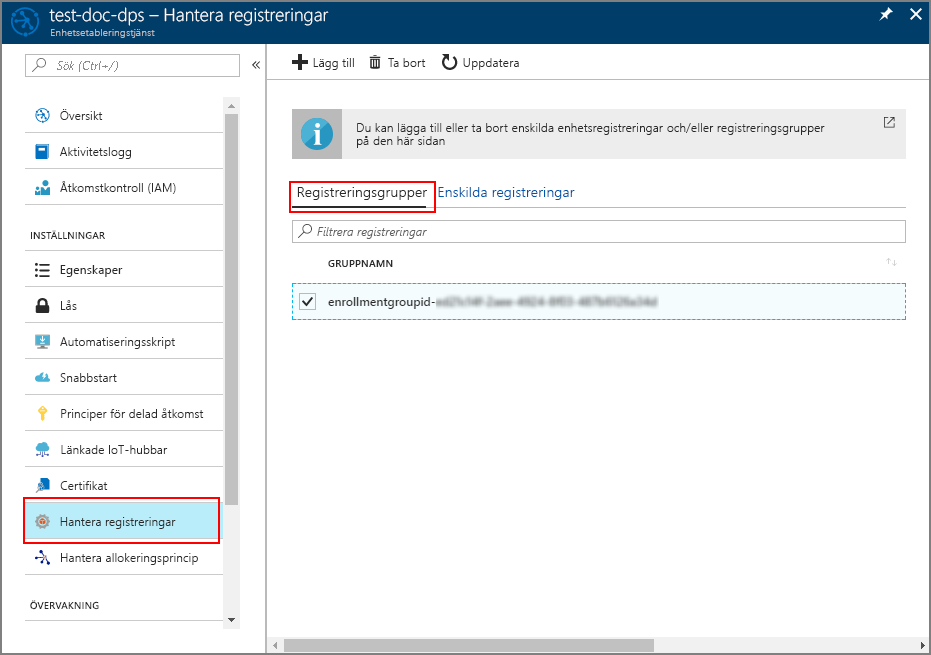

# <a name="enroll-x509-devices-to-iot-hub-device-provisioning-service-using-java-service-sdk"></a>Registrera X.509-enheter på IoT Hub Device Provisioning-tjänsten med Java-tjänst-SDK

[!INCLUDE [iot-dps-selector-quick-enroll-device-x509](../../includes/iot-dps-selector-quick-enroll-device-x509.md)]

De här stegen visar hur du registrerar en grupp simulerade X.509-enheter programmässigt på Azure IoT Hub Device Provisioning-tjänsten, med [Java-tjänst-SDK](https://azure.github.io/azure-iot-sdk-java/service/) med hjälp av ett Java-exempelprogram. Java-tjänst-SDK fungerar på både Windows- och Linux-datorer men i den här artikeln används en Windows-utvecklingsdator för att gå igenom registreringsprocessen.

Se till att [konfigurera IoT Hub Device Provisioning-tjänsten med Azure-portalen](./quick-setup-auto-provision.md) innan du fortsätter.

<a id="setupdevbox"></a>

## <a name="prepare-the-development-environment"></a>Förbereda utvecklingsmiljön 

1. Kontrollera att [Java SE Development Kit 8](http://www.oracle.com/technetwork/java/javase/downloads/jdk8-downloads-2133151.html) är installerat på datorn. 

2. Konfigurera miljövariabler för Java-installationen. Variabeln `PATH` ska innehålla den fullständiga sökvägen till katalogen *jdk1.8.x\bin*. Om det här är datorns första Java-installation skapar du en ny miljövariabeln med namnet `JAVA_HOME` och gör så att den pekar på den fullständiga sökvägen till katalogen *jdk1.8.x*. På Windows-datorer finns den här katalogen normalt i mappen *C:\\Program\\Java\\* och du kan skapa eller redigera miljövariabler genom att söka efter **Redigera systemets miljövariabler** i **Kontrollpanelen** på Windows-datorn. 

  Du kan kontrollera om Java har konfigurerats på datorn genom att köra följande kommando i kommandofönstret:

    ```cmd\sh
    java -version
    ```

3. Ladda ned och extrahera [Maven 3](https://maven.apache.org/download.cgi) på datorn. 

4. Redigera miljövariabeln `PATH` så att den pekar på mappen *apache-maven-3.x.x\\bin* i mappen där Maven har extraherats. Du kan bekräfta att Maven har installerats genom att köra följande kommando i kommandofönstret:

    ```cmd\sh
    mvn --version
    ```

5. Kontrollera att [git](https://git-scm.com/download/) är installerad på datorn och har lagts till i miljövariabeln `PATH`. 


<a id="javasample"></a>

## <a name="download-and-modify-the-java-sample-code"></a>Ladda ned och ändra Java-exempelkoden

I det här avsnittet visas hur du lägger till etableringsinformationen för X.509-enheten i exempelkoden. 

1. Öppna en kommandotolk. Klona GitHub-lagringsplatsen för enhetsregistreringens kodexempel med Java-tjänst-SDK:
    
    ```cmd\sh
    git clone https://github.com/Azure/azure-iot-sdk-java.git --recursive
    ```

2. I den nedladdade källkoden går du till exempelmappen **_azure-iot-sdk-java/provisioning/provisioning-samples/service-enrollment-group-sample_**. Öppna filen **_/src/main/java/samples/com/microsoft/azure/sdk/iot/ServiceEnrollmentGroupSample.java_** i valfritt redigeringsprogram och lägg till följande information:

    1. Lägg till `[Provisioning Connection String]` för etableringstjänsten från portalen enligt följande:
        1. Navigera till etableringstjänsten i [Azure Portal](https://portal.azure.com). 
        2. Öppna **Policyer för delad åtkomst** och välj en princip med behörigheten *EnrollmentWrite*.
        3. Kopiera **Anslutningssträng – primär nyckel**. 

              

        4. I exempelkodfilen **_ServiceEnrollmentGroupSample.java_** ersätter du `[Provisioning Connection String]` med **Anslutningssträng – primär nyckel**.

            ```Java
            private static final String PROVISIONING_CONNECTION_STRING = "[Provisioning Connection String]";
            ```

    2. Lägg till rotcertifikatet för gruppen med enheter. Om du behöver ett exempelrotcertifikat använder du verktyget _X.509 Certificate Generator_ enligt följande:
        1. I ett kommandofönster navigerar du vill mappen **_azure-iot-sdk-java/provisioning/provisioning-tools/provisioning-x509-cert-generator_**.
        2. Skapa verktyget genom att köra följande kommando:

                ```cmd\sh
                mvn clean install
                ```

        4. Kör verktyget med följande kommandon:

                ```cmd\sh
                cd target
                java -jar ./provisioning-x509-cert-generator-{version}-with-deps.jar
                ```

        5. Vid uppmaning kan du ange ett _eget namn_ för dina certifikat.
        6. Verktyget genererar lokalt **Client Cert** (klientcertifikat), **Client Cert Private Key** (privat nyckel för klientcertifikat) och **Root Cert** (rotcertifikat).
        7. Kopiera **rotcertifikatet**, inklusive raderna **_-----BEGIN CERTIFICATE-r----_** och **_-----END CERTIFICATE-----_**. 
        8. Tilldela **rotcertifikatets** värde till parametern **PUBLIC_KEY_CERTIFICATE_STRING** enligt nedan:

                ```Java
                private static final String PUBLIC_KEY_CERTIFICATE_STRING =
                        "-----BEGIN CERTIFICATE-----\n" +
                        "XXXXXXXXXXXXXXXXXXXXXXXXXXXXXXXXXXXXXXXXXXXXXXXXXXXXXXXXXXXXXXXX\n" +
                        "XXXXXXXXXXXXXXXXXXXXXXXXXXXXXXXXXXXXXXXXXXXXXXXXXXXXXXXXXXXXXXXX\n" +
                        "XXXXXXXXXXXXXXXXXXXXXXXXXXXXXXXXXXXXXXXXXXXXXXXXXXXXXXXXXXXXXXXX\n" +
                        "XXXXXXXXXXXXXXXXXXXXXXXXXXXXXXXXXXXXXXXXXXXXXXXXXXXXXXXXXXXXXXXX\n" +
                        "XXXXXXXXXXXXXXXXXXXXXXXXXXXXXXXXXXXXXXXXXXXXXXXXXXXXXXXXXXXXXXXX\n" +
                        "XXXXXXXXXXXXXXXXXXXXXXXXXXXXXXXXXXXXXXXXXXXXXXXXXXXXXXXXXXXXXXXX\n" +
                        "XXXXXXXXXXXXXXXXXXXXXXXXXXXXXXXXXXXXXXXXXXXXXXXXXXXXXXXXXXXXXXXX\n" +
                        "XXXXXXXXXXXXXXXXXXXXXXXXXXXXXXXXXXXXXXXXXXXXXXXXXXXXXXXXXXXXXXXX\n" +
                        "XXXXXXXXXXXXXXXXXXXXXXXXXXXXXXXXXXXXXXXXXXXXXXXXXXXXXXXXXXXXXXXX\n" +
                        "XXXXXXXXXXXXXXXXXXXXXXXXXXXXXXXXXXXXXXXXXXXXXXXXXXXXXXXXXXXXXXXX\n" +
                        "-----END CERTIFICATE-----\n";
                ```

        9. Stäng kommandofönstret eller ange **n** när du tillfrågas om *verifieringskod*. 
 
    3. Alternativt kan du konfigurera etableringstjänsten genom exempelkoden:
        - Om du vill lägga till konfigurationen i exemplet gör du följande:
            1. Navigera till IoT-hubben som är länkad till din etableringstjänst i [Azure Portal](https://portal.azure.com). Öppna fliken **Översikt** för hubben och kopiera **värdnamnet**. Tilldela **värdnamnet** till parametern *IOTHUB_HOST_NAME*.

                ```Java
                private static final String IOTHUB_HOST_NAME = "[Host name].azure-devices.net";
                ```
            2. Tilldela ett eget namn till parametern *DEVICE_ID* och behåll standardvärdet för *PROVISIONING_STATUS*, *ENABLED*. 

        - Eller: om du väljer att inte konfigurera etableringstjänsten kommentera ut eller ta bort följande instruktioner i filen _ServiceEnrollmentGroupSample.java_:

            ```Java
            enrollmentGroup.setIotHubHostName(IOTHUB_HOST_NAME);                // Optional parameter.
            enrollmentGroup.setProvisioningStatus(ProvisioningStatus.ENABLED);  // Optional parameter.
            ```

    4. Studera exempelkoden. Den skapar, uppdaterar, frågar och tar bort en gruppregistrering för X.509-enheter. Du kan verifiera att registreringen har lyckats i portalen genom att tillfälligt kommentera ut följande rader med kod i filen _ServiceEnrollmentGroupSample.java_:

        ```Java
        // ************************************** Delete info of enrollmentGroup ***************************************
        System.out.println("\nDelete the enrollmentGroup...");
        provisioningServiceClient.deleteEnrollmentGroup(enrollmentGroupId);
        ```

    5. Spara filen _ServiceEnrollmentGroupSample.java_. 
 

<a id="runjavasample"></a>

## <a name="build-and-run-sample-group-enrollment"></a>Skapa och kör exemplet på gruppregistrering

1. Öppna ett kommandofönster och navigera till mappen **_azure-iot-sdk-java/provisioning/provisioning-samples/service-enrollment-group-sample_**.

2. Skapa exempelkoden genom att använda följande kommando:

    ```cmd\sh
    mvn install -DskipTests
    ```

   Kommandot laddar ned Maven-paketet [`com.microsoft.azure.sdk.iot.provisioning.service`](https://www.mvnrepository.com/artifact/com.microsoft.azure.sdk.iot.provisioning/provisioning-service-client) på datorn. Paketet innehåller binärfilerna för Java-tjänst-SDK, som exempelkoden behöver skapa. Om du har kört verktyget _X.509 Certificate Generator_ i det föregående avsnittet har det här paketet redan laddats ned på datorn. 

3. Kör exemplet genom att använda de här kommandona i kommandofönstret:

    ```cmd\sh
    cd target
    java -jar ./service-enrollment-group-sample-{version}-with-deps.jar
    ```

4. Se utdatafönstret om registreringen har lyckats.

5. Navigera till etableringstjänsten i Azure Portal. Klicka på **Hantera registreringar**. Observera att gruppen med X.509-enheter visas under fliken **Registreringsgrupper**, med ett automatiskt genererat *GRUPPNAMN*. 

      

## <a name="modifications-to-enroll-a-single-x509-device"></a>Ändringar för att registrera en enskild X.509-enhet

Om du vill registrera en enskild X.509-enhet ändrar du exempelkoden för *enskild registrering* som används i [Registrera TPM-enhet på IoT Hub Device Provisioning-tjänsten med Java-tjänst-SDK](quick-enroll-device-tpm-java.md#javasample) enligt följande:

1. Kopiera *eget namn* för din X.509-klientcertifikatet till Urklipp. Om du vill använda verktyget _X.509 Certificate Generator_ enligt [föregående exempelkodavsnitt](#javasample) anger du ett _eget namn_ för certifikatet eller använder standardvärdet **microsoftriotcore**. Använd **eget namn** som värdet för variabeln *REGISTRATION_ID*. 

    ```Java
    // Use common name of your X.509 client certificate
    private static final String REGISTRATION_ID = "[RegistrationId]";
    ```

2. Byt namn på variabeln *TPM_ENDORSEMENT_KEY* som *PUBLIC_KEY_CERTIFICATE_STRING*. Kopiera ditt klientcertifikat eller **Client Cert** (klientcertifikat) från utdata för verktyget _X.509 Certificate Generator_ som värdet för variabeln *PUBLIC_KEY_CERTIFICATE_STRING*. 

    ```Java
    // Rename the variable *TPM_ENDORSEMENT_KEY* as *PUBLIC_KEY_CERTIFICATE_STRING*
    private static final String PUBLIC_KEY_CERTIFICATE_STRING =
            "-----BEGIN CERTIFICATE-----\n" +
            "XXXXXXXXXXXXXXXXXXXXXXXXXXXXXXXXXXXXXXXXXXXXXXXXXXXXXXXXXXXXXXXX\n" +
            "XXXXXXXXXXXXXXXXXXXXXXXXXXXXXXXXXXXXXXXXXXXXXXXXXXXXXXXXXXXXXXXX\n" +
            "XXXXXXXXXXXXXXXXXXXXXXXXXXXXXXXXXXXXXXXXXXXXXXXXXXXXXXXXXXXXXXXX\n" +
            "XXXXXXXXXXXXXXXXXXXXXXXXXXXXXXXXXXXXXXXXXXXXXXXXXXXXXXXXXXXXXXXX\n" +
            "XXXXXXXXXXXXXXXXXXXXXXXXXXXXXXXXXXXXXXXXXXXXXXXXXXXXXXXXXXXXXXXX\n" +
            "XXXXXXXXXXXXXXXXXXXXXXXXXXXXXXXXXXXXXXXXXXXXXXXXXXXXXXXXXXXXXXXX\n" +
            "XXXXXXXXXXXXXXXXXXXXXXXXXXXXXXXXXXXXXXXXXXXXXXXXXXXXXXXXXXXXXXXX\n" +
            "XXXXXXXXXXXXXXXXXXXXXXXXXXXXXXXXXXXXXXXXXXXXXXXXXXXXXXXXXXXXXXXX\n" +
            "XXXXXXXXXXXXXXXXXXXXXXXXXXXXXXXXXXXXXXXXXXXXXXXXXXXXXXXXXXXXXXXX\n" +
            "XXXXXXXXXXXXXXXXXXXXXXXXXXXXXXXXXXXXXXXXXXXXXXXXXXXXXXXXXXXXXXXX\n" +
            "-----END CERTIFICATE-----\n";
    ```
3. I funktionen **main** ersätter du raden `Attestation attestation = new TpmAttestation(TPM_ENDORSEMENT_KEY);` med följande för att använda X.509-klientcertifikatet:
    ```Java
    Attestation attestation = X509Attestation.createFromClientCertificates(PUBLIC_KEY_CERTIFICATE_STRING);
    ```

4. Spara, skapa och kör exempelfilen för *enskild registrering*, med hjälp av stegen i avsnittet [Skapa och kör exempelkoden för enskild registrering](quick-enroll-device-tpm-java.md#runjavasample).


## <a name="clean-up-resources"></a>Rensa resurser
Om du tänker utforska Java-tjänstexemplet ska du inte rensa resurserna som har skapats i den här snabbstarten. Om du inte planerar att fortsätta kan du använda stegen nedan för att ta bort alla resurser som har skapats i den här snabbstarten.

1. Stäng utdatafönstret för Java-exemplet på datorn.
1. Stäng _X509 Cert Generator_-fönstret på datorn.
1. Navigera till Device Provisioning-tjänsten i Azure Portal, klicka på **Hantera registreringar** och välj sedan fliken **Registreringsgrupper**. Välj *GRUPPNAMN* för de X.509-enheter du har registrerat med hjälp av den här snabbstarten och klicka på knappen **Ta bort** högst upp på bladet.  

## <a name="next-steps"></a>Nästa steg
I den här snabbstarten har du registrerat en simulerad grupp X.509-enheter i Device Provisioning-tjänsten. Om du vill ha mer djupgående information om enhetsetablering kan du fortsätta till självstudien om konfiguration av Device Provisioning-tjänsten i Azure-portalen. 

> [!div class="nextstepaction"]
> [Självstudier om Azure IoT Hub Device Provisioning-tjänsten](./tutorial-set-up-cloud.md)
