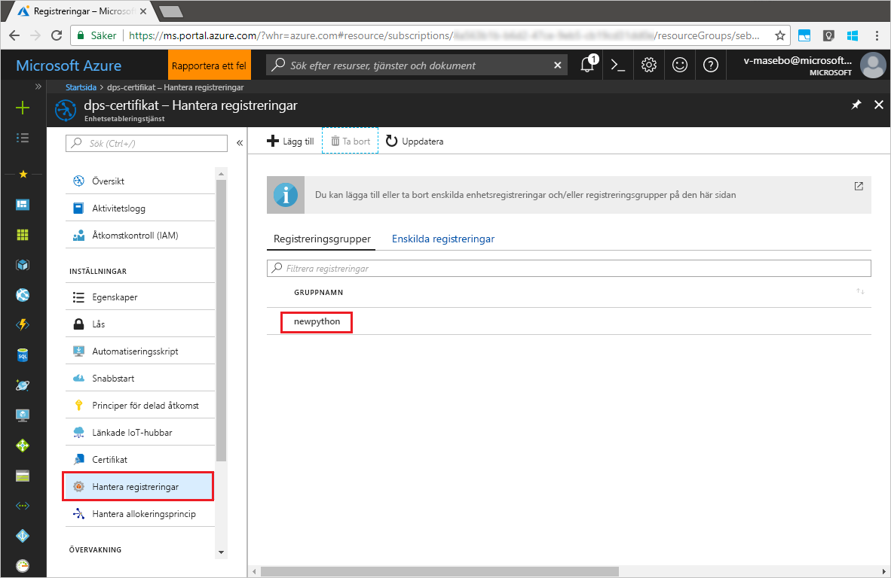

# <a name="enroll-x509-devices-to-iot-hub-device-provisioning-service-using-python-provisioning-service-sdk"></a>Registrera X.509-enheter på IoT Hub Device Provisioning-tjänsten med SDK för Python-etableringtjänst
[!INCLUDE [iot-dps-selector-quick-enroll-device-x509](../../includes/iot-dps-selector-quick-enroll-device-x509.md)]

De här stegen visar hur du registrerar en grupp simulerade X.509-enheter programmässigt på Azure IoT Hub Device Provisioning-tjänsten, med [SDK för Python-etableringtjänst](https://github.com/Azure/azure-iot-sdk-python/tree/master/provisioning_service_client) med hjälp av ett Python-exempelprogram. Java-tjänst-SDK fungerar på både Windows- och Linux-datorer men i den här artikeln används en Windows-utvecklingsdator för att gå igenom registreringsprocessen.

Se till att [konfigurera IoT Hub Device Provisioning-tjänsten med Azure-portalen](./quick-setup-auto-provision.md) innan du fortsätter.

> [!NOTE]
> Denna snabbstart har bara stöd för **Registreringsgrupp**. Arbetet med **enskild registrering** via _SDK för Python-etableringtjänst_ pågår fortfarande.
> 

<a id="prepareenvironment"></a>

## <a name="prepare-the-environment"></a>Förbereda miljön 

1. Ladda ned och installera [Python 2.x eller 3.x](https://www.python.org/downloads/). Se till att använda en 32-bitars eller 64-bitars installation beroende på vad som krävs för din konfiguration. Se till att du lägger till Python i den plattformsspecifika miljövariabeln när du uppmanas att göra det under installationen. 

1. Välj ett av följande alternativ:

    - Bygg och kompilera **Azure IoT Python SDK**. Skapa Python-paketen med hjälp av [de här instruktionerna](https://github.com/Azure/azure-iot-sdk-python/blob/master/doc/python-devbox-setup.md). Om du använder Windows OS installerar du även [Visual C++ redistributable package](http://www.microsoft.com/download/confirmation.aspx?id=48145) så att du kan använda interna DLL:er från Python.

    - [Installera eller uppgradera *pip*, pakethanteringssystemet för Python](https://pip.pypa.io/en/stable/installing/) och installera paketet med följande kommando:

        ```cmd/sh
        pip install azure-iothub-provisioningserviceclient
        ```

1. Du behöver också en .pem-fil som innehåller ett rotcertifikatutfärdarcertifikat eller mellanliggande X.509-certifikat som har laddats upp tidigare och verifierats av din etableringstjänst. **Azure IoT C SDK** innehåller verktyg som du kan använda för att skapa en X.509-certifikatkedja, ladda upp ett rot- eller mellanliggande certifikat från kedjan och utföra innehavarbevis med tjänsten för att verifiera certifikatet. Om du vill använda verktygen klonar du [Azure IoT C SDK](https://github.com/Azure/azure-iot-sdk-c) och följer stegen i [azure-iot-sdk-c\tools\CACertificates\CACertificateOverview.md](https://github.com/Azure/azure-iot-sdk-c/blob/master/tools/CACertificates/CACertificateOverview.md) på datorn.


## <a name="modify-the-python-sample-code"></a>Ändra Python-exempelkoden

I det här avsnittet visas hur du lägger till etableringsinformationen för X.509-enheten i exempelkoden. 

1. Skapa en ny **Registreringsgrupp.py**-fil med en texteditor.

1. Lägg till följande `import`-instruktioner och variabler längst upp i **Registreringsgrupp.py**-filen. Byt sedan `dpsConnectionString` mot din anslutningssträng som finns under **Policyer för delad åtkomst** i **Device Provisioning-tjänsten** på **Azure Portal**. Byt ut platshållaren för certifikat med certifikatet som skapades i [Förbereda miljön](quick-enroll-device-x509-python.md#prepareenvironment). Skapa slutligen ett unikt `registrationid` och se till att det endast innehåller små bokstäver, siffror och bindestreck.  
   
    ```python
    from provisioningserviceclient import ProvisioningServiceClient
    from provisioningserviceclient.models import EnrollmentGroup, AttestationMechanism

    CONNECTION_STRING = "{dpsConnectionString}"

    SIGNING_CERT = """-----BEGIN CERTIFICATE-----
    XXXXXXXXXXXXXXXXXXXXXXXXXXXXXXXXXXXXXXXXXXXXXXXXXXXXXXXXXXXXXXXX
    XXXXXXXXXXXXXXXXXXXXXXXXXXXXXXXXXXXXXXXXXXXXXXXXXXXXXXXXXXXXXXXX
    XXXXXXXXXXXXXXXXXXXXXXXXXXXXXXXXXXXXXXXXXXXXXXXXXXXXXXXXXXXXXXXX
    XXXXXXXXXXXXXXXXXXXXXXXXXXXXXXXXXXXXXXXXXXXXXXXXXXXXXXXXXXXXXXXX
    XXXXXXXXXXXXXXXXXXXXXXXXXXXXXXXXXXXXXXXXXXXXXXXXXXXXXXXXXXXXXXXX
    XXXXXXXXXXXXXXXXXXXXXXXXXXXXXXXXXXXXXXXXXXXXXXXXXXXXXXXXXXXXXXXX
    XXXXXXXXXXXXXXXXXXXXXXXXXXXXXXXXXXXXXXXXXXXXXXXXXXXXXXXXXXXXXXXX
    XXXXXXXXXXXXXXXXXXXXXXXXXXXXXXXXXXXXXXXXXXXXXXXXXXXXXXXXXXXXXXXX
    XXXXXXXXXXXXXXXXXXXXXXXXXXXXXXXXXXXXXXXXXXXXXXXXXXXXXXXXXXXXXXXX
    XXXXXXXXXXXXXXXXXXXXXXXXXXXXXXXXXXXXXXXXXXXXXXXXXXXXXXXXXXXXXXXX
    XXXXXXXXXXXXXXXXXXXXXXXXXXXXXXXXXXXXXXXXXXXXXXXXXXXXXXXXXXXXXXXX
    XXXXXXXXXXXXXXXXXXXXXXXXXXXXXXXXXXXXXXXXXXXXXXXXXXXXXXXXXXXXXXXX
    XXXXXXXXXXXXXXXXXXXXXXXXXXXXXXXXXXXXXXXXXXXXXXXXXXXXXXXXXXXXXXXX
    XXXXXXXXXXXXXXXXXXXXXXXXXXXXXXXXXXXXXXXXXXXXXXXXXXXXXXXXXXXXXXXX
    XXXXXXXXXXXXXXXXXXXXXXXXXXXXXXXXXXXXXXXXXXXXXXXXXXXXXXXX
    -----END CERTIFICATE-----"""

    GROUP_ID = "{registrationid}"
    ```

1. Lägg till följande funktion och funktionsanrop för att implementera skapandet av registreringsgruppen:
   
    ```python
    def main():
        print ( "Initiating enrollment group creation..." )

        psc = ProvisioningServiceClient.create_from_connection_string(CONNECTION_STRING)
        att = AttestationMechanism.create_with_x509_signing_certs(SIGNING_CERT)
        eg = EnrollmentGroup.create(GROUP_ID, att)

        eg = psc.create_or_update(eg)
    
        print ( "Enrollment group created." )

    if __name__ == '__main__':
        main()
    ```

1. Spara och stäng **Registreringsgrupp.py**-filen.
 

## <a name="run-the-sample-group-enrollment"></a>Kör exemplet på gruppregistrering

1. Öppna en kommandotolk och kör skriptet.

    ```cmd/sh
    python EnrollmentGroup.py
    ```

1. Se utdata för att se om registreringen har lyckats.

1. Navigera till etableringstjänsten i Azure Portal. Klicka på **Hantera registreringar**. Observera att gruppen med X.509-enheter visas under fliken **Registreringsgrupper**, med namnet som `registrationid` skapade tidigare. 

      


## <a name="clean-up-resources"></a>Rensa resurser
Om du tänker utforska Java-tjänstexemplet ska du inte rensa resurserna som har skapats i den här snabbstarten. Om du inte planerar att fortsätta kan du använda stegen nedan för att ta bort alla resurser som har skapats i den här snabbstarten.

1. Stäng utdatafönstret för Java-exemplet på datorn.
1. Stäng _X509 Cert Generator_-fönstret på datorn.
1. Navigera till Device Provisioning-tjänsten i Azure Portal, klicka på **Hantera registreringar** och välj sedan fliken **Registreringsgrupper**. Välj *GRUPPNAMN* för de X.509-enheter du har registrerat med hjälp av den här snabbstarten och klicka på knappen **Ta bort** högst upp på bladet.  


## <a name="next-steps"></a>Nästa steg
I den här snabbstarten har du registrerat en simulerad grupp X.509-enheter i Device Provisioning-tjänsten. Om du vill ha mer djupgående information om enhetsetablering kan du fortsätta till självstudien om konfiguration av Device Provisioning-tjänsten i Azure-portalen. 

> [!div class="nextstepaction"]
> [Självstudier om Azure IoT Hub Device Provisioning-tjänsten](./tutorial-set-up-cloud.md)
