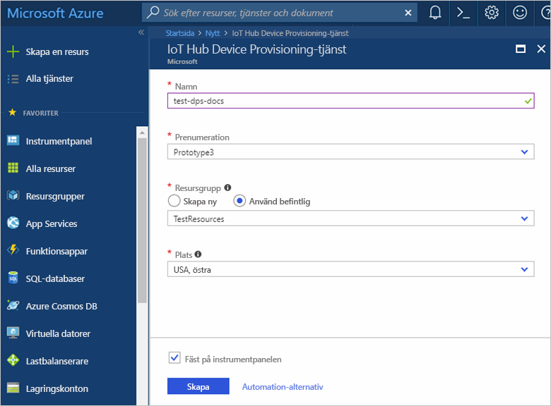
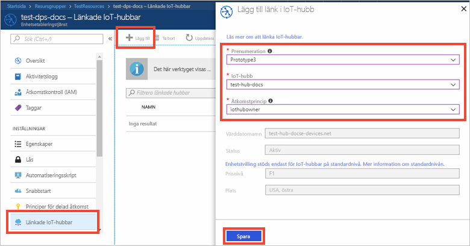

# Konfigurera tjänsten IoT Hub Device Provisioning (förhandsversion) på Azure-portalen

Dessa steg beskriver hur du konfigurerar Azure-molnresurserna på portalen för att etablera dina enheter. I den här proceduren skapar du en IoT-hubb, skapar en ny instans av IoT Hub Device Provisioning-tjänsten och länkar de två tjänsterna. 

Om du inte har en Azure-prenumeration kan du skapa ett [kostnadsfritt konto](https://azure.microsoft.com/free/?WT.mc_id=A261C142F) innan du börjar.

## Logga in på Azure Portal

Logga in på [Azure-portalen](https://portal.azure.com/).

## Skapa en IoT Hub

1. Klicka på knappen **New** (Nytt) i det övre vänstra hörnet i Azure Portal.

2. Välj **Sakernas Internet**, välj **IoT Hub** och klicka på **Skapa**. 

3. Ange ett namn för IoT-hubben i fältet **Namn**. Välj något av de tillgängliga prisalternativen, ange [IoT Hub-enheterna](https://azure.microsoft.com/pricing/details/iot-hub/), välj antalet partitioner för meddelanden från enheten till molnet och välj den prenumeration som du vill använda för den här resursen. Ange namnet på en ny eller befintlig resursgrupp och välj platsen. Klicka på **Skapa** när du är klar.

      

4. När IoT-hubben har distribuerats öppnas sammanfattningsbladet för hubben automatiskt.

## Skapa en ny instans av IoT Hub Device Provisioning-tjänsten

1. Klicka på knappen **New** (Nytt) i det övre vänstra hörnet i Azure Portal.

2. Sök efter **Device Provisioning Service** på *Marketplace*. Välj **IoT Device Provisioning Service (förhandsversion)** och klicka på **Skapa**. 

3. Ange ett namn för Device Provisioning-tjänstinstansen i fältet **Namn**. Välj den prenumeration som ska användas för den här instansen, och ange namnet på en ny eller befintlig resursgrupp. Välj platsen. Klicka på **Skapa** när du är klar.

      

4. När tjänsten har distribuerats öppnas sammanfattningsbladet för tjänsten automatiskt.

## Länka IoT-hubben och Device Provisioning-tjänstinstansen

1. Klicka på **Alla resurser** på menyn till höger på Azure-portalen. Välj Device Provisioning-tjänstinstansen som du skapade i det föregående avsnittet.  

2. Välj **Linked IoT hubs** (Länkade IoT-hubbar) på sammanfattningsbladet för Device Provisioning-tjänsten. Klicka på knappen **+ Lägg till** som visas överst på bladet. 

3. Väl den aktuella prenumerationen eller ange namnet på och anslutningssträngen för en annan prenumeration på bladet **Add link to IoT hub or pool** (Lägg till länk till IoT-hubb eller pool). Välj *IoT-hubb* som **Resurstyp** och välj namnet på hubben i listrutan. Klicka på **Spara** när du är klar. 

      

3. Nu bör den valda hubben visas under bladet **Linked IoT hubs** (Länkade IoT-hubbar). 

## Rensa resurser

De andra snabbstarterna i den här samlingen bygger på den här snabbstarten. Om du vill fortsätta med efterföljande snabbstarter eller självstudier låter du bli att rensa resurserna som du har skapat i den här snabbstarten. Om du inte planerar att fortsätta följer du stegen nedan för att ta bort alla resurser som du har skapat i den här snabbstarten på Azure-portalen.

1. Klicka på **Alla resurser** på menyn till vänster på Azure-portalen och välj din Device Provisioning-tjänst. Klicka på **Ta bort** överst på bladet **Alla resurser**.  
2. Klicka på **Alla resurser** på menyn till vänster på Azure-portalen och välj din IoT-hubb. Klicka på **Ta bort** överst på bladet **Alla resurser**.  

## Nästa steg

I den här snabbstarten har du skapat en IoT-hubb och en instans av Device Provisioning-tjänsten och länkat de två resurserna. Om du vill lära dig hur du använder den här konfigurationen för att etablera en simulerad enhet fortsätter du till Snabbstart för att skapa en simulerad enhet.

> [!div class="nextstepaction"]
> [Snabbstart för att skapa en simulerad enhet](./quick-create-simulated-device.md)

