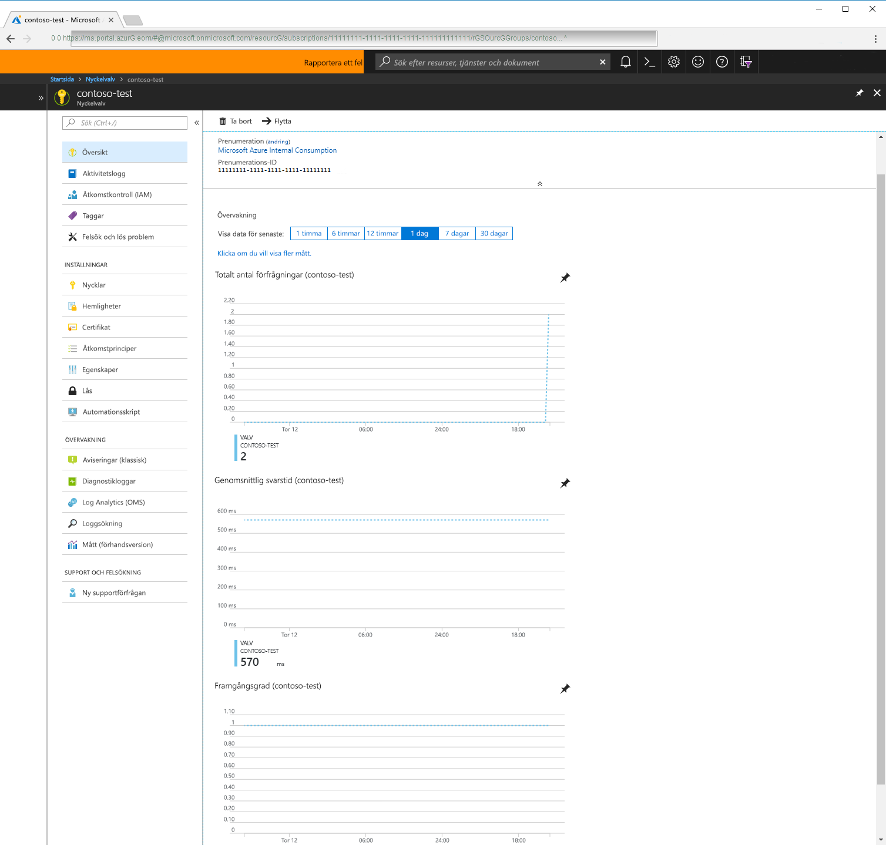

# Vad är Azure Key Vault?

Azure Key Vault är en molntjänst som fungerar som säkert lager för hemligheter.

Du har lösenord, anslutningssträngar och andra uppgifter som behövs för att hålla igång dina program. Du vill se till att den här informationen är tillgänglig men att den samtidigt är skyddad. Lösningen på det här problemet heter Azure Key Vault. Med Azure Key Vault kan du säkert lagra och hantera programhemligheter.

Du kan skapa flera säkra behållare, som kallas valv, i Key Vault. De här valven stöds av säkerhetsmoduler på maskinvarunivå (HSM:er). Med valv så minskar risken för att säkerhetsinformation förloras av misstag eftersom lagringen av hemligheter centraliseras. Key Vaults styr och loggar dessutom åtkomsten till informationen du lagrar. Azure Key Vault kan hantera förfrågningar om och förnyande av TLS-certifikat (Transport Layer Security), och du har tillgång till alla de funktioner som krävs för en robust livscykelhantering av certifikat.

 Azure Key Vault är utformat med stöd för programnycklar och hemligheter. Key Vault är inte avsett att användas för lagring av användarlösenord.

## Därför ska du använda Azure Key Vault

### Central lagring av programhemligheter

När dina programhemligheter lagras lokalt i Azure Key Vault kan du styra spridningen av dem. Då minskar risken att hemligheter sprids av misstag. När du använder Key Vault behöver programutvecklare inte längre lagra säkerhetsinformation i sina program. Den här informationen behöver alltså inte ingå i koden. Ett program kan till exempel behöva ansluta till en databas. Istället för att anslutningssträngen lagras i programkoden så lagras den säkert i Key Vault.

Dina program har säker åtkomst till den information de behöver via URI:er som tillåter dem att hämta specifika versioner av en hemlighet när programmets nyckel eller hemlighet lagras i Azure Key Vault. Det här sker utan att du behöver skriva någon egen kod för att skydda den hemliga informationen.

### Lagra hemligheter säkert

I Azure skyddas Keys med hjälp av algoritmer, nyckellängder och maskinvarubaserade säkerhetsmoduler (HSM:er) som är branschstandard. De HSM:er som används är FIPS-validerade (Federal Information Processing Standards) enligt 140-2 Level 2.

För åtkomst till ett nyckelvalv krävs en korrekt autentisering och auktorisering (av en användare eller ett program). Autentiseringen etablerar anroparens identitet medan auktoriseringen avgör vilka åtgärder som anroparen får utföra.

Autentiseringen görs via Azure Active Directory. Auktoriseringen kan göras via rollbaserad åtkomstkontroll (RBAC) eller med åtkomstprinciper för Key Vault. RBAC används vid hanteringen av valv och åtkomstprinciper för nyckelvalv används vid försök att komma åt data som lagras i ett valv.

Skyddet för Azure Key Vaults kan vara antingen program - eller maskinvarubaserat (HSM). I situationer där du vill öka säkerheten ytterligare kan du importera och generera nycklar i maskinvarubaserade säkerhetsmoduler (HSM:er) som aldrig lämnar HSM-gränsen. Microsoft använder Thales HSM:er. Du kan använda Thales verktyg till att flytta en nyckel från din HSM till Azure Key Vault.

Azure Key Vault är dessutom utformat så att Microsoft inte kan se eller extrahera dina nycklar.

### Övervaka åtkomst och användning

När du väl har skapat några nyckelvalv vill du förmodligen övervaka hur och när dina nycklar och hemligheter används. Det kan du göra genom att aktivera loggning för Key Vault. Du kan konfigurera Azure Key Vault att göra följande:

- arkivera till ett lagringskonto
- strömma till en händelsehubb
- skicka loggarna till Log Analytics.

Du har kontroll över dina loggar, du kan skydda dem genom att begränsa åtkomsten och du kan ta bort loggar du inte längre behöver.

### Enklare administration av programhemligheter

Det ingår ett flertal steg när du lagrar värdefulla data. Säkerhetsinformationen måste skyddas, den måste följa en livscykel och ha hög tillgänglighet. Azure Key Vault gör flera av de här aspekterna enklare så här:

- Du behöver inte ha någon HSM-kompetens på företaget.
- Du kan skala upp med kort varsel vid tillfälliga toppar i organisationens användning.
- Innehållet i dina nyckelvarv kan replikeras inom en region och till en sekundär region. Det här säkerställer tillgängligheten och gör att administratören inte behöver utlösa redundansen manuellt.
- Du har tillgång till vanliga administrationsalternativ för Azure via portalen, Azure CLI:t och PowerShell.
- Vissa uppgifter kring certifikat som du köper från offentliga certifikatutfärdare automatiseras, som registrering och förnyelse.

Dessutom kan du särskilja programhemligheter i Azure Key Vaults. Program kan då endast komma åt valv som de har behörighet till, och de kan begränsas till att endast få utföra specifika åtgärder. Du kan skapa ett nyckelvalv per program och begränsa hemligheterna som lagras i ett nyckelvalv till ett visst program och utvecklarteam.

### Integrera med andra Azure-tjänster

Som säker lagring i Azure så har Key Vault använts till att förenkla scenarier som [Azure Disk Encryption](../security/azure-security-disk-encryption.md), funktionen [alltid krypterad]( https://docs.microsoft.com/sql/relational-databases/security/encryption/always-encrypted-database-engine) i SQL Server och Azure SQL samt [Azure-webbappar]( https://docs.microsoft.com/azure/app-service/web-sites-purchase-ssl-web-site). Key Vault kan i sig integreras med lagringskonton, händelsehubbar och Log Analytics.

## Nästa steg

- [Snabbstart: Skapa ett nyckelvalv med hjälp av CLI](quick-create-cli.md)
- [Konfigurera ett Azure-webbprogram för att läsa en hemlighet från Key Vault](tutorial-web-application-keyvault.md)