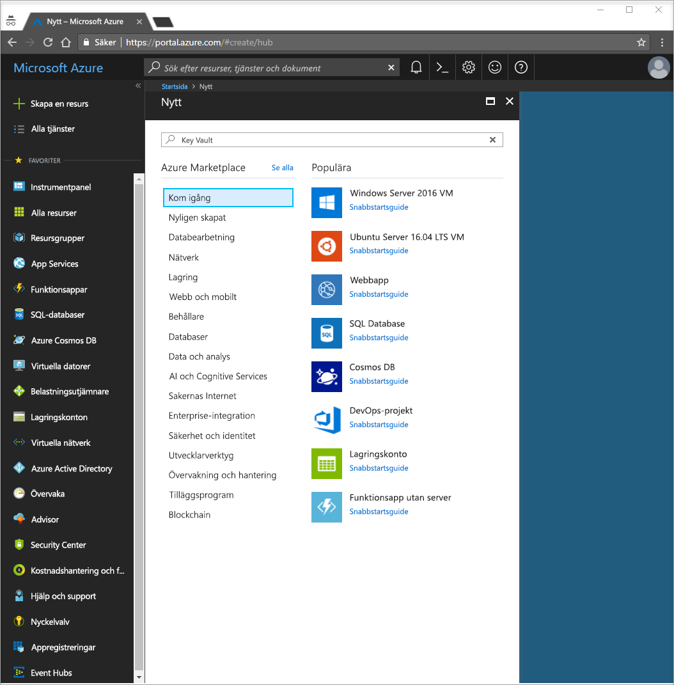
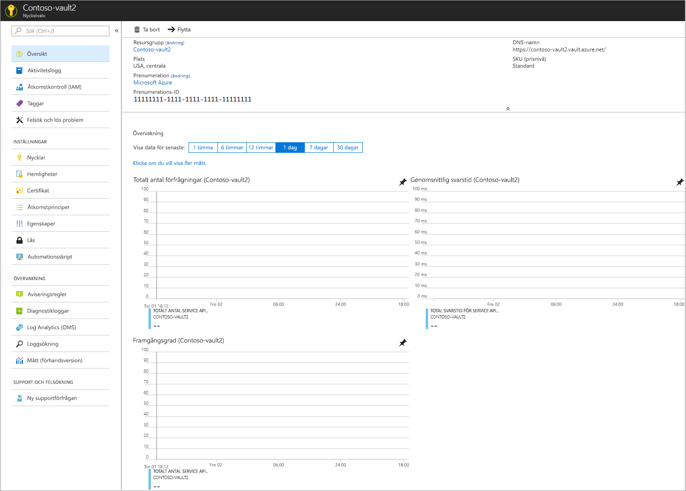

# Snabbstart: Ställ in och hämta en hemlighet från Azure Key Vault med hjälp av Azure-portalen

Azure Key Vault är en molntjänst som fungerar som säkert lager för hemligheter. Du kan på ett säkert sätt lagra nycklar, lösenord, certifikat och andra hemligheter. Mer information om Key Vault finns i [översikten](key-vault-overview.md). Du kan skapa och hantera Azure-nyckelvalv via Azure Portal. I den här snabbstarten skapar du ett nyckelvalv. När du har gjort det kommer du att lagra en hemlighet.

Om du inte har en Azure-prenumeration kan du skapa ett [kostnadsfritt konto](https://azure.microsoft.com/free/?WT.mc_id=A261C142F) innan du börjar.

## Logga in på Azure

Logga in på Azure Portal på http://portal.azure.com.

## Skapa ett valv

1. Välj alternativet **Skapa en resurs** uppe till vänster i Azure Portal

    
2. Skriv **Key Vault** i sökrutan.
3. Välj **Key Vault** i listan med resultat.
4. Välj **Skapa** i avsnittet Key Vault.
5. Ange följande information i avsnittet **Skapa nyckelvalv** avsnittet Ange följande information:
    - **Namn**: I den här snabbstarten använder vi **Contoso-vault2**. Du måste ange ett unikt namn när du testar funktionen.
    - **Prenumeration**: Välj den prenumeration du vill använda i den här snabbstarten.
    - Under **Resursgrupp** väljer du **Skapa ny** och anger ett resursgruppsnamn.
    - Välj en plats i listrutan **Plats**.
    - Markera kryssrutan **Fäst på instrumentpanelen**.
    - Lämna standardvärdena för de andra alternativen.
6. När du har angett den här informationen väljer du **Skapa**.

Anteckna de två egenskaperna som visas nedan:

* **Valvnamn**: I det här exemplet är namnet **Contoso-vault2**. Du kommer att använda det här namnet i senare steg.
* **Valvets URI**: I det här exemplet är det https://contoso-vault2.vault.azure.net/. Program som använder ditt valv via dess REST-API måste använda denna URI.

Nu är ditt Azure-konto det enda kontot med behörighet att utföra åtgärder i det nya valvet.

## Lägga till en hemlighet i Key Vault

När du ska lägga till en hemlighet i valvet behöver du bara utföra några ytterligare steg. I det här fallet lägger vi till ett lösenord som kan användas av ett program. Lösenordet kallas **ExamplePassword** och vi lagrar värdet **Pa$$w0rd** i det.

1. Välj **Hemligheter** på egenskapssidan för Key Vault.
2. Klicka på **Generera/importera**.
3. Välj följande på skärmen **Skapa en hemlighet**:
    - **Uppladdningsalternativ**: Manuell.
    - **Namn**: ExamplePassword.
    - **Värde**: Pa$$w0rd.
    - Lämna standardvärdena för de andra alternativen. Klicka på **Skapa**.

När du får ett meddelande om att hemligheten har skapats kan du klicka på den i listan. Du ser då vissa av egenskaperna. Om du klickar på den aktuella versionen så kan du se värdet du angav i föregående steg.

## Rensa resurser

Andra snabbstarter och självstudier om Key Vault bygger på den här snabbstarten. Om du planerar att fortsätta med efterföljande snabbstarter och självstudier kan du lämna kvar de här resurserna.
När du inte behöver resursgruppen längre så tar du bort den. Då tas även nyckelvalvet och relaterade resurser bort. Så här tar du bort resursgruppen via portalen:

1. Skriv namnet på resursgruppen i rutan Sök längst upp i portalen. När du ser resursgruppen du använde i den här snabbstarten bland sökresultaten väljer du den.
2. Välj **Ta bort resursgrupp**.
3. I rutan **SKRIV RESURSGRUPPSNAMNET:** skriver du namnet på resursgruppen och väljer **Ta bort**.

## Nästa steg

I den här snabbstarten har du skapat ett nyckelvalv och lagrat en hemlighet. Om du vill lära dig mer om Key Vault och hur du kan använda det med dina program fortsätter du till självstudien om att använda webbprogram med Key Vault.

> [!div class="nextstepaction"]
> Om du vill lära dig att läsa en hemlighet från Key Vault via en webbapp genom att använda hanterade tjänstidentiteter fortsätter du med självstudien [Konfigurera en Azure-webbapp att läsa en hemlighet från Key Vault](tutorial-web-application-keyvault.md)
