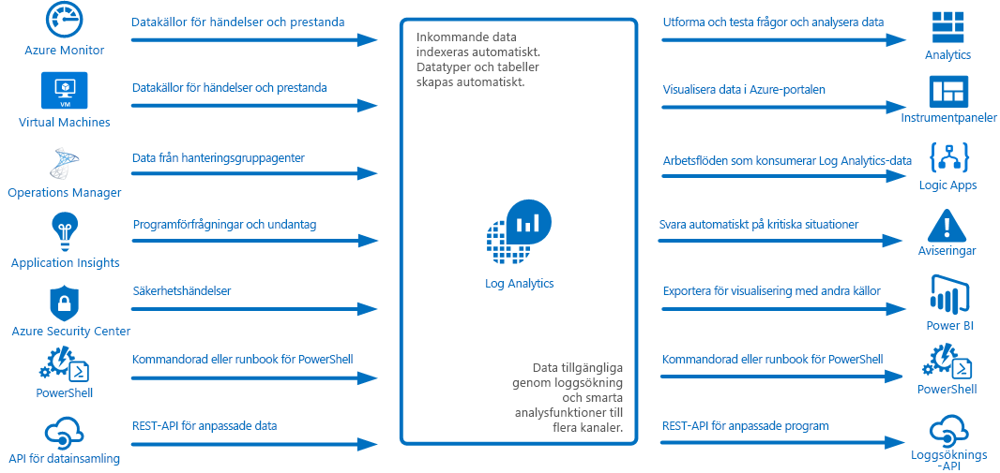
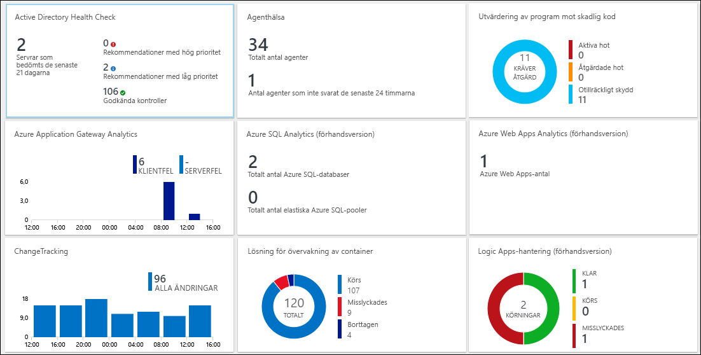
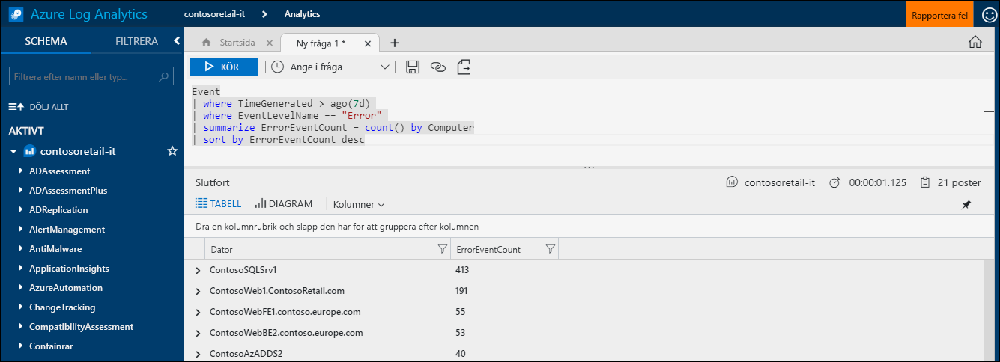
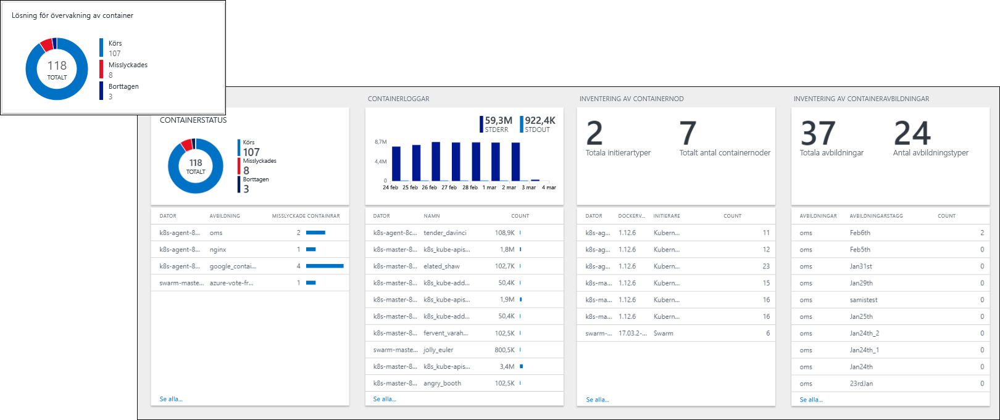
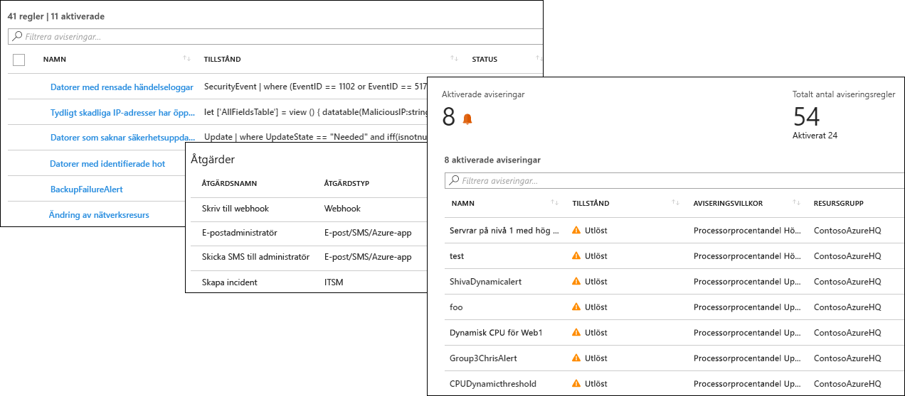
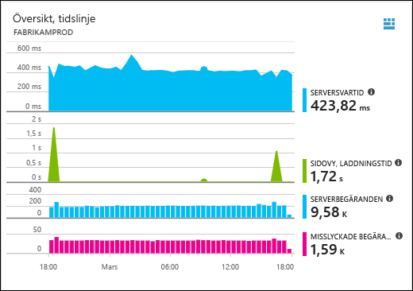
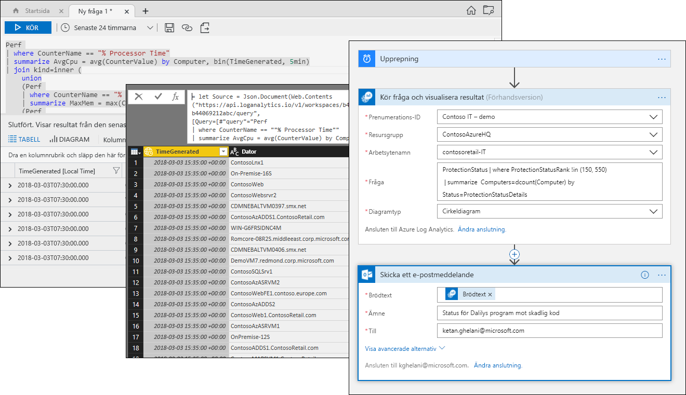

# Vad är Azure Log Analytics?
Log Analytics spelar en central roll i Azure-hanteringen genom att samla in telemetri och övriga data från en mängd källor och tillhandahåller ett frågespråk och en analytisk motor som ger dig insikter om hur dina program och resurser fungerar.  Du kan antingen interagera direkt med Log Analytics-data via loggsökningar och vyer, eller så kan du använda analysverktyg i övriga Azure-tjänster som lagrar deras data i Log Analytics, som Application Insights eller Azure Security Center.  

Log Analytics kräver minimal konfiguration och är redan integrerat i med övriga Azure-tjänster.  Du behöver bara skapa en arbetsyta om du vill aktivera insamling.  Du kan sedan installera agenter på virtuella datorer för att inkludera dem i arbetsytan och aktivera hanteringslösningar som inkluderar logik för att tillhandahålla ytterligare insikter i olika program.  I bakgrunden är datatyper antingen fördefinierade eller skapade automatiskt när data samlas in.

## Roll vid övervakning

De olika övervakningstjänsterna i Azure beskrivs i [Monitoring Azure applications and resources](../monitoring-and-diagnostics/monitoring-overview.md) (Övervaka Azure-program och -resurser).  Log Analytics spelar en central roll genom att konsolidera övervakningsdata från olika källor och tillhandahålla ett kraftfullt frågespråk för konsolidering och analys.  

Log Analytics är dock inte begränsat till övervakning av Azure-resurser.  Det kan samla in data från resurser som finns lokalt eller i andra moln för att skapa en hybridövervakningsmiljö och kan direkt ansluta till System Center Operations Manager för att samla in telemetri från befintliga agenter.  Analysverktygen i Log Analytics som loggsökningar, vyer och hanteringslösningar fungerar mot alla insamlade data och ger dig möjlighet att göra en centraliserad analys av hela miljön.

## Datainsamling
Log Analytics samlar in data från många olika källor.  När data har samlats in ordnas de i separata tabeller för varje datatyp, som låter alla data analyseras tillsammans oavsett originalkälla.

Metoder för att samla in data till Log Analytics är följande:

- Konfigurera Azure Monitor to för att kopiera mått och loggar som det samlar in från Azure-resurser.
- Agenter på virtuella datorer i [Windows](log-analytics-windows-agent.md) och [Linux](log-analytics-linux-agents.md) skickar telemetri från gästoperativsystem och program till Log Analytics enligt de [datakällor](log-analytics-data-sources.md) du konfigurerar.  
- Anslut en [System Center Operations Manager-hanteringsgrupp](log-analytics-om-agents.md) till Log Analytics för att samla in data från dess agenter.
- Azure-tjänster som [Application Insights](https://docs.microsoft.com/azure/application-insights/) och [Azure Security Center](https://docs.microsoft.com/azure/security-center/) lagrar sina data direkt i Log Analytics utan konfiguration.
- Skriv data från PowerShell-kommandoraden eller [Azure Automation-runbook](../automation/automation-runbook-types.md) med cmdlet:ar från Log Analytics.
- Om du har anpassade krav kan du använda [HTTP Data Collector API](log-analytics-data-collector-api.md) för att skriva data till Log Analytics från en REST API-klient.

## Lägga till funktioner med hanteringslösningar
[Hanteringslösningar](log-analytics-add-solutions.md) tillhandahåller förpaketerad logik för en speciell produkt eller scenario.  De kan samla in extra data till Log Analytics eller bearbeta data som redan har samlats in.  De inkluderar vanligen en vy för att hjälpa dig att analysera dessa ytterligare data.  Lösningar är tillgängliga för en mängd funktioner och ytterligare lösningar läggs till hela tiden.  Du kan enkelt bläddra bland tillgängliga lösningar och [lägga till dem på din arbetsyta](log-analytics-add-solutions.md) från Azure Marketplace.  

## Frågespråk

Log Analytics tillhandahåller en [omfattande frågesyntax](http://docs.loganalytics.io) för att snabbt hämta, konsolidera och analysera insamlade data.  Du kan skapa och testa frågor med [loggsökning eller avancerade analysportaler](log-analytics-log-search-portals.md) och sedan antingen direkt analysera data med verktygen eller spara frågor för användning med visualiseringar, aviseringar eller exporter till andra verktyg som Power BI eller Excel.

Frågespråket i Log Analytics passar enkla loggsökningar men innehåller även avancerade funktioner som aggregeringar, kopplingar och smart analys. Du kan snabbt lära dig frågespråket med [flera självstudier](https://docs.loganalytics.io/docs/Learn/Tutorials) som är tillgängliga.  Viss vägledning erbjuds användare som redan är bekanta med [SQL](https://docs.loganalytics.io/docs/Learn/References/SQL-to-Azure-Log-Analytics) och [Splunk](https://docs.loganalytics.io/docs/Learn/References/Splunk-to-Azure-Log-Analytics).

## Visualisera Log Analytics-data

[Vyer i Log Analytics](log-analytics-view-designer.md) presenterar data från loggsökningar visuellt.  Varje vy innehåller en kombination av visualiseringar som stapel- och linjediagram utöver listor som summerar kritiska data.  [Hanteringslösningar](#add-functionality-with-management-solutions) innehåller vyer som summerar data för ett speciellt program, och du kan skapa egna vyer för att presentera data från valfri Log Analytics-loggsökning.

Du kan även fästa resultatet av en Log Analytics-fråga till en [Azure-instrumentpanel](../azure-portal/azure-portal-dashboards.md), som gör att du kan kombinera paneler från olika Azure-tjänster.  Du kan också fästa en Log Analytics-vy på instrumentpanelen.

## Skapa aviseringar från Log Analytics-data

Använd [Azure Alerts](../monitoring-and-diagnostics/monitoring-overview-unified-alerts.md) så att det proaktivt meddelar dig om villkor i Log Analytics-data som är viktiga för dig.  En fråga körs automatiskt vid schemalagda intervaller och en varning skapas om resultatet matchar specifika villkor.  Det gör att du kan kombinera aviseringar från Log Analytics med andra källor som aviseringar i nästan realtid via [Azure Monitor](../monitoring-and-diagnostics/monitoring-near-real-time-metric-alerts.md) och programundantag i [Application Insights](../application-insights/app-insights-alerts.md), och dela [åtgärdsgrupper](../monitoring-and-diagnostics/monitoring-action-groups.md) för svar på aviseringsvillkor.

## Använda Log Analytics-data i andra tjänster
Tjänster som Application Insights och Azure Security Center lagrar sina data i Log Analytics.  Normalt interagerar du med de omfattande analysverktygen som tillhandahålls av tjänsterna, men du kan även använda Log Analytics-frågor för att få åtkomst till deras data och kan potentiellt kombinera dem med data från andra tjänster.  

Exempelvis är följande vy från Application Insights.  Om du klickar på ikonen längst upp till höger startar Log Analytics-analyskonsolen med frågorna som används av diagrammet.

## Exportera Log Analytics-Data

Log Analytics gör även sina data tillgängliga utanför Azure.  Du kan konfigurera [Power BI](log-analytics-powerbi.md) så att det importerar resultatet av en fråga med schemalagda intervaller. Det gör att du kan dra nytta av dess funktioner som att kombinera data från olika källor och dela rapporter på webben och mobila enheter.  Du kan också använda [Loggsöknings-API](log-analytics-log-search-api.md) för att skapa anpassade lösningar som utnyttjar Log Analytics-data eller för att integrera med andra system.

Du kan använda [Logic Apps](../logic-apps/logic-apps-overview.md) i Azure för att skapa anpassade arbetsflöden baserat på Log Analytics-data.  För mer komplex logik baserat på PowerShell kan du använda [runbooks i Azure Automation](../automation/automation-runbook-types.md).

## Nästa steg
- Kom igång genom att [samla in data från virtuella datorer i Azure](log-analytics-quick-collect-azurevm.md).
- Gå igenom en [självstudie om att analysera Log Analytics-data med en enkel fråga](log-analytics-tutorial-viewdata.md).
* [Bläddra bland tillgängliga lösningar](log-analytics-add-solutions.md) för att lägga till funktioner i Log Analytics.

