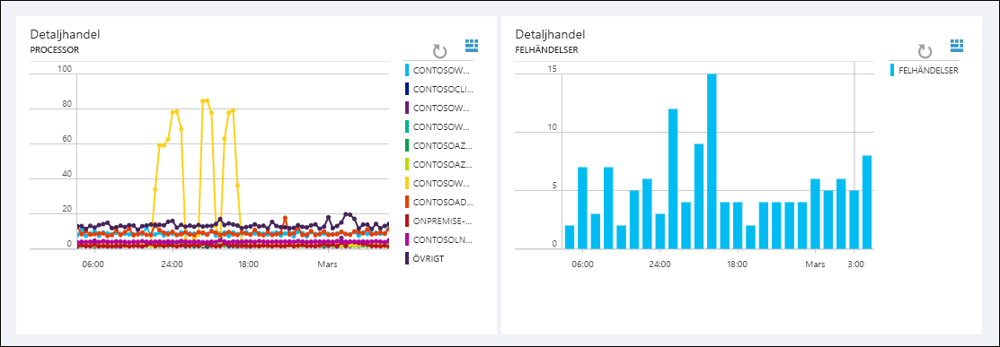

# Vad är Log Analytics?
Log Analytics är en tjänst i [Operations Management Suite \(OMS\)](../operations-management-suite/operations-management-suite-overview.md) som hjälper dig att samla och analysera data som genererats av resurser i molnet och i lokala miljöer. Det ger dig realtidsinsikter med integrerad sökning och anpassade instrumentpaneler för snabb analys av miljontals poster över hela arbetsbelastningen och alla servrar, oavsett deras fysiska plats.

## Komponenter i Log Analytics
I centrum av Log Analytics finns OMS-databasen som ligger i Azure-molnet.  Data samlas i databasen från anslutna källor genom att konfigurera datakällor och lägga till lösningar i din prenumeration.  Alla datakällor och lösningar skapar olika typer av poster som har en egen uppsättning egenskaper, men de kan fortfarande analyseras tillsammans i förfrågningar till databasen.  Det gör att du kan använda samma verktyg och metoder för att arbeta med olika typer av data som samlats från olika källor.

Anslutna datakällor är de datorer och andra resurser som genererar data som samlas in av Log Analytics.  Detta kan omfatta agenter som installerats på [Windows](log-analytics-windows-agents.md)- och [Linux](log-analytics-linux-agents.md)-datorer som ansluter direkt, eller agenter i en [ansluten System Center Operations Manager-hanteringsgrupp](log-analytics-om-agents.md).  Log Analytics kan även samla data från [Azure Storage](log-analytics-azure-storage.md).

[Datakällor](log-analytics-data-sources.md) är olika typer av data som samlas in från varje anslutna källa.  Detta innefattar händelser och [prestandadata](log-analytics-data-sources-performance-counters.md) från [Windows](log-analytics-data-sources-windows-events.md)- och Linux-agenter förutom källor som [IIS-loggar](log-analytics-data-sources-iis-logs.md) och [anpassade textloggar](log-analytics-data-sources-custom-logs.md).  Du kan konfigurera varje datakälla som du vill samla in och konfigurationen skickas automatiskt till varje ansluten källa.

## Analysera Log Analytics-data
De flesta interaktionen med Log Analytics sker via OMS-portalen, som kan köras i alla webbläsare och ger åtkomst till konfigurationsinställningar och flera olika verktyg för att analysera och agera på insamlad data.  Från portalen kan du utnyttja [loggsökningar](log-analytics-log-searches.md) där du skapar förfrågningar för att analysera insamlad data, [instrumentpaneler](log-analytics-dashboards.md) som du kan anpassa med grafiska vyer över dina mest värdefulla sökningar och [lösningar](log-analytics-add-solutions.md) som ger ytterligare funktioner och analysverktyg.

Log Analytics tillhandahåller en frågesyntax för att snabbt hämta och konsolidera data i databasen.  Du kan skapa och spara [loggsökningar](log-analytics-log-searches.md) för att direkt analysera data i OMS-portalen eller köra loggsökningar automatiskt för att skapa en avisering om resultatet av förfrågan indikerar ett viktigt villkor.

För att få en snabb grafisk vy över hälsotillståndet för hela din miljö kan du lägga till grafik för sparade loggsökningar i din [instrumentpanel](log-analytics-dashboards.md).   

För att analysera data utanför Log Analytics kan du exportera data från OMS-databasen till verktyg som [Power BI](log-analytics-powerbi.md) eller Excel.  Du kan också använda [Loggsöknings-API](log-analytics-log-search-api.md) för att skapa anpassade lösningar som utnyttjar Log Analytics-data eller för att integrera med andra system.

## Lösningar
Lösningar lägger till funktioner i Log Analytics.  De körs huvudsakligen i molnet och ger analys av data som samlats i OMS-databasen. De kan också definiera nya typer av poster som ska samlas in som kan analyseras med loggsökningar eller genom ytterligare användargränssnitt som tillhandahålls i lösningen i OMS-instrumentpanelen.  

Det finns lösningar tillgängliga för en mängd funktioner och du kan enkelt bläddra bland lösningar och [lägga till dem i din OMS-arbetsyta](log-analytics-add-solutions.md) från lösningsgalleriet.  Många distribueras automatiskt och börjar arbeta direkt, medan andra kan kräver en viss konfiguration.

## Log Analytics-arkitekturen
Kraven för en distribution av Log Analytics är minimala eftersom de centrala komponenterna finns i Azure-molnet.  Detta inkluderar databasen utöver de tjänster som gör att du kan kombinera och analysera insamlad data.  Portalen kan nås från valfri webbläsare, så det finns inga krav på klientprogramvaran.

Du måste installera agenter på [Windows](log-analytics-windows-agents.md)- och [Linux](log-analytics-linux-agents.md)-datorer, men det krävs ingen ytterligare agent för datorer som redan tillhör en [ansluten SCOM-hanteringsgrupp](log-analytics-om-agents.md).  SCOM-agenter fortsätter att kommunicera med hanteringsservrar som vidarebefordrar sina data till Log Analytics.  Vissa lösningar kräver dock agenter som kommunicerar direkt med Log Analytics.  Dokumentationen för varje lösning specificerar kommunikationskraven.

När du [registrerar dig för Log Analytics](log-analytics-get-started.md) skapar du en OMS-arbetsyta.  Du kan betrakta arbetsytan som en unik OMS-miljö med en egen databas och egna datakällor och lösningar. Du kan skapa flera arbetsytor i din prenumeration för att stödja flera miljöer, till exempel för produktion och test.

## Nästa steg
* [Registrera dig för ett kostnadsfritt Log Analytics-konto](log-analytics-get-started.md) för att testa i din egen miljö.
* Visa de olika [datakällor](log-analytics-data-sources.md) som finns tillgängliga för att samla data till OMS-databasen.
* [Bläddra bland tillgängliga lösningar i lösningsgalleriet](log-analytics-add-solutions.md) för att lägga till funktioner i Log Analytics.

<!--HONumber=Dec16_HO2-->

