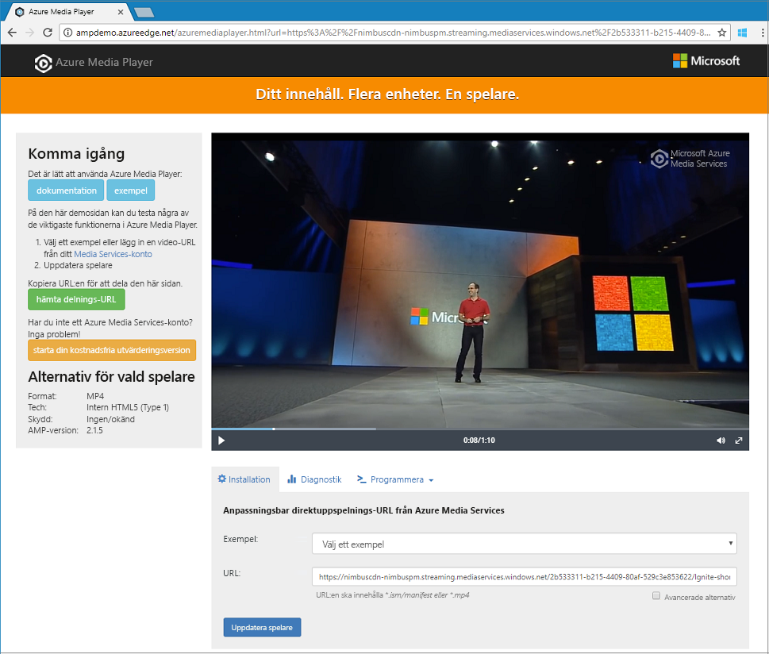

# <a name="quickstart-stream-video-files---net"></a>Snabbstart: Strömma videofiler – .NET

> [!NOTE]
> Den senaste versionen av Azure Media Services är en förhandsversion och kallas ibland för v3. För att börja använda v3 API:er ska du skapa ett nytt Media Services-konto såsom beskrivs i den här snabbstarten. 

Den här snabbstarten visar hur lätt det är att börja strömma video på en mängd olika webbläsare och enheter med Azure Media Services. Exemplet i det här ämnet kodar innehåll som du gör tillgängligt via en HTTPS-URL. 

I slutet av snabbstarten kommer du att kunna strömma en video.  



[!INCLUDE [quickstarts-free-trial-note](../../../includes/quickstarts-free-trial-note.md)]

## <a name="prerequisites"></a>Nödvändiga komponenter

Om du inte har Visual Studio installerat kan du hämta [Visual Studio Community 2017](https://www.visualstudio.com/thank-you-downloading-visual-studio/?sku=Community&rel=15).

## <a name="download-the-sample"></a>Hämta exemplet

Klona en GitHub-lagringsplats som innehåller det strömmande .NET-exemplet till din dator med följande kommando:  

 ```bash
 git clone http://github.com/Azure-Samples/media-services-v3-dotnet-quickstarts.git
 ```

Exemplet finns i mappen [EncodeAndStreamFiles](https://github.com/Azure-Samples/media-services-v3-dotnet-quickstarts/tree/master/AMSV3Quickstarts/EncodeAndStreamFiles).

Exemplet utför följande åtgärder:

1. Skapar en transformering (kontrollerar först om den angivna transformeringen finns). 
2. Skapa en utdatatillgång som används som kodningsjobbets utdata.
3. Skapar jobbets indata som baseras på en HTTPS-URL.
4. Skickar kodningsjobbet med de indata och utdata som skapades tidigare.
5. Kontrollerar jobbets status.
6. Skapar en StreamingLocator.
7. Skapar strömnings-URL:er.

Du kan få beskrivningar av varje funktion i exemplet, undersöka koden och titta på kommentarer i [den här källfilen](https://github.com/Azure-Samples/media-services-v3-dotnet-quickstarts/blob/master/AMSV3Quickstarts/EncodeAndStreamFiles/Program.cs).

## <a name="log-in-to-azure"></a>Logga in på Azure

Logga in på [Azure-portalen](http://portal.azure.com).

[!INCLUDE [cloud-shell-try-it.md](../../../includes/cloud-shell-try-it.md)]

[!INCLUDE [media-services-cli-create-v3-account-include](../../../includes/media-services-cli-create-v3-account-include.md)]

[!INCLUDE [media-services-v3-cli-access-api-include](../../../includes/media-services-v3-cli-access-api-include.md)]

## <a name="run-the-sample-app"></a>Kör exempelappen

När du kör appen visas URL:er som kan användas för uppspelning av video med olika protokoll. 

1. Tryck på Ctrl+F5 för att köra programmet *EncodeAndStreamFiles*.
2. Välj Apples **HLS**-protokoll (slutar med *manifest(format=m3u8-aapl)*) och kopiera strömnings-URL:en från konsolen.


I exemplets [källkod](https://github.com/Azure-Samples/media-services-v3-dotnet-quickstarts/blob/master/AMSV3Quickstarts/EncodeAndStreamFiles/Program.cs), kan du se hur URL:en är byggd. För att skapa den, måste du sammanfoga strömningsslutpunktens värdnamn och sökvägen för strömningslokaliseraren.  

## <a name="test-with-azure-media-player"></a>Testa med Azure Media Player

I den här artikeln används Azure Media Player för att testa dataströmmen. 

> [!NOTE]
> Om en spelare finns på en HTTPS-webbplats uppdaterar du URL:en till ”HTTPS”.

1. Öppna en webbläsare och navigera till [https://aka.ms/azuremediaplayer/](https://aka.ms/azuremediaplayer/).
2. I rutan **URL:** klistrar du in ett av de strömmande URL-värden som du fick när du körde programmet. 
3. Tryck på **Uppdatera spelare**.

Azure Media Player kan användas vid testning, men bör inte användas i en produktionsmiljö. 

## <a name="clean-up-resources"></a>Rensa resurser

Om du inte längre behöver någon av resurserna i resursgruppen, inklusive Media Services och lagringskontona som du skapade för snabbstarten, tar du bort resursgruppen. Du kan använda verktyget **CloudShell**.

Kör följande kommando i **CloudShell**:

```azurecli-interactive
az group delete --name amsResourceGroup
```

## <a name="examine-the-code"></a>Granska koden

Du kan få beskrivningar av varje funktion i exemplet, undersöka koden och titta på kommentarer i [den här källfilen](https://github.com/Azure-Samples/media-services-v3-dotnet-quickstarts/blob/master/AMSV3Quickstarts/EncodeAndStreamFiles/Program.cs).

I självstudien för att [ladda upp, koda och strömma filer](stream-files-tutorial-with-api.md) får du ett mer avancerat strömningsexempel med detaljerade förklaringar. 

## <a name="multithreading"></a>Flertrådsteknik

SDK:erna i Azure Media Services v3 är inte trådsäkra. När du arbetar med flertrådade program bör du skapa ett nytt AzureMediaServicesClient-objekt per tråd.

## <a name="next-steps"></a>Nästa steg

> [!div class="nextstepaction"]
> [Självstudie: ladda upp, koda och strömma filer](stream-files-tutorial-with-api.md)
