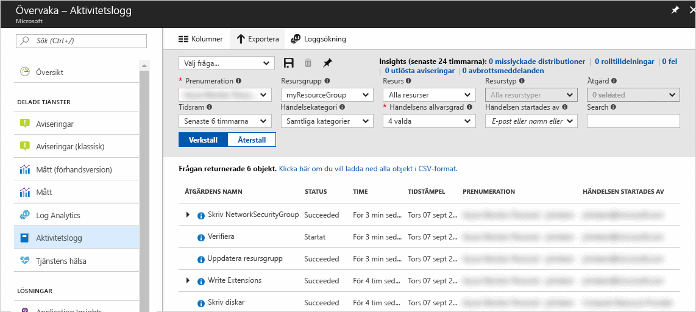
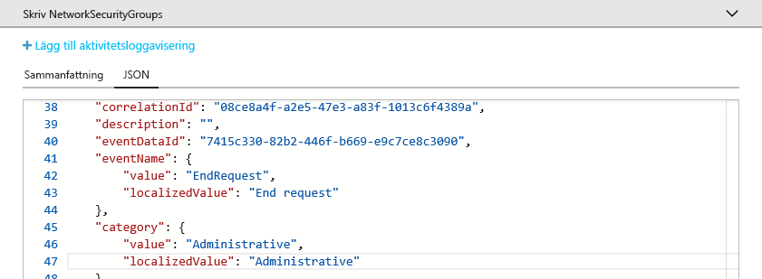
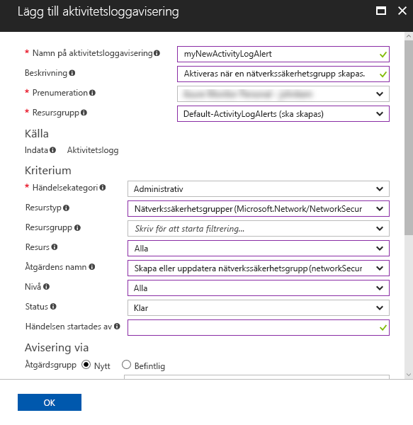

# Granska och ta emot meddelanden om viktiga åtgärder i din Azure-prenumeration

Den **Azure-aktivitetsloggen** innehåller en historik över prenumerationsnivån händelser i Azure. Det ger information om *som* skapas, uppdateras eller tas bort *vad* resurser och *när* de gjorde den. Du kan skapa en **aktivitetsloggen avisering** att ta emot e-post, SMS eller webhook meddelanden när en aktivitet inträffar som matchar din avisering villkor. Den här Snabbstartsguide för att skapa en enkel nätverkssäkerhetsgrupp, surfning aktivitetsloggen för att förstå den händelse som uppstått och sedan redigera en aktivitetsloggen avisering att bli meddelad när nätverkssäkerhetsgrupp har skapats kommer vidarebefordran.

Om du inte har en Azure-prenumeration kan du skapa ett [kostnadsfritt](https://azure.microsoft.com/free/) konto innan du börjar.

## Logga in på Azure Portal

Logga in på [Azure-portalen](https://portal.azure.com/).

## Skapa en säkerhetsgrupp för nätverk

1. Klicka på knappen **New** (Nytt) i det övre vänstra hörnet i Azure Portal.

2. Välj **nätverk**väljer **nätverkssäkerhetsgruppen**.

3. Ange ”myNetworkSG” som den **namn** och skapa en ny resursgrupp med namnet **myResourceGroup**. Klicka på knappen **Skapa**.

    

## Bläddra aktivitetsloggen i portalen

En händelse har nu lagts till aktivitetsloggen som beskriver skapandet av nätverkssäkerhetsgruppen. Använd följande instruktioner för att identifiera händelsen.

1. Klicka på den **övervakaren** knapp hittades i listan över vänstra navigeringsfönstret. Det öppnar du avsnittet aktivitetsloggen. Det här avsnittet innehåller en historik över alla åtgärder som användarna har utförts på resurser i din prenumeration, filtrera efter flera egenskaper som den **resursgruppen**, **Timespan**, och  **Kategori**.

2. I den **aktivitetsloggen** klickar du på den **resursgruppen** listrutan och välj **myResourceGroup**. Ändra den **Timespan** dropdown till **senaste 1 timme**. Klicka på **Använd**.

    

3. Klicka på den **skriva NetworkSecurityGroups** händelse i tabellen i händelser som visas.

## Bläddra en händelse i aktivitetsloggen

Avsnittet som visas innehåller grundläggande information om åtgärden som utfördes, inklusive namn, tidsstämpel, och användaren eller programmet som utförts av den.

Klicka på den **JSON** fliken om du vill visa fullständig händelseinformationen. Detta omfattar information om hur användaren eller programmet har behörighet att utföra åtgärden, händelsekategori och nivå och status för åtgärden.

## Skapa en avisering i aktivitetsloggen

1. Klicka på den **sammanfattning** fliken att återgå till händelsesammanfattning.

2. I avsnittet Sammanfattning som visas, klickar du på **Lägg till aktivitet loggen avisering**.

    

3. Ge aktivitetsloggen aviseringen i avsnittet som visas, namn och beskrivning.

4. Under **kriterier** se till att **händelsekategori** är inställd på **administrativa**, **resurstypen** är inställd på **nätverk säkerhetsgrupper**, **åtgärdsnamn** är inställd på **skapa eller uppdatera Nätverkssäkerhetsgrupp**, **Status** är inställd på  **Lyckades** och alla andra villkor är antingen tomt eller ange att **alla**. Kriterierna som definierar de regler som används för att avgöra om aviseringen ska aktiveras när en ny händelse visas i aktivitetsloggen.

    

5. Under **avisering via** Välj **ny** åtgärd gruppen och ge en **namn** och **kortnamnet** för åtgärdsgruppen. Åtgärdsgruppen definierar de åtgärder som vidtas när aviseringen aktiveras (när kriterierna som matchar en ny händelse).

6. Under **åtgärder** lägga till 1 eller fler åtgärder genom att tillhandahålla en **namn** åtgärd i **åtgärdstyp** (till exempel e-post eller SMS) och **information**för viss åtgärd (till exempel en Webhooksadressen, e-postadress eller SMS).

    

7. Klicka på **Ok** spara aktivitetsloggen aviseringen.

## Testa aktivitetsloggen aviseringen

> [!NOTE]
> Det tar cirka 10 minuter för en aktivitetsloggen varning ska aktiveras helt. Nya händelser som inträffar innan aktivitetsloggen aviseringen helt aktiverade genererar inte aviseringar.
>
>

Om du vill testa aviseringen Upprepa det föregående avsnittet ska **skapar en nätverkssäkerhetsgrupp**, men ger ett annat namn för den här nätverkssäkerhetsgruppen och återanvända den befintliga resursgruppen. Du får ett meddelande om att nätverkssäkerhetsgruppen skapades inom några minuter.

## Rensa resurser

Ta bort resursgruppen och nätverkssäkerhetsgruppen när de inte längre behövs. Om du vill göra det, skriver du namnet på resursgruppen som du skapade i sökrutan överst i portalen och klicka på namnet på resursgruppen. Klicka på avsnittet som visas i **ta bort resursgruppen** , skriver du namnet på resursgruppen och på **ta bort**.

## Nästa steg

I den här snabbstartsguide utfört en åtgärd för att generera en händelse i aktivitetsloggen och sedan skapa en avisering för aktivitetsloggen att bli meddelad när den här åtgärden genomförs igen i framtiden. Du kan sedan testat aviseringen genom att utföra åtgärden igen. Azure gör tillgängliga aktivitetsloggen händelser från de senaste 90 dagarna. Om du vill behålla händelser som är längre än 90 dagar försök arkivering aktivitetsloggen data tillsammans med andra övervakningsdata.

> [!div class="nextstepaction"]
> [Arkivera övervakningsdata](./monitor-tutorial-archive-monitoring-data.md)
