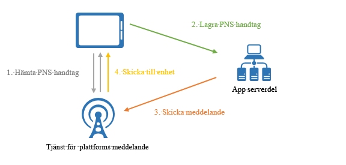
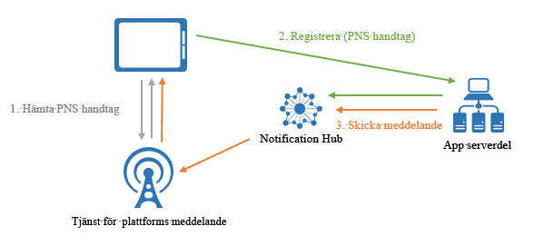

# Vad är Azure Notification Hubs?
Azure Notification Hubs innehåller en lättanvänd och uppskalad push-motor som gör det möjligt för dig att skicka meddelanden till valfri plattform (iOS, Android, Windows, Kindle, Baidu osv) från valfri serverdel (molnet eller lokalt). Notification Hubs fungerar utmärkt för både företags- och konsumentscenarier. Här följer några exempel:

- Skicka meddelanden med senaste nytt till miljontals användare med låg latens.
- Skicka platsbaserade kuponger till intresserade användarsegment.
- Skicka händelserelaterade meddelanden till användare eller grupper med media-/sport-/ekonomi-/spelprogram.
- Skicka innehåll med erbjudanden till program engagera och marknadsföra gentemot kunder.
- Meddela användare om företagshändelser, t.ex. nya meddelanden och arbetsobjekt.
- Skicka koder för multifaktorautentisering.

## Vad är push-meddelanden?
Push-meddelanden är en typ av app-till-användare-kommunikation där användare av mobila appar får meddelanden med önskad information, vanligtvis i ett popup-fönster eller en dialogruta. Användarna kan vanligtvis välja att visa eller avfärda meddelandena. Om användaren väljer det första alternativet öppnas mobilprogrammet som kommunicerade meddelandet.

Push-meddelanden är viktiga för konsumentapparna när det gäller att öka engagemanget och användningen, och för företagsapparna när det gäller att kommunicera uppdaterad affärsinformation. Det är den bästa formen av app-till-användare-kommunikation eftersom den är energieffektiv för mobila enheter, flexibla för avsändarna av meddelanden och är tillgängliga även när motsvarande program inte är aktiva.

Mer information om push-meddelanden för några populära plattformar finns i följande avsnitt: 
* [iOS](https://developer.apple.com/notifications/)
* [Android](https://developer.android.com/guide/topics/ui/notifiers/notifications.html)
* [Windows](http://msdn.microsoft.com/library/windows/apps/hh779725.aspx)

## Hur fungerar push-meddelanden?
Push-meddelanden levereras via plattformsspecifika infrastrukturer som kallas för *plattformsspecifika meddelandesystem* (Platform Notification Systems, PNS). De erbjuder grundläggande push-funktioner när det gäller att leverera ett meddelande till en enhet med en tillhandahållen referens, och de har inget gemensamt gränssnitt. Om du vill skicka ett meddelande till alla kunder via en apps iOS-, Android- och Windows-versioner måste utvecklarna arbeta med Apple Push Notification Service (APNS), Firebase Cloud Messaging (FCM) och Windows Notification Service (WNS).

På hög nivå fungerar push-tekniken så här:

1. Klientappen vill ta emot aviseringar. Därför kontaktar den motsvarande PNS för att hämta dess unika och temporära push-referens. Vilken referenstypen är beror på systemet (WNS har t.ex. URI:er medan APN har token).
2. Klientappen lagrar denna referens i appens serverdel eller provider.
3. För att skicka ett push-meddelande kontaktar appens serverdel PNS-systemet genom att använda handtaget för att rikta in sig på en specifik klientapp.
4. PNS-systemet vidarebefordrar meddelandet till den enhet som anges av handtaget.

## Utmaningarna med push-meddelanden
PNS:er är kraftfulla. Det krävs ändå mycket arbete av apputvecklaren för att implementera även de mest grundläggande scenarierna för push-meddelanden, som att sända push-meddelanden till olika användarsegment.

Att skicka meddelanden kräver en komplex infrastruktur som är orelaterad till programmets huvudsakliga affärslogik. Några av de infrastrukturella utmaningarna är:

- **Plattformsberoende**
    - Serverdelen måste ha en komplex och svårunderhållen plattformsberoende logik för att kunna skicka meddelanden till enheter på olika plattformar eftersom PNS:erna inte är enhetliga.
- **Skalning**
    - Enligt PNS-riktlinjerna måste enhetstoken uppdateras varje gång appen startas. Serverdelen hanterar en stor mängd trafik och databasåtkomst bara för att hålla dessa token uppdaterade. När antalet enheter växer och blir fler, upp till tusentals miljoner, blir kostnaden för att skapa och hantera den här infrastrukturen enorm.
    - Merparten av PNS-systemen stöder inte sändning av meddelanden till flera enheter. En enkel sändning till en miljon enheter resulterar i en miljon anrop till PNS-systemen. Att skala den här mängden trafik med minimal svarstid är en intrikat uppgift.
- **Routning** 
    - Även om PNS-systemen tillhandahåller ett sätt på vilket man kan skicka meddelanden till enheter, så riktar sig merparten av appmeddelandena till användare eller intressegrupper. Serverdelen måste upprätthålla ett register för att kunna associera enheter till intressegrupper, användare, egenskaper och så vidare. Det här arbetet gör att det tar ännu längre tid att få ut en app på marknaden och att underhållskostnaden ökar.

## Varför ska man använda Azure Notification Hubs?
Notification Hubs eliminerar all komplexitet som associeras till att skicka push-meddelanden från sin egen appserverdel. Dess utskalade multiplattform för en push-meddelandeinfrastruktur reducerar den push-relaterade kodningen och förenklar serverdelen. Med Notification Hubs är enheterna enbart ansvariga för att registrera sina PNS-handtag hos en hubb, medan serverdelen skickar meddelanden till användare eller intressegrupper, så som visas på följande bild:

Meddelandehubbar är användningsfärdiga push-motorer med följande fördelar:

- **Plattformsoberoende**
    - Stöd för alla större push-plattformar, inklusive iOS, Android, Windows, Kindle och Baidu.
    - Ett gemensamt gränssnitt för alla plattformar i plattformsspecifika eller plattformsoberoende format med icke plattformsspecifikt arbete.
    - Hantering av enhetshandtag på ett och samma ställe.
- **Serverdelsoberoende**
    - Molnet eller lokalt
    - .NET, Node.js, Java osv.
- **Stor uppsättning av leveransmönster**
    - Skicka till en eller flera plattformar. Du kan skicka direkt till miljontals enheter på olika plattformar med ett enda API-anrop.
    - Skicka till enhet: du kan rikta meddelanden till enskilda enheter.
    - Skicka till användare: taggar och mallfunktioner hjälper dig att nå en användares samtliga plattformsoberoende enheter.
    - Skicka till segmentet med dynamiska taggar: taggfunktionen hjälper dig att segmentera enheter och skicka meddelanden till dem efter behov, oavsett om du skickar till ett segment eller ett segmentuttryck (t.ex. aktiv OCH bor i Seattle INTE ny användare). I stället för att vara begränsad till pub-sub kan du uppdatera enhetstaggar var som helst och när som helst.
    - Lokaliserad push: mallfunktionen kan bidra till att uppnå lokalisering utan att detta påverkar serverdelskoden.
    - Tyst push: du kan aktivera push-pull-mönster genom att skicka tysta meddelanden till enheter och utlösa dem när du vill slutföra vissa hämtningar eller åtgärder.
    - Schemalagd push: du kan schemalägga utskickning av meddelanden när som helst.
    - Direkt push: du kan hoppa över att registrera enheter med Notification Hubs-tjänsten och direkt batchpusha till en lista över enhetshandtag.
    - Anpassad push: enhets-push-variabler hjälper dig att skicka enhetsspecifika personliga push-meddelanden med anpassade nyckelvärdepar.
- **Omfattande telemetri**
    - Allmän telemetri för push, enhet, fel och åtgärder är tillgänglig i Azure Portal och i programmet.
    - Meddelandetelemetri spårar varje push från ditt initiala begäransanrop till Notification Hubs-tjänsten och batchbearbetar bort push-meddelandena.
    - Feedback från plattformsspecifikt meddelandesystem kommunicerar all feedback från det plattformsspecifika meddelandesystemet för att underlätta felsökningen.
- **Skalbarhet** 
    - Skicka snabba meddelanden till miljontals enheter utan ändrad arkitektur eller enhetspartitionering.
- **Säkerhet**
    - SAS (Shared Access Secret) eller federerad autentisering.

## Integrering med Mobilappar i Apptjänst
För att underlätta för en sömlös och enhetlig användarupplevelse av alla Azure-tjänster har [App Service Mobile Apps](../app-service-mobile/app-service-mobile-value-prop.md) inbyggt stöd för push-meddelanden som skickas via Notification Hubs. [App Service Mobile Apps](../app-service-mobile/app-service-mobile-value-prop.md) är en mycket skalbar, globalt tillgänglig plattform för mobilappsutveckling tänkt att användas av utvecklare av företagsprogram och systemintegrerare. Den ger mobilutvecklare tillgång till ett stort utbud av funktioner.

Utvecklare av mobilappar kan utnyttja Notification Hubs med följande arbetsflöde:

1. Hämta PNS-handtag för enheter
2. Registrera enheten med Notification Hub via en praktisk registrering med API för klient-SDK:er i Mobile Apps

    > [!NOTE]
    > Observera att Mobile Apps av säkerhetsskäl tar bort alla taggar vid registreringen. Arbeta med Notification Hubs direkt från din serverdel för att associera taggar med enheter.
1. Skicka meddelanden från din apps serverdel med Notification Hubs

Här är några av de fördelar som utvecklarna får tack vare den här integreringen:

- **Mobile Apps Client-SDK:er**: Dessa SDK:er för flera plattformar ger dig enkla API:er för att registrera och tala med den meddelandehubb som har länkats till mobilappen automatiskt. Utvecklare behöver inte gräva djupt bland autentiseringsuppgifterna för Notification Hubs eller arbeta med en ytterligare tjänst.
    - *Skicka till användare*: SDK:erna taggar en given enhet automatiskt med ett autentiserat användar-ID för Mobile Apps och aktiverar på så vis ett scenario för push-till-användare.
    - *Skicka till enhet*: SDK:erna använder automatiskt installations-ID:t för Mobile Apps som GUID för att registrera med Notification Hubs vilket gör att utvecklarna slipper upprätthålla flera olika GUID-tjänster.
- **Installationsmodell**: Mobile Apps fungerar tillsammans med Notification Hubs senaste push-modell för att representera alla push-egenskaper som är kopplade till en enhet i en JSON-installation. Denna kopplas samman med Push Notification Services och är enkel att använda.
- **Flexibilitet**: Utvecklare kan alltid välja att arbeta direkt med Notification Hubs, även om integrationen redan är på plats.
- **Integrerad upplevelse i [Azure Portal](https://portal.azure.com)**: Push som en funktion är visuellt återgiven i Mobile Apps och utvecklarna kan enkelt arbeta med den associerade meddelandehubben via Mobile Apps.

## Nästa steg
Kom igång med att skapa och använda en meddelandehubb genom att följa [Självstudier: Skicka meddelanden till mobila program](notification-hubs-android-push-notification-google-fcm-get-started.md). [0]: ./media/notification-hubs-overview/registration-diagram.png [1]: ./media/notification-hubs-overview/notification-hub-diagram.png [Hur kunder använder Notification Hubs]: http://azure.microsoft.com/services/notification-hubs [Notification Hubs-självstudier och guider]: http://azure.microsoft.com/documentation/services/notification-hubs [iOS]: http://azure.microsoft.com/documentation/articles/notification-hubs-ios-get-started [Android]: http://azure.microsoft.com/documentation/articles/notification-hubs-android-get-started [Windows Universal]: http://azure.microsoft.com/documentation/articles/notification-hubs-windows-store-dotnet-get-started [Windows Phone]: http://azure.microsoft.com/documentation/articles/notification-hubs-windows-phone-get-started [Kindle]: http://azure.microsoft.com/documentation/articles/notification-hubs-kindle-get-started [Xamarin.iOS]: http://azure.microsoft.com/documentation/articles/partner-xamarin-notification-hubs-ios-get-started [Xamarin.Android]: http://azure.microsoft.com/documentation/articles/partner-xamarin-notification-hubs-android-get-started [Microsoft.WindowsAzure.Messaging.NotificationHub]: http://msdn.microsoft.com/library/microsoft.windowsazure.messaging.notificationhub.aspx [Microsoft.ServiceBus.Notifications]: http://msdn.microsoft.com/library/microsoft.servicebus.notifications.aspx [App Service Mobile Apps]: https://azure.microsoft.com/documentation/articles/app-service-mobile-value-prop/ [templates]: notification-hubs-templates-cross-platform-push-messages.md [Azure Portal]: https://portal.azure.com [tags]: (http://msdn.microsoft.com/library/azure/dn530749.aspx)
