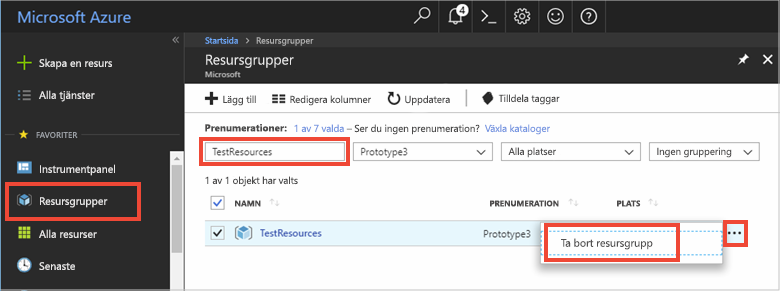

# <a name="quickstart-how-to-use-azure-redis-cache-with-java"></a>Snabbstart: Så här använder du Azure Redis Cache med Java


Azure Redis Cache ger dig tillgång till en dedikerad Redis-cache som hanteras av Microsoft. Din cache är tillgänglig från alla program i Microsoft Azure.

Den här artikeln visar hur du kommer igång med Azure Redis Cache med hjälp av [Jedis](https://github.com/xetorthio/jedis) Redis-Cache-klienten för Java.


Du kan använda valfritt kodredigeringsprogram för att slutföra stegen i den här snabbstarten. [Visual Studio Code](https://code.visualstudio.com/) är dock ett utmärkt alternativ som är tillgängligt på Windows-, macOS- och Linux-plattformar.

[!INCLUDE [quickstarts-free-trial-note](../../includes/quickstarts-free-trial-note.md)]


## <a name="prerequisites"></a>Nödvändiga komponenter

[Apache Maven](http://maven.apache.org/)


## <a name="create-an-azure-redis-cache"></a>Skapa en Azure Redis Cache

[!INCLUDE [redis-cache-create](../../includes/redis-cache-create.md)]

[!INCLUDE [redis-cache-access-keys](../../includes/redis-cache-access-keys.md)]

Lägg till miljövariabler för **HOST NAME** och **primär** åtkomstnyckel. Du använder dessa variabler från din kod i stället för att inkludera den känsliga informationen direkt i koden.

```
set REDISCACHEHOSTNAME=contosoCache.redis.cache.windows.net
set REDISCACHEKEY=XXXXXXXXXXXXXXXXXXXXXXXXXXXXXXXXXXXXXXXXXXXX
```

## <a name="create-a-new-java-app"></a>Skapa en ny Java-app

Generera en ny snabbstartsapp med Maven:

```
mvn archetype:generate -DarchetypeGroupId=org.apache.maven.archetypes -DarchetypeArtifactId=maven-archetype-quickstart -DarchetypeVersion=1.3 -DgroupId=example.demo -DartifactId=redistest -Dversion=1.0
```

Ändra till den nya *redistest*-projektkatalogen.

Öppna filen *pom.xml* och lägg till ett beroende för [Jedis](https://github.com/xetorthio/jedis):

```xml
    <dependency>
        <groupId>redis.clients</groupId>
        <artifactId>jedis</artifactId>
        <version>2.9.0</version>
        <type>jar</type>
        <scope>compile</scope>
    </dependency>
```

Spara filen *pom.xml*.

Öppna *App.java* och ersätt koden med följande kod:

```java
package example.demo;

import redis.clients.jedis.Jedis;
import redis.clients.jedis.JedisShardInfo;

/**
 * Redis test
 *
 */
public class App 
{
    public static void main( String[] args )
    {

        boolean useSsl = true;
        String cacheHostname = System.getenv("REDISCACHEHOSTNAME");
        String cachekey = System.getenv("REDISCACHEKEY");

        // Connect to the Redis cache over the SSL port using the key.
        JedisShardInfo shardInfo = new JedisShardInfo(cacheHostname, 6380, useSsl);
        shardInfo.setPassword(cachekey); /* Use your access key. */
        Jedis jedis = new Jedis(shardInfo);      

        // Perform cache operations using the cache connection object...

        // Simple PING command        
        System.out.println( "\nCache Command  : Ping" );
        System.out.println( "Cache Response : " + jedis.ping());

        // Simple get and put of integral data types into the cache
        System.out.println( "\nCache Command  : GET Message" );
        System.out.println( "Cache Response : " + jedis.get("Message"));

        System.out.println( "\nCache Command  : SET Message" );
        System.out.println( "Cache Response : " + jedis.set("Message", "Hello! The cache is working from Java!"));

        // Demostrate "SET Message" executed as expected...
        System.out.println( "\nCache Command  : GET Message" );
        System.out.println( "Cache Response : " + jedis.get("Message"));

        // Get the client list, useful to see if connection list is growing...
        System.out.println( "\nCache Command  : CLIENT LIST" );
        System.out.println( "Cache Response : " + jedis.clientList());

        jedis.close();
    }
}
```

Den här koden visar hur du ansluter till en Azure Redis Cache-instans med hjälp av cache-värdnamnet och viktiga miljövariabler. Koden lagrar och hämtar även ett strängvärde i cacheminnet. Kommandona `PING` och `CLIENT LIST` körs också. 

Spara *App.java*.

## <a name="build-and-run-the-app"></a>Skapa och kör appen

Skapa och kör appen genom att köra följande Maven-kommando:

```
mvn exec:java -D exec.mainClass=example.demo.App
```

I exemplet nedan ser du att `Message`-nyckeln tidigare hade ett cachelagrat värde som angavs med Redis-konsolen i Azure-portalen. Appen uppdatera det cachelagrade värdet. Appen körde även kommandona `PING` och `CLIENT LIST`.


## <a name="clean-up-resources"></a>Rensa resurser

Om du ska fortsätta till nästa självstudie kan du behålla resurserna som du har skapat i den här självstudien och använda dem igen.

Om du är klar med exempelappen för snabbstart kan du ta bort Azure-resurserna som du skapade i snabbstarten för att undvika kostnader. 

> [!IMPORTANT]
> Det går inte att ångra borttagningen av en resursgrupp och resursgruppen och alla resurser i den tas bort permanent. Kontrollera att du inte av misstag tar bort fel resursgrupp eller resurser. Om du har skapat resurserna som värd för det här exemplet i en befintlig resursgrupp som innehåller resurser som du vill behålla, kan du ta bort varje resurs separat från deras respektive blad istället för att ta bort resursgruppen.
>

Logga in på [Azure Portal](https://portal.azure.com) och klicka på **Resursgrupper**.

Skriv namnet på din resursgrupp i textrutan **Filtrera efter namn...**. Anvisningarna för den här artikeln använde en resursgrupp med namnet *TestResources*. På din resursgrupp i resultatlistan klickar du på **...** och därefter **Ta bort resursgrupp**.



Du blir ombedd att bekräfta borttagningen av resursgruppen. Skriv namnet på din resursgrupp för att bekräfta och klicka på **Ta bort**.

Efter en liten stund tas resursgruppen och resurser som finns i den bort.


## <a name="next-steps"></a>Nästa steg

I den här snabbstarten du har lärt dig hur du använder Azure Redis Cache från ett Java-program. Fortsätta till nästa snabbstart om du vill använda Redis Cache med en ASP.NET-webbapp.

> [!div class="nextstepaction"]
> [Skapa en ASP.NET-webbapp som använder Azure Redis Cache.](./cache-web-app-howto.md)


