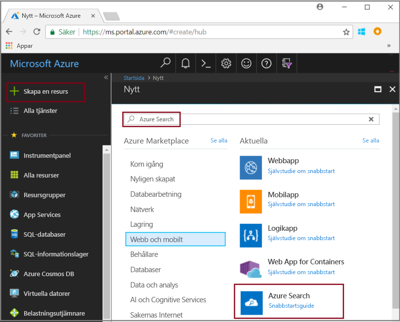
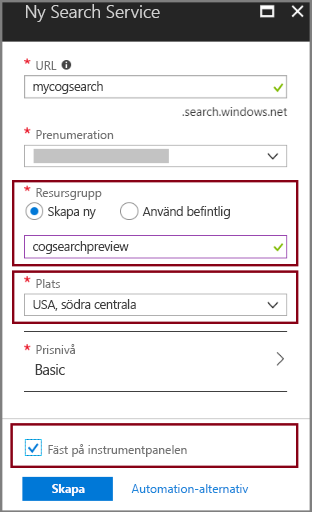
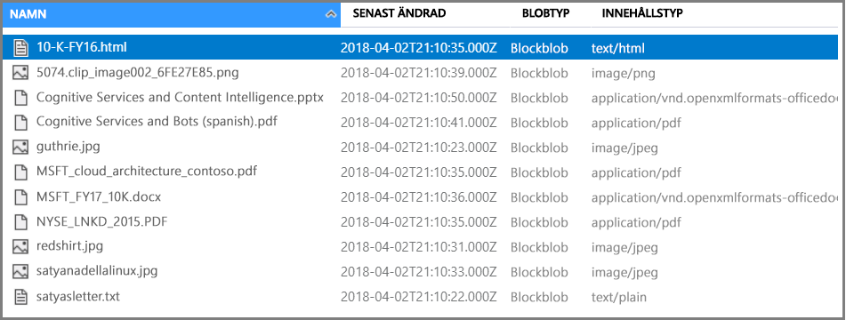
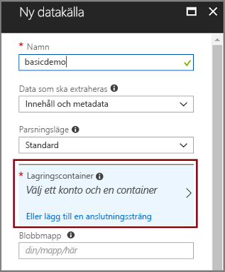
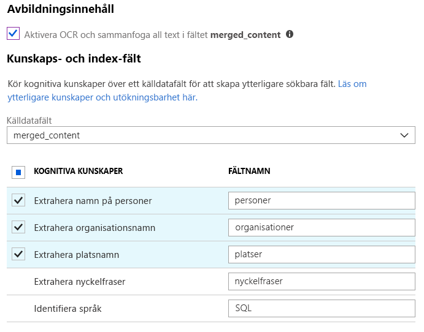
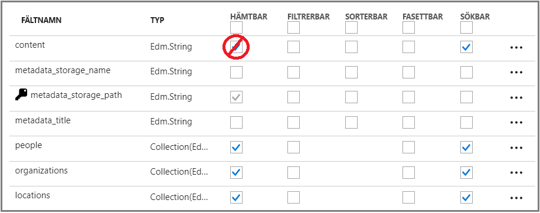
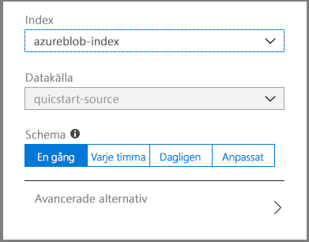
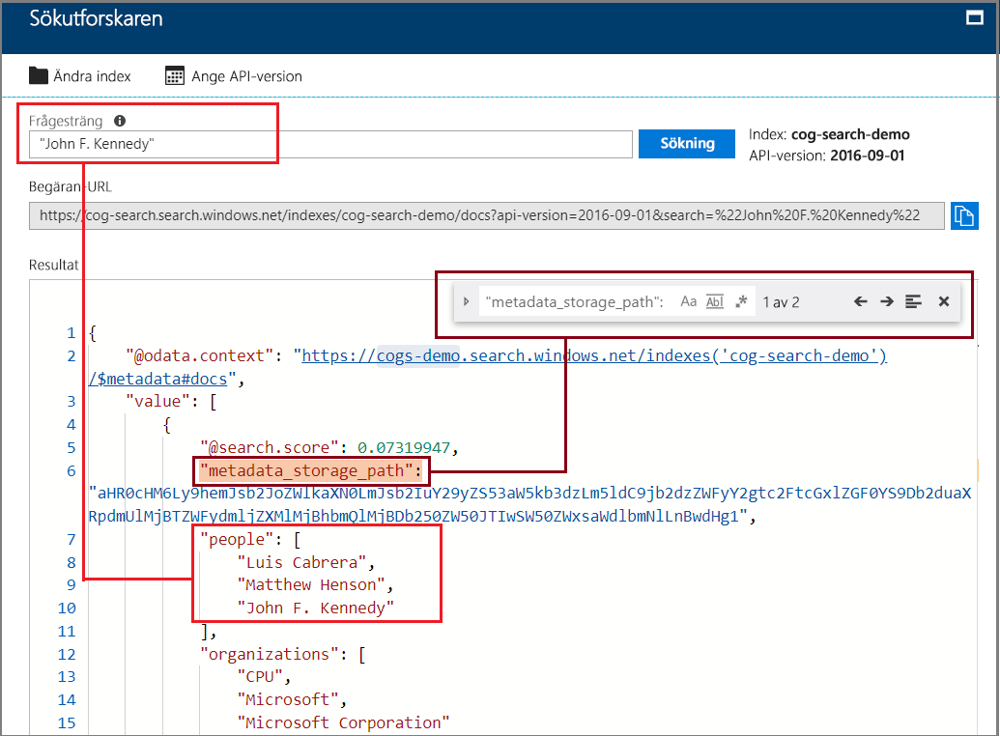

# Snabbstart: Skapa en pipeline för kognitiv sökning med kunskaper och exempeldata

Kognitiv sökning (förhandsversion) lägger till kunskaper för dataextrahering, bearbetning av naturligt språk (NLP) och bildbearbetning i en indexeringspipeline i Azure Search, så att det blir lättare att söka i svårgenomsökt och ostrukturerat innehåll. Information som skapas av en kunskap, t.ex. entitetsidentifiering eller bildanalys, läggs till i ett index i Azure Search.

I den här snabbstarten får du prova berikningspipelinen på [Azure Portal](https://portal.azure.com) utan att skriva en enda rad med kod:

* Börja med exempeldata i Azure Blob Storage
* Konfigurera [guiden Importera data](search-import-data-portal.md) för indexering och berikning 
* Kör guiden (en entitetskunskap upptäcker personer, platser och organisationer)
* Fråga berikade data med [Sökutforskaren](search-explorer.md).

Du kan prova kognitiva sökning i en Azure Search-tjänst som skapats i någon av följande regioner:

* Södra centrala USA
* Västra Europa

Om du inte har en Azure-prenumeration kan du skapa ett [kostnadsfritt konto](https://azure.microsoft.com/free/?WT.mc_id=A261C142F) innan du börjar.

## Nödvändiga komponenter

[”Vad är kognitiva sökning?”](cognitive-search-concept-intro.md) introducerar arkitekturen och komponenterna bakom databerikning. 

Endast Azure-tjänster används i det här scenariot. Som en del av förberedelserna skapar du de tjänster som du behöver.

+ Källdata hämtas från Azure Blob Storage.
+ Datainmatning och indexering, berikad kognitiv sökning och frågor för fulltextsökning hanteras av Azure Search.

### Konfigurera Azure Search

Börja med att registrera dig för Azure Search-tjänsten. 

1. Gå till [Azure-portalen](https://portal.azure.com) och logga in med ditt Azure-konto.

1. Klicka på **Skapa en resurs**, sök efter Azure Search och klicka på **Skapa**. Läs [Skapa en Azure Search-tjänst på portalen](search-create-service-portal.md) om det är första gången du konfigurerar en söktjänst och du behöver mer hjälp.

  

1. För Resursgrupp skapar du en resursgrupp som ska innehålla alla resurser som du skapar i den här snabbstarten. På så sätt blir det enklare att rensa resurserna när du är klar med snabbstarten.

1. För Plats väljer du antingen **USA, södra centrala** eller **Europa, västra**. Förhandsversionen är för närvarande endast tillgänglig i dessa regioner.

1. För Prisnivå kan du skapa en **kostnadsfri** tjänst för användning med självstudier och snabbstarter. För djupare analys med egna data väljer du en [betaltjänst](https://azure.microsoft.com/pricing/details/search/) som **Basic** eller **Standard**. 

  En kostnadsfri tjänst är begränsad till 3 index, 16 MB maximal blobstorlek och 2 minuters indexering, vilket är otillräckligt för att dra full nytta av funktionerna i kognitiv sökning. Information om gränserna för olika nivåer finns i [Tjänstbegränsningar](search-limits-quotas-capacity.md).

  > [!NOTE]
  > Kognitiv sökning är tillgängligt som en förhandsversion. För närvarande kan du köra kunskapsuppsättningar på alla nivåer, inklusive den kostnadsfria nivån. Priserna för den här funktionen kommer att meddelas längre fram.

1. Fäst tjänsten på instrumentpanelen för snabb åtkomst till tjänsten.

  

### Konfigurera Azure Blob Service och läsa in exempeldata

Berikningspipelinen hämtar data från Azure-datakällor som stöds av [Azure Search-indexerare](search-indexer-overview.md). I den här övningen använder vi blogglagring för att demonstrera flera typer av innehåll.

1. [Ladda ned exempeldata](https://1drv.ms/f/s!As7Oy81M_gVPa-LCb5lC_3hbS-4) som består av en liten filuppsättning med olika typer av data. 

1. Registrera dig för Azure Blob Storage, skapa ett lagringskonto, logga in i Storage Explorer och skapa en behållare. Anvisningar för alla steg finns i [snabbstarten för Azure Storage Explorer](../storage/blobs/storage-quickstart-blobs-storage-explorer.md).

1. Använd Azure Storage Explorer och klicka på **Ladda upp** i behållaren som du skapade för att ladda upp exempeldata.

  

## Skapa berikningspipelinen

Gå tillbaka till instrumentpanelsidan i Azure Search och klicka på **Importera data** i kommandofältet för att konfigurera berikning i fyra steg.

### Steg 1: Skapa en datakälla

I **Anslut till dina data** > **Azure Blob Storage** väljer du kontot och behållaren som du skapade. Namnge datakällan och lämna standardvärdena för resten av inställningarna. 

   

Skapa datakällan genom att klicka på **OK**.

En fördel med att använda guiden **Importera data** är att den även kan skapa ditt index. När datakällan skapas, skapar guiden samtidigt ett indexschema. Det kan ta några sekunder att skapa indexet.

### Steg 2: Lägga till kognitiva kunskaper

Nu ska du lägga till berikningssteg till indexeringspipelinen. På portalen finns fördefinierade kognitiva kunskaper för bild- och textanalys. På portalen körs en kunskapsuppsättning mot ett enda källfält. Det kan verka som ett litet mål, men för Azure-blobar innehåller fältet `content` merparten av blobdokumentet (till exempel ett Word-dokument eller en PowerPoint-presentation). Därför är det här fältet idealiskt, eftersom allt innehåll i en blob finns där.

Välj kunskaper som utför bearbetning av naturligt språk i **Add cognitive skills** (Lägg till kognitiva kunskaper). I den här snabbstarten väljer du entitetsigenkänning för personer, organisationer och platser.

Acceptera definitionen genom att klicka på **OK**.
   
  

Kunskaper för bearbetning av naturligt språk körs på textinnehåll i exempeldatamängden. Eftersom vi inte valde några bildbearbetningsalternativ bearbetas inte JPEG-filerna som finns i exempeldatauppsättningen i den här snabbstarten. 

### Steg 3: Konfigurera indexet

Kommer du ihåg indexet som skapades med datakällan? I det här steget kan du visa dess schema och ändra inställningar om det behövs. 

I den här snabbstarten passar guidens standardinställningar bra: 

+ Alla index måste ha ett namn. För den här typen av datakälla är standardnamnet *azureblob-index*.

+ Alla dokument måste ha en nyckel. Guiden väljer ett fält med unika värden. I den här snabbstarten är nyckeln *metadata_storage_path*.

+ Alla fältsamlingar måste innehålla fält med en datatyp som beskriver dess värden, och alla fält måste ha indexattribut som beskriver hur de används i ett sökscenario. 

Eftersom du har definierat en kunskapsuppsättning förutsätter guiden att du vill använda källdatafältet, och utdatafälten som skapas av kunskaperna. Därför läggs indexfält till för `content`, `people`, `organizations` och `locations`. Observera att Hämtbar och Sökbar aktiveras automatiskt för dessa fält.

Granska fältens attribut i **Anpassa index** för att se hur de används i ett index. Sökbar anger att det går att söka i ett fält. Hämtbar betyder att det kan returneras i resultat. 

Överväg att ta bort Hämtbar från fältet `content`. I blobar kan det här fältet uppgå till flera tusen rader, vilket blir svårläst i ett verktyg som **Sökutforskaren**.

Acceptera indexdefinitionen genom att klicka på **OK**.

  

> [!NOTE]
> Vi har tagit bort fält som inte används från skärmbilden. Om du följer anvisningarna på portalen visas fler fält i listan.

### Steg 4: Konfigurera indexeraren

Indexeraren är en övergripande resurs som styr indexeringen. Indexeraren definierar datakällans namn, indexet och körningsfrekvensen. Slutresultatet av guiden **Importera data** är alltid en indexerare som du kan köra flera gånger.

Namnge indexeraren på sidan **Indexerare** och använd det förvalda alternativet ”kör en gång” för att köra den direkt. 

  

Klicka på **OK** för att importera, berika och indexera data.

  

Eftersom indexeringen och berikningen kan ta tid rekommenderar vi att du börjar med mindre datamängder. Du kan övervaka indexeringen på sidan Meddelanden på Azure Portal. 

## Fråga i Sökutforskaren

När ett index har skapats kan du skicka frågor för att returnera dokument från indexet. På portalen använder du **Sökutforskaren** för att köra frågor och visa resultat. 

1. Klicka på **Sökutforskaren** i kommandofältet på söktjänstens instrumentpanelsidan.

1. Välj **Ändra index** längst upp och välj det index som du skapade.

1. Ange en söksträng för att fråga indexet, till exempel ”John F. Kennedy”.

Resultatet returneras i JSON, som kan vara relativt utförligt och svårläst, särskilt i stora dokument som kommer från Azure-blobar. 

Om det är svårt att överblicka resultatet använder du CTRL-F för att söka i dokument. I den här frågan kan du söka efter ”John F. Kennedy” i JSON för att visa instanser av söktermen. 

Du kan också använda CTRL-F för att se hur många dokument det finns i en viss resultatuppsättning. För Azure-blobar väljer portalen ”metadata_storage_path” som nyckel eftersom varje värde är unikt för dokumentet. Använd CTRL-F och sök efter ”metadata_storage_path” för att se antalet dokument. I den här frågan innehåller två dokument i resultatuppsättningen termen ”John F. Kennedy”.

  

## Lärdomar

Nu har du slutfört din första övning i berikad indexering. Syftet med den här snabbstarten var att introducera viktiga begrepp och att vägleda dig genom guiden så att du snabbt kan börja skapa lösningar för kognitiv sökning med dina egna data.

Bland de viktigaste lärdomarna som vi hoppas att du tar med dig är beroendet av Azure-datakällor. Berikad kognitiv sökning är bundet till indexerare, och indexerare är Azure- och källspecifika. I den här snabbstarten används Azure Blob Storage, men det går att använda andra Azure-datakällor. Mer information finns i [Indexerare i Azure Search](search-indexer-overview.md).

En annan viktig aspekt är att kunskaper körs på indatafält. På portalen måste du välja ett enda fält för alla kunskaper. I koden kan indata vara andra fält, eller utdata från en överordnad kunskap.

 Indata för en kunskap mappas till ett utdatafält i ett index. Internt konfigurerar portalen [anteckningar](cognitive-search-concept-annotations-syntax.md) och definierar en [kunskapsuppsättning](cognitive-search-defining-skillset.md), som definierar ordningen på åtgärder och det allmänna flödet. Dessa steg är dolda på portalen, men när du börjar skriva kod blir dessa begrepp viktiga.

Slutligen lärde du dig hur du visar resultat genom att fråga indexet. Vad Azure Search erbjuder är i grunden ett sökbart index, som du kan fråga med [enkel](https://docs.microsoft.com/rest/api/searchservice/simple-query-syntax-in-azure-search) eller [utökad frågesyntax](https://docs.microsoft.com/rest/api/searchservice/lucene-query-syntax-in-azure-search). Ett index som innehåller berikade fält är precis som andra fält. Om du vill använda standardanalysverktyg eller [anpassade analysverktyg](search-analyzers.md), [bedömningsprofiler](https://docs.microsoft.com/rest/api/searchservice/add-scoring-profiles-to-a-search-index), [synonymer](search-synonyms.md), [fasetterade filter](search-filters-facets.md), geo-sökning eller andra Azure Search-funktioner kan du självklart göra det.

## Rensa resurser

När du är klar rensar du enklast upp genom att ta bort resursgruppen som innehåller Azure Search och Azure Blob Service.  

Förutsatt att du placerade båda tjänsterna i samma grupp, tar du bort resursgruppen för att permanent ta bort allt i den, inklusive tjänsterna och eventuellt lagrat innehåll som du skapade i den här övningen. På portalen visas resursgruppens namn på översiktssidan för varje tjänst.

## Nästa steg

Du kan experimentera med indexering och berikning genom att köra guiden igen med olika kunskaper och källdatafält. Om du vill upprepa stegen tar du bort indexet och indexeraren och återskapar sedan indexeraren med en ny kombination av val.

+ Markera det index som du skapade i **Översikt** > **Index** och klicka sedan på **Ta bort**.

+ Dubbelklicka på panelen **Indexerare** i **Översikt**. Leta upp indexeraren som du skapade och ta bort den.

Alternativt kan du återanvända de exempeldata och tjänster som du skapat och lära dig hur du utför samma åtgärder via programmering i nästa självstudiekurs. 

> [!div class="nextstepaction"]
> [Självstudier: Lär dig mer om REST API:er för kognitiv sökning](cognitive-search-tutorial-blob.md)