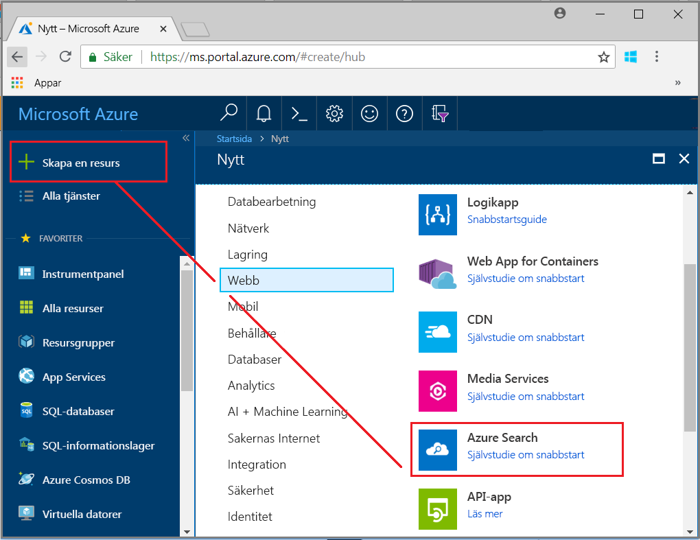
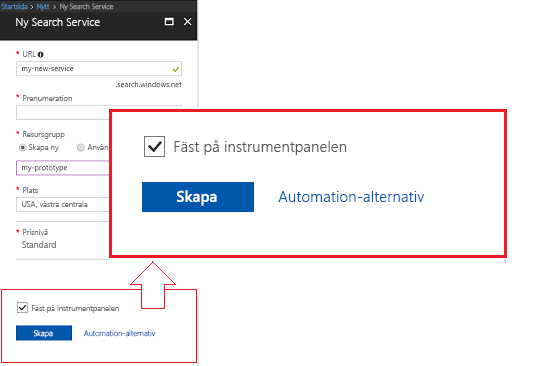
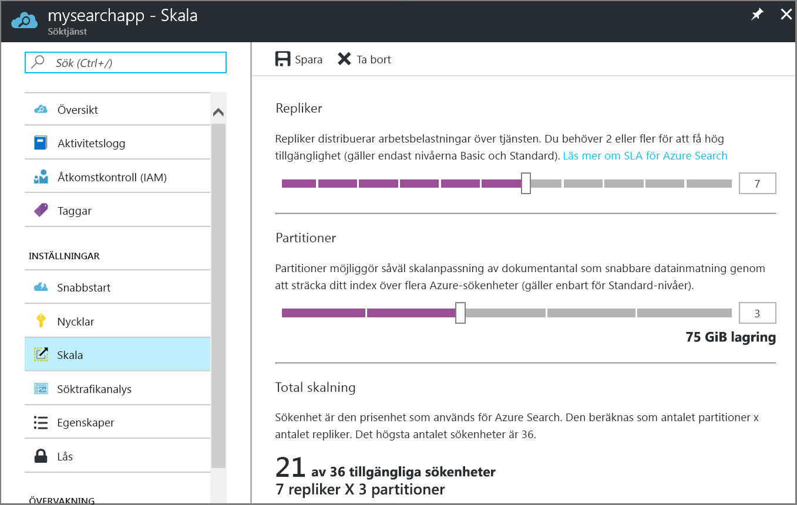

# Skapa en Azure Search-tjänst i portalen

Se hur du skapar eller etablerar en Azure Search-tjänst i portalen. 

Föredrar du PowerShell? Använd [tjänstmallen](https://azure.microsoft.com/resources/templates/101-azure-search-create/) för Azure Resource Manager. Om du behöver hjälp att komma igång går du till bakgrundsinformationen i [Hantera Azure Search med PowerShell](search-manage-powershell.md).

## Prenumerera (kostnadsfritt eller betalt)

[Öppna ett kostnadsfritt Azure-konto](https://azure.microsoft.com/pricing/free-trial/?WT.mc_id=A261C142F) och använd kostnadsfria krediter för att prova betalda Azure-tjänster. Efter att krediterna är slut behåller du kontot och fortsätter använda kostnadsfria Azure-tjänster, till exempel Websites. Ditt kreditkort debiteras aldrig om du inte specifikt ändrar dina inställningar och ber om debitering.

Du kan också [aktivera MSDN-prenumerantförmåner](https://azure.microsoft.com/pricing/member-offers/msdn-benefits-details/?WT.mc_id=A261C142F). Med en MSDN-prenumeration får du krediter varje månad som du kan använda Azure-betaltjänster. 

## Hitta Azure Search
1. Logga in på [Azure-portalen](https://portal.azure.com/).
2. Klicka på plustecknet (”+ Skapa resurs”) i det övre vänstra hörnet.
3. Välj **Webb** > **Azure Search**.

## Namnge tjänsten och URL-slutpunkten

Ett tjänstnamn är en del av URL-slutpunkten mot vilken API-anrop utfärdas: `https://your-service-name.search.windows.net`. Ange tjänstnamnet i fältet **URL**. 

Kraven för tjänstnamn:
   * Det måste vara unikt inom namnområdet search.windows.net
   * 2 och 60 tecken
   * Använd gemena bokstäver, siffror och bindestreck (”-”)
   * Undvik streck (”-”) i de första 2 tecknen eller som sista enskilt tecken
   * Inga streck i följd (”--”) någonstans

## Välj en prenumeration
Om du har mer än en prenumeration väljer du en som även har data- eller fillagringstjänster. Azure Search kan automatiskt identifiera Azure Table- och Blob-lagring, SQL Database och Azure Cosmos DB för indexering via [*indexerare*](search-indexer-overview.md), men endast för tjänster i samma prenumeration.

## Välj en resursgrupp
En resursgrupp är en samling Azure-tjänster och Azure-resurser som används tillsammans. Om du till exempel använder Azure Search för att indexera en SQL-databas måste båda tjänsterna tillhöra samma resursgrupp.

> [!TIP]
> Om du tar bort en resursgrupp tar du också bort tjänsterna i gruppen. Om du har ett prototypprojekt som använder flera tjänster kan du placera dem i samma resursgrupp. Då är det lättare att rensa upp när projektet är slutfört. 

## Välj en värdplats 
Azure Search är en Azure-tjänst som kan finnas i datacenter över hela världen. Observera att [priserna kan variera](https://azure.microsoft.com/pricing/details/search/) efter geografiskt område.

## Välj en prisnivå (SKU)
[Azure Search finns för närvarande med flera olika prisnivåer](https://azure.microsoft.com/pricing/details/search/): Kostnadsfritt, Basic eller Standard. Nivåerna har olika [kapacitet och begränsningar](search-limits-quotas-capacity.md). Mer information finns i [Välj en prisnivå nivå eller SKU](search-sku-tier.md).

Standard väljs normalt för produktionsarbetsbelastningar men de flesta kunderna börjar med den kostnadsfria tjänsten.

När tjänsten väl har skapats går det inte att ändra prisnivå. Om du senare behöver en högre eller lägre nivå måste du skapa tjänsten på nytt.

## Skapa din tjänst

Kom ihåg att fästa din tjänst på instrumentpanelen för enkel åtkomst när du loggar in.

## Skala din tjänst
Det kan ta några minuter att skapa en tjänst (15 minuter eller mer beroende på nivå). När tjänsten har etablerats kan du skala den så att den passar dina behov. Eftersom du har valt standardnivån för din Azure Search-tjänst kan du skala tjänsten i två dimensioner: repliker och partitioner. Om du hade valt Basic-nivån hade du bara kunnat lägga till repliker. Skalning är inte tillgängligt om du etablerar tjänsten utan kostnad.

Med ***Partitioner*** kan tjänsten lagra och söka igenom fler dokument.

Med ***Repliker*** kan tjänsten hantera en högre belastning av sökfrågor.

Om du lägger till resurser blir din månatliga faktura större. [Priskalkylatorn](https://azure.microsoft.com/pricing/calculator/) kan hjälpa dig att förstå hur fakturering påverkas när du lägger till resurser. Kom ihåg att du kan ändra resurser baserat på belastning. Du kan till exempel öka resurserna för att skapa den fullständiga initiala indexeringen och sedan minska resurserna till en nivå som är mer lämplig för inkrementell indexering.

> [!Important]
> En tjänst måste ha [2 repliker för skrivskyddad SLA och 3 repliker för läs-/skriv-SLA](https://azure.microsoft.com/support/legal/sla/search/v1_0/).

1. Gå till söktjänstsidan i Azure-portalen.
2. Välj **Inställningar** > **Skala** i det vänstra navigeringsfönstret.
3. Använd reglaget om du vill lägga till resurser av endera typ.

> [!Note] 
> Varje nivå har olika [begränsningar](search-limits-quotas-capacity.md) för det totala antalet Search-enheter som tillåts i en enskild tjänst (repliker * partitioner = totalt antal Search-enheter).

## När ska du lägga till en andra tjänst?

En stor majoritet av kunderna använder bara en tjänst som etablerats på en nivå som har [rätt resursbalans](search-sku-tier.md). En tjänst kan vara värd för flera index i enlighet med [gränsvärdena för den nivå du väljer](search-capacity-planning.md), med indexen isolerade från varandra. I Azure Search kan förfrågningar bara riktas till ett index, vilket minimerar risken för oavsiktlig eller avsiktlig datahämtning från andra index i samma tjänst.

Även om de flesta kunder bara använder en tjänst kan det vara nödvändigt med tjänstredundans om de operativa kraven omfattar följande:

+ Haveriberedskap (avbrott i datacenter). Det finns ingen omedelbar redundans i Azure Search vid ett avbrott. Mer information och rekommendationer finns i [Tjänstadministration](search-manage.md).
+ Din undersökning av modeller med flera klientorganisationer har fastställt att ytterligare tjänster är den optimala designen. Mer information finns i [Design för flera klientorganisationer](search-modeling-multitenant-saas-applications.md).
+ Om du har globalt distribuerade program kan du behöva en instans av Azure Search i flera olika områden för att minimera svarstiden för programmets internationella trafik.

> [!NOTE]
> I Azure Search går det inte att separera indexering och frågearbetsbelastningar. Därför skapar du aldrig flera tjänster för separerade arbetsbelastningar. Index tillfrågas alltid om vilken tjänst den skapades i (du kan inte skapa ett index i en tjänst och kopiera den till en annan).
>

Det behövs ingen andra tjänst för hög tillgänglighet. Hög tillgänglighet för frågor uppnås när du använder minst 2 repliker i samma tjänst. Replikuppdateringar är sekventiella, vilket innebär att minst en fungerar när en ny tjänstuppdatering görs. Mer information om drifttid finns i [Serviceavtal](https://azure.microsoft.com/support/legal/sla/search/v1_0/).

## Nästa steg
När du har etablerat en Azure Search-tjänst är du redo att [definiera ett index](search-what-is-an-index.md) så att du kan ladda upp och söka i dina data. 

> [!div class="nextstepaction"]
> [Hur du använder Azure Search i .NET](search-howto-dotnet-sdk.md)
