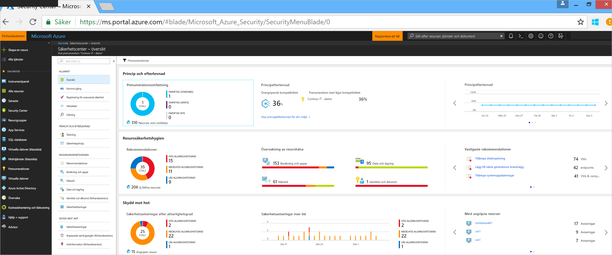
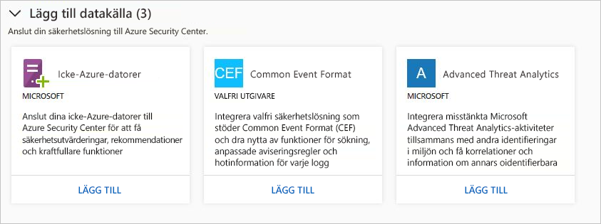
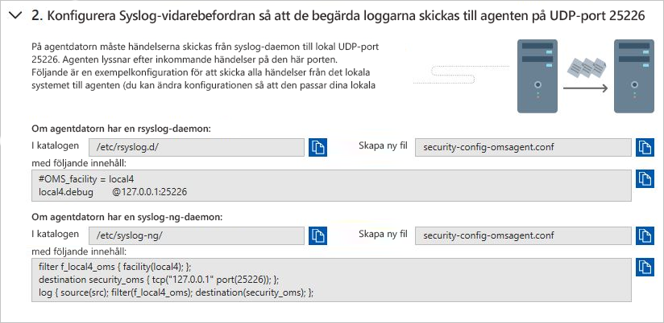
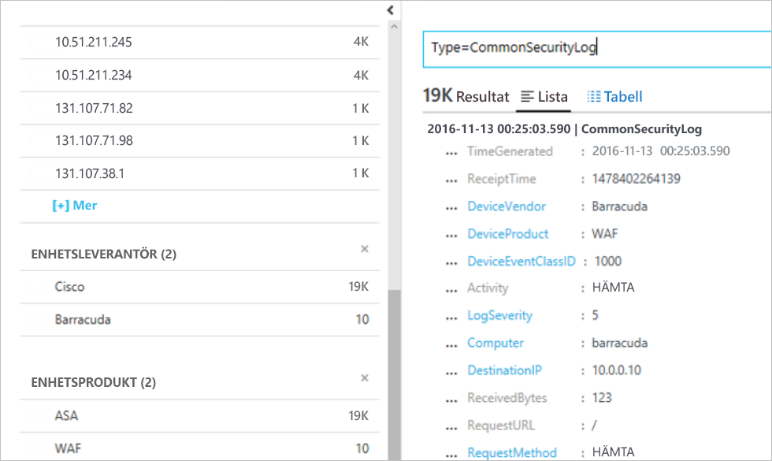

# Snabbstart: Ansluta säkerhetslösningar till Security Center

Förutom att samla in säkerhetsdata från datorerna kan du integrer säkerhetsdata från en mängd andra säkerhetslösningar, däribland alla som stöder Common Event Format (CEF). CEF är ett branschstandardformat ovanpå Syslog-meddelanden som används av många säkerhetsleverantörer för att händelser ska kunna integreras mellan olika plattformar.

I den här snabbstarten får du veta hur du:
- Ansluter en säkerhetslösning till Security Center med CEF-loggar
- Verifierar anslutningen med säkerhetslösningen

## Nödvändiga komponenter
Du måste ha en prenumeration på Microsoft Azure för att komma igång med Security Center. Om du inte har någon prenumeration kan du registrera dig för ett [kostnadsfritt konto](https://azure.microsoft.com/free/).

För att gå igenom den här självstudien måste du ha standardnivån i Security Center. Du kan prova Security Center Standard utan kostnad under de första 60 dagarna. Snabbstarten för att [registrera Azure-prenumerationen till Security Center Standard](security-center-get-started.md) vägleder dig genom uppgraderingen till Standard.

Du behöver också en [Linux-dator](https://docs.microsoft.com/azure/log-analytics/log-analytics-agent-linux) med en Syslog-tjänst som redan är ansluten till Security Center.

## Ansluta lösning med CEF

1. Logga in på [Azure-portalen](https://azure.microsoft.com/features/azure-portal/).
2. På menyn **Microsoft Azure** väljer du **Security Center**. **Security Center – Översikt** öppnas.

      

3. På huvudmenyn i Security Center väljer du **Säkerhetslösningar**.
4. På sidan Security Solutions, under **Lägg till datakällor (3)** klickar du på **Lägg till** under **Common Event Format**.

    

5. På sidan Common Event Format-loggar expanderar du det andra steget, **Konfigurera Syslog-vidarebefordran så att de begärda loggarna skickas till agenten på UDP-port 25226**, och följer instruktionerna nedan på Linux-datorn:

    

6. Expandera det tredje steget, **Placera agentkonfigurationsfilen på agentdatorn**, och följ instruktionerna nedan på Linux-datorn:

    

7. Expandera det fjärde steget, **Starta om syslog-daemon och agenten**, och följ instruktionerna nedan på Linux-datorn:

    

## Verifiera anslutningen

Innan du fortsätter med stegen nedan måste du vänta tills syslog-enheten börjar rapportera till Security Center. Det kan ta lite tid och varierar beroende på miljöns storlek.

1.  I den vänstra rutan i Security Center-instrumentpanelen klickar du på **Sök**.
2.  Välj arbetsytan som Syslog-enheten (Linux-dator) är ansluten till.
3.  Skriv *CommonSecurityLog* och klicka på knappen **Sök**.

Följande exempel visar resultatet av dessa steg: 

## Rensa resurser
De andra snabbstarterna och självstudierna i den här samlingen bygger på den här snabbstarten. Om du tänker fortsätta med att arbeta med efterföljande snabbstarter och självstudier ska du fortsätta att köra Standard-nivån och ha automatisk etablering aktiverad. Om du inte tänker fortsätta eller vill återgå till den kostnadsfria nivån:

1. Återgå till huvudmenyn i Security Center och välj **Säkerhetsprincip**.
2. Välj den prenumeration eller princip du vill ska återgå till den kostnadsfria nivån. **Säkerhetsprincip** öppnas.
3. Under **PRINCIPKOMPONENTER** väljer du **Prisnivå**.
4. Välj **Kostnadsfri** om du vill byta prenumeration från Standard-nivån till den kostnadsfria nivån.
5. Välj **Spara**.

Om du vill avaktivera automatisk etablering:

1. Återgå till huvudmenyn i Security Center och välj **Säkerhetsprincip**.
2. Välj den prenumeration du vill avaktivera automatisk etablering för.
3. Under **Säkerhetsprincip – Datainsamling** väljer du **Av** under **Registrering** för att inaktivera automatisk etablering.
4. Välj **Spara**.

>[!NOTE]
> Inaktivering av automatisk etablering tar inte bort Microsoft Monitoring Agent från virtuella Azure-datorer där agenten har etablerats. Inaktivering av automatisk etablering begränsar säkerhetsövervakningen för dina resurser.
>

## Nästa steg
I den här snabbstarten har du lärt dig att ansluta en Linux Syslog-lösning till Security Center med CEF. När du ansluter dina CEF-loggar till Security Center kan du dra nytta av funktioner för sökning, anpassade aviseringsregler och hotinformation för varje logg. Om du vill läsa mer om hur du använder Security Center fortsätter du till självstudien om konfiguration av en säkerhetsprincip och utvärderar resursers säkerhet.

> [!div class="nextstepaction"]
> [Självstudie: Definiera och utvärdera säkerhetsprinciper](./tutorial-security-policy.md)
