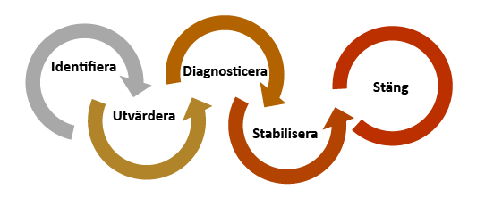
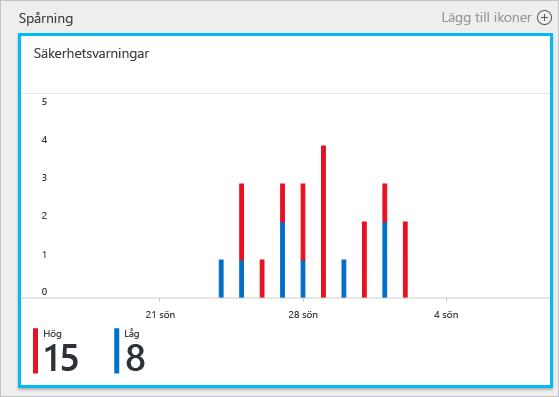
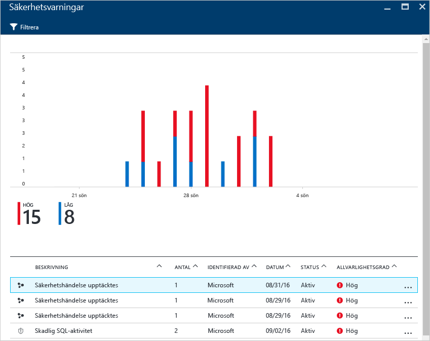
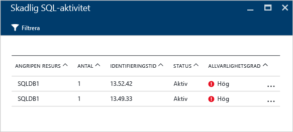
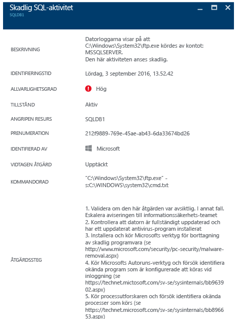

# Använda Azure Security Center vid incidenthantering
Många organisationer lär sig att reagera på säkerhetsincidenter först när de har drabbats av en attack. För att minska kostnaderna och skadorna är det viktigt att ha en incidenthanteringsplan på plats innan en attack äger rum. Azure Security Center kan användas i olika faser av en incidenthantering.

## Incidenthantering
En effektiv plan är beroende av tre grundfunktioner: förmågan att skydda, upptäcka och svara på hot. Skydd handlar om att förhindra incidenter, identifiering är hur du upptäcker hot tidigt och svar handlar om att avlägsna angriparen och återställa systemen för att minimera påverkan av ett intrång. 

Den här artikeln använder säkerhetsstegen för incidenthantering från artikeln [Microsoft Azure Security Response i molnet](https://gallery.technet.microsoft.com/Azure-Security-Response-in-dd18c678) enligt följande diagram:

Security Center kan användas under stegen identifiering, utvärdering och diagnostisering. Läs mer om vart och ett av dessa steg. Här visas ett exempel på hur Security Center kan vara användbart vid de tre första incidenthanteringsstegen:

* **Identifiera**: Den första indikationen i en händelseundersökning
  * Exempel: En första verifiering av att en säkerhetsvarning med hög prioritet aktiverades i instrumentpanelen till Security Center.
* **Utvärdera**: Utför en första utvärdering för att få mer information om den misstänkta aktiviteten.
  * Exempel: Hämta mer information om säkerhetsaviseringen.
* **Diagnostisera**: Utföra en teknisk undersökning, identifiera strategier för inneslutning, begränsning och lösning
  * Exempel: Följ anvisningarna för reparation som beskrivs i Security Center i säkerhetsvarningen.

Scenariot nedan visar hur du använder Security Center till identifiering, utvärdering och diagnostisering/hantering vid en säkerhetsincident.  I Security Center är en [säkerhetsincident](security-center-incident.md) en sammanställning av alla aviseringar för en resurs som överensstämmer med särskilda [händelsekedje](https://blogs.technet.microsoft.com/office365security/addressing-your-cxos-top-five-cloud-security-concerns/)mönster. Incidenter visas på panelen och bladet [Säkerhetsaviseringar](security-center-managing-and-responding-alerts.md). En incident visar en lista över relaterade aviseringar så att du kan få mer information om varje förekomst. Security Center har även fristående säkerhetsaviseringar som också kan användas för att spåra en misstänkt aktivitet.

## Scenario
Contoso migrerade nyligen några av sina lokala resurser till Azure, inklusive vissa virtuella datorbaserade branschspecifika arbetsbelastningar och SQL-databaser. För närvarande har Contosos CSIRT (Computer Security Incident Response Team) svårt att undersöka säkerhetsproblem på grund av bristande säkerhetsfunktioner i de aktuella incidenthanteringsverktygen. Bristen på integrering utgör ett problem vid identifiering (det blir för många falska positiva resultat), samt vid utvärderings- och diagnostiseringsstegen. Som en del av den här migreringen beslutar de att välja Security Center för att lösa problemet. 

Den första fasen i migreringen slutförs efter att alla resurser har integreras och hanterar alla säkerhetsrekommendationer från Security Center. Contoso CSIRT är huvudresursen för att hantera säkerhetsincidenter. Gruppen består av en grupp personer med ansvar för att hantera en alla säkerhetsincidenter. Gruppmedlemmarna har tydligt definierade uppgifter som säkerställer att inget område lämnas utan åtgärd. 

I det här scenariot fokuserar vi på rollerna för följande personer som ingår i Contoso CSIRT:

Johanna arbetar med säkerhetsåtgärder och hennes ansvar omfattar:

* Övervakning och hantering av säkerhetshot dygnet runt
* Eskalering till molnets arbetsbelastningsägare eller säkerhetsanalytiker vid behov

Sam är säkerhetsanalytiker och hans ansvar omfattar:

* Undersöka attacker
* Uppdatera aviseringar 
* Arbeta med arbetsbelastningsägare för att fastställa och tillämpa åtgärder

Som du kan se har Johanna och Sam olika ansvarsområden och de måste samarbeta för att dela den information som erhålls från Security Center. 

## Rekommenderad lösning
Eftersom Johanna och Sam har olika roller, kommer de att använda olika områden i Security Center till att skaffa relevant information för sitt dagliga arbete. Johanna använder säkerhetsaviseringar som en del av sin dagliga övervakning. 

Johanna använder säkerhetsaviseringar under identifierings- och utvärderingsstegen. När Johanna har avslutat den inledande utvärderingen kan hon eskalera problemet till Sam om det krävs ytterligare undersökning. Sam har nu använt informationen från Security Center, ibland tillsammans med andra datakällor, till att gå vidare till diagnostiseringssteget.

## Hur man implementerar denna lösning
Om du vill se hur du använder Azure Security Center i ett scenario för incidenthantering, följer vi Johanna i identifierings- och utvärderingsstegen och ser sedan vad Sam gör för att diagnosticera problemet. 

### Identifierings- och utvärderingsstegen vid incidenthantering
Johanna har loggat in på Azure-portalen och är i Security Center-konsolen. Som en del av sin dagliga övervakning har hon börjat granska säkerhetsaviseringar med hög prioritet genom att utföra följande steg:

1. Klicka på ikonen **Säkerhetsaviseringar** och gå till bladet **Säkerhetsaviseringar**.
    
   
   > [!NOTE]
   > I det här scenariot ska Johanna utföra en utvärdering av aviseringen om skadlig SQL-aktivitet som visas i bilden ovan. 
   > 
   > 
2. Klicka på aviseringen **Skadlig SQL-aktivitet** och granska de attackerade resurserna i bladet **Skadlig SQL-aktivitet**:  
   
    I det här bladet kan Johanna föra anteckningar om de attackerade resurserna, hur många gånger angrepp har inträffat och när det har upptäckts.
3. Klicka på den **attackerade resursen** för att få mer information om angreppet. 

När hon har läst beskrivningen är Johanna övertygad om att detta inte är falskt positivt och att hon bör eskalera fallet till Sam.

### Steget att diagnosticera incidenthantering
Sam får fallet från Johanna och börjar granska reparationsstegen som föreslås i Security Center.

### Ytterligare resurser
Incidenthanteringsteamet kan också använda [Security Center Power BI](security-center-powerbi.md)-funktionen för att se olika typer av rapporter som kan hjälpa dem vid ytterligare undersökning genom att visualisera, analysera och filtrera rekommendationer och säkerhetsaviseringar. Företag som använder en SIEM-lösning (Security Information and Event Management) vid undersökningen kan även [integrera Security Center med lösningen](security-center-integrating-alerts-with-log-integration.md). Azures granskningsloggar och virtuella datorsäkerhetshändelser kan dessutom integreras med [loggintegrationsverktyget i Azure](https://blogs.msdn.microsoft.com/azuresecurity/2016/07/21/microsoft-azure-log-integration-preview/). Den här informationen kan användas tillsammans med den information som tillhandahålls av Security Center när man undersöker ett angrepp.

## Slutsats
Att sätta samman ett team innan en incident inträffar är mycket viktigt för organisationen och kommer att ge en positiv påverkan av hur incidenter hanteras. Om teamet har rätt verktyg för att övervaka resurserna kan de vidta rätt steg för att åtgärda en säkerhetsincident. Security Centers [identifieringsfunktioner](security-center-detection-capabilities.md) hjälper IT-avdelningen att snabbt agera på säkerhetsincidenter samt åtgärda säkerhetsproblem.

<!--HONumber=Sep16_HO3-->

