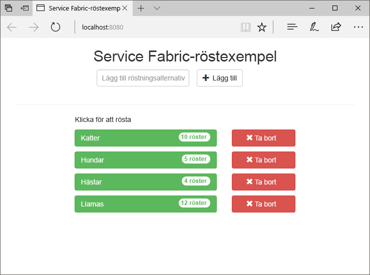
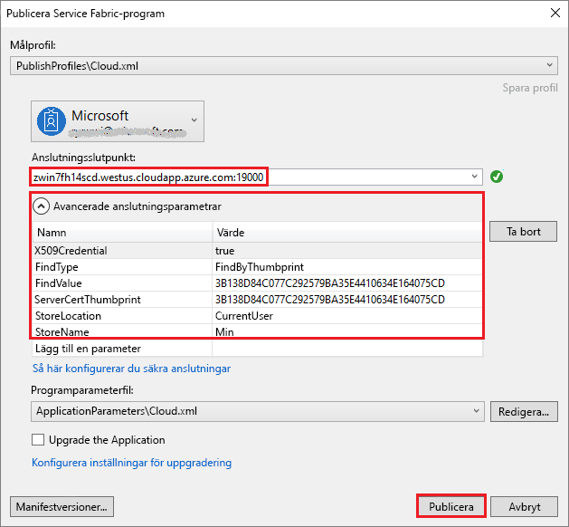
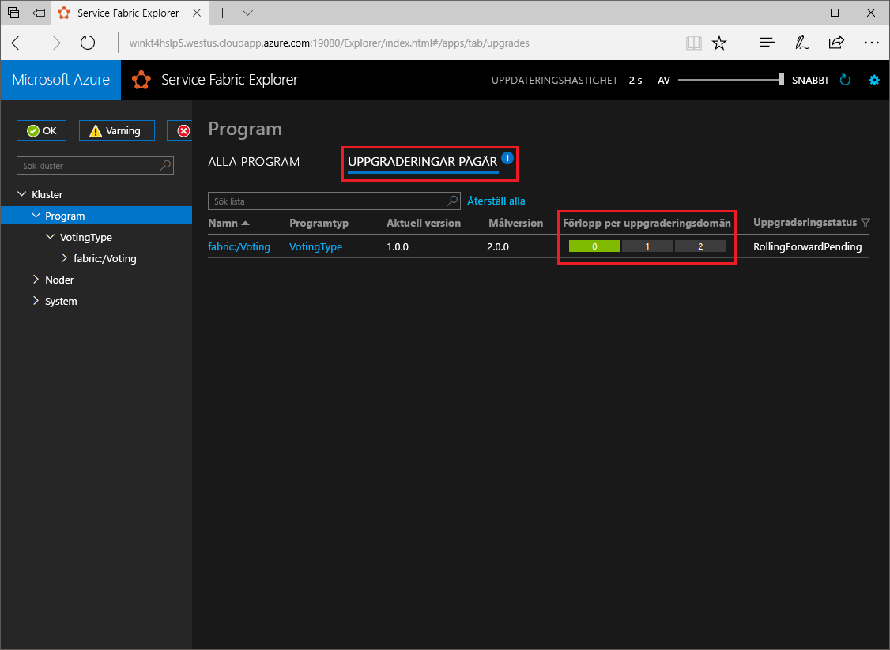

# <a name="quickstart-create-a-net-service-fabric-application-in-azure"></a>Snabbstart: Skapa ett .NET Service Fabric-program i Azure
Azure Service Fabric är en plattform för distribuerade system för distribution och hantering av skalbara och tillförlitliga mikrotjänster och behållare. 

Den här snabbstarten visar hur du distribuerar ditt första .NET-program i Service Fabric. När du är klar har du ett röstningsprogam med en ASP.NET Core-klientdel som sparar röstningsresultat i en tillståndskänslig serverdelstjänst i klustret.



Med det här programmet får du lära dig att:
> [!div class="checklist"]
> * Skapa ett program med .NET och Service Fabric
> * Använda ASP.NET Core som webbklient
> * Lagra programdata i en tillståndskänslig tjänst
> * Felsöka programmet lokalt
> * Distribuera programmet till ett kluster i Azure
> * Skala programmet över flera noder
> * Utföra en löpande programuppgradering

## <a name="prerequisites"></a>Nödvändiga komponenter
För att slutföra den här snabbstarten behöver du:
1. [Installera Visual Studio 2017](https://www.visualstudio.com/) med **Azure Development** och arbetsbelastningarna **ASP.NET och webbutveckling**.
2. [Installera Git](https://git-scm.com/)
3. [Installera Microsoft Azure Service Fabric SDK](http://www.microsoft.com/web/handlers/webpi.ashx?command=getinstallerredirect&appid=MicrosoftAzure-ServiceFabric-CoreSDK)
4. Kör följande kommando för att aktivera Visual Studio för distribution till det lokala Service Fabric-klustret:
    ```powershell
    Set-ExecutionPolicy -ExecutionPolicy Unrestricted -Force -Scope CurrentUser
    ```

>[!NOTE]
> Exempelprogrammet i denna snabbstart använder funktioner som inte är tillgängliga på Windows 7.
>

## <a name="download-the-sample"></a>Hämta exemplet
Kör följande kommando i ett kommandofönster för att klona databasen för exempelappen till den lokala datorn.
```
git clone https://github.com/Azure-Samples/service-fabric-dotnet-quickstart
```

## <a name="run-the-application-locally"></a>Kör programmet lokalt
Högerklicka på Visual Studio-ikonen på startmenyn och välj **Kör som administratör**. Du måste köra Visual Studio som administratör för att kunna bifoga felsökningsprogrammet till tjänsterna.

Öppna Visual Studio-lösningen **Voting.sln** från den lagringsplats du har klonat.  

Röstningsprogrammet är som standard inställt på att lyssna på port 8080.  Programporten ställs in i filen */VotingWeb/PackageRoot/ServiceManifest.xml*.  Du kan ändra programporten genom att uppdatera attributet **Port** för elementet **Slutpunkt**.  Om du vill distribuera och köra programmet lokalt måste programporten vara öppen och tillgänglig på datorn.  Om du ändrar programporten ersätter du det nya programportvärdet med ”8080” i den här artikeln.

Distribuera programmet genom att trycka på **F5**.

> [!NOTE]
> Första gången du kör och distribuerar programmet skapar Visual Studio ett lokalt kluster för felsökning. Den här åtgärden kan ta lite tid. Statusen för klustergenereringen visas i utdatafönstret i Visual Studio.  I dina utdata visas ett meddelande om att programmets URL är inte inställd eller inte är en HTTP-/HTTPS-URL och att webbläsaren därför inte öppnas i programmet.  Det här meddelandet anger inte ett fel, utan att webbläsaren inte kommer att startas automatiskt.

När distributionen är klar, startar du en webbläsare och öppnar den här sidan: `http://localhost:8080` – programmets klientdel.


Du kan nu lägga till en uppsättning röstningsalternativ och börja ta emot röster. Programmet körs och lagrar alla data i Service Fabric-klustret, utan att en separat databas krävs.

## <a name="walk-through-the-voting-sample-application"></a>Gå igenom exempelprogrammet för röstning
Röstningsprogrammet består av två tjänster:
- Webbklienttjänst (VotingWeb) – En webbklienttjänst för ASP.NET Core som används av webbsidan och visar webb-API:er för att kommunicera med serverdelstjänsten.
- Serverdelstjänst (VotingData) – En webbtjänst för ASP.NET Core som visar en API för att lagra röstningsresultat i en tillförlitlig ordlista på disken.


När du röstar i programmet händer följande:
1. Ett JavaScript skickar röstningsbegäran till webb-API i webbklienttjänsten som en HTTP PUT-begäran.

2. Webbklienttjänsten använder en proxy för att hitta och vidarebefordra en HTTP PUT-begäran till serverdelstjänsten.

3. Serverdelstjänsten tar den inkommande begäran och lagrar det uppdaterade resultatet i en tillförlitlig ordlista, som replikeras till flera noder i klustret och sparas på disken. Alla programdata lagras i klustret, så det behövs ingen databas.

## <a name="debug-in-visual-studio"></a>Felsökning i Visual Studio

När du felsöker programmet i Visual Studio, använder du ett lokalt utvecklingskluster för Service Fabric. Du kan välja att anpassa felsökningen så att det passar ditt scenario. I det här programmet lagras data i serverdelstjänsten med hjälp av en tillförlitlig ordlista. Visual Studio tar som standard bort programmet när du stoppar felsökningsprogrammet. När programmet tas bort kommer även data i serverdelstjänsten att tas bort. Om du vill spara data mellan felsökningssessionerna kan du ändra **programmets felsökningsläge** som en egenskap i projektet **Voting** i Visual Studio.

Gör så här om du vill se vad som händer i koden:
1. Öppna filen **/VotingWeb/Controllers/VotesController.cs** och konfigurera en brytpunkt i webb-API:ns metod **Put** (rad 69). Du kan söka efter filen i Solution Explorer i Visual Studio.

2. Öppna filen **/VotingData/Controllers/VoteDataController.cs** och konfigurera en brytpunkt i denna webb-API:s metod **Put** (rad 54).

3. Gå tillbaka till webbläsaren och klicka på ett röstningsalternativ eller lägg till ett nytt röstningsalternativ. Du kommer till den första brytpunkten i webbklientdelens api-kontroll.
    - Här skickar JavaScript i webbläsaren en begäran till webb-API-kontrollen i frontwebbtjänsten.
    
    

    - Skapa först URL:en till ReverseProxy för serverdelstjänsten **(1)**.
    - Skicka sedan HTTP PUT-begäran till ReverseProxy **(2)**.
    - Till sist returneras svaret från serverdelstjänsten till klienten **(3)**.

4. Tryck på **F5** för att fortsätta
    - Du befinner dig nu på brytpunkten i serverdelstjänsten.
    
    

    - På den första raden i metoden **(1)** kommer `StateManager` hämta eller lägga till en tillförlitlig ordlista med namnet `counts`.
    - All interaktion med värden i en tillförlitlig ordlista kräver en transaktion, den här använder instruktionen **(2)** som skapar den transaktionen.
    - I transaktionen uppdaterar du värdet för den relevanta nyckeln för röstningsalternativet och utför åtgärden **(3)**. När utförandemetoden returneras uppdateras data i ordlistan och replikeras till andra noder i klustret. Data har nu lagrats i klustret och serverdelstjänsten kan redundansväxla till andra noder och fortfarande ha data tillgängliga.
5. Tryck på **F5** för att fortsätta

Stoppa felsökningssessionen genom att trycka på **Skift + F5**.

## <a name="deploy-the-application-to-azure"></a>Distribuera programmet till Azure
Om du vill distribuera programmet till Azure behöver du ett Service Fabric-kluster som kör programmet. 

### <a name="join-a-party-cluster"></a>Ansluta till ett partkluster
Partykluster är kostnadsfria, tidsbegränsade Service Fabric-kluster i Azure som körs av Service Fabric-teamet där vem som helst kan distribuera program och lära sig mer om plattformen. Klustret använder ett enda självsignerat certifikat för nod-till nod- samt klient-till-nod-säkerhet. 

Logga in och [ansluta till ett Windows-kluster](http://aka.ms/tryservicefabric). Hämta PFX-certifikatet till datorn genom att klicka på **PFX**-länken. Klicka på länken **Hur ansluter man till ett säkert partkluster?** och kopiera lösenordet för certifikatet. Certifikatet, certifikatlösenordet och värdet **Anslutningsslutpunkt** används i följande steg.


> [!Note]
> Det finns ett begränsat antal tillgängliga partkluster per timme. Om du får ett felmeddelande när du försöker registrera dig för ett partkluster, kan du vänta en stund och försöka igen, eller följa stegen i självstudien [Distribuera en .NET-app](https://docs.microsoft.com/azure/service-fabric/service-fabric-tutorial-deploy-app-to-party-cluster#deploy-the-sample-application) som hjälper dig att skapa ett Service Fabric-kluster i din Azure-prenumeration och distribuera programmet till den. Om du inte redan har en Azure-prenumeration kan du skapa ett [kostnadsfritt konto](https://azure.microsoft.com/free/?WT.mc_id=A261C142F). När du har distribuerat och kontrollerat programmet i klustret kan du gå vidare till [Skala program och tjänster i ett kluster](#scale-applications-and-services-in-a-cluster) i denna snabbstart.
>


På en Windows-dator installerar du PFX i certifikatarkivet *CurrentUser\My*.

```powershell
PS C:\mycertificates> Import-PfxCertificate -FilePath .\party-cluster-873689604-client-cert.pfx -CertStoreLocation Cert:\CurrentUser\My -Password (ConvertTo-SecureString 873689604 -AsPlainText -Force)


   PSParentPath: Microsoft.PowerShell.Security\Certificate::CurrentUser\My

Thumbprint                                Subject
----------                                -------
3B138D84C077C292579BA35E4410634E164075CD  CN=zwin7fh14scd.westus.cloudapp.azure.com
```

Kom ihåg tumavtrycket för följande steg.

> [!Note]
> Frontwebbtjänsten är som standard konfigurerad för att lyssna efter inkommande trafik på port 8080. Port 8080 är öppen i partklustret.  Om du behöver ändra programporten ändrar du den till en av de portar som är öppna i partklustret.
>

### <a name="deploy-the-application-using-visual-studio"></a>Distribuera programmet med hjälp av Visual Studio
Nu när programmet är redo kan du distribuera det till ett kluster direkt från Visual Studio.

1. Högerklicka på **Röstning** i Solution Explorer och välj **Publicera**. Dialogrutan Publicera visas.


2. Kopiera **Anslutningsslutpunkten** för partyklustret till fältet **Anslutningsslutpunkt**. Till exempel `zwin7fh14scd.westus.cloudapp.azure.com:19000`. Klicka på **Avancerade anslutningsparametrar** och kontrollera att värdena *FindValue* och *ServerCertThumbprint* matchar tumavtrycket för certifikatet som installerades i föregående steg. 

    

    Varje program i klustret måste ha ett unikt namn.  Partkluster är en offentlig, delad miljö men det kan finnas en konflikt med ett befintligt program.  Om det finns en namnkonflikt byter du namn på Visual Studio-projektet och distribuerar igen.

3. Klicka på **Publicera**.

4. Öppna en webbläsare och ange klusteradressen följt av ”: 8080” för att komma till programmet i klustret, till exempel `http://zwin7fh14scd.westus.cloudapp.azure.com:8080`. Du bör nu se det program som körs i klustret i Azure.

    

## <a name="scale-applications-and-services-in-a-cluster"></a>Skala program och tjänster i ett kluster
Service Fabric-tjänster kan enkelt skalas över ett kluster beroende på en ändring av belastningen på tjänsterna. Du kan skala en tjänst genom att ändra antalet instanser som körs i klustret. Det går att skala tjänsterna på flera sätt, till exempel med skript eller kommandon från PowerShell eller Service Fabric CLI (sfctl). I det här exemplet använder du Service Fabric Explorer.

Service Fabric Explorer körs i alla Service Fabric-kluster och kan nås från en webbläsare genom att bläddra till klustrets HTTP-hanteringsport (19080), till exempel `http://zwin7fh14scd.westus.cloudapp.azure.com:19080`. 

Du kan få en webbläsarvarning att platsen inte är betrodd. Det beror på att certifikatet är självsignerat. Du kan välja att ignorera varningen och gå vidare. När du uppmanas av webbläsaren väljer du det installerade certifikatet för att ansluta. 

Gör så här om du vill skala frontwebbtjänsten:

1. Öppna Service Fabric Explorer i ditt kluster, till exempel `http://zwin7fh14scd.westus.cloudapp.azure.com:19080`.
2. Klicka på ellipsknappen (tre punkter) bredvid noden **fabric:/Voting/VotingWeb** i trädvyn och välj **Scale Service** (Skala tjänst).

    

    Du kan nu välja att skala antalet instanser av frontwebbtjänsten.

3. Ändra antalet till **2** och klicka på **Scale Service** (Skala tjänst).
4. Klicka på noden **fabric:/Voting/VotingWeb** i trädvyn och utöka partitionsnoden (som representeras av en globalt unik identifierare).

    

    Efter en stund kan du se att tjänsten har två instanser.  I trädvyn ser du vilka noder instanserna körs på.

Med den här enkla hanteringsåtgärden har vi dubblerat resurserna för bearbetning av användarbelastning för frontwebbtjänsten. Det är viktigt att veta att du inte behöver flera instanser av en tjänst för att den ska köras på ett tillförlitligt sätt. Om en tjänst misslyckas ser Service Fabric till att en ny tjänstinstans körs i klustret.

## <a name="perform-a-rolling-application-upgrade"></a>Utföra en löpande programuppgradering
När du distribuerar nya uppdateringar till programmet, sprider Service Fabric uppdateringen på ett säkert sätt. Med löpande uppgraderingar slipper du driftstopp under uppgraderingen och du får även automatisk återställning om det uppstår fel.

Gör så här om du vill uppgradera programmet:

1. Öppna filen **/VotingWeb/Views/Home/Index.cshtml** i Visual Studio.
2. Ändra rubriken på sidan genom att lägga till eller uppdatera texten. Du kan till exempel ändra rubriken till "Service Fabric Voting Sample v2".
3. Spara filen.
4. Högerklicka på **Röstning** i Solution Explorer och välj **Publicera**. Dialogrutan Publicera visas.
5. Högerklicka på knappen **Manifestversion** om du vill ändra version för tjänsten och programmet.
6. Ändra versionen av elementet **Kod** under **VotingWebPkg** till exempelvis "2.0.0" och klicka på **Spara**.

    
7. I dialogrutan för att **publicera Service Fabric-program** markerar du kryssrutan för att uppgradera programmet och klickar på **Publicera**.

    
8. Öppna webbläsaren och bläddra till klusteradressen på port 19080, t.ex. `http://zwin7fh14scd.westus.cloudapp.azure.com:19080`.
9. Klicka på noden **Program** i trädvyn och sedan **Pågående uppgraderingar** i det högra fönstret. Du kan se hur uppgraderingen går igenom uppgraderingsdomänerna i klustret och ser till att varje domän fungerar som den ska innan den går vidare till nästa. En uppgraderingsdomän i förloppsfältet visas som grön när domänens hälsotillstånd har verifierats.
    

    Service Fabric gör uppgraderingar på ett säkert sätt genom att vänta två minuter efter uppgradering av tjänsten på varje nod i klustret. Du kan förvänta dig att hela uppgraderingen tar cirka åtta minuter.

10. Du kan fortfarande använda programmet när uppgraderingen körs. Eftersom du har två instanser av tjänsten som körs i klustret kan en del förfrågningar få en uppgraderad version av programmet, medan andra kan få den gamla versionen.

## <a name="next-steps"></a>Nästa steg
I den här snabbstarten har du lärt dig att:

> [!div class="checklist"]
> * Skapa ett program med .NET och Service Fabric
> * Använda ASP.NET Core som webbklient
> * Lagra programdata i en tillståndskänslig tjänst
> * Felsöka programmet lokalt
> * Distribuera programmet till ett kluster i Azure
> * Skala programmet över flera noder
> * Utföra en löpande programuppgradering

Titta på den här självstudien om du vill veta mer om Service Fabric och .NET:
> [!div class="nextstepaction"]
> [.NET-program på Service Fabric](service-fabric-tutorial-create-dotnet-app.md)
