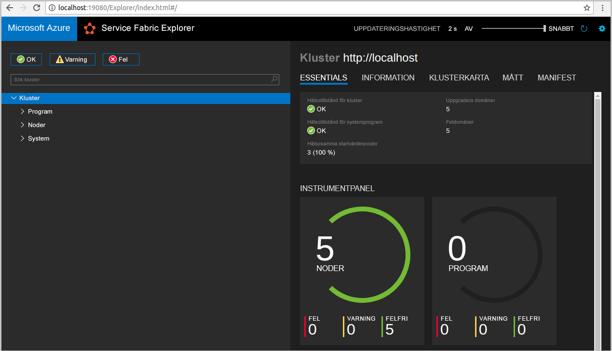
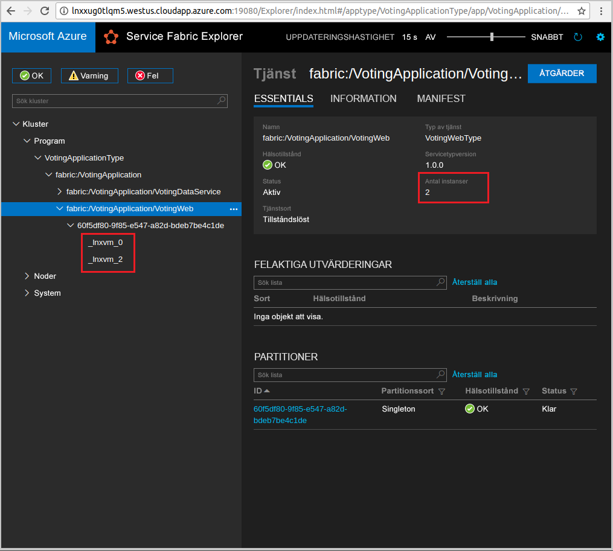

# <a name="create-a-java-application"></a>Skapa ett Java-program
Azure Service Fabric är en plattform för distribuerade system för distribution och hantering av mikrotjänster och behållare. 

I den här snabbstarten får du lära dig att distribuera ditt första Java-program till Service Fabric med hjälp av Eclipse Integrated Development Environment på en Linux-utvecklarmaskin. När du är klar har du ett röstningsprogram med en Java-webbklient som sparar röstningsresultat i en tillståndskänslig backend-tjänst i klustret.


I den här snabbstarten lär du dig att:

> [!div class="checklist"]
> * Använda Eclipse som ett verktyg för Service Fabric Java-program
> * Distribuera programmet till ditt lokala kluster 
> * Distribuera programmet till ett kluster i Azure
> * Skala ut programmet över flera noder

## <a name="prerequisites"></a>Nödvändiga komponenter
För att slutföra den här snabbstarten behöver du:
1. [Installera Service Fabric SDK och Service Fabric Command Line Interface (CLI)](https://docs.microsoft.com/azure/service-fabric/service-fabric-get-started-linux#installation-methods)
2. [Installera Git](https://git-scm.com/)
3. [Installera Eclipse](https://www.eclipse.org/downloads/)
4. [Konfigurera en Java-miljö](https://docs.microsoft.com/azure/service-fabric/service-fabric-get-started-linux#set-up-java-development) och kontrollera att du följer de valfria stegen för att installera plugin-programmet Eclipse 

## <a name="download-the-sample"></a>Hämta exemplet
Kör följande kommando i ett kommandofönster för att klona databasen för exempelappen till den lokala datorn.
```
git clone https://github.com/Azure-Samples/service-fabric-java-quickstart.git
```

## <a name="run-the-application-locally"></a>Kör programmet lokalt
1. Starta ditt lokala kluster genom att köra följande kommando:

    ```bash
    sudo /opt/microsoft/sdk/servicefabric/common/clustersetup/devclustersetup.sh
    ```
    Det kan ta lite tid att starta det lokala klustret. Om du vill kontrollera att klustret är fullständigt aktiverat går du till Service Fabric Explorer på **http://localhost:19080**. När du ser fem felfria noder vet du att det lokala klustret är igång och redo. 
    
    

2. Öppna Eclipse.
3. Klicka på Arkiv -> Öppna projekt, under Filsystem... 
4. Klicka på Directory (Katalog) och välj katalogen `Voting` från mappen `service-fabric-java-quickstart` som du klonade från Github. Klicka på Slutför. 

    
    
5. Nu finns projektet `Voting` i Package Explorer (Paketutforskaren) för Eclipse. 
6. Högerklicka på projektet och välj **Publish Application...** (Publicera program) under listrutan **Service Fabric**. Välj **PublishProfiles/Local.json** som Target Profile (Målprofil) och klicka på Publish (Publicera). 

    
    
7. Öppna valfri webbläsare och hitta programmet genom att gå till **http://localhost: 8080**. 

    
    
Du kan nu lägga till en uppsättning röstningsalternativ och börja ta emot röster. Programmet körs och lagrar alla data i Service Fabric-klustret, utan att en separat databas krävs.

## <a name="deploy-the-application-to-azure"></a>Distribuera programmet till Azure

### <a name="set-up-your-azure-service-fabric-cluster"></a>Konfigurera ett Azure Service Fabric-kluster
Om du vill distribuera programmet till ett kluster i Azure kan du skapa ett eget kluster.

Partykluster är kostnadsfria, tidsbegränsade Service Fabric-kluster som finns på Azure. De körs av Service Fabric-teamet. Där kan alla distribuera program och lära sig mer om plattformen. [Följ dessa instruktioner](http://aka.ms/tryservicefabric) för att få åtkomst till ett partykluster. 

Du kan använda Service Fabric Explorer, CLI eller Powershell för att utföra hanteringsåtgärder på det säkra partklustret. Om du vill använda Service Fabric Explorer behöver du ladda ned PFX-filen från webbplatsen med partklustret och importera certifikatet till certifikatarkivet (Windows eller Mac) eller till webbläsaren (Ubuntu). Det finns inget lösenord för självsignerade certifikat från partklustret. 

För att kunna utföra hanteringsåtgärder med Powershell eller CLI måste du ha PFX (Powershell) eller PEM (CLI). Om du vill konvertera PFX-filen till en PEM-fil kör du följande kommando:  

```bash
openssl pkcs12 -in party-cluster-1277863181-client-cert.pfx -out party-cluster-1277863181-client-cert.pem -nodes -passin pass:
```

Information om hur du skapar ett eget kluster finns i [Skapa ditt första Service Fabric-kluster i Azure](service-fabric-tutorial-create-vnet-and-linux-cluster.md).

> [!Note]
> Spring Boot-tjänsten är konfigurerad för att lyssna efter inkommande trafik på port 8080. Se till att den porten är öppen i ditt kluster. Porten är öppen om du använder ett partykluster.
>

### <a name="add-certificate-information-to-your-application"></a>Lägg till certifikatinformation i ditt program

Certifikattumavtrycket måste läggas till i ditt program eftersom det använder Service Fabrics programmeringsmodeller. 

1. Du kommer att behöva tumavtrycket för certifikatet i ```Voting/VotingApplication/ApplicationManiest.xml```-filen när du kör på ett säkert kluster. Kör följande kommando för att extrahera tumavtrycket för certifikatet.

    ```bash
    openssl x509 -in [CERTIFICATE_FILE] -fingerprint -noout
    ```

2. I ```Voting/VotingApplication/ApplicationManiest.xml``` lägger du till följande kodavsnitt under taggen **ApplicationManifest**. **X509FindValue** ska vara tumavtrycket från föregående steg (inga semikolon). 

    ```xml
    <Certificates>
        <SecretsCertificate X509FindType="FindByThumbprint" X509FindValue="0A00AA0AAAA0AAA00A000000A0AA00A0AAAA00" />
    </Certificates>   
    ```
    
### <a name="deploy-the-application-using-eclipse"></a>Distribuera programmet med Eclipse
Nu när programmet är redo kan du distribuera det till ett kluster direkt från Visual Studio.

1. Öppna filen **Cloud.json** som finns i katalogen **PublishProfiles** och fyll i uppgifter i fälten `ConnectionIPOrURL` och `ConnectionPort`. Exempel: 

    ```bash
    {
         "ClusterConnectionParameters": 
         {
            "ConnectionIPOrURL": "lnxxug0tlqm5.westus.cloudapp.azure.com",
            "ConnectionPort": "19080",
            "ClientKey": "[path_to_your_pem_file_on_local_machine]",
            "ClientCert": "[path_to_your_pem_file_on_local_machine]"
         }
    }
    ```

2. Högerklicka på projektet och välj **Publish Application...** (Publicera program) under listrutan **Service Fabric**. Välj **PublishProfiles/Cloud.json** som Target Profile (Målprofil) och klicka på Publish (Publicera). 

    

3. Öppna valfri webbläsare och hitta programmet genom att gå till **http://\<ConnectionIPOrURL>:8080**. 

    
    
## <a name="scale-applications-and-services-in-a-cluster"></a>Skala program och tjänster i ett kluster
Tjänsterna kan enkelt skalas över ett kluster när belastningen på tjänsterna ändras. Du kan skala en tjänst genom att ändra antalet instanser som körs i klustret. Det går att skala tjänsterna på flera sätt, till exempel med skript eller kommandon från Service Fabric CLI (sfctl). I det här exemplet använder vi Service Fabric Explorer.

Service Fabric Explorer körs i alla Service Fabric-kluster och kan nås från en webbläsare genom att bläddra till klustrets HTTP-hanteringsport (19080), till exempel `http://lnxxug0tlqm5.westus.cloudapp.azure.com:19080`.

Gör så här om du vill skala frontwebbtjänsten:

1. Öppna Service Fabric Explorer i ditt kluster, till exempel `https://lnxxug0tlqm5.westus.cloudapp.azure.com:19080`.
2. Klicka på ellipsknappen (tre punkter) bredvid noden **fabric:/Voting/VotingWeb** i trädvyn och välj **Scale Service** (Skala tjänst).

    

    Du kan nu välja att skala antalet instanser av frontwebbtjänsten.

3. Ändra antalet till **2** och klicka på **Scale Service** (Skala tjänst).
4. Klicka på noden **fabric:/Voting/VotingWeb** i trädvyn och utöka partitionsnoden (som representeras av en globalt unik identifierare).

    

    Du kan nu se att tjänsten har två instanser och i trädvyn du se vilka noder instanserna körs på.

Med den här enkla hanteringsåtgärden har vi dubblerat resurserna för bearbetning av användarbelastning för frontwebbtjänsten. Det är viktigt att veta att du inte behöver flera instanser av en tjänst för att den ska köras på ett tillförlitligt sätt. Om en tjänst misslyckas ser Service Fabric till att en ny tjänstinstans körs i klustret.

## <a name="next-steps"></a>Nästa steg
I den här snabbstarten har du lärt dig att:

> [!div class="checklist"]
> * Använda Eclipse som ett verktyg för Service Fabric Java-program
> * Distribuera Java-program till ditt lokala kluster 
> * Distribuera Java-program till ett kluster i Azure
> * Skala ut programmet över flera noder

* Läs mer om hur man [felsöker tjänster i Java med Eclipse](service-fabric-debugging-your-application-java.md)
* Läs mer om hur man [konfigurerar kontinuerlig integration och distribution med Jenkins](service-fabric-cicd-your-linux-applications-with-jenkins.md)
* Se andra [Java-exempel](https://github.com/Azure-Samples/service-fabric-java-getting-started)