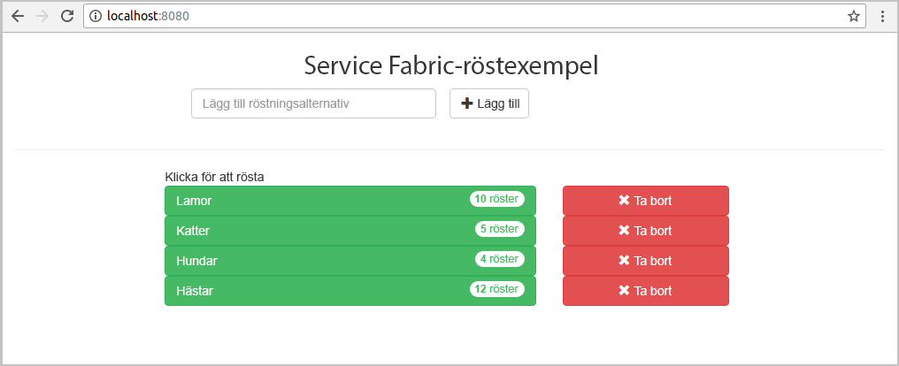
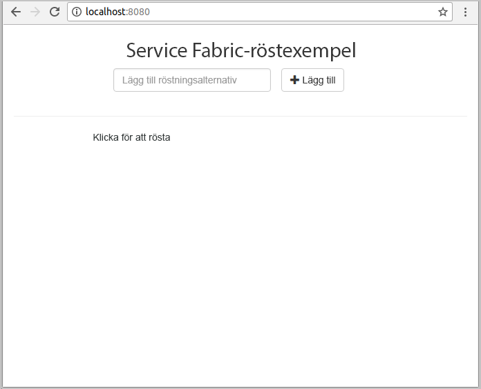
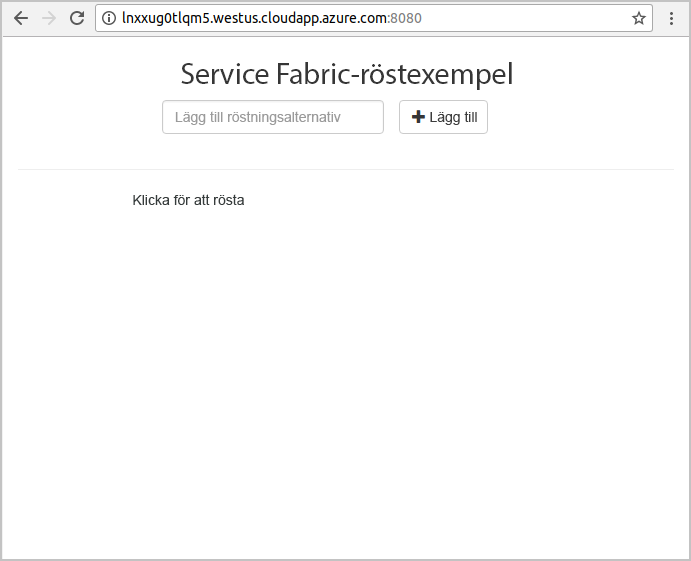
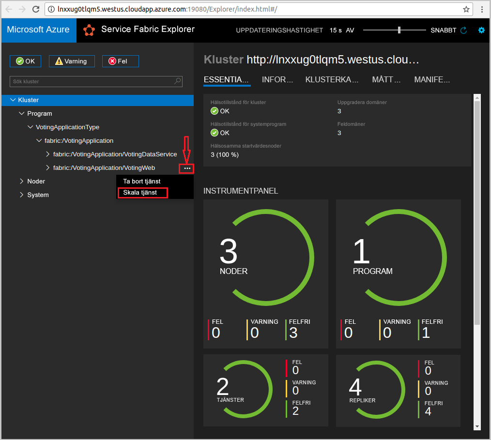

# <a name="create-a-java-application"></a>Skapa ett Java-program
Azure Service Fabric är en plattform för distribuerade system för att distribuera och hantera mikrotjänster och behållare. 

Den här snabbstarten visar hur du distribuerar din första Java-program till Service Fabric med Eclipse IDE på en Linux-dator för utvecklare. När du är klar har du röstningsapp med en Java-webbklientservern som sparar röstning resultat i en tillståndskänslig backend-tjänst i klustret.



I den här snabbstarten lär du dig att:

> [!div class="checklist"]
> * Använda Eclipse som ett verktyg för Service Fabric Java-program
> * Distribuera programmet till det lokala klustret 
> * Distribuera programmet till ett kluster i Azure
> * Skalbara program över flera noder

## <a name="prerequisites"></a>Krav
För att slutföra den här snabbstarten behöver du:
1. [Installera Service Fabric SDK & Service Fabric kommandoradsgränssnittet (CLI)](https://docs.microsoft.com/en-us/azure/service-fabric/service-fabric-get-started-linux#installation-methods)
2. [Installera Git](https://git-scm.com/)
3. [Installera Eclipse](https://www.eclipse.org/downloads/)
4. [Konfigurera en Java-miljö](https://docs.microsoft.com/en-us/azure/service-fabric/service-fabric-get-started-linux#set-up-java-development), att kontrollera att du följer de valfria stegen för att installera plugin-programmet Eclipse 

## <a name="download-the-sample"></a>Hämta exemplet
Kör följande kommando för att klona exempel app lagringsplatsen till den lokala datorn i ett kommandofönster.
```
git clone https://github.com/Azure-Samples/service-fabric-java-quickstart.git
```

## <a name="run-the-application-locally"></a>Kör programmet lokalt
1. Starta din lokala klustret genom att köra följande kommando:

    ```bash
    sudo /opt/microsoft/sdk/servicefabric/common/clustersetup/devclustersetup.sh
    ```
    Starten av det lokala klustret tar en stund. För att bekräfta att klustret är fullständigt dig åtkomst till Service Fabric-Utforskaren på **http://localhost:19080**. Fem felfri noder ange det lokala klustret är igång. 
    
    

2. Öppna Eclipse.
3. Klicka på Arkiv -> Öppna projekt från filsystemet... 
4. Klicka på katalogen och välj den `Voting` katalog från den `service-fabric-java-quickstart` mappen som du har klonat från Github. Klicka på Slutför. 

    
    
5. Nu har du den `Voting` paketet Explorer för Eclipse-projekt. 
6. Högerklicka på projektet och välj **publicera program...**  under den **Service Fabric** listrutan. Välj **PublishProfiles/Local.json** som mål-profil och klicka på Publicera. 

    
    
7. Öppna valfri webbläsare och få åtkomst till programmet genom att öppna **http://localhost: 8080**. 

    
    
Du kan nu lägga till en uppsättning röstning alternativ och starta tar röster. Programmet körs och lagrar alla data i din Service Fabric-klustret utan att behöva en separat databas.

## <a name="deploy-the-application-to-azure"></a>Distribuera programmet till Azure

### <a name="set-up-your-azure-service-fabric-cluster"></a>Konfigurera Azure Service Fabric-kluster
Skapa ditt eget kluster för att distribuera program till ett kluster i Azure, eller Använd ett part kluster.

Partykluster är kostnadsfria, tidsbegränsade Service Fabric-kluster som finns på Azure. De körs av Service Fabric-teamet där alla kan distribuera program och lär dig mer om plattformen. [Följ dessa instruktioner](http://aka.ms/tryservicefabric) för att få åtkomst till ett partykluster. 

Information om hur du skapar ett eget kluster finns i [Skapa ditt första Service Fabric-kluster i Azure](service-fabric-get-started-azure-cluster.md).

> [!Note]
> Webbtjänsten front-end konfigureras så att den lyssnar på port 8080 för inkommande trafik. Se till att den porten är öppen i ditt kluster. Om du använder part klustret är den här porten öppen.
>

### <a name="deploy-the-application-using-eclipse"></a>Distribuera programmet med Eclipse
Nu när programmet och klustret är klar kan distribuera du den till klustret direkt från Eclipse.

1. Öppna den **Cloud.json** filen den **PublishProfiles** directory och Fyll i den `ConnectionIPOrURL` och `ConnectionPort` fälten på lämpligt sätt. Ett exempel finns: 

    ```bash
    {
         "ClusterConnectionParameters": 
         {
            "ConnectionIPOrURL": "lnxxug0tlqm5.westus.cloudapp.azure.com",
            "ConnectionPort": "19080",
            "ClientKey": "",
            "ClientCert": ""
         }
    }
    ```

2. Högerklicka på projektet och välj **publicera program...**  under den **Service Fabric** listrutan. Välj **PublishProfiles/Cloud.json** som mål-profil och klicka på Publicera. 

    

3. Öppna valfri webbläsare och få åtkomst till programmet genom att öppna **http://\<ConnectionIPOrURL >: 8080**. 

    
    
## <a name="scale-applications-and-services-in-a-cluster"></a>Skala program och tjänster i ett kluster
Tjänster kan skalas över ett kluster kan utföra en ändring i belastningen på tjänsterna. Du kan skala en tjänst genom att ändra antalet instanser som körs i klustret. Du har flera olika sätt att skala dina tjänster kan du använda skript eller kommandon från Service Fabric CLI (sfctl). I det här exemplet använder vi Service Fabric Explorer.

Service Fabric Explorer körs i alla Service Fabric-kluster och kan nås från en webbläsare genom att bläddra till kluster HTTP Hanteringsport (19080), till exempel `http://lnxxug0tlqm5.westus.cloudapp.azure.com:19080`.

Gör så här om du vill skala frontwebbtjänsten:

1. Öppna Service Fabric Explorer i ditt kluster, till exempel `http://lnxxug0tlqm5.westus.cloudapp.azure.com:19080`.
2. Klicka på ellipsknappen (tre punkter) bredvid den **fabric: / Röstningsdatabasen/VotingWeb** noder i trädvyn och välj **skala Service**.

    

    Du kan nu välja att skala antalet instanser av frontwebbtjänsten.

3. Ändra antalet till **2** och klicka på **Scale Service** (Skala tjänst).
4. Klicka på den **fabric: / Röstningsdatabasen/VotingWeb** noden i trädvyn och expandera noden partition (representerade av GUID).

    

    Du kan nu se att tjänsten har två instanser och i trädvyn du se vilka noder instanserna körs på.

Med den här enkla hanteringsåtgärden har vi dubblerat resurserna för bearbetning av användarbelastning för frontwebbtjänsten. Det är viktigt att veta att du inte behöver flera instanser av en tjänst för att den ska köras på ett tillförlitligt sätt. Om en tjänst misslyckas ser Service Fabric till att en ny tjänstinstans körs i klustret.

## <a name="next-steps"></a>Nästa steg
I den här snabbstarten har du lärt dig att:

> [!div class="checklist"]
> * Använda Eclipse som ett verktyg för Service Fabric Java-program
> * Distribuera Java-program till det lokala klustret 
> * Distribuera Java-program till ett kluster i Azure
> * Skalbara program över flera noder

* Lär dig mer om [tjänster i Java med Eclipse-felsökning](service-fabric-debugging-your-application-java.md)
* Lär dig mer om [ställa in din kontinuerlig integreation & distribution med Jenkins](service-fabric-cicd-your-linux-java-application-with-jenkins.md)
* Utcheckning andra [Java-exempel](https://github.com/Azure-Samples/service-fabric-java-getting-started)