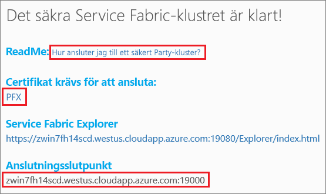
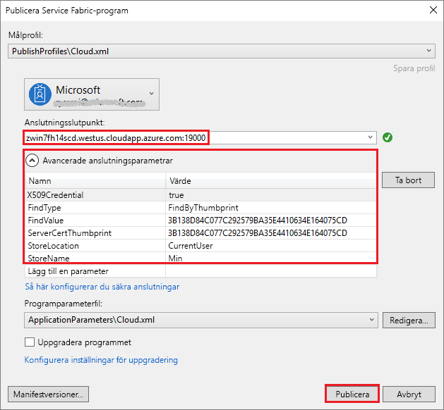

# <a name="tutorial-deploy-an-application-to-a-service-fabric-cluster-in-azure"></a>Självstudiekurs: Distribuera ett program till ett Service Fabric-kluster i Azure
Den här självstudiekursen är del två i en serie. Här får du se hur du distribuerar ett Azure Service Fabric-program till ett kluster som körs i Azure.

I del två av den här självstudieserien får du lära dig att:
> [!div class="checklist"]
> * [Skapa ett .NET Service Fabric-program](service-fabric-tutorial-create-dotnet-app.md)
> * Distribuera programmet till ett fjärrkluster
> * [Konfigurera CI/CD med hjälp av Visual Studio Team Services](service-fabric-tutorial-deploy-app-with-cicd-vsts.md)
> * [Konfigurera övervakning och diagnostik för programmet](service-fabric-tutorial-monitoring-aspnet.md)

I den här självstudieserien får du lära du dig att:
> [!div class="checklist"]
> * Distribuera ett program till ett fjärrkluster med Visual Studio
> * Ta bort ett program från ett kluster med Service Fabric Explorer

## <a name="prerequisites"></a>Nödvändiga komponenter
Innan du börjar den här självstudien:
- om du inte har en Azure-prenumeration kan du skapa ett [kostnadsfritt konto](https://azure.microsoft.com/free/?WT.mc_id=A261C142F)
- [Installera Visual Studio 2017](https://www.visualstudio.com/) och installera **Azure Development** och arbetsbelastningarna **ASP.NET och webbutveckling**.
- [Installera Service Fabric SDK](service-fabric-get-started.md)

## <a name="download-the-voting-sample-application"></a>Ladda ned exempelprogrammet Röstning
Om du inte byggde exempelprogrammet Röstning i [del ett av självstudiekursen](service-fabric-tutorial-create-dotnet-app.md) kan du ladda ned det. Kör följande kommando i ett kommandofönster för att klona databasen för exempelappen till den lokala datorn.

```
git clone https://github.com/Azure-Samples/service-fabric-dotnet-quickstart
```

## <a name="set-up-a-party-cluster"></a>Konfigurera ett partkluster
Partykluster är kostnadsfria, tidsbegränsade Service Fabric-kluster i Azure som körs av Service Fabric-teamet där vem som helst kan distribuera program och lära sig mer om plattformen. Kostnadsfritt!

Gå till den här webbplatsen för att få åtkomst till ett partkluster: http://aka.ms/tryservicefabric. Följ sedan instruktionerna för att få åtkomst till ett kluster. Du behöver ett Facebook- eller GitHub-konto för att kunna få åtkomst till ett partkluster.

Om du vill kan du använda ett eget kluster i stället för partklustret.  ASP.NET-kärnans webbklient använder omvänd proxy för att kommunicera med tjänstens tillståndskänsliga serverdel.  Omvänd proxy är aktiverat som standard för partklustret och det lokala utvecklingsklustret.  Om du distribuerar exempelprogrammet Röstning till ett eget kluster måste du [aktivera omvänd proxy i klustret](service-fabric-reverseproxy.md#setup-and-configuration).

> [!NOTE]
> Partkluster är inte skyddade, så dina program och de data som du lägger där kan vara synliga för andra. Distribuera aldrig sådant som du inte vill att andra ska se. Glöm inte att läsa igenom våra användningsvillkor noga.

Logga in och [ansluta till ett Windows-kluster](http://aka.ms/tryservicefabric). Hämta PFX-certifikatet till datorn genom att klicka på **PFX**-länken. Certifikatet och värdet **Anslutningens slutpunkt** används i följande steg.



På en Windows-dator ska du installera PFX i certifikatarkivet *CurrentUser\My*.

```powershell
PS C:\mycertificates> Import-PfxCertificate -FilePath .\party-cluster-873689604-client-cert.pfx -CertStoreLocation Cert:
\CurrentUser\My


  PSParentPath: Microsoft.PowerShell.Security\Certificate::CurrentUser\My

Thumbprint                                Subject
----------                                -------
3B138D84C077C292579BA35E4410634E164075CD  CN=zwin7fh14scd.westus.cloudapp.azure.com
```


## <a name="deploy-the-app-to-the-azure"></a>Distribuera appen till Azure
Nu när programmet är klart kan du distribuera det till partklustret direkt från Visual Studio.

1. Högerklicka på **Röstning** i Solution Explorer och välj **Publicera**. 

    

2. Kopiera **Anslutningsslutpunkten** för partyklustret till fältet **Anslutningsslutpunkt**. Till exempel `zwin7fh14scd.westus.cloudapp.azure.com:19000`. Klicka på **Avancerade anslutningsparametrar** och fyll i följande information.  Värdena *FindValue* och *ServerCertThumbprint* måste matcha tumavtrycket för certifikatet som installerades i föregående steg. Klicka på **Publicera**. 

    När publiceringen är klar bör du kunna skicka en begäran till programmet via en webbläsare.

3. Öppna din webbläsare och ange klusteradressen (anslutningens slutpunkt utan portinformation, till exempel win1kw5649s.westus.cloudapp.azure.com).

    Nu bör du få samma resultat som du fick när du körde programmet lokalt.

    

## <a name="remove-the-application-from-a-cluster-using-service-fabric-explorer"></a>Ta bort programmet från ett kluster med Service Fabric Explorer
Service Fabric Explorer är ett grafiskt användargränssnitt där du kan utforska och hantera program i ett Service Fabric-kluster.

Så här tar du bort programmet från partklustret:

1. Gå till Service Fabric Explorer med hjälp av länken på registreringssidan för partklustret. Exempelvis https://win1kw5649s.westus.cloudapp.azure.com:19080/Explorer/index.html.

2. I Service Fabric Explorer navigerar du till noden **fabric:/Voting** i trädvyn till vänster.

3. Klicka på knappen **Åtgärd** i rutan **Essentials** och välj **Ta bort programmet**. Bekräfta borttagning av programinstansen, så att instansen av vårt program som körs i klustret tas bort.


## <a name="remove-the-application-type-from-a-cluster-using-service-fabric-explorer"></a>Ta bort programtypen från ett kluster med Service Fabric Explorer
Program distribueras som programtyper i ett Service Fabric-kluster, vilket gör att du kan ha flera instanser och versioner av det program som körs i klustret. När du har tagit bort den instans av vårt program som körs kan vi också ta bort typen, så att vi slutför rensningen av distributionen.

Du kan läsa mer om programmodellen i Service Fabric i informationen om att [modellera ett program i Service Fabric](service-fabric-application-model.md).

1. Navigera till noden **VotingType** (röstningstyp) i trädvyn.

2. Klicka på knappen **Åtgärd** i rutan **Essentials** till höger och välj **Avetablera typen**. Bekräfta avetableringen av programtypen.


Detta avslutar självstudiekursen.

## <a name="next-steps"></a>Nästa steg
I den här självstudiekursen lärde du dig att:

> [!div class="checklist"]
> * Distribuera ett program till ett fjärrkluster med Visual Studio
> * Ta bort ett program från ett kluster med Service Fabric Explorer

Gå vidare till nästa kurs:
> [!div class="nextstepaction"]
> [Konfigurera kontinuerlig integrering med Visual Studio Team Services](service-fabric-tutorial-deploy-app-with-cicd-vsts.md)
