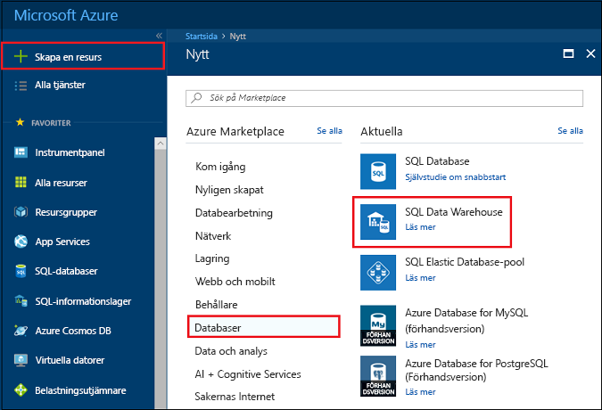
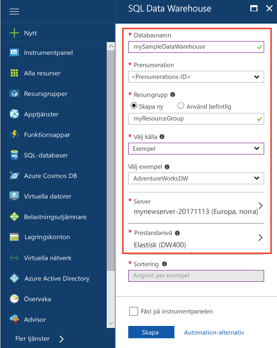
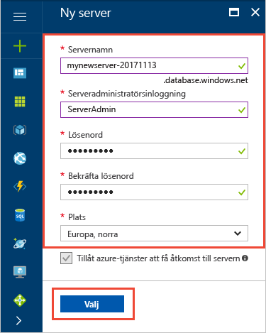
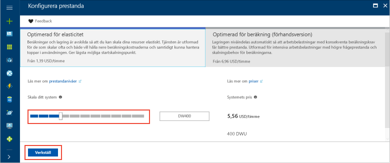
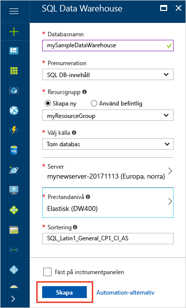
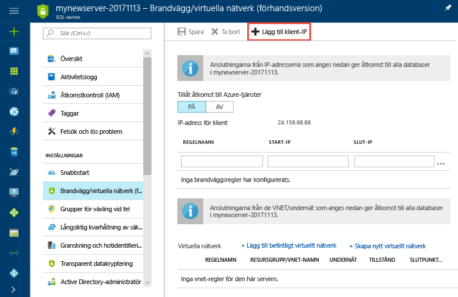
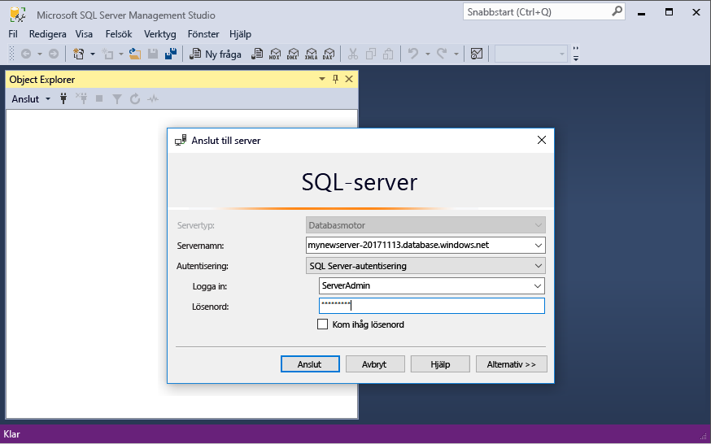
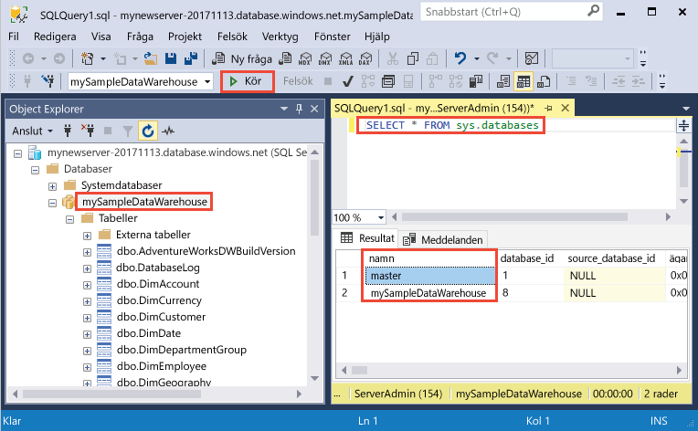
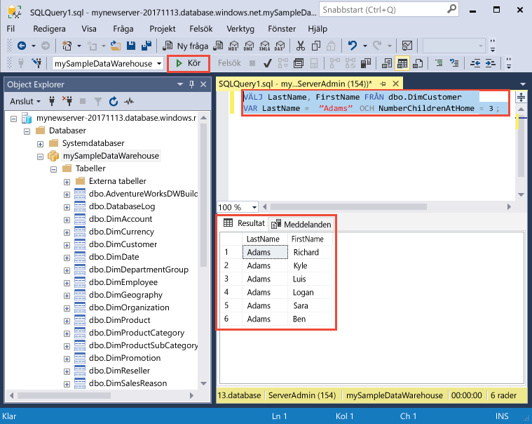

# <a name="create-an-azure-sql-data-warehouse-in-the-azure-portal"></a>Skapa en Azure SQL data warehouse i Azure-portalen

Den här snabbstartsguide skapar ett data warehouse med hjälp av tjänsten Azure SQL Data Warehouse och initierar med AdventureWorksDW-exempeldata. Sedan ansluta till data warehouse och köra en fråga på data. I självstudiekursen används den [Azure-portalen](https://portal.azure.com) och [SQL Server Management Studio](/sql/ssms/download-sql-server-management-studio-ssms.md) (SSMS)

Om du inte har en Azure-prenumeration kan du skapa ett [kostnadsfritt](https://azure.microsoft.com/free/) konto innan du börjar.

## <a name="before-you-begin"></a>Innan du börjar

Innan du börjar den här snabbstarten, hämta och installera den senaste versionen av [SQL Server Management Studio](/sql/ssms/download-sql-server-management-studio-ssms.md) (SSMS).

## <a name="log-in-to-the-azure-portal"></a>Logga in på Azure Portal

Logga in på [Azure-portalen](https://portal.azure.com/).

## <a name="create-a-data-warehouse"></a>Skapa ett datalager

Ett Azure SQL data warehouse har skapats med en definierad uppsättning [beräkningsresurser](performance-tiers.md). Databasen har skapats i en [Azure-resursgrupp](../azure-resource-manager/resource-group-overview.md) och i en [logisk Azure SQL-server](../sql-database/sql-database-features.md). 

Följ dessa steg om du vill skapa ett SQL data warehouse med AdventureWorksDW-exempeldata. 

1. Klicka på den **ny** knappen i det övre vänstra hörnet i Azure-portalen.

2. Välj **databaser** från den **ny** och väljer **SQL Data Warehouse** under **aktuell** på den **ny**sidan.

    

3. Fyll i formuläret SQL Data Warehouse med följande information:   

    | Inställning | Föreslaget värde | Beskrivning | 
    | ------- | --------------- | ----------- | 
    | **Databasnamn** | mySampleDataWarehouse | För giltiga databasnamn, se [databasidentifierare](/sql/relational-databases/databases/database-identifiers). Observera att ett informationslager är en typ av databas.| 
    | **Prenumeration** | Din prenumeration  | Mer information om dina prenumerationer finns i [Prenumerationer](https://account.windowsazure.com/Subscriptions). |
    | **Resursgrupp** | myResourceGroup | Giltiga resursgruppnamn finns i [Namngivningsregler och begränsningar](https://docs.microsoft.com/azure/architecture/best-practices/naming-conventions). |
    | **Välj källa** | Exempel | Anger om du vill läsa in en exempeldatabas. Observera att ett informationslager är en typ av databas. |
    | **Välj exempel** | AdventureWorksDW | Anger om du vill läsa in AdventureWorksDW som exempeldatabas.  |

    

4. Klicka på **Server** för att skapa och konfigurera en ny server för den nya databasen. Fyll i den **nytt serverformulär** med följande information: 

    | Inställning | Föreslaget värde | Beskrivning | 
    | ------------ | ------------------ | ------------------------------------------------- | 
    | **Servernamn** | Valfritt globalt unikt namn | Giltiga servernamn finns i [Namngivningsregler och begränsningar](https://docs.microsoft.com/azure/architecture/best-practices/naming-conventions). | 
    | **Inloggning för serveradministratör** | Valfritt giltigt namn | För giltiga inloggningsnamn, se [Databasidentifierare](https://docs.microsoft.com/sql/relational-databases/databases/database-identifiers).|
    | **Lösenord** | Valfritt giltigt lösenord | Lösenordet måste innehålla minst åtta tecken och måste innehålla tecken från tre av följande kategorier: versaler, gemener, siffror och specialtecken. |
    | **Plats** | Valfri giltig plats | För information om regioner, se [Azure-regioner](https://azure.microsoft.com/regions/). |

    

5. Klicka på **Välj**.

6. Klicka på **prestandanivån** att ange om datalagret har optimerats för elasticitet eller beräkning och antalet data warehouse enheter. 

7. Den här självstudiekursen, Välj den **optimerade för elasticitet** tjänstnivån. Skjutreglaget, som standard är inställt på **DW400**.  Försök att flytta uppåt och nedåt för att se hur det fungerar. 

    

8. Klicka på **Använd**.

9. Nu när du har fyllt i SQL Database-formuläret klickar du på **Skapa** så att databasen etableras. Etableringen tar några minuter. 

    

10. Klicka på **Aviseringar** i verktygsfältet för att övervaka distributionsprocessen.
    
     

## <a name="create-a-server-level-firewall-rule"></a>Skapa en brandväggsregel på servernivå

Tjänsten SQL Data Warehouse skapar en brandvägg på servernivå som förhindrar externa program och verktyg från att ansluta till servern eller en databas på servern. Du kan lägga till brandväggsregler som tillåter anslutning för specifika IP-adresser för att tillåta anslutningar.  Följ dessa steg för att skapa en [brandväggsregel på servernivå](../sql-database/sql-database-firewall-configure.md) för din klients IP-adress. 

> [!NOTE]
> SQL Data Warehouse kommunicerar via port 1433. Om du försöker ansluta från ett företagsnätverk kanske utgående trafik via port 1433 inte av ditt nätverks brandvägg. I så fall kommer du inte att kunna ansluta till din Azure SQL Database-server om inte din IT-avdelning öppnar port 1433.
>

1. När distributionen är klar klickar du på **SQL-databaser** på menyn till vänster och klickar sedan på **mySampleDatabase** på sidan **SQL-databaser**. På översiktssidan för din databas öppnas och visar fullständigt kvalificerade servernamnet (exempelvis **mynewserver 20171113.database.windows.net**) och innehåller alternativ för ytterligare konfiguration. 

2. Kopiera det här fullständiga servernamnet för anslutning till servern och databaserna i efterföljande snabbstarter. Klicka på servernamnet för att öppna serverinställningarna för.

    

3. Klicka på servernamnet för att öppna serverinställningarna för.

    

5. Klicka på **visa brandväggsinställningar**. Sidan **Brandväggsinställningar** för SQL Database-servern öppnas. 

    

4. Klicka på **Lägg till klient-IP** i verktygsfältet och lägg till din aktuella IP-adress i en ny brandväggsregel. Med en brandväggsregel kan du öppna port 1433 för en enskild IP-adress eller för IP-adressintervall.

5. Klicka på **Spara**. En brandväggsregel på servernivå för att öppna port 1433 på den logiska servern skapas för din aktuella IP-adress.

6. Klicka på **OK** och stäng sedan sidan **Brandväggsinställningar**.

Nu kan du ansluta till SQLServer och dess datalager med den här IP-adress. Anslutningen fungerar från SQL Server Management Studio eller något annat verktyg du väljer. När du ansluter kan du använda ServerAdmin-kontot som du skapade tidigare.  

> [!IMPORTANT]
> Som standard är åtkomst genom SQL Database-brandväggen aktiverad för alla Azure-tjänster. Klicka på **OFF** på den här sidan och klicka sedan på **spara** att inaktivera brandväggen för alla Azure-tjänster.

## <a name="get-the-fully-qualified-server-name"></a>Hämta det fullständigt kvalificerade servernamnet

Hämta det fullständigt kvalificerade servernamnet för SQLServer i Azure-portalen. Senare används det fullständigt kvalificerade namnet när du ansluter till servern.

1. Logga in på [Azure-portalen](https://portal.azure.com/).
2. Välj **SQL-databaser** på den vänstra menyn och klicka på databasen på sidan **SQL-databaser**. 
3. I rutan **Essentials** på sidan för Azure Portal för databasen letar du reda på och kopierar **servernamnet**. I det här exemplet är det fullständigt kvalificerade namnet mynewserver 20171113.database.windows.net. 

      

## <a name="connect-to-the-server-as-server-admin"></a>Anslut till servern som serveradministratör

Det här avsnittet använder [SQL Server Management Studio](/sql/ssms/download-sql-server-management-studio-ssms.md) (SSMS) för att upprätta en anslutning till Azure SQL-servern.

1. Öppna SQL Server Management Studio.

2. I dialogrutan **Anslut till server** anger du följande information:

   | Inställning       | Föreslaget värde | Beskrivning | 
   | ------------ | ------------------ | ------------------------------------------------- | 
   | Servertyp | Databasmotor | Det här värdet krävs |
   | servernamn | Fullständigt kvalificerat servernamn | Namnet ska vara ungefär så här: **mynewserver 20171113.database.windows.net**. |
   | Autentisering | SQL Server-autentisering | SQL-autentisering är den enda autentiseringstypen som vi har konfigurerat i den här kursen. |
   | Inloggning | Serveradministratörskontot | Detta är det konto som du angav när du skapade servern. |
   | Lösenord | Lösenordet för serveradministratörskontot | Detta är det lösenord som du angav när du skapade servern. |

    

4. Klicka på **Anslut**. Fönstret Object Explorer öppnas i SSMS. 

5. I Object Explorer, expandera **databaser**. Expandera **mySampleDatabase** visa objekten i den nya databasen.

     

## <a name="run-some-queries"></a>Köra några frågor

SQL Data Warehouse använder T-SQL som frågespråket. Använd följande steg för att öppna ett fönster i fråga och köra några T-SQL-frågor.

1. Högerklicka på **mySampleDataWarehouse** och välj **ny fråga**.  Ett nytt frågefönster öppnas.
2. Ange följande kommando för att visa en lista över databaser i frågefönstret.

    ```sql
    SELECT * FROM sys.databases
    ```

3. Klicka på **Kör**.  Resultatet av frågan visar två databaser: **master** och **mySampleDataWarehouse**.

    

4. Om du vill titta på vissa data använder du följande kommando för att se hur många kunder med efternamn Adams som har tre underordnade hemma. Resultatlistan sex kunder. 

    ```sql
    SELECT LastName, FirstName FROM dbo.dimCustomer
    WHERE LastName = 'Adams' AND NumberChildrenAtHome = 3;
    ```

    

## <a name="clean-up-resources"></a>Rensa resurser

Att debiteras du för beräkningsresurser och data som du har lästs in i ditt data warehouse. Dessa faktureras separat. 

- Om du vill skydda data i lagring kan du pausa beräkning när du inte använder datalagret. Genom att pausa beräkning kommer du bara att kostnad för lagring av data och du kan återuppta beräkningen när du är redo att arbeta med data.
- Om du vill ta bort framtida avgifter kan du ta bort datalagret. 

Följ dessa steg för att rensa resurser som du önskar.

1. Logga in på den [Azure-portalen](https://portal.azure.com), klicka på ditt informationslager.

    

1. Om du vill pausa beräkning, klickar du på den **pausa** knappen. När datalagret har pausats, visas en **starta** knappen.  Om du vill återuppta databearbetning, klickar du på **starta**.

2. Ta bort datalagret så att du inte kommer att debiteras för beräkning och lagring genom att klicka på **ta bort**.

3. Ta bort SQL-server som du har skapat, klicka på **mynewserver 20171113.database.windows.net** i föregående bild och klicka sedan på **ta bort**.  Var försiktig med detta som tar bort servern tas bort alla databaser som har tilldelats servern.

4. Ta bort resursgruppen, klicka på **myResourceGroup**, och klicka sedan på **ta bort resursgruppen**.


## <a name="next-steps"></a>Nästa steg

Nu när du har en databas kan du ansluta och söka med dina favoritverktyg. Lär dig mer genom att välja verktyg nedan:

- [SQL Server Management Studio](../sql-database/sql-database-connect-query-ssms.md?toc=%2fazure%2fsql-data-warehouse%2ftoc.json)
- [Visual Studio Code](../sql-database/sql-database-connect-query-vscode.md?toc=%2fazure%2fsql-data-warehouse%2ftoc.json)
- [NET](../sql-database/sql-database-connect-query-dotnet.md?toc=%2fazure%2fsql-data-warehouse%2ftoc.json)
- [PHP](../sql-database/sql-database-connect-query-php.md?toc=%2fazure%2fsql-data-warehouse%2ftoc.json)
- [Node.js](../sql-database/sql-database-connect-query-nodejs.md?toc=%2fazure%2fsql-data-warehouse%2ftoc.json)
- [Java](../sql-database/sql-database-connect-query-java.md?toc=%2fazure%2fsql-data-warehouse%2ftoc.json)
- [Python](../sql-database/sql-database-connect-query-python.md?toc=%2fazure%2fsql-data-warehouse%2ftoc.json)
- [Ruby](../sql-database/sql-database-connect-query-ruby.md?toc=%2fazure%2fsql-data-warehouse%2ftoc.json)