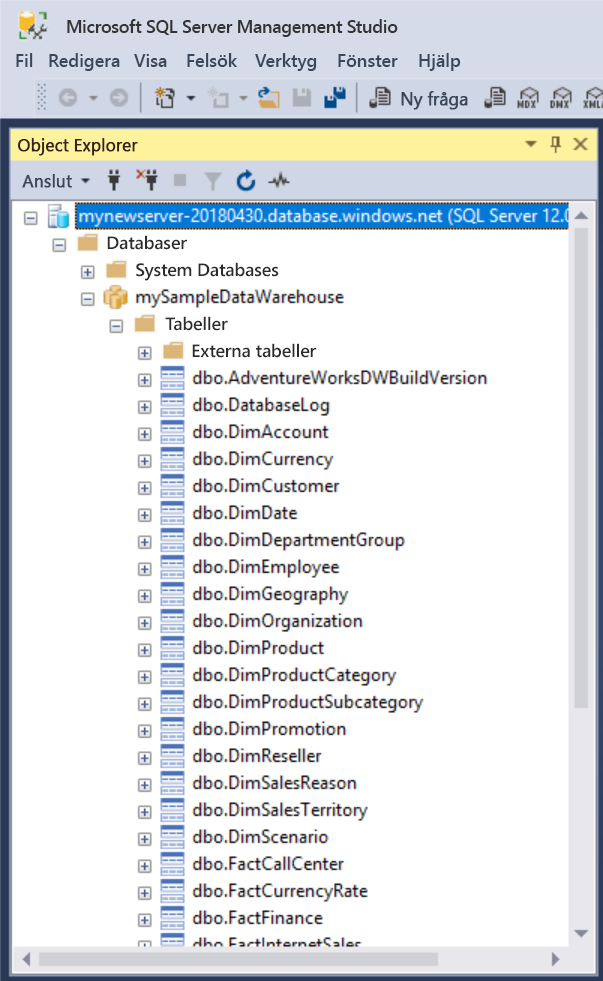

# <a name="quickstart-scale-compute-in-azure-sql-data-warehouse-using-t-sql"></a>Snabbstart: Skala bearbetning i Azure SQL Data Warehouse med hjälp av T-SQL

Skala bearbetning i Azure SQL Data Warehouse med hjälp av T-SQL och SQL Server Management Studio (SSMS). Skala ut beräkning för bättre prestanda eller skala beräkna tillbaka om du vill spara kostnader. 

Om du inte har en Azure-prenumeration kan du skapa ett [kostnadsfritt](https://azure.microsoft.com/free/) konto innan du börjar.

## <a name="before-you-begin"></a>Innan du börjar

Ladda ned och installera den senaste versionen av [SQL Server Management Studio](/sql/ssms/download-sql-server-management-studio-ssms.md) (SSMS).

Detta förutsätter att du har slutfört [Snabbstart: skapa och ansluta - portal](create-data-warehouse-portal.md). När du har slutfört skapa och Anslut Snabbstart du vet hur du ansluter till: skapa ett data warehouse med namnet **mySampleDataWarehouse**, skapas en brandväggsregel som tillåter vår klienten att komma åt servern installerad.
 
## <a name="create-a-data-warehouse"></a>Skapa ett datalager

Använd [Snabbstart: skapa och ansluta - portal](create-data-warehouse-portal.md) att skapa ett data warehouse med namnet **mySampleDataWarehouse**. Slut Snabbstart för att se till att du har en brandväggsregel och kan ansluta till ditt informationslager i SQL Server Management Studio.

## <a name="connect-to-the-server-as-server-admin"></a>Ansluta till servern som serveradministratör

I det här avsnittet används [SQL Server Management Studio](/sql/ssms/download-sql-server-management-studio-ssms.md) (SSMS) för att upprätta en anslutning till Azure SQL-servern.

1. Öppna SQL Server Management Studio.

2. I dialogrutan **Anslut till server** anger du följande information:

   | Inställning       | Föreslaget värde | Beskrivning | 
   | ------------ | ------------------ | ------------------------------------------------- | 
   | Servertyp | Databasmotor | Det här värdet är obligatoriskt |
   | servernamn | Fullständigt kvalificerat servernamn | Här är ett exempel: **mynewserver 20171113.database.windows.net**. |
   | Autentisering | SQL Server-autentisering | SQL-autentisering är den enda autentiseringstypen som vi konfigurerar i den här självstudiekursen. |
   | Inloggning | Serveradministratörskontot | Detta är det konto som du angav när du skapade servern. |
   | Lösenord | Lösenordet för serveradministratörskontot | Detta är det lösenord som du angav när du skapade servern. |

    

4. Klicka på **Anslut**. Fönstret Object Explorer öppnas i SSMS. 

5. Expandera **Databaser** i Object Explorer. Expandera **mySampleDatabase** så visas objekten i den nya databasen.

     

## <a name="view-service-objective"></a>Målet för vyn
Mål tjänstinställning innehåller antalet informationslagerenheter för datalagret. 

Visa de aktuella informationslagerenheter för ditt data warehouse:

1. Under anslutningen till **mynewserver 20171113.database.windows.net**, expandera **systemdatabaser**.
2. Högerklicka på **master** och välj **ny fråga**. Ett nytt frågefönster öppnas.
3. Kör följande fråga för att välja från vyn sys.database_service_objectives dynamisk hantering. 

    ```sql
    SELECT
        db.name [Database]
    ,   ds.edition [Edition]
    ,   ds.service_objective [Service Objective]
    FROM
        sys.database_service_objectives ds
    JOIN
        sys.databases db ON ds.database_id = db.database_id
    WHERE 
        db.name = 'mySampleDataWarehouse'
    ```

4. Följande resultat visas **mySampleDataWarehouse** har ett tjänstmål för DW400. 

    


## <a name="scale-compute"></a>Skala bearbetning
Du kan öka eller minska beräkningsresurser genom att justera informationslagerenheter i SQL Data Warehouse. Den [skapa och Connect - portal](create-data-warehouse-portal.md) skapade **mySampleDataWarehouse** och initieras med 400 dwu: er. Följande steg justera dwu: er för **mySampleDataWarehouse**.

Ändra informationslagerenheter:

1. Högerklicka på **master** och välj **ny fråga**.
2. Använd den [ALTER DATABASE](/sql/t-sql/statements/alter-database-azure-sql-database) T-SQL-instruktionen för att ändra tjänstmålet. Kör följande fråga för att ändra tjänstmålet till DW300. 

```Sql
ALTER DATABASE mySampleDataWarehouse
MODIFY (SERVICE_OBJECTIVE = 'DW300')
;
```

## <a name="check-database-state"></a>Kontrollera databasens status

Kontrollera databasens status genom att köra följande fråga mot den **master** databas.

```sql
SELECT name AS "Database Name", state_desc AS "Status" 
FROM sys.databases db
WHERE db.name = 'mySampleDataWarehouse'
;
```

När du kör det här kommandot får statusvärdet Online, pausa, inställd på återupptar, skalning eller pausas.

## <a name="check-operation-status"></a>Kontrollera Åtgärdsstatus för

Kör följande fråga för att returnera information om olika hanteringsåtgärder på ditt SQL Data Warehouse den [sys.dm_operation_status](/sql/relational-databases/system-dynamic-management-views/sys-dm-operation-status-azure-sql-database) DMV. Exempelvis returnerar igen och tillstånd för processen som ska antingen vara IN_PROGRESS eller SLUTFÖRTS.

```sql
SELECT *
FROM
    sys.dm_operation_status
WHERE
    resource_type_desc = 'Database'
AND 
    major_resource_id = 'MySQLDW'
```


## <a name="next-steps"></a>Nästa steg
Nu har du lärt dig hur du kan skala beräkning för ditt informationslager. Om du vill veta mer om Azure SQL Data Warehouse kan fortsätta med självstudiekursen om att läsa in data.

> [!div class="nextstepaction"]
>[Läsa in data i ett SQL Data Warehouse](load-data-from-azure-blob-storage-using-polybase.md)
