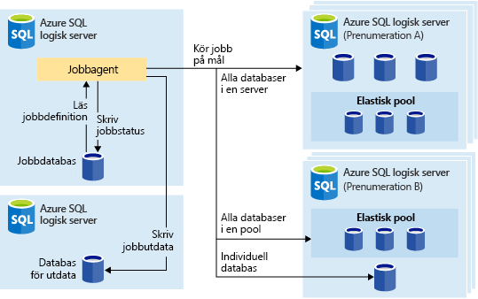
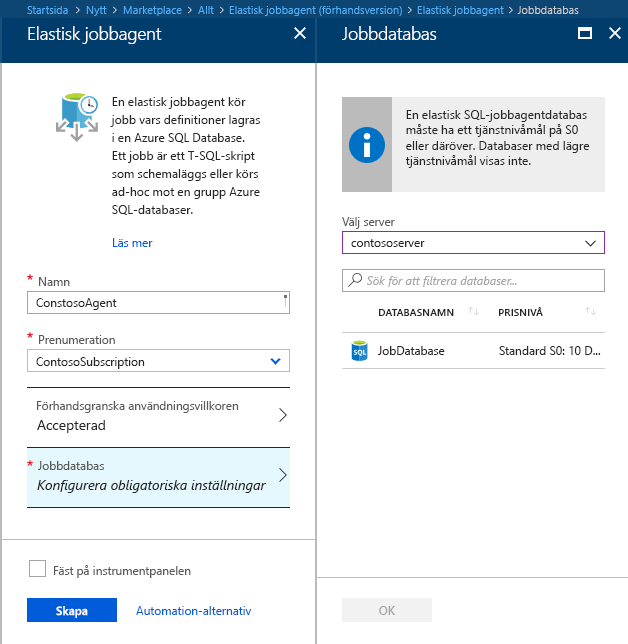
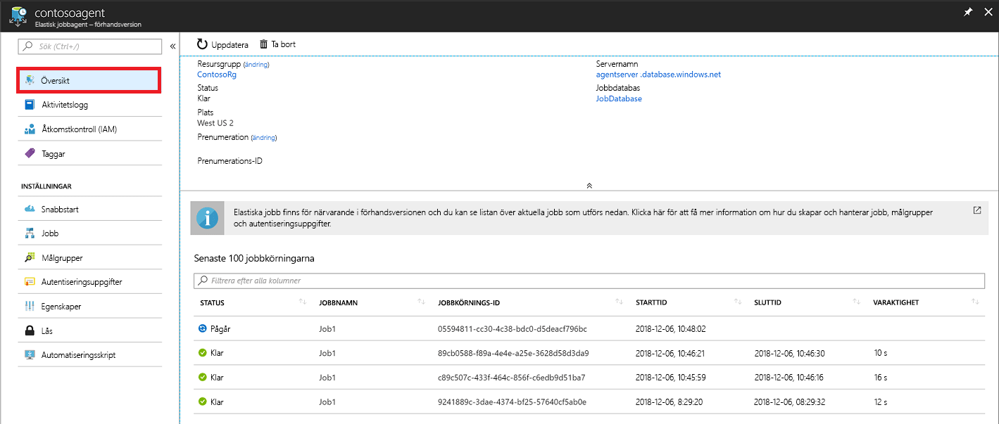
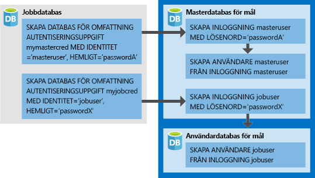

# <a name="manage-groups-of-databases-with-elastic-database-jobs"></a>Hantera grupper av databaser med Elastic Database-jobb

**Elastic Database-jobb** ger möjligheten att köra ett eller flera T-SQL-skript parallellt, över ett stort antal databaser enligt ett schema eller på begäran.

**Köra jobb mot en valfri kombination av databaser**: en eller flera enskilda databaser, alla databaser på en server, alla databaser i en elastisk pool eller en shardkarta med den ytterligare flexibiliteten att inkludera eller exkludera en viss databas. **Jobb kan köras över flera servrar och flera pooler och kan även köras mot databaser i olika prenumerationer.** Servrar och pooler räknas upp dynamiskt vid körning. Därför körs jobben mot alla databaser som finns i målgruppen vid tidpunkten för körningen.

Följande bild visar en jobbagent som kör flera jobb över olika typer av målgrupper:




## <a name="why-use-elastic-jobs"></a>Varför använda elastiska jobb?

### <a name="manage-many-databases"></a>Hantera många databaser

- Schemalägg administrativa uppgifter som körs varje veckodag, efter kontorstid osv.
- Distribuera schemaändringar, hantering av autentiseringsuppgifter, insamling av prestandadata eller insamling av telemetri för klientorganisation (kund). Uppdatera referensdata (information som är gemensam över alla databaser).
- Bygg om index för att förbättra frågeprestandan. Konfigurera jobb att köras över en samling databaser regelbundet, till exempel vid tidpunkter för låg belastning.
- Samla in frågeresultat från en uppsättning databaser till en central tabell regelbundet. Prestandafrågor kan kontinuerligt köras och konfigureras för att utlösa ytterligare åtgärder som ska utföras.

### <a name="collect-data-for-reporting"></a>Samla in data för rapportering

- Sammanställ data från en samling Azure SQL-databaser till en enskild måltabell.
- Kör databearbetningsfrågor med längre körningstid över en stor uppsättning databaser, till exempel insamling av kundtelemetri. Resultaten samlas till en enskild måltabell för ytterligare analys.

### <a name="reduce-overhead"></a>Minska omkostnader

- Vanligtvis måste du ansluta till varje databas separat för att köra Transact-SQL-instruktioner eller utföra andra administrativa uppgifter. Ett jobb hanterar uppgiften att logga in på varje databas i målgruppen. Du definierar, underhåller och bevarar även Transact-SQL-skript som ska köras över en grupp Azure SQL-databaser.

### <a name="accounting"></a>Redovisning

- Jobb loggar status för körning för varje databas. Du kan även få automatiska försök på nytt när fel uppstår.

### <a name="flexibility"></a>Flexibilitet

- Definiera anpassade grupper av Azure SQL-databaser och definiera scheman för att köra ett jobb.


## <a name="elastic-job-components"></a>Elastiska jobbkomponenter

|Komponent  | Beskrivning (mer information finns nedanför tabellen) |
|---------|---------|
|[**Elastisk jobbagent**](#elastic-job-agent) |  Den Azure-resurs som du skapar för att köra och hantera jobb.   |
|[**Jobbdatabas**](#job-database)    |    En Azure SQL-databas som jobbagenten använder för att lagra jobbrelaterade data, jobbdefinitioner osv.      |
|[**Målgrupp**](#target-group)      |  Den uppsättning servrar, pooler, databaser och shardkartor som ett jobb ska köras mot.       |
|[**Jobb**](#job)  |  Ett jobb är en arbetsprocess som består av ett eller flera [jobbsteg](#job-step). Jobbsteg anger vilket T-SQL-skript som ska köras samt annan information som krävs för att köra skriptet.  |


### <a name="elastic-job-agent"></a>Elastisk jobbagent

En agent för elastiska jobb är Azure-resursen för att skapa, köra och hantera jobb. Den elastiska jobbagenten är en Azure-resurs som du skapar i portalen ([PowerShell](elastic-jobs-powershell.md) och REST stöds också). 

För att skapa en **elastisk jobbagent** krävs en befintlig SQL-databas. Agenten konfigurerar den här befintliga databasen som [*jobbdatabasen*](#job-database).

Det är kostnadsfritt att skapa en elastisk jobbagent. Jobbdatabasen debiteras samma kostnad som övriga SQL-databaser.

### <a name="job-database"></a>Jobbdatabas

*Jobbdatabasen* används för att definiera jobb och spåra status och historik för jobbkörningar. *Jobbdatabasen* används också för att lagra agentmetadata, loggar, resultat och jobbdefinitioner och innehåller även många användbara lagrade procedurer och andra databasobjekt för att skapa, köra och hantera jobb med hjälp av T-SQL.

För den aktuella förhandsversionen krävs en befintlig Azure SQL-databas (S0 eller senare) för att skapa en elastisk jobbagent.

*Jobbdatabasen* behöver inte bokstavligt talat vara ny, men den ska vara ren och tom och på S0 eller en högre tjänstnivå. Den rekommenderade tjänstenivån för *jobbdatabasen* är S1 eller högre, men i praktiken beror det på prestandabehoven för dina jobb: antal jobbsteg samt hur många gånger och hur ofta jobb körs. Till exempel kan en S0-databas vara tillräcklig för en jobbagent som kör några jobb per timme, men om det körs ett jobb varje minut kan prestandan bli för låg. I det fallet vore det förmodligen bättre att ha en högre tjänstenivå.


#### <a name="job-database-permissions"></a>Behörigheter för jobbdatabas

När en jobbagent skapas så skapas ett schema, tabeller och en roll som heter *jobs_reader* i *jobbdatabasen*. Rollen skapas med följande behörigheter och är utformad för att ge administratörer mer detaljerad åtkomstkontroll för jobbövervakning:


|Rollnamn  |'jobs'-schemabehörigheter  |'jobs_internal'-schemabehörigheter  |
|---------|---------|---------|
|**jobs_reader**     |    VÄLJ     |    Inget     |

> [!IMPORTANT]
> Tänk på säkerhetsaspekterna innan du beviljar åtkomst till *jobbdatabasen* som en databasadministratör. En användare som vill vålla skada och får behörigheter att skapa eller redigera jobb skulle kunna skapa eller redigera ett jobb som använder lagrade autentiseringsuppgifter för att ansluta till en databas som står under en sådan användares kontroll. Användaren skulle då kunna ta reda på lösenordet i autentiseringsuppgifterna.


### <a name="target-group"></a>Målgrupp

En *målgrupp* definierar den uppsättning databaser som ett jobbsteg ska köras mot. En målgrupp kan innehålla vilket antal och vilken kombination som helst av följande:

- **Azure SQL server** – om en server anges utgör alla databaser som finns i servern vid tidpunkten för jobbkörningen en del av gruppen. Huvuddatabasens autentiseringsuppgifter måste anges så att gruppen kan räknas upp och uppdateras före jobbkörning.
- **Elastisk pool** – om en elastisk pool anges utgör alla databaser som finns i den elastiska poolen vid tidpunkten för jobbkörningen en del av gruppen. Vad gäller en server måste huvuddatabasens autentiseringsuppgifter anges så att gruppen kan uppdateras före jobbkörningen.
- **Enskild databas** – ange en eller flera enskilda databaser som ska utgöra en del av gruppen.
- **Shardkarta** – databaser för en shardkarta.

> [!TIP]
> Vid tidpunkten för jobbkörning omvärderar *dynamisk uppräkning* uppsättningen databaser i de målgrupper som inkluderar servrar eller pooler. Dynamisk uppräkning ser till att **jobb körs över alla databaser som finns i servern eller poolen vid tidpunkten för jobbkörningen**. Omvärdering av lista över databaser vid körning är särskilt användbart för scenarier där pool- eller servermedlemskap ändras ofta.


Pooler och enskilda databaser kan anges som inkluderade eller exkluderade från gruppen. På så sätt går det att skapa en målgrupp med valfri kombination av databaser. Till exempel kan du lägga till en server till en målgrupp men exkludera specifika databaser i den elastiska poolen (eller exkludera en hel elastisk pool).

En målgrupp kan inkludera databaser i flera prenumerationer och över flera regioner. Observera att körningar mellan regioner har en högre fördröjning än körningar inom samma region.


### <a name="job"></a>Jobb

Ett *jobb* är en arbetsprocess som körs enligt ett schema eller som ett engångsjobb. Jobb består att ett eller flera *jobbsteg*.

#### <a name="job-step"></a>Jobbsteg

Varje jobbsteg anger ett T-QSL-skript som ska köras, en eller flera målgrupper som T-SQL-skriptet ska köras mot samt de autentiseringsuppgifter som jobbagenten behöver för att ansluta till måldatabasen. Varje jobbsteg har anpassade principer för tidsgränser och försök på nytt, och kan valfritt ange utdataparametrar.

#### <a name="job-output"></a>Jobbutdata

Resultatet av stegen i ett jobb på varje måldatabas registreras i detalj, och skriptutdata kan samlas in i en specifik tabell. Du kan ange en databas för att spara alla data som returneras från ett jobb.

#### <a name="job-history"></a>Jobbhistorik

Jobbkörningshistorik sparas i *jobbdatabasen*. Ett systemrensningsjobb rensar körningshistorik som är äldre än 45 dagar. Om du vill ta bort historik som är äldre än 45 dagar anropar du den lagrade proceduren **sp_purge_history** i *jobbdatabasen*.

## <a name="workflow-to-create-configure-and-manage-jobs"></a>Arbetsflöde för att skapa, konfigurera och hantera jobb

### <a name="create-and-configure-the-agent"></a>Skapa och konfigurera agenten

1. Skapa eller identifiera en tom SQL-databas på S0-nivå eller högre. Den här används som *jobbdatabas* vid skapande av den elastiska jobbagenten.
2. Skapa en elastisk jobbagent i [portalen](https://portal.azure.com/#create/Microsoft.SQLElasticJobAgent) eller med [PowerShell](elastic-jobs-powershell.md#create-the-elastic-job-agent).

   

### <a name="create-run-and-manage-jobs"></a>Skapa, kör och hantera jobb

1. Skapa autentiseringsuppgifter för jobbkörning i *jobbdatabasen* med [PowerShell](elastic-jobs-powershell.md#create-job-credentials-so-that-jobs-can-execute-scripts-on-its-targets) eller [T-SQL](elastic-jobs-tsql.md#create-a-credential-for-job-execution).
2. Definiera målgruppen (de databaser som du vill köra jobbet mot) med [PowerShell](elastic-jobs-powershell.md#define-the-target-databases-you-want-to-run-the-job-against) eller [T-SQL](elastic-jobs-tsql.md#create-a-target-group-servers).
3. Skapa autentiseringsuppgifter för en jobbagent i varje databas som jobbet ska köras mot [(lägg till användaren (eller rollen) till varje databas i gruppen)](https://docs.microsoft.com/azure/sql-database/sql-database-control-access). Exempel finns i [PowerShell-självstudien](elastic-jobs-powershell.md#create-job-credentials-so-that-jobs-can-execute-scripts-on-its-targets).
4. Skapa ett jobb med [PowerShell](elastic-jobs-powershell.md#create-a-job) eller [T-SQL](elastic-jobs-tsql.md#deploy-new-schema-to-many-databases).
5. Lägg till jobbsteg med [PowerShell](elastic-jobs-powershell.md#create-a-job-step) eller [T-SQL](elastic-jobs-tsql.md#deploy-new-schema-to-many-databases).
6. Kör ett jobb med [PowerShell](elastic-jobs-powershell.md#run-the-job) eller [T-SQL](elastic-jobs-tsql.md#begin-ad-hoc-execution-of-a-job).
7. Övervaka jobbkörningsstatus med portalen, [PowerShell](elastic-jobs-powershell.md#monitor-status-of-job-executions) eller [T-SQL](elastic-jobs-tsql.md#monitor-job-execution-status).

   

## <a name="credentials-for-running-jobs"></a>Autentiseringsuppgifter för att köra jobb

Jobbet använder [databasbegränsade autentiseringsuppgifter](/sql/t-sql/statements/create-database-scoped-credential-transact-sql) för att ansluta till de databaser som anges av målgruppen vid körning. Om en målgrupp innehåller servrar eller pooler används de här databasbegränsade autentiseringsuppgifterna för att ansluta till huvuddatabasen för att räkna upp de tillgängliga databaserna.

Att konfigurera rätt autentiseringsuppgifter för att köra ett jobb kan vara något förvirrande, så tänk på följande punkter:

- De databasbegränsade autentiseringsuppgifterna måste skapas i *jobbdatabasen*.
- **Alla måldatabaser måste ha en inloggning med [tillräcklig behörighet](https://docs.microsoft.com/sql/relational-databases/security/permissions-database-engine) för att slutföra jobbet** (jobuser i diagrammet nedan).
- Autentiseringsuppgifter förväntas återanvändas över olika jobb, och autentiseringsuppgifternas lösenord krypteras och säkras från användare som endast har skrivskyddad åtkomst till jobbobjekt.

Följande bild är utformad för att underlätta förståelse och konfiguration av rätt autentiseringsuppgifter för jobb. **Kom ihåg att skapa användaren i varje databas (alla *målanvändardatabaser*) som jobbet behöver köras mot**.



## <a name="security-best-practices"></a>Metodtips för säkerhet

Några metodtips för att arbeta med elastiska jobb:

- Begränsa användningen av API:er till betrodda personer.
- Autentiseringsuppgifter ska ha minsta möjliga behörigheter som krävs för att utföra jobbsteget. Mer information finns i [Authorization and Permissions SQL Server](https://docs.microsoft.com/dotnet/framework/data/adonet/sql/authorization-and-permissions-in-sql-server) (Auktorisering och behörigheter i SQL Server).
- Vid användning av server- och/eller poolmålgruppsmedlem rekommenderas det starkt att du skapar separata autentiseringsuppgifter med behörigheter på huvuddatabasen för att visa/lista databaser som används för att expandera databaslistan över servrar och pooler före jobbkörning.


## <a name="agent-performance-capacity-and-limitations"></a>Agentprestanda, kapacitet och begränsningar

Elastiska jobb använder minimalt med beräkningsresurser medan de väntar på att jobb med lång körningstid blir klara.

Beroende på storleken på målgruppen med databaser och önskad körningstid för ett jobb (antalet samtidiga arbetare) kräver agenten olika mängder beräkningsresurser och prestanda från *jobbdatabasen* (ju fler mål och ju högre antal jobb, desto större beräkningsresurser krävs det).

För tillfället är förhandsgranskningen begränsad till 100 samtidiga jobb.

### <a name="prevent-jobs-from-reducing-target-database-performance"></a>Förhindra jobb från att minska måldatabasens prestanda

För att resurser inte ska överbelastas vid körning av jobb mot databaser i en elastisk SQL-pool kan jobb konfigureras för att begränsa antalet databaser som ett jobb kan köras mot samtidigt.

##  <a name="differences-between-elastic-jobs-and-sql-server-agent"></a>Skillnader mellan elastiska jobb och SQL Server Agent

Det finns vissa skillnader mellan SQL Server Agent (tillgängligt lokalt och som en del av SQL Database Managed Instance) och Azure SQL Database Elastic Job-agenten (finns nu tillgänglig för SQL Database och SQL Data Warehouse).


|  |Elastiska jobb  |SQL Server Agent |
|---------|---------|---------|
|Omfång     |  Vilket antal som helst av Azure SQL-databaser och/eller informationslagerdatabaser i samma Azure-moln som jobbagenten. Målen kan finnas i olika logiska servrar, prenumerationer och/eller regioner. <br><br>Målgrupper kan bestå av enskilda databaser eller informationslagerdatabaser, eller alla databaser i en server, pool eller shardkarta (dynamiskt uppräknade vid jobbkörningen). | Valfri enskild databas i samma SQL Server-instans som SQL-agenten. |
|API:er och verktyg som stöds     |  Portal, PowerShell, T-SQL, Azure Resource Manager      |   T-SQL, SQL Server Management Studio (SSMS)     |


## <a name="best-practices-for-creating-jobs"></a>Metodtips för att skapa jobb

### <a name="idempotent-scripts"></a>Idempotent-skript
T-SQL-skripten för ett jobb måste vara [idempotent](https://en.wikipedia.org/wiki/Idempotence). **Idempotent** innebär att om skriptet lyckas och körs igen, så erhålls samma resultat. Ett skript kan misslyckas på grund av tillfälliga nätverksproblem. I så fall försöker jobbet automatiskt köra skriptet på nytt ett förinställt antal gånger innan det ger upp. Ett idempotent-skript ger samma resultat även om det har lyckats köra två eller fler gånger.

En enkel metod är att testa om ett objekt finns innan det skapas.


```sql
IF NOT EXIST (some_object)
    -- Create the object
    -- If it exists, drop the object before recreating it.
```

På liknande sätt måste ett skript kunna lyckas köra genom att logiskt testa och motverka eventuella tillstånd som det hittar.


## <a name="next-steps"></a>Nästa steg

- [Skapa och hantera elastiska jobb med PowerShell](elastic-jobs-powershell.md)
- [Skapa och hantera elastiska jobb med Transact-SQL (T-SQL)](elastic-jobs-tsql.md)