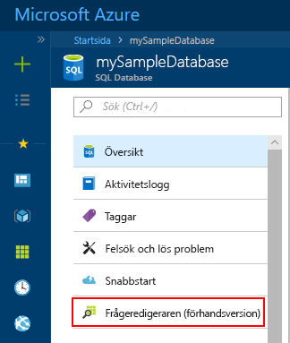
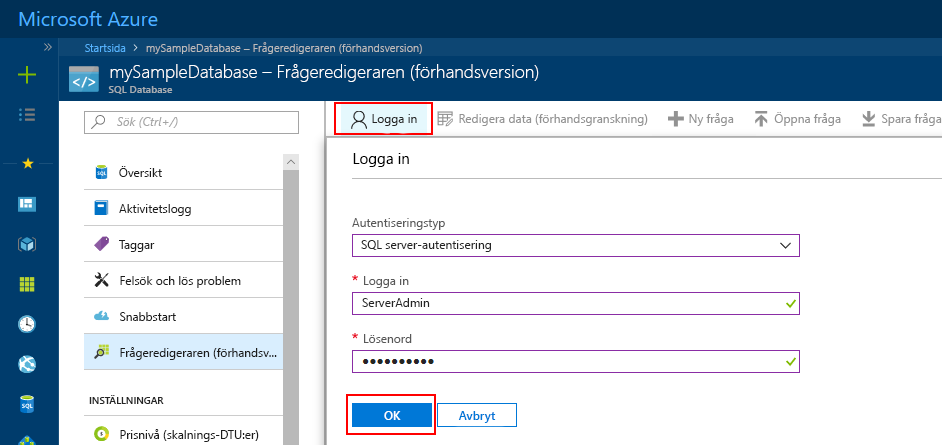
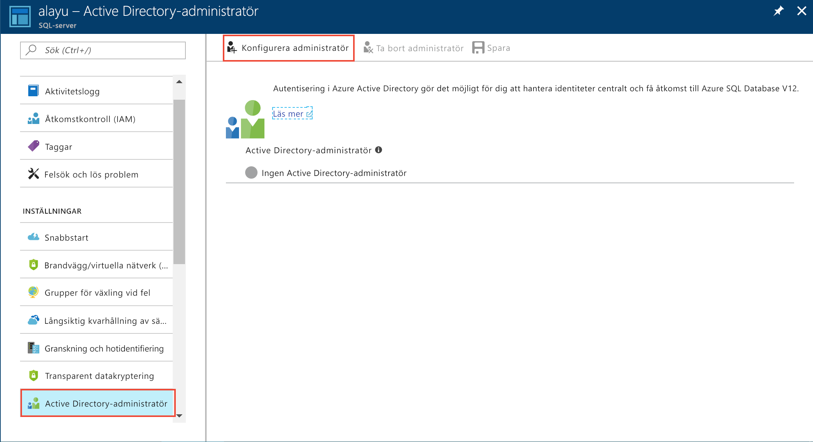
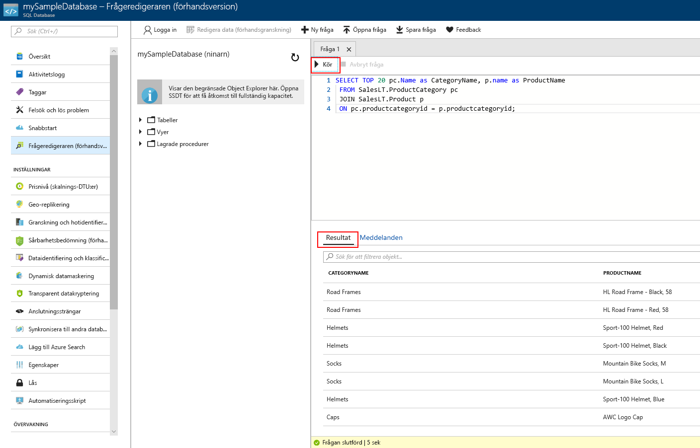

# <a name="azure-portal-use-the-sql-query-editor-to-connect-and-query-data"></a>Azure Portal: Använd SQL-frågeredigeraren för att ansluta och fråga efter data

SQL-frågeredigeraren är ett frågeverktyg för webbläsare och ett effektivt och enkelt sätt att köra SQL-frågor i Azure SQL Database och Azure SQL Data Warehouse utan att lämna Azure Portal. Den här snabbstarten visar hur du ansluter till en SQL-databas med frågeredigeraren och sedan använder Transact-SQL-uttryck för att fråga, infoga, uppdatera och ta bort data i databasen.

## <a name="prerequisites"></a>Nödvändiga komponenter

Den här snabbstarten använder resurser som har skapats i någon av dessa snabbstarter:

[!INCLUDE [prerequisites-create-db](../../includes/sql-database-connect-query-prerequisites-create-db-includes.md)]

> [!NOTE]
> Kontrollera att alternativet ”Tillåt åtkomst till Azure-tjänster” är inställt på ”PÅ” i inställningarna för SQL Server-brandväggen. Det här alternativet ger SQL-frågeredigeraren åtkomst till dina databaser och datalager.

## <a name="log-in-to-the-azure-portal"></a>Logga in på Azure Portal

Logga in på [Azure-portalen](https://portal.azure.com/).


## <a name="connect-using-sql-authentication"></a>Anslut med SQL-autentisering

1. Klicka på **SQL-databaser** på den vänstra menyn och klicka på databasen som du vill fråga.

2. På SQL Database-sidan för databasen letar du reda på och klickar på **Frågeutforskaren (förhandsversion)** på den vänstra menyn.

    

3. Klicka på **Logga in** och markera sedan **SQL-serverautentisering** när du blir uppmanad. Ange sedan inloggning och lösenord för serveradministratör som du angav när du tidigare skapade databasen.

    

4. Klicka på **OK för att logga in**.


## <a name="connect-using-azure-ad"></a>Anslut med hjälp av Azure AD

Genom att konfigurera en Active Directory-administratör kan du använda en enda identitet för att logga in på Azure Portal och SQL-databasen. Följ stegen nedan för att konfigurera Active Directory-administratör för SQL-servern som du skapade.

> [!NOTE]
> E-postkonton (till exempel outlook.com, hotmail.com, live.com, gmail.com, yahoo.com) stöds inte ännu som Active Directory-administratörer. Se till att välja en användare som antingen skapades internt i Azure Active Directory eller externt till Azure Active Directory.

1. Välj **SQL-servrar** i den vänstra menyn och välj din SQL-server från listan över servrar.

2. Välj inställningen **Active Directory-administratör** från inställningsmenyn i din SQL-server.

3. På bladet Active Directory-administratör klickar du på kommandot **Konfigurera administratör** och väljer användare eller grupp som kommer att vara Active Directory-administratör.

    

4. Längst upp på bladet Active Directory-administratör klickar du på kommandot **Spara** för att ange Active Directory-administratör.

Gå till SQL-databasen som du vill fråga och klicka på **Datautforskaren (förhandsversion)** på den vänstra menyn. Sidan för Datautforskaren öppnas och ansluter automatiskt till databasen.


## <a name="run-query-using-query-editor"></a>Kör frågan i frågeredigeraren

När du är autentiserad skriver du följande fråga i fönstret för frågeredigeraren för att fråga efter de 20 bästa produkterna efter kategori.

```sql
 SELECT TOP 20 pc.Name as CategoryName, p.name as ProductName
 FROM SalesLT.ProductCategory pc
 JOIN SalesLT.Product p
 ON pc.productcategoryid = p.productcategoryid;
```

Klicka på **Kör** och granska frågeresultaten i fönstret **Resultat**.



## <a name="insert-data-using-query-editor"></a>Infoga data med frågeredigeraren

Använd följande kod för att infoga en ny produkt i tabellen SalesLT.Product med Transact-SQL-instruktionen [INSERT](https://msdn.microsoft.com/library/ms174335.aspx).

1. I frågefönstret ersätter du den föregående frågan med följande fråga:

   ```sql
   INSERT INTO [SalesLT].[Product]
           ( [Name]
           , [ProductNumber]
           , [Color]
           , [ProductCategoryID]
           , [StandardCost]
           , [ListPrice]
           , [SellStartDate]
           )
     VALUES
           ('myNewProduct'
           ,123456789
           ,'NewColor'
           ,1
           ,100
           ,100
           ,GETDATE() );
   ```

2. I verktygsfältet klickar du på **Kör**för att infoga en ny rad i Product-tabellen.

## <a name="update-data-using-query-editor"></a>Uppdatera data med frågeredigeraren

Med följande kod uppdaterar du den nya produkt du tidigare lade till med Transact-SQL-instruktionen [UPDATE](https://msdn.microsoft.com/library/ms177523.aspx).

1. I frågefönstret ersätter du den föregående frågan med följande fråga:

   ```sql
   UPDATE [SalesLT].[Product]
   SET [ListPrice] = 125
   WHERE Name = 'myNewProduct';
   ```

2. I verktygsfältet trycker du på **Kör** för att uppdatera den angivna raden i Product-tabellen.

## <a name="delete-data-using-query-editor"></a>Ta bort data med frågeredigeraren

Med följande kod tar du bort den nya produkt du tidigare lade till med Transact-SQL-instruktionen [DELETE](https://msdn.microsoft.com/library/ms189835.aspx).

1. I frågefönstret ersätter du den föregående frågan med följande fråga:

   ```sql
   DELETE FROM [SalesLT].[Product]
   WHERE Name = 'myNewProduct';
   ```

2. I verktygsfältet trycker du på **Kör** för att ta bort angiven rad i Product-tabellen.


## <a name="query-editor-considerations"></a>Överväganden för frågeredigeraren

Det finns några saker du behöver veta när du arbetar med frågeredigeraren:

1. Kontrollera att du har ställt in alternativet ”Tillåt åtkomst till Azure-tjänster” på ”PÅ” i inställningarna för Azure SQL Server-brandväggen. Det här alternativet ger SQL-frågeredigeraren åtkomst till dina SQL-databaser och datalager.

2. Om SQL-servern finns i ett virtuellt nätverk, kan frågeredigeraren inte användas för att fråga databaser på den servern.

3. Genom att trycka på F5 uppdateras sidan för frågeredigeraren och frågan som arbetades på går förlorad. Använd knappen Kör i verktygsfältet för att köra frågor.

4. Frågeredigeraren stöder inte anslutning till huvud-DB

5. Det finns en 5 minuters timeout för frågekörning.

6. Administratörsinloggning i Azure Active Directory fungerar inte med konton som har tvåfaktorautentisering aktiverat.

7. E-postkonton (till exempel outlook.com, hotmail.com, live.com, gmail.com, yahoo.com) stöds inte ännu som Active Directory-administratörer. Se till att välja en användare som antingen skapades internt i Azure Active Directory eller externt till Azure Active Directory

8. Frågeredigeraren stöder endast cylindriska projektioner för geografidatatyper.

9. Det finns inte stöd för IntelliSense för databastabeller och vyer. Men redigeraren har stöd för automatisk komplettering av namn som redan har skrivits.


## <a name="next-steps"></a>Nästa steg

- Se [Transact-SQL differences in SQL database](sql-database-transact-sql-information.md) (Transact-SQL-skillnader i SQL Database) för att lära dig om Transact-SQL som stöds i Azure SQL-databaser.
