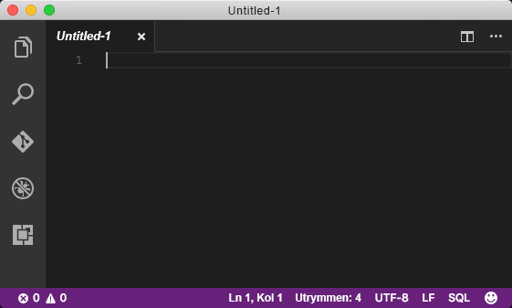
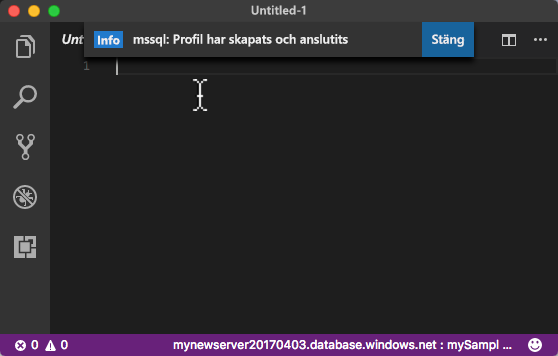
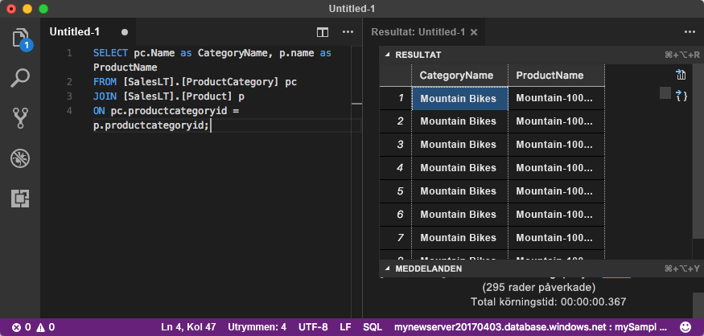

# <a name="azure-sql-database-use-visual-studio-code-to-connect-and-query-data"></a>Azure SQL Database: Använd Visual Studio Code för att ansluta och skicka frågor till data

[Visual Studio Code](https://code.visualstudio.com/docs) är en grafisk kodredigerare för Linux, macOS och Windows som stöder tillägg, inklusive [mssql-tillägget](https://aka.ms/mssql-marketplace) för frågor till Microsoft SQL Server, Azure SQL Database och SQL Data Warehouse. Den här snabbstarten visar hur du använder Visual Studio Code för att ansluta till en Azure SQL-databas och sedan använder Transact-SQL-uttryck för att fråga, infoga, uppdatera och ta bort data i databasen.

## <a name="prerequisites"></a>Nödvändiga komponenter

Den här snabbstarten använder resurser som har skapats i någon av dessa snabbstarter:

[!INCLUDE [prerequisites-create-db](../../includes/sql-database-connect-query-prerequisites-create-db-includes.md)]

#### <a name="install-vs-code"></a>Installera VS-kod

Innan du börjar bör du kontrollera att du har installerat den senaste versionen av [Visual Studio Code](https://code.visualstudio.com/Download) och har läst in [mssql-tillägget](https://aka.ms/mssql-marketplace). Installationsanvisningar finns i [Installera VS Code](https://docs.microsoft.com/sql/linux/sql-server-linux-develop-use-vscode#install-vs-code) för mssql-tillägget och [mssql för Visual Studio Code](https://marketplace.visualstudio.com/items?itemName=ms-mssql.mssql). 

## <a name="configure-vs-code"></a>Konfigurera VS-kod 

### <a name="mac-os"></a>**Mac OS**
För macOS måste du installera OpenSSL, som är ett förhandskrav för den .Net Core som används i mssql-tillägget. Ange följande kommandon för att installera **brew** och **OpenSSL**. 

```bash
ruby -e "$(curl -fsSL https://raw.githubusercontent.com/Homebrew/install/master/install)"
brew update
brew install openssl
mkdir -p /usr/local/lib
ln -s /usr/local/opt/openssl/lib/libcrypto.1.0.0.dylib /usr/local/lib/
ln -s /usr/local/opt/openssl/lib/libssl.1.0.0.dylib /usr/local/lib/
```

### <a name="linux-ubuntu"></a>**Linux (Ubuntu)**

Ingen särskild konfiguration behövs.

### <a name="windows"></a>**Windows**

Ingen särskild konfiguration behövs.

## <a name="sql-server-connection-information"></a>Anslutningsinformation för en SQL-server

Skaffa den anslutningsinformation du behöver för att ansluta till Azure SQL Database. Du behöver det fullständiga servernamnet, databasnamnet och inloggningsinformationen i nästa procedurer.

[!INCLUDE [prerequisites-server-connection-info](../../includes/sql-database-connect-query-prerequisites-server-connection-info-includes.md)]

## <a name="set-language-mode-to-sql"></a>Ange språkläge till SQL

Ställ in språkläget på **SQL** i Visual Studio Code för att aktivera mssql-kommandon och T-SQL IntelliSense.

1. Öppna ett Visual Studio Code-fönster. 

2. Klicka på **Oformaterad text** nere till höger i statusfältet.
3. Listrutan **Select language mode** (Välj språkläge) öppnas. Skriv **SQL**, tryck på **ENTER** och ange språkläge för SQL. 

   

## <a name="connect-to-your-database"></a>Ansluta till databasen

Använd Visual Studio Code för att upprätta en anslutning till Azure SQL Database-servern.

> [!IMPORTANT]
> Kontrollera att du har din server, databas och inloggningsinformation redo innan du fortsätter. Om du ändrar fokus från Visual Studio-koden när du har börjat ange information om anslutningsprofilen måste du börja om med att skapa anslutningsprofilen.
>

1. I VS Code trycker du på **CTRL+SHIFT+P** (eller **F1**) för att öppna kommandopaletten.

2. Skriv in **sqlcon** och tryck på **RETUR**.

3. Tryck på **RETUR** för att välja **Create Connection Profile** (Skapa anslutningsprofil). Detta skapar en anslutningsprofil för SQL Server-instansen.

4. Följ anvisningarna för att ange anslutningsegenskaper för den nya anslutningsprofilen. När du har angett ett värde trycker du på **RETUR** för att fortsätta. 

   | Inställning       | Föreslaget värde | Beskrivning |
   | ------------ | ------------------ | ------------------------------------------------- | 
   | **Servernamn | Fullständigt kvalificerat servernamn | Namnet ska vara ungefär så här: **mynewserver20170313.database.windows.net**. |
   | **Databasnamn** | mySampleDatabase | Namnet på databasen som användaren ska ansluta till. |
   | **Autentisering** | SQL-inloggning| SQL-autentisering är den enda autentiseringstypen som vi har konfigurerat i den här kursen. |
   | **Användarnamn** | Serveradministratörskontot | Detta är det konto som du angav när du skapade servern. |
   | **Lösenord (SQL-inloggning)** | Lösenordet för serveradministratörskontot | Detta är det lösenord som du angav när du skapade servern. |
   | **Spara lösenordet?** | Ja eller nej | Välj Ja om du inte vill ange lösenordet varje gång. |
   | **Ange ett namn för den här profilen** | Ett anslutningsprofilnamn, t.ex. **mySampleDatabase** | Ett sparat profilnamn förbättrar anslutningen på efterföljande inloggningar. | 

5. Tryck på tangenten **ESC** för att stänga meddelandet som informerar om att profilen har skapats och anslutits.

6. Kontrollera anslutningen i statusfältet.

   

## <a name="query-data"></a>Frågedata

Använd följande kod för att söka efter de 20 främsta produkterna med Transact-SQL-instruktionen [SELECT](https://msdn.microsoft.com/library/ms189499.aspx).

1. I fönstret **Editor** anger du följande fråga i frågefönstret:

   ```sql
   SELECT pc.Name as CategoryName, p.name as ProductName
   FROM [SalesLT].[ProductCategory] pc
   JOIN [SalesLT].[Product] p
   ON pc.productcategoryid = p.productcategoryid;
   ```

2. Tryck på **CTRL+SKIFT+E** att hämta data från Product- och ProductCategory-tabeller.

    

## <a name="insert-data"></a>Infoga data

Använd följande kod för att infoga en ny produkt i tabellen SalesLT.Product med Transact-SQL-instruktionen [INSERT](https://msdn.microsoft.com/library/ms174335.aspx).

1. I fönstret **Editor** tar du bort föregående fråga och skriver in följande fråga:

   ```sql
   INSERT INTO [SalesLT].[Product]
           ( [Name]
           , [ProductNumber]
           , [Color]
           , [ProductCategoryID]
           , [StandardCost]
           , [ListPrice]
           , [SellStartDate]
           )
     VALUES
           ('myNewProduct'
           ,123456789
           ,'NewColor'
           ,1
           ,100
           ,100
           ,GETDATE() );
   ```

2. Tryck på **CTRL+SKIFT+E** för att infoga en ny rad i Product-tabellen.

## <a name="update-data"></a>Uppdatera data

Med följande kod uppdaterar du den nya produkt du tidigare lade till med Transact-SQL-instruktionen [UPDATE](https://msdn.microsoft.com/library/ms177523.aspx).

1.  I fönstret **Editor** tar du bort föregående fråga och skriver in följande fråga:

   ```sql
   UPDATE [SalesLT].[Product]
   SET [ListPrice] = 125
   WHERE Name = 'myNewProduct';
   ```

2. Tryck på **CTRL+SKIFT+E** för att uppdatera angiven rad i Product-tabellen.

## <a name="delete-data"></a>Ta bort data

Med följande kod tar du bort den nya produkt du tidigare lade till med Transact-SQL-instruktionen [DELETE](https://docs.microsoft.com/sql/t-sql/statements/delete-transact-sql).

1. I fönstret **Editor** tar du bort föregående fråga och skriver in följande fråga:

   ```sql
   DELETE FROM [SalesLT].[Product]
   WHERE Name = 'myNewProduct';
   ```

2. Tryck på **CTRL+SHIFT+E** för att ta bort angiven rad i Product-tabellen.

## <a name="next-steps"></a>Nästa steg

- Om du vill ansluta och fråga med SQL Server Management Studio kan du läsa [Anslut och fråga med SSMS](sql-database-connect-query-ssms.md).
- Information om hur du ansluter och frågar med hjälp av Azure Portal finns i [Ansluta och fråga med Azure Portal SQL-frågeredigeraren](sql-database-connect-query-portal.md).
- En artikel från MSDN-magazine om hur du använder Visual Studio Code finns i [Skapa en IDE-databas med MSSQL-tillägget blogginlägg](https://msdn.microsoft.com/magazine/mt809115).
