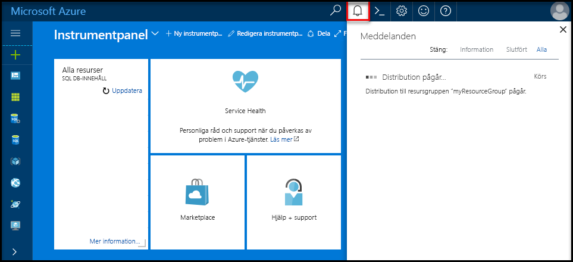
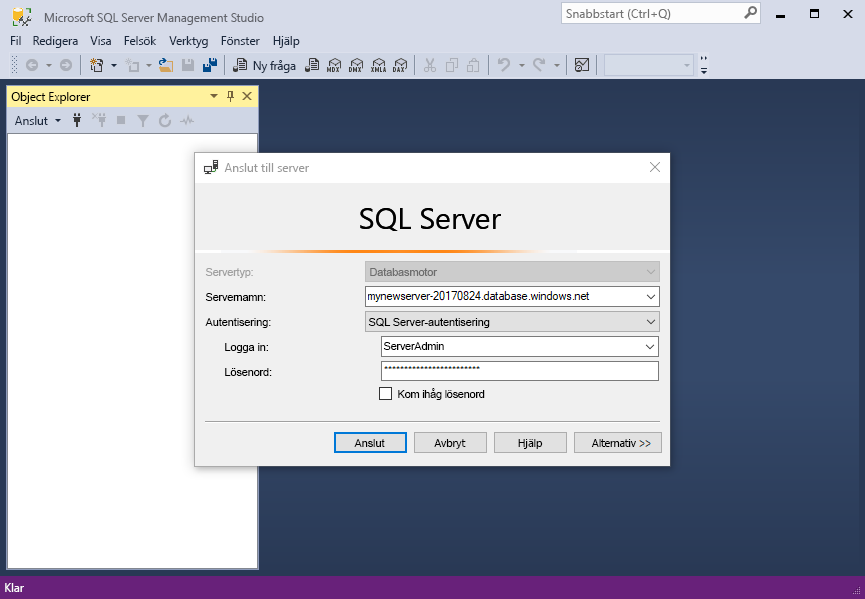
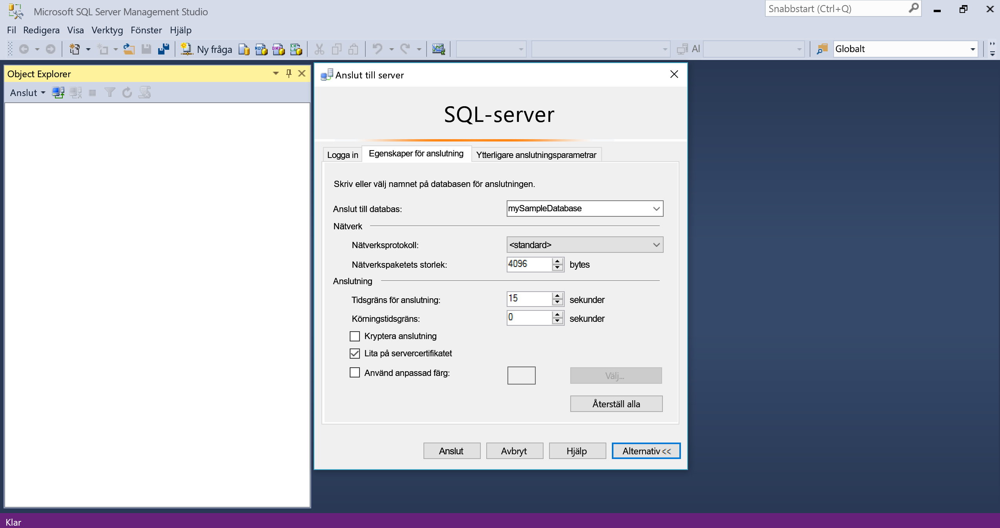
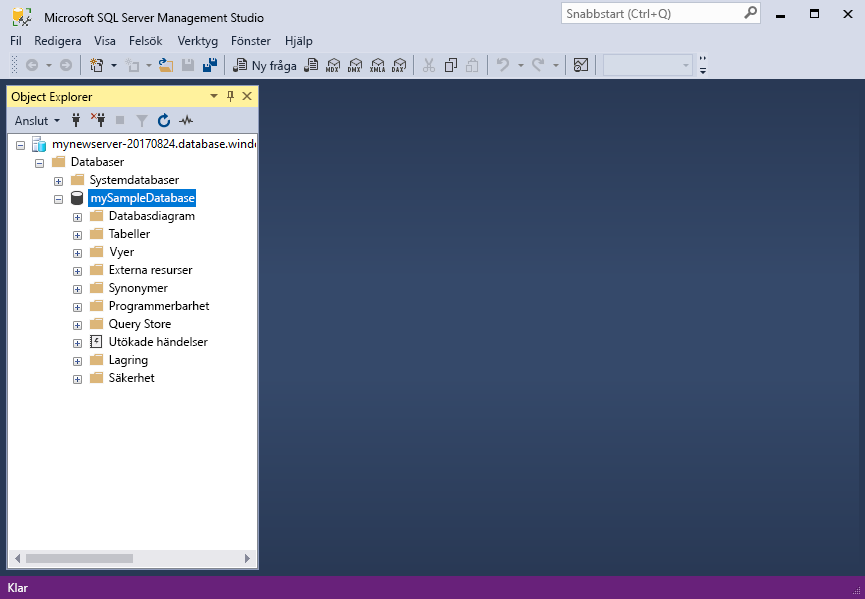

# <a name="tutorial-design-your-first-azure-sql-database-using-ssms"></a>Självstudier: Skapa din första Azure SQL-databas med SSMS

Azure SQL Database är en relationsdatabas-som-tjänst (DBaaS) som bygger på Microsoft Cloud (Azure). I de här självstudierna får du lära dig att använda Azure-portalen och [SQL Server Management Studio](https://msdn.microsoft.com/library/ms174173.aspx) (SSMS) för att: 

> [!div class="checklist"]
> * Skapa en databas på Azure Portal*
> * Skapade en brandväggsregel på servernivå på Azure-portalen
> * Ansluta till databasen med SSMS
> * Skapa tabeller med SSMS
> * Massinläsa data med BCP
> * Fråga efter dessa data med SSMS

Om du inte har en Azure-prenumeration kan du [skapa ett kostnadsfritt konto ](https://azure.microsoft.com/free/) innan du börjar.

   >[!NOTE]
   > I den här självstudiekursen använder vi [den DTU-baserade inköpsmodellen](sql-database-service-tiers-dtu.md), men du kan också välja [den vCore-baserade inköpsmodellen (förhandsversion)](sql-database-service-tiers-vcore.md). 

## <a name="prerequisites"></a>Nödvändiga komponenter

För att kunna följa de här självstudierna ska du kontrollera att du har installerat:
- Den senaste versionen av [SQL Server Management Studio](https://msdn.microsoft.com/library/ms174173.aspx) (SSMS).
- Den senaste versionen av [BCP och SQLCMD](https://www.microsoft.com/download/details.aspx?id=36433).

## <a name="log-in-to-the-azure-portal"></a>Logga in på Azure-portalen

Logga in på [Azure-portalen](https://portal.azure.com/).

## <a name="create-a-blank-sql-database"></a>Skapa en tom SQL-databas

Azure SQL-databasen skapas med en definierad uppsättning [beräknings-och lagringsresurser](sql-database-service-tiers-dtu.md). Databasen skapas i en [Azure-resursgrupp](../azure-resource-manager/resource-group-overview.md) och i en [logisk Azure SQL Database-server](sql-database-features.md). 

Följ de här stegen om du vill skapa en tom SQL-databas. 

1. Klicka på **Skapa en resurs** längst upp till vänster i Azure Portal.

2. Välj **Databaser** i avsnittet Azure Marketplace på sidan **Nytt** och klicka sedan på **SQL Database** i avsnittet **Aktuellt**.

   

3. Fyll i följande information i SQL Database-formuläret (se föregående bild):   

   | Inställning       | Föreslaget värde | Beskrivning | 
   | ------------ | ------------------ | ------------------------------------------------- | 
   | **Databasnamn** | mySampleDatabase | För giltiga databasnamn, se [databasidentifierare](https://docs.microsoft.com/sql/relational-databases/databases/database-identifiers). | 
   | **Prenumeration** | Din prenumeration  | Mer information om dina prenumerationer finns i [Prenumerationer](https://account.windowsazure.com/Subscriptions). |
   | **Resursgrupp** | myResourceGroup | Giltiga resursgruppnamn finns i [Namngivningsregler och begränsningar](https://docs.microsoft.com/azure/architecture/best-practices/naming-conventions). |
   | **Välj källa** | Tom databas | Anger att en tom databas ska skapas. |

4. Klicka på **Server** för att skapa och konfigurera en ny server för den nya databasen. Fyll i formuläret **Ny server** med följande information: 

   | Inställning       | Föreslaget värde | Beskrivning | 
   | ------------ | ------------------ | ------------------------------------------------- | 
   | **Servernamn** | Valfritt globalt unikt namn | Giltiga servernamn finns i [Namngivningsregler och begränsningar](https://docs.microsoft.com/azure/architecture/best-practices/naming-conventions). | 
   | **Inloggning för serveradministratör** | Valfritt giltigt namn | För giltiga inloggningsnamn, se [Databasidentifierare](https://docs.microsoft.com/sql/relational-databases/databases/database-identifiers).|
   | **Lösenord** | Valfritt giltigt lösenord | Lösenordet måste innehålla minst åtta tecken och måste innehålla tecken från tre av följande kategorier: versaler, gemener, siffror och icke-alfanumeriska tecken. |
   | **Plats** | Valfri giltig plats | För information om regioner, se [Azure-regioner](https://azure.microsoft.com/regions/). |

   

5. Klicka på **Välj**.

6. Klicka på **Prisnivå** för att ange tjänstnivå, antalet DTU:er eller V-kärnor och mängden lagring. Undersök alternativen för antalet DTU:er/V-kärnor och lagringsutrymme som du har tillgång till på varje tjänstnivå. I den här självstudiekursen använder vi [den DTU-baserade inköpsmodellen](sql-database-service-tiers-dtu.md), men du kan också välja [den vCore-baserade inköpsmodellen (förhandsversion)](sql-database-service-tiers-vcore.md). 

7. I de här självstudierna väljer du tjänstnivån **Standard** och använder sedan skjutreglaget för att välja **100 DTU:er (S3)** och **400** GB lagring.

   

8. Godkänn förhandsgranskningsvillkoren för att använda alternativet **Lägg till mer lagringsutrymme**. 

   > [!IMPORTANT]
   > Mer än 1 TB lagringsutrymme på premiumnivån är för närvarande tillgängligt i alla regioner förutom följande: Storbritannien, norra, västra centrala USA, södra Storbritannien 2, Kina, östra, USDoDCentral, Tyskland, centrala, USDoDEast, sydvästra USA Gov, södra centrala USA Gov, Tyskland, nordöstra, Kina, norra, östra USA Gov. Det maximala lagringsutrymmet på Premium-nivån i andra regioner är begränsat till 1 TB. Se [sidan 11-15 i Aktuella begränsningar]( sql-database-dtu-resource-limits-single-databases.md#single-database-limitations-of-p11-and-p15-when-the-maximum-size-greater-than-1-tb).

9. När du har valt tjänstenivå, antalet DTU:er och mängden lagring klickar du på **Apply** (Använd).  

10. Välj en **sortering** för den tomma databasen (använd standardvärdet för de här självstudierna). Mer information om sorteringar finns i [Sorteringar](https://docs.microsoft.com/sql/t-sql/statements/collations).

11. Nu när du har fyllt i SQL Database-formuläret klickar du på **Skapa** så att databasen etableras. Etableringen tar några minuter. 

12. Klicka på **Aviseringar** i verktygsfältet för att övervaka distributionsprocessen.
    
     

## <a name="create-a-server-level-firewall-rule"></a>Skapa en brandväggsregel på servernivå

SQL Database-tjänsten skapar en brandvägg på servernivå som hindrar externa program och verktyg från att ansluta till servern eller databaser på servern, såvida inte en brandväggsregel konfigureras som öppnar brandväggen för specifika IP-adresser. Följ de här stegen om du vill skapa en [brandväggsregel på SQL Database-servernivå](sql-database-firewall-configure.md) för din klients IP-adress och aktivera extern anslutning genom SQL Database-brandväggen endast för din IP-adress. 

> [!NOTE]
> SQL Database kommunicerar via port 1433. Om du försöker ansluta inifrån ett företagsnätverk, kan utgående trafik via port 1433 nekas av nätverkets brandvägg. I så fall kommer du inte att kunna ansluta till din Azure SQL Database-server om inte din IT-avdelning öppnar port 1433.
>

1. När distributionen är klar klickar du på **SQL-databaser** på menyn till vänster och klickar sedan på **mySampleDatabase** på sidan **SQL-databaser**. Översiktssidan för databasen öppnas, där du kan se det fullständigt kvalificerade servernamnet (som **mynewserver-20170824.database.windows.net**) och alternativ för ytterligare konfiguration. 

2. Kopiera det här fullständigt kvalificerade servernamnet. Du behöver det när du ansluter till servern och dess databaser i efterföljande självstudier och snabbstartsguider. 

    

3. Klicka på **Konfigurera serverns brandvägg** i verktygsfältet. Sidan **Brandväggsinställningar** för SQL Database-servern öppnas. 

    

4. Klicka på **Lägg till klient-IP** i verktygsfältet och lägg till din aktuella IP-adress i en ny brandväggsregel. Med en brandväggsregel kan du öppna port 1433 för en enskild IP-adress eller för IP-adressintervall.

5. Klicka på **Spara**. En brandväggsregel på servernivå för att öppna port 1433 på den logiska servern skapas för din aktuella IP-adress.

6. Klicka på **OK** och stäng sedan sidan **Brandväggsinställningar**.

Nu kan du ansluta till SQL Server Database-servern och dess databaser med SQL Server Management Studio eller något annat verktyg från den här IP-adressen med det Server-administratörskonto som skapades tidigare.

> [!IMPORTANT]
> Som standard är åtkomst genom SQL Database-brandväggen aktiverad för alla Azure-tjänster. Klicka på **AV** på den här sidan om du vill inaktivera åtkomsten för alla Azure-tjänster.

## <a name="sql-server-connection-information"></a>Anslutningsinformation för en SQL-server

Hämta det fullständigt kvalificerade servernamnet för Azure SQL Database-servern i Azure Portal. Du kan använda det fullständigt kvalificerade servernamnet för att ansluta till servern med hjälp av SQL Server Management Studio.

1. Logga in på [Azure-portalen](https://portal.azure.com/).
2. Välj **SQL-databaser** på den vänstra menyn och klicka på databasen på sidan **SQL-databaser**. 
3. I rutan **Essentials** på sidan för Azure Portal för databasen letar du reda på och kopierar **servernamnet**.

   

## <a name="connect-to-the-database-with-ssms"></a>Ansluta till databasen med SSMS

Använd [SQL Server Management Studio](https://docs.microsoft.com/sql/ssms/sql-server-management-studio-ssms) för att upprätta en anslutning till Azure SQL Database-servern.

1. Öppna SQL Server Management Studio.

2. I dialogrutan **Anslut till server** anger du följande information:

   | Inställning       | Föreslaget värde | Beskrivning | 
   | ------------ | ------------------ | ------------------------------------------------- | 
   | Servertyp | Databasmotor | Det här värdet är obligatoriskt |
   | servernamn | Fullständigt kvalificerat servernamn | Namnet bör se ut ungefär så här: **mynewserver20170824.database.windows.net**. |
   | Autentisering | SQL Server-autentisering | SQL-autentisering är den enda autentiseringstypen som vi har konfigurerat i den här kursen. |
   | Inloggning | Serveradministratörskontot | Detta är det konto som du angav när du skapade servern. |
   | Lösenord | Lösenordet för serveradministratörskontot | Detta är det lösenord som du angav när du skapade servern. |

   

3. Klicka på **Alternativ** i dialogrutan **Anslut till server**. I avsnittet **Anslut till databas** anger du **mySampleDatabase** så att du ansluter till den här databasen.

     

4. Klicka på **Anslut**. Fönstret Object Explorer öppnas i SSMS. 

5. I Object Explorer expanderar du **Databaser** och sedan **mySampleDatabase** för att visa objekten i exempeldatabasen.

     

## <a name="create-tables-in-the-database"></a>Skapa tabeller i databasen 

Skapa ett databasschema med fyra tabeller som visar ett studenthanteringssystem för universitet med [Transact-SQL](https://docs.microsoft.com/sql/t-sql/language-reference):

- Person
- Kurs
- Student
- Information som visar ett studenthanteringssystem för universitet

Följande diagram visar hur tabellerna är relaterade till varandra. Vissa av tabellerna hänvisar till kolumner i andra tabeller. Till exempel hänvisar studenttabellen till kolumnen **PersonId** i tabellen **Person**. Studera diagrammet för att förstå hur tabellerna i de här självstudierna är relaterade till varandra. Mer information om hur du skapar effektiva databastabeller finns i [Skapa effektiva databastabeller](https://msdn.microsoft.com/library/cc505842.aspx). Information om hur du väljer datatyper finns i [Datatyper](https://docs.microsoft.com/sql/t-sql/data-types/data-types-transact-sql).

> [!NOTE]
> Du kan också använda [tabelldesignern i SQL Server Management Studio](https://docs.microsoft.com/sql/ssms/visual-db-tools/design-database-diagrams-visual-database-tools) för att skapa och utforma tabeller. 


1. I Object Explorer högerklickar du på **mySampleDatabase** och klickar sedan på **Ny fråga**. Ett tomt frågefönster öppnas som är anslutet till databasen.

2. I frågefönstret skriver du följande fråga om du vill skapa fyra tabeller i databasen: 

   ```sql 
   -- Create Person table

   CREATE TABLE Person
   (
   PersonId   INT IDENTITY PRIMARY KEY,
   FirstName   NVARCHAR(128) NOT NULL,
   MiddelInitial NVARCHAR(10),
   LastName   NVARCHAR(128) NOT NULL,
   DateOfBirth   DATE NOT NULL
   )
   
   -- Create Student table
 
   CREATE TABLE Student
   (
   StudentId INT IDENTITY PRIMARY KEY,
   PersonId  INT REFERENCES Person (PersonId),
   Email   NVARCHAR(256)
   )
   
   -- Create Course table
 
   CREATE TABLE Course
   (
   CourseId  INT IDENTITY PRIMARY KEY,
   Name   NVARCHAR(50) NOT NULL,
   Teacher   NVARCHAR(256) NOT NULL
   ) 

   -- Create Credit table
 
   CREATE TABLE Credit
   (
   StudentId   INT REFERENCES Student (StudentId),
   CourseId   INT REFERENCES Course (CourseId),
   Grade   DECIMAL(5,2) CHECK (Grade <= 100.00),
   Attempt   TINYINT,
   CONSTRAINT  [UQ_studentgrades] UNIQUE CLUSTERED
   (
   StudentId, CourseId, Grade, Attempt
   )
   )
   ```

   

3. Expandera noden ”Tabeller” i utforskaren för SQL Server Management Studio för att se de tabeller som du skapade.

   

## <a name="load-data-into-the-tables"></a>Läs in data i tabellerna

1. Skapa en mapp med namnet **SampleTableData** i din mapp för nedladdningar för att lagra exempeldata till din databas. 

2. Högerklicka på följande länkar och spara dem i mappen **SampleTableData**. 

   - [SampleCourseData](https://sqldbtutorial.blob.core.windows.net/tutorials/SampleCourseData)
   - [SamplePersonData](https://sqldbtutorial.blob.core.windows.net/tutorials/SamplePersonData)
   - [SampleStudentData](https://sqldbtutorial.blob.core.windows.net/tutorials/SampleStudentData)
   - [SampleCreditData](https://sqldbtutorial.blob.core.windows.net/tutorials/SampleCreditData)

3. Öppna en kommandotolk och navigera till mappen SampleTableData.

4. Kör följande kommandon för att infoga exempeldata i tabellerna där du ersätter värdena för **Servernamn**, **Databasnamn**, **Användarnamn** och **Lösenord** med värdena för din miljö.
  
   ```bcp
   bcp Course in SampleCourseData -S <ServerName>.database.windows.net -d <DatabaseName> -U <Username> -P <password> -q -c -t ","
   bcp Person in SamplePersonData -S <ServerName>.database.windows.net -d <DatabaseName> -U <Username> -P <password> -q -c -t ","
   bcp Student in SampleStudentData -S <ServerName>.database.windows.net -d <DatabaseName> -U <Username> -P <password> -q -c -t ","
   bcp Credit in SampleCreditData -S <ServerName>.database.windows.net -d <DatabaseName> -U <Username> -P <password> -q -c -t ","
   ```

Du har nu läst in exempeldata i de tabeller som du skapade tidigare.

## <a name="query-data"></a>Frågedata

Kör följande frågor för att hämta information från databastabellerna. I [Skriva SQL-frågor](https://technet.microsoft.com/library/bb264565.aspx) kan du läsa mer om hur du skriver SQL-frågor. Den första frågan kopplar ihop alla fyra tabellerna och söker efter alla elever som undervisats av ”Dominick Pope” som har ett betyg som är högre än 75 % i klassen. Den andra frågan kopplar ihop alla fyra tabeller och söker efter alla kurser som ”Noe Coleman” någonsin har registrerat sig på.

1. Kör följande fråga i frågefönstret i SQL Server Management Studio:

   ```sql 
   -- Find the students taught by Dominick Pope who have a grade higher than 75%

   SELECT  person.FirstName,
   person.LastName,
   course.Name,
   credit.Grade
   FROM  Person AS person
   INNER JOIN Student AS student ON person.PersonId = student.PersonId
   INNER JOIN Credit AS credit ON student.StudentId = credit.StudentId
   INNER JOIN Course AS course ON credit.CourseId = course.courseId
   WHERE course.Teacher = 'Dominick Pope' 
   AND Grade > 75
   ```

2. Kör följande fråga i frågefönstret i SQL Server Management Studio:

   ```sql
   -- Find all the courses in which Noe Coleman has ever enrolled

   SELECT  course.Name,
   course.Teacher,
   credit.Grade
   FROM  Course AS course
   INNER JOIN Credit AS credit ON credit.CourseId = course.CourseId
   INNER JOIN Student AS student ON student.StudentId = credit.StudentId
   INNER JOIN Person AS person ON person.PersonId = student.PersonId
   WHERE person.FirstName = 'Noe'
   AND person.LastName = 'Coleman'
   ```

## <a name="next-steps"></a>Nästa steg 
I de här självstudierna har du lärt dig grundläggande databasuppgifter, till exempel att skapa en databas och tabeller, läsa in och fråga efter data, samt återställa databasen till en tidigare tidpunkt. Du har lärt dig att:
> [!div class="checklist"]
> * Skapa en databas
> * Konfigurera en brandväggsregel
> * Ansluta till databasen med [SQL Server Management Studio](https://msdn.microsoft.com/library/ms174173.aspx) (SSMS)
> * Skapa tabeller
> * Massinläsa data
> * Fråga efter dessa data

Gå vidare till fler självstudier för att lära dig att utforma en databas med Visual Studio och C#.

> [!div class="nextstepaction"]
>[Utforma en Azure SQL databas och ansluta med C# och ADO.NET](sql-database-design-first-database-csharp.md)
