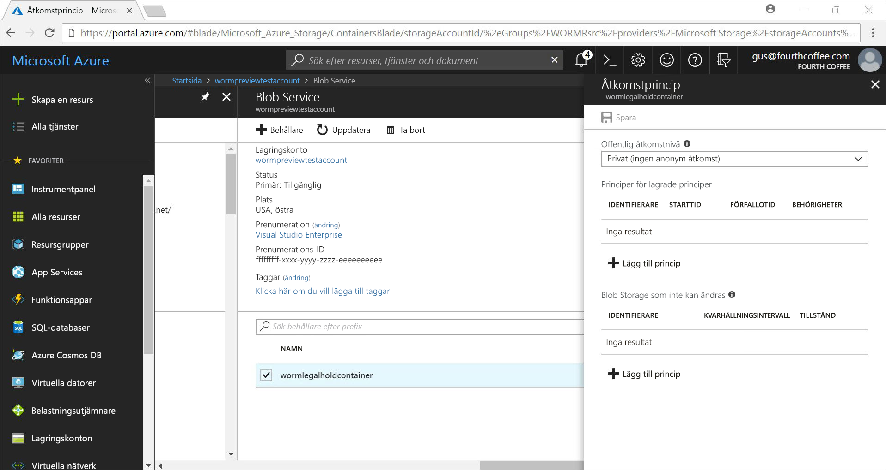
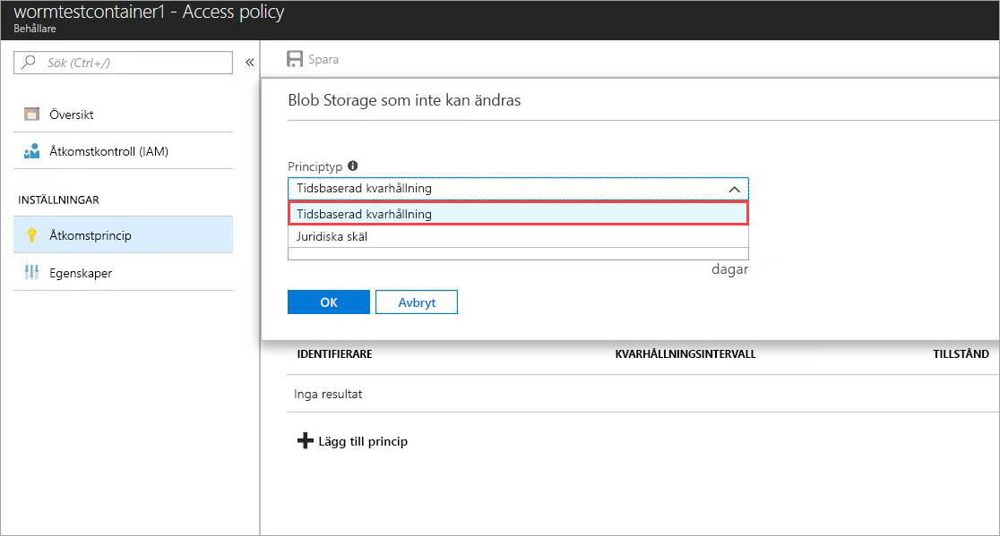
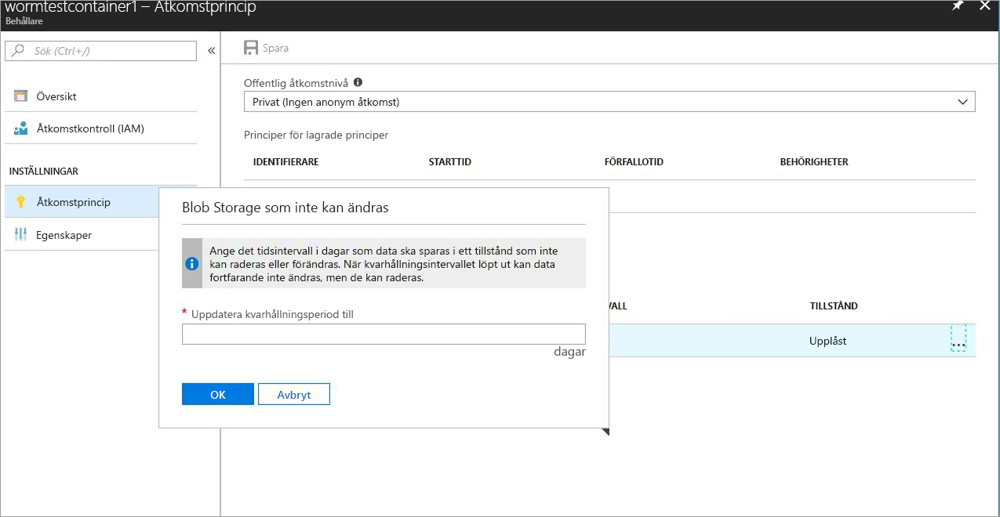
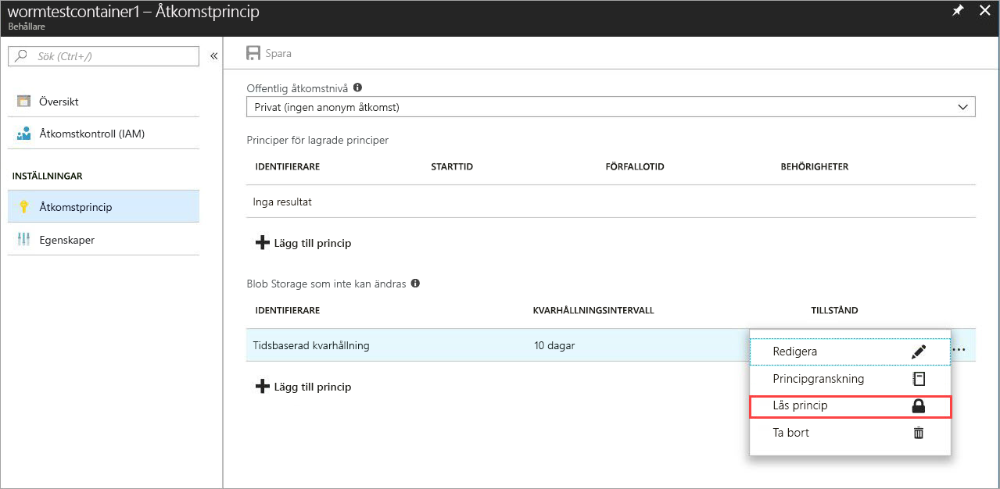
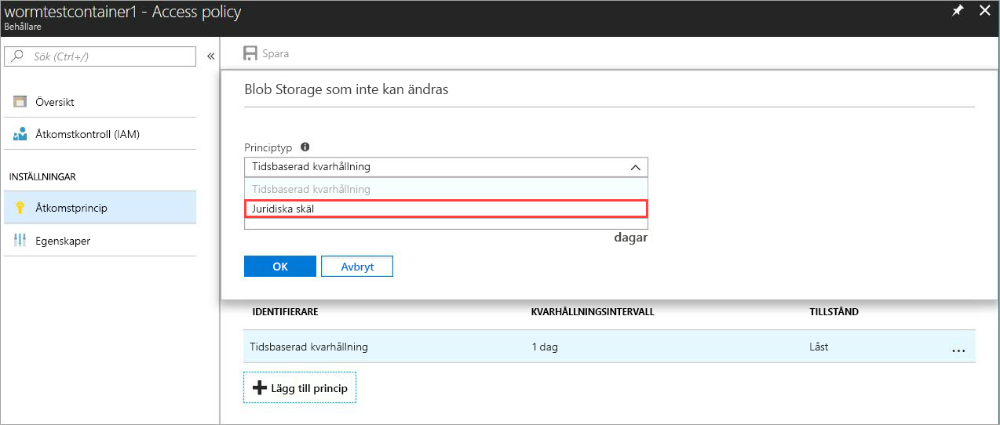
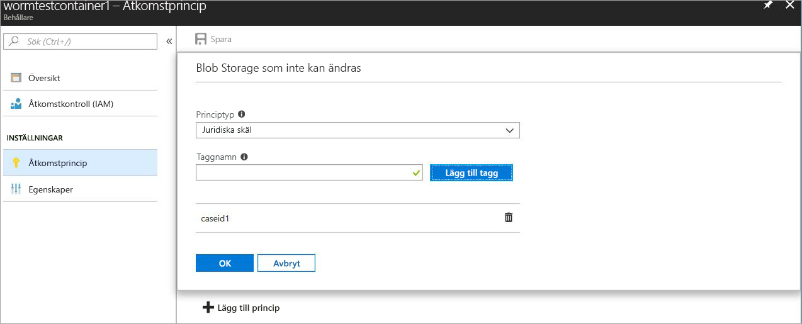

# <a name="store-business-critical-data-in-azure-blob-storage-preview"></a>Store verksamhetskritiska data i Azure Blob storage (förhandsversion)

Oföränderlig lagring för Azure-blobblagringen (objekt) gör det möjligt för användare att lagra sina verksamhetskritiska data i Azure blob storage med tillståndet mask (Skriv en gång, Läs många). Det här tillståndet kan inte raderas och kan inte ändras under en användardefinierad tidsperiod. Blobar kan skapas och läsa, men inte ändras eller tas bort under Kvarhållningsintervall.

## <a name="overview"></a>Översikt

Oföränderlig storage gör det möjligt för organisationer i många reglerade branscher, särskilt broker-återförsäljare organisationer att lagra data på ett sätt som är kompatibla med sek 17a-4(f) och andra bestämmelser.

Vanliga program innehåller:

- **Regelefterlevnad**: oföränderligt lagring för Azure Blob storage har utformats för att hjälpa finansiella institutioner och relaterade branscher åtgärda sek 17a-4(f), CFTC 1.31©-(d) FINRA osv.

- **Skydda dokumentet kvarhållning**: användare får maximalt dataskydd som Blob-lagring garanterar att data inte ändras eller tas bort av någon användare, inklusive de som har administrativ behörighet.

- **Bevarande av juridiska skäl**: oföränderligt lagring för Azure Blob storage gör att användarna kan lagra känslig information som är viktiga för en tvister eller brottsutredning etc. manipuleringssäker statusen för den önskade varaktigheten.

Oföränderlig storage möjliggör:

- **Stöd för tidsbaserad bevarandeprincip:** Användare anger principer för att lagra data under ett angivet tidsintervall.

- **Principstöd för bevarande av juridiska skäl:** När kvarhållningsintervallet inte är känt, kan användare ställa in bevarande av juridiska skäl för att lagra data oföränderliga tills bevarande av juridiska skäl avmarkeras.  När ett bevarande av juridiska skäl anges kan blobbar skapas och läsas, men inte ändras eller tas bort. Varje bevarande av juridiska skäl är associerat med en användardefinierad alfanumerisk tagg som används som en ID-sträng (till exempel en case-ID).

- **Stöd för alla blob-nivåer:** WORM-principer är oberoende av Azure Blob Storage-nivå och tillämpas på alla nivåer, frekvent, lågfrekvent och arkiv. Detta ger kunder möjlighet att lagra data i de flesta kostnadsoptimerade nivåer för sina arbetsbelastningar samtidigt som data förblir oförändrade

- 
  **Konfiguration för containernivå:** Med oföränderlig lagringsfunktion kan du konfigurera taggar för tidsbaserade bevarandeprinciper och bevarande av juridiska skäl på containernivå.  Användare kan skapa och låsa tidsbaserade bevarandeprinciper, utöka kvarhållningsintervaller, ställa in och ta bort bevarande av juridiska skäl osv. via enkla inställningar på containernivå.  Dessa principer ska gälla för alla blobbar i containern, både befintliga och nya.

- 
  **Stöd för granskningsloggning:** Varje container innehåller en granskningslogg som visar upp till fem tidsbaserade kvarhållningskommandon för låsta tidsbaserade bevarandeprinciper med högst tre loggar för tillägg av kvarhållningsintervall.  För tidsbaserat bevarande innehåller loggen användar-ID, kommandotyp, tidsstämplar och kvarhållningsintervall. För bevarande av juridiska skäl innehåller loggen användar-ID, kommandotyp, tidsstämplar och taggar för bevarande av juridiska skäl. Den här loggfilen finns kvar under containerns livslängd enligt SEC 17a-4(f) reglerande föreskrifter. En mer omfattande logg över alla aktiviteter i kontrollplanen finns i [Azure-aktivitetsloggen](https://docs.microsoft.com/azure/monitoring-and-diagnostics/monitoring-overview-activity-logs). Det är användarens ansvar att lagra dessa loggar beständigt såsom krävs för reglerande eller andra ändamål.

Oföränderlig lagring är aktiverat i alla offentliga Azure-regioner.

## <a name="how-it-works"></a>Hur det fungerar

Oföränderlig lagring för Azure Blob storage stöder två typer av mask eller inte kan ändras principer: tidsbaserat bevarande och bevarande av juridiska skäl. Mer information om hur du skapar principerna som inte kan ändras finns i avsnittet [Komma igång](#Getting-started).
När en bevarandeprincip som baseras på tidpunkt eller bevarande av juridiska skäl används i en container, flyttas alla befintliga blobbar till det oåterkalleliga (skriv- och ta bort-skyddat) tillståndet. Alla nya blobbar som har överförts till containern flyttas också till det oåterkalleliga tillståndet.

> [!IMPORTANT]
> En tidsbaserad bevarandeprincip måste vara *låst* för att blobben ska vara i ett oåterkalleligt (skriva och ta bort skyddade) tillstånd för SEC 17a-4(f) och annan regelefterlevnad. Det rekommenderas att principen låses inom en rimlig tid, vanligtvis inom 24 timmar. Vi rekommenderar inte att använda ett *olåst* tillstånd för något annat syfte än kortsiktiga funktionsförsök.

 När en tidsbaserad bevarandeprincip används i en container, finns alla blobbar i containern kvar i det oföränderliga tillståndet under hela den *effektiva* kvarhållningsperioden. Den effektiva kvarhållningsperioden för befintliga blobbar är lika med skillnaden mellan tiden för skapandet av bloben och det användardefinierade kvarhållningsintervallet. För nya blobbar är den effektiva kvarhållningsperioden lika med det kvarhållningsintervall som angetts av användaren. Eftersom användarna kan ändra kvarhållningsintervallet, används det senaste värdet för det användardefinierade kvarhållningsintervallet för att beräkna den effektiva kvarhållningsperioden.

> [!TIP]
> Exempel: Användare skapar en tidsbaserad bevarandeprincip med ett kvarhållningsintervall på fem år.
> Det finns en befintlig blob, testblob1, i containern som skapades för ett år sedan. Den effektiva kvarhållningsperioden för testblob1 ska vara fyra år.
> En ny blob, testblob2, överförs nu till containern. Den effektiva kvarhållningsperioden för den här nya blobben blir fem år.

### <a name="legal-holds"></a>Bevarande av juridiska skäl

Vid bevarande av juridiska skäl är alla befintliga och nya blobbar i det oföränderliga tillståndet tills bevarande av juridiska skäl avmarkeras.
Mer information om hur du ställer in och tar bort bevarande av juridiska skäl finns i avsnittet [Komma igång](#Getting-started).

En container kan ha både en bevarandeprincip med bevarande av juridiska skäl och en tidsbaserad bevarandeprincip samtidigt. Alla blobbar i containern är i det oföränderliga tillståndet tills alla bevarande av juridiska skäl tas bort, även om deras effektiva kvarhållningsperiod har upphört att gälla. Således är en blob i det oföränderliga tillståndet tills den effektiva loggperioden förfaller trots att alla giltiga undantag har rensats.
I följande tabell visas de typer av blob-åtgärder som kommer att inaktiveras för olika scenarierna av oföränderligt tillstånd.
Referera till informationen om [Azure Blob Service-API](https://docs.microsoft.com/rest/api/storageservices/blob-service-rest-api) för Blob REST API-dokumentationen.

|Scenario  |Blob-tillstånd  |Blob-åtgärder inte tillåtna  |
|---------|---------|---------|
|Effektivt kvarhållningsintervall för blobben har ännu inte gått ut och/eller bevarande av juridiska skäl har angetts     |Oåterkallelig: både ta bort- och skrivskyddad         |Ta bort containern, ta bort blobben, placera Blob1, placera blockering, placera blockeringslista, ange Blob-metadata, placera sidan, ange Blob-egenskaper, ögonblicksbild-Blob, inkrementellt kopiera Blob, lägga till blockering         |
|Effektivt kvarhållningsintervall på blobben har upphört att gälla     |Skrivskyddad endast (ta bort tillåts)         |Placera Blob, placera blockering, placera blockeringslista, ange Blob-metadata, placera sidan, ange Blob-egenskaper, ögonblicksbild-Blob, inkrementellt kopiera Blob, lägga till blockering         |
|Alla bevarande av juridiska skäl har tagits bort och inga tidsbaserade bevarandeprinciper inställda på containern     |Föränderlig         |Ingen         |
|Ingen WORM-princip skapad (tidsbaserad kvarhållning eller bevarande av juridiska skäl)     |Föränderlig         |Ingen         |

> [!NOTE]
> De första placera Blob- och placera blockeringslista- och placera blockerings-åtgärderna som krävs för att skapa en blob tillåts i de första två scenarierna från tabellen ovan, alla efterföljande åtgärder tillåts inte.
> Oföränderlig storage är endast tillgänglig i GPv2- och blob storage-konton och måste skapas via den [Azure Resource Manager](https://docs.microsoft.com/azure/azure-resource-manager/resource-group-overview).

## <a name="pricing"></a>Prissättning

Det finns inga extra kostnad för att använda den här funktionen och oföränderliga data kostar samma som vanliga, föränderliga data. Referera till sidan [priser för Azure Storage](https://azure.microsoft.com/pricing/details/storage/blobs/) för relaterad prisinformation.

### <a name="restrictions"></a>Begränsningar

Följande begränsningar gäller under den offentliga förhandsversionen:

- **Lagra inte produktions- eller affärskritiska data**
- Alla förhandsgransknings-/NDA-begränsningar gäller

## <a name="getting-started"></a>Komma igång

Azure Storage som inte kan ändras för Azure Blob-lagring stöds på de senaste versionerna av [Azure-portalen](http://portal.azure.com)Azure [CLI 2.0](https://docs.microsoft.com/cli/azure/install-azure-cli?view=azure-cli-latest), och Azure [PowerShell](https://github.com/Azure/azure-powershell/releases/tag/Azure.Storage.v4.4.0-preview-May2018)

### <a name="azure-portal"></a>Azure Portal

1. Skapa en ny container eller välj en befintlig container för lagring av de blobbar som ska behållas i det oföränderliga tillståndet.
 containern måste finnas i ett GPv2-lagringskonto.
2. Klicka på åtkomstprincipen i containerinställningarna och klicka sedan på **+ Lägg till princip** under principen **oföränderlig blobblagring** som visas nedan.

    

3. Om du vill aktivera tidsbaserad kvarhållning väljer du tidsbaserad kvarhållning från den nedrullningsbara menyn.

    

4. Ange det önskade kvarhållningsintervallet i dagar (minst en dag)

    

    Som du ser ovan låses det initiala tillståndet av principen upp. Detta gör att du kan testa funktionen med en lägre kvarhållningsintervall och göra ändringar i principen innan du låser den. Låsning är nödvändigt för regelefterlevnad av SEC 17a 4 etc.

5. Lås principen genom att högerklicka på den ..., och följande meny visas:-

    

    Klicka på Låsprincip så visas principtillståndet nu som låst. När det är låst kan principen inte längre tas bort och endast tillägg av kvarhållningsintervall kommer att tillåtas.

6. Om du vill aktivera bevarande av juridiska skäl, klicka på + Lägg till princip och välj bevarande av juridiska skäl från den nedrullningsbara menyn

    

7. Skapa ett bevarande av juridiska skäl med en eller flera taggar

    

### <a name="cli-20"></a>CLI 2.0

Installera [CLI-tillägget](http://docs.microsoft.com/cli/azure/install-azure-cli?view=azure-cli-latest) med `az extension add -n storage-preview`

Om du redan har installerat tillägget använder du följande kommando för att aktivera oföränderligt lagring: `az extension update -n storage-preview`

Funktionen ingår i följande kommandogrupper (kör ”-h” på dem för att visa kommandona): `az storage container immutability-policy` och `az storage container legal-hold`.

### <a name="powershell"></a>PowerShell

Funktionen oföränderlig lagring stöds på [PowerShell version 4.4.0-förhandsgranskning](https://github.com/Azure/azure-powershell/releases/tag/Azure.Storage.v4.4.0-preview-May20180).
Följ anvisningarna nedan om du vill aktivera den här funktionen:

1. Kontrollera att du har den senaste versionen av PowerShellGet installerad med `Install-Module PowerShellGet –Repository PSGallery –Force`
2. Ta bort alla tidigare installationer av Azure PowerShell
3. Installera AzureRM (Azure kan installeras på samma sätt från den här lagringsplatsen) `Install-Module AzureRM –Repository PSGallery –AllowClobber`
4. Installera förhandsversionen av cmdlet:ar för lagringshanteringsplanen`Install-Module -Name AzureRM.Storage -AllowPrerelease -Repository PSGallery -AllowClobber`

Ett PowerShell-kodexempel illustrerar hur funktionen tillhandahålls nedan.

## <a name="client-libraries"></a>Klientbibliotek

Oföränderlig lagring för Azure Blob storage har stöd för följande versioner av klienten bibliotek

- [.NET-klientbibliotek (version 7.2.0-förhandsversion och senare](https://www.nuget.org/packages/Microsoft.Azure.Management.Storage/7.2.0-preview)
- [node.js-klientbiblioteket (version 4.0.0 och senare)](https://www.npmjs.com/package/azure-arm-storage)
- [Python-klientbibliotek (version 2.0.0 Release Candidate 2 och senare)](https://pypi.org/project/azure-mgmt-storage/2.0.0rc1/)

## <a name="supported-values"></a>Värden som stöds

- Minsta kvarhållningsintervall är en dag, högsta är 400 år
- För ett visst lagringskonto är det högsta antalet containrar per lagringskonto med låsta oföränderliga principer 1000
- För ett visst lagringskonto är det högsta antalet containrar med en inställning för bevarande av juridiska skäl 1000
- För en viss container är det högsta antalet taggar för bevarande av juridiska skäl 10
- Den högsta längden på en tagg för bevarande av juridiska skäl är 23 alfanumeriska tecken, den minsta längden är tre tecken
- För en viss container är det högsta antalet tillåtna tillägg för kvarhållningsintervall för låsta oföränderliga principer tre
- För en viss container med en låst oföränderlig princip finns det högst fem tidsbaserade principloggar för tidsbaserad kvarhållning och högst 10 principloggar för bevarande av juridiska skäl som finns kvar under containerns varaktighet.

## <a name="faq"></a>VANLIGA FRÅGOR OCH SVAR

**Avser funktionen endast blockeringsblobbar eller sid- och tilläggsblobbar också?**

Oföränderlig lagring för blobbar kan användas med alla blob-typer.  Observera dock att det rekommenderas att funktionen främst används för blockeringsblobbar. Till skillnad från blockeringsblobbar, behöver sidblobbar och tilläggsblobbar skapas utanför en WORM-container och sedan kopieras in.  Då de kopierats in till en WORM-container tillåts inte fler *tillägg* till en tilläggsblob eller ändringar av en sidblob.

**Behöver jag alltid skapa ett nytt lagringskonto för att använda den här funktionen?**

Du kan använda lagring som inte kan ändras med eventuella befintliga GPv2-konton eller på nya storage-konton om typen är GPv2. Den här funktionen är endast tillgänglig med blob storage.


  **Vad händer om jag försöker ta bort en container med en *låst* tidsbaserade bevarandeprincip eller bevarande av juridiska skäl?**

Åtgärden med att ta bort containern misslyckas om det finns minst en blob med en låst tidsbaserad bevarandeprincip eller ett bevarande av juridiska skäl. Detta gäller även om data [tas bort mjukt](storage-blob-soft-delete.md). Åtgärden med att ta bort containern lyckas om det inte finns några blobbar med ett aktiv kvarhållningsintervall och inga bevaranden av juridiska skäl. Du måste först ta bort blobbarna innan du kan ta bort containern. 


  **Vad händer om jag försöker ta bort ett lagringskonto med en WORM-container som har en *låst* tidsbaserad bevarandeprincip eller ett bevarande av juridiska skäl?**

Borttagningen av lagringskontot misslyckas om det finns minst en WORM-container med bevarande av juridiska skäl eller en blob med ett aktivt kvarhållningsintervall.  Alla WORM-containrar måste tas bort innan lagringskontot kan tas bort.  Under föregående fråga finns mer information om borttagning av containrar.

**Kan jag flytta data över olika blob-nivåer (frekvent, lågfrekvent, kall) när blobben är i oförändrat tillstånd?**

Ja, du kan använda kommandot Ange Blob-nivå för att flytta data över blob-nivåer samtidigt som data bevaras i oföränderligt tillstånd. Oföränderlig lagring stöds på nivåerna för frekvent, lågfrekvent och kalla blob.

**Vad händer om jag inte betalat och mitt kvarhållningsintervall inte har gått ut?**

Vid utebliven betalning gäller normala datakvarhållningsprinciper som anges enligt villkoren i ditt avtal med Microsoft.

**Finns det en utvärderingsversion eller en respitperiod för att bara testa funktionen?**

Ja, när en tidsbaserad bevarandeprincip skapas första gången, är det i ett *olåst* tillstånd. I det här tillståndet kan du göra önskade ändringar i kvarhållningsintervallet som att öka eller minska och även ta bort principen. När principen låses, förblir den låst för alltid förhindra borttagning. Dessutom kan kvarhållningsintervall inte längre minskas när principen är låst. Vi rekommenderar starkt att du använder det *olåsta* tillståndet endast för att testa den och låser principen inom 24 timmar, för att inte riskera inkompatibilitet med SEC 17a-4(f) och andra föreskrifter.

**Är funktionen tillgänglig i nationella och offentliga moln?**

Oföränderlig storage finns för närvarande endast i offentliga Azure-regioner. E-post azurestoragefeedback@microsoft.com rörande intresse för ett visst nationellt moln.

## <a name="sample-code"></a>Exempelkod

Ett  PowerShell-exempelskript anges nedan som referens.
Det här skriptet skapar ett nytt lagringskonto och en container och visar sedan hur du ställer in och avmarkerar bevarande av juridiska skäl, skapar och låser en tidsbaserad bevarandeprincip (aka ImmutabilityPolicy) utökar kvarhållningsintervall osv.

```powershell
\$ResourceGroup = "\<Enter your resource group\>”

\$StorageAccount = "\<Enter your storage account name\>"

\$container = "\<Enter your container name\>"

\$container2 = "\<Enter another container name\>”

\$location = "\<Enter the storage account location\>"

\# Login to the Azure Resource Manager Account

Login-AzureRMAccount

Register-AzureRmResourceProvider -ProviderNamespace "Microsoft.Storage"

\# Create your Azure Resource Group

New-AzureRmResourceGroup -Name \$ResourceGroup -Location \$location

\# Create your Azure storage account

New-AzureRmStorageAccount -ResourceGroupName \$ResourceGroup -StorageAccountName
\$StorageAccount -SkuName Standard_LRS -Location \$location -Kind Storage

\# Create a new container

New-AzureRmStorageContainer -ResourceGroupName \$ResourceGroup
-StorageAccountName \$StorageAccount -Name \$container

\# Create Container 2 with Storage Account object

\$accountObject = Get-AzureRmStorageAccount -ResourceGroupName \$ResourceGroup
-StorageAccountName \$StorageAccount

New-AzureRmStorageContainer -StorageAccount \$accountObject -Name \$container2

\# Get container

Get-AzureRmStorageContainer -ResourceGroupName \$ResourceGroup
-StorageAccountName \$StorageAccount -Name \$container

\# Get Container with Account object

\$containerObject = Get-AzureRmStorageContainer -StorageAccount \$accountObject
-Name \$container

\#list container

Get-AzureRmStorageContainer -ResourceGroupName \$ResourceGroup
-StorageAccountName \$StorageAccount

\#remove container (Add -Force to dismiss prompt)

Remove-AzureRmStorageContainer -ResourceGroupName \$ResourceGroup
-StorageAccountName \$StorageAccount -Name \$container2

\#with Account object

Remove-AzureRmStorageContainer -StorageAccount \$accountObject -Name
\$container2

\#with Container object

\$containerObject2 = Get-AzureRmStorageContainer -StorageAccount \$accountObject
-Name \$container2

Remove-AzureRmStorageContainer -InputObject \$containerObject2

\#Set LegalHold

Add-AzureRmStorageContainerLegalHold -ResourceGroupName \$ResourceGroup
-StorageAccountName \$StorageAccount -Name \$container -Tag tag1,tag2

\#with Account object

Add-AzureRmStorageContainerLegalHold -StorageAccount \$accountObject -Name
\$container -Tag tag3

\#with Container object

Add-AzureRmStorageContainerLegalHold -Container \$containerObject -Tag tag4,tag5

\#Clear LegalHold

Remove-AzureRmStorageContainerLegalHold -ResourceGroupName \$ResourceGroup
-StorageAccountName \$StorageAccount -Name \$container -Tag tag2

\#with Account object

Remove-AzureRmStorageContainerLegalHold -StorageAccount \$accountObject -Name
\$container -Tag tag3,tag5

\#with Container object

Remove-AzureRmStorageContainerLegalHold -Container \$containerObject -Tag tag4

\# create/update ImmutabilityPolicy

\#\# with account/container name

Set-AzureRmStorageContainerImmutabilityPolicy -ResourceGroupName \$ResourceGroup
-StorageAccountName \$StorageAccount -ContainerName \$container
-ImmutabilityPeriod 10

\#with Account object

Set-AzureRmStorageContainerImmutabilityPolicy -StorageAccount \$accountObject
-ContainerName \$container -ImmutabilityPeriod 1 -Etag \$policy.Etag

\#with Container object

\$policy = Set-AzureRmStorageContainerImmutabilityPolicy -Container
\$containerObject -ImmutabilityPeriod 7

\#\# with ImmutabilityPolicy object

Set-AzureRmStorageContainerImmutabilityPolicy -ImmutabilityPolicy \$policy
-ImmutabilityPeriod 5

\#get ImmutabilityPolicy

Get-AzureRmStorageContainerImmutabilityPolicy -ResourceGroupName \$ResourceGroup
-StorageAccountName \$StorageAccount -ContainerName \$container

\#with Account object

Get-AzureRmStorageContainerImmutabilityPolicy -StorageAccount \$accountObject
-ContainerName \$container

\#with Container object

Get-AzureRmStorageContainerImmutabilityPolicy -Container \$containerObject

\#Lock ImmutabilityPolicy (Add -Force to dismiss prompt)

\#\# with ImmutabilityPolicy object

\$policy = Get-AzureRmStorageContainerImmutabilityPolicy -ResourceGroupName
\$ResourceGroup -StorageAccountName \$StorageAccount -ContainerName \$container

\$policy = Lock-AzureRmStorageContainerImmutabilityPolicy -ImmutabilityPolicy
\$policy -force

\#\# with account/container name

\$policy = Lock-AzureRmStorageContainerImmutabilityPolicy -ResourceGroupName
\$ResourceGroup -StorageAccountName \$StorageAccount -ContainerName \$container
-Etag \$policy.Etag

\#with Account object

\$policy = Lock-AzureRmStorageContainerImmutabilityPolicy -StorageAccount
\$accountObject -ContainerName \$container -Etag \$policy.Etag

\#with Container object

\$policy = Lock-AzureRmStorageContainerImmutabilityPolicy -Container
\$containerObject -Etag \$policy.Etag -force

\#Extend ImmutabilityPolicy

\#\# with ImmutabilityPolicy object

\$policy = Get-AzureRmStorageContainerImmutabilityPolicy -ResourceGroupName
\$ResourceGroup -StorageAccountName \$StorageAccount -ContainerName \$container

\$policy = Set-AzureRmStorageContainerImmutabilityPolicy -ImmutabilityPolicy
\$policy -ImmutabilityPeriod 11 -ExtendPolicy

\#\# with account/container name

\$policy = Set-AzureRmStorageContainerImmutabilityPolicy -ResourceGroupName
\$ResourceGroup -StorageAccountName \$StorageAccount -ContainerName \$container
-ImmutabilityPeriod 11 -Etag \$policy.Etag -ExtendPolicy

\#with Account object

\$policy = Set-AzureRmStorageContainerImmutabilityPolicy -StorageAccount
\$accountObject -ContainerName \$container -ImmutabilityPeriod 12 -Etag
\$policy.Etag -ExtendPolicy

\#with Container object

\$policy = Set-AzureRmStorageContainerImmutabilityPolicy -Container
\$containerObject -ImmutabilityPeriod 13 -Etag \$policy.Etag -ExtendPolicy

\#Remove ImmutabilityPolicy (Add -Force to dismiss prompt)

\#\# with ImmutabilityPolicy object

\$policy = Get-AzureRmStorageContainerImmutabilityPolicy -ResourceGroupName
\$ResourceGroup -StorageAccountName \$StorageAccount -ContainerName \$container

Remove-AzureRmStorageContainerImmutabilityPolicy -ImmutabilityPolicy \$policy

\#\# with account/container name

Remove-AzureRmStorageContainerImmutabilityPolicy -ResourceGroupName
\$ResourceGroup -StorageAccountName \$StorageAccount -ContainerName \$container
-Etag \$policy.Etag

\#with Account object

Remove-AzureRmStorageContainerImmutabilityPolicy -StorageAccount \$accountObject
-ContainerName \$container -Etag \$policy.Etag

\#with Container object

Remove-AzureRmStorageContainerImmutabilityPolicy -Container \$containerObject
-Etag \$policy.Etag
```
