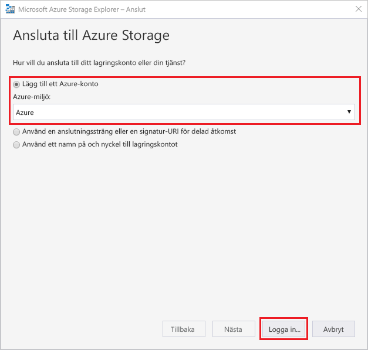
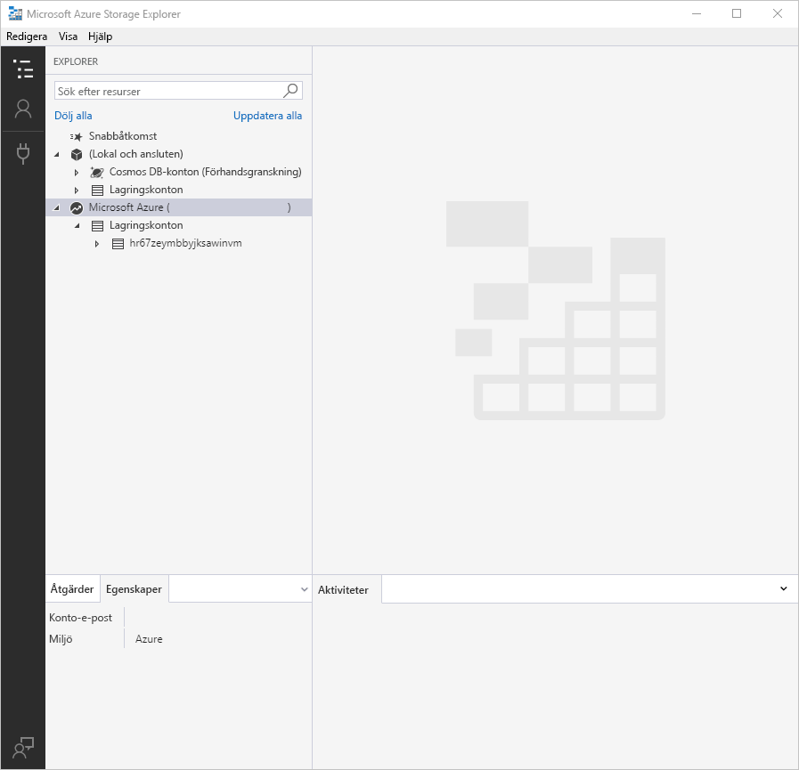
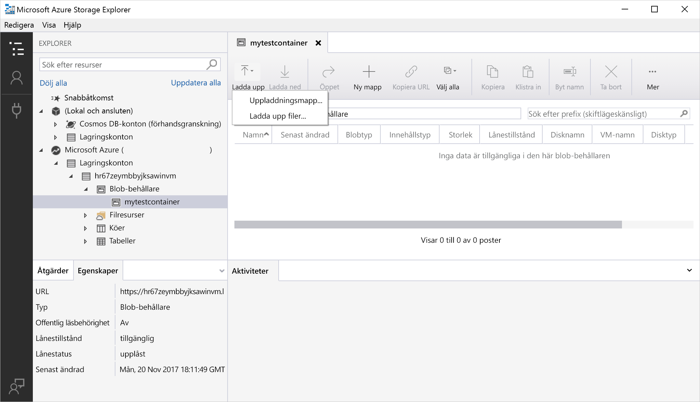
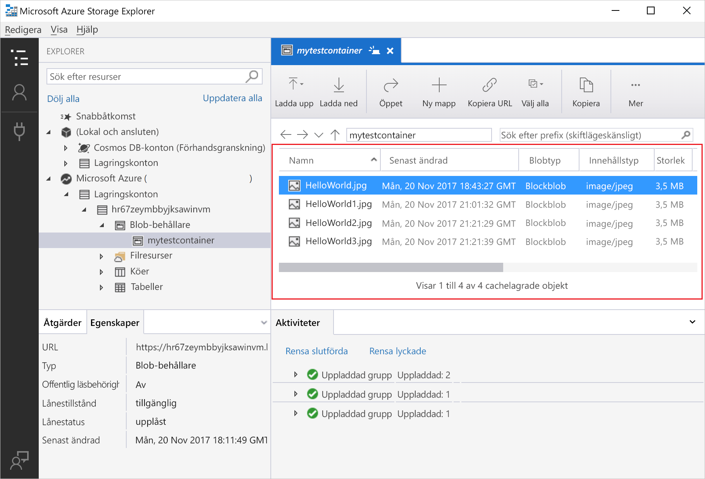
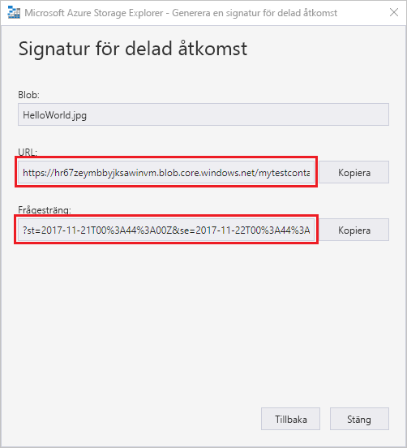

# Snabbstart: Skapa en blob i objektlagring med hjälp av Azure Storage Explorer

I den här snabbstarten får du lära dig hur du skapar en container och en blob med [Azure Storage Explore](https://azure.microsoft.com/features/storage-explorer/). Du får lära dig hur du hämtar bloben till din lokala dator och hur du visar alla blobar i en container. Du får också lära dig hur du skapar en ögonblicksbild av en blob, hanterar åtkomstprinciper för containrar och skapar en signatur för delad åtkomst.

## Nödvändiga komponenter

Om du inte har en Azure-prenumeration kan du skapa ett [kostnadsfritt konto](https://azure.microsoft.com/free/?WT.mc_id=A261C142F) innan du börjar.

För den här snabbstarten krävs att du installerar Azure Storage Explorer. Information om hur du installerar Azure Storage Explorer för Windows, Macintosh och Linux finns i [Azure Storage Explorer](https://azure.microsoft.com/features/storage-explorer/).

[!INCLUDE [storage-create-account-portal-include](../../../includes/storage-create-account-portal-include.md)]

## Logga in i Storage Explorer

Första gången programmet startas visas fönstret **Microsoft Azure Storage Explorer – anslut**. I Storage Explorer finns flera olika sätt att ansluta till lagringskonton. I följande tabell visas vilka olika sätt du kan ansluta på:

|Aktivitet|Syfte|
|---|---|
|Lägga till ett Azure-konto | Omdirigerar dig till din organisations inloggningssida för att autentisera dig i Azure. |
|Använda en anslutningssträng eller en signatur-URI för delad åtkomst | Kan användas för direkt åtkomst till en container eller ett lagringskonto med en SAS-token eller en delad anslutningssträng. |
|Använda lagringskontots namn och nyckel| Använd lagringskontonamnet och nyckeln för ditt lagringskonto för att ansluta till Azure Storage.|

Välj **Lägg till ett Azure-konto** och klicka på **Logga in...**. Följ anvisningarna på skärmen för att logga in på ditt Azure-konto.

När anslutningen är klar läses Azure Storage Explorer in med fliken **Utforskaren** öppen. I den här vyn får du information om alla dina lagringskonton i Azure samt lokal lagring som konfigurerats via [Azure Storage-emulatorn](../common/storage-use-emulator.md?toc=%2fazure%2fstorage%2fblobs%2ftoc.json), [Cosmos DB](../../cosmos-db/storage-explorer.md?toc=%2fazure%2fstorage%2fblobs%2ftoc.json) -konton eller [Azure Stack](../../azure-stack/user/azure-stack-storage-connect-se.md?toc=%2fazure%2fstorage%2fblobs%2ftoc.json)miljöer.

## Skapa en container

Blobar laddas alltid upp till en container. På så vis kan du ordna grupper av blobar på samma sätt som du ordnar filer i mappar på datorn.

Om du vill skapa en container ska du expandera det lagringskonto som du skapade i föregående steg. Välj **Blob Containers** (Blob-behållare), högerklicka och välj **Create Blob Container** (Skapa blob-behållare). Ange namnet på blob-containern. Se avsnittet [Skapa containern och ange behörigheter](storage-quickstart-blobs-dotnet.md#create-the-container-and-set-permissions) för en lista över regler och begränsningar vid namngivning av blob-containrar. Skapa blob-containern när du är klar genom att trycka på **Retur**. När en blob-behållare har skapats visas den i mappen **Blob Containers** (Blob-behållare) för det valda lagringskontot.

## Ladda upp blobar i containern

Blob Storage stöder blockblobar, tilläggsblobar och sidblobar. VHD-filer som används för att backa upp virtuella datorer i IaaS är sidblobar. Tilläggsblobar används för loggning, till exempel när du vill skriva till en fil och sedan fortsätta att lägga till mer information. De flesta filer som lagras i Blob Storage är blockblobar.

Välj **Ladda upp** i menyfliksområdet för containrar. Den här åtgärden ger dig möjlighet att ladda upp en mapp eller fil.

Välj de filer eller mappar du vill ladda upp. Välj **typ av blob**. Godkända alternativ är **Append**, **Page** eller **Block** blob (tilläggs-, sid- eller blockblob).

Om du laddar upp en VHD- eller VHDX-fil, välj **Upload .vhd/.vhdx files as page blobs (recommended)** (Ladda upp VHD-/VHDX-filer som sidblobar (rekommenderas)).

I fältet **Upload to folder (optional)** (Ladda upp i mapp (valfritt)) kan du ange ett mappnamn för att lagra filerna eller mapparna i en mapp under containern. Om ingen mapp anges laddas filerna upp direkt under containern.

När du väljer **OK** sätts de valda filerna i kö för uppladdning och varje fil laddas upp. När uppladdningen är klar visas resultatet i fönstret **Activities** (Aktiviteter).

## Visa blobar i en container

I programmet **Azure Storage Explorer** väljer du en container under ett lagringskonto. I huvudrutan visas en lista över blobarna i den valda containern.

## Ladda ned blobbar

Ladda ned blobar med hjälp av **Azure Storage Explorer** genom att markera en blob och välja **Download** (Ladda ned) i menyfliksområdet. En fildialogruta öppnas och där du kan ange ett filnamn. Välj **Spara** att starta nedladdningen av en blob till den lokala platsen.

## Hantera ögonblicksbilder

I Azure Storage Explorer kan du ta och hantera [ögonblicksbilder](storage-blob-snapshots.md) av dina blobar. Ta en ögonblickbild av en blob genom att högerklicka på den och välja **Make Snapshot** (Skapa ögonblicksbild). Visa en ögonblickbild av en blob genom att högerklicka på den och välja **Manage Snapshots** (Hantera ögonblicksbilder). En lista över ögonblicksbilder för bloben visas på den aktuella fliken.

## Hantera åtkomstprinciper

I Storage Explorer kan du hantera principer för åtkomst till containrar i dess användargränssnitt. Det finns två typer av säkra åtkomst-principer (SAS): servicenivå och kontonivå. SAS på kontonivå riktar sig till lagringskontot och kan användas på flera tjänster och resurser. SAS på servicenivå definieras på en resurs under en viss tjänst. Generera en SAS på servicenivå genom att högerklicka på en container och välja **Manage Access Policies...** (Hantera åtkomstprinciper). Generera en SAS på kontonivå genom att högerklicka på lagringskontot.

Välj **Add** (Lägg till) om du vill lägga till en ny åtkomstprincip och definiera behörigheter för den principen. Välj **Save** (Spara) när du är klar och vill spara åtkomstprincipen. Den här principen är nu tillgänglig för användning när du konfigurerar en signatur för delad åtkomst.

## Arbete med signaturer för delad åtkomst

Signaturer för delad åtkomst (SAS) kan hämtas via Storage Explorer. Högerklicka på ett lagringskonto, en container eller en blob och välj **Get Shared Access Signature...** (Hämta signatur för delad åtkomst). Välj start- och förfallotid samt behörigheter för SAS-URL och välj **Create** (Skapa). En fullständig URL med både frågesträngen och frågesträngen fristående tillhandahålls och kan kopieras från nästa skärm.

## Nästa steg

I den här snabbstarten har du lärt dig hur du överför filer mellan en lokal disk och Azure Blob Storage med **Azure Storage Explorer**. Om du vill veta mer om att arbeta med Blob Storage kan du fortsätta till anvisningarna om Blob Storage.

> [!div class="nextstepaction"]
> [Anvisningar för Blob Storage-åtgärder](storage-how-to-use-blobs-powershell.md)
