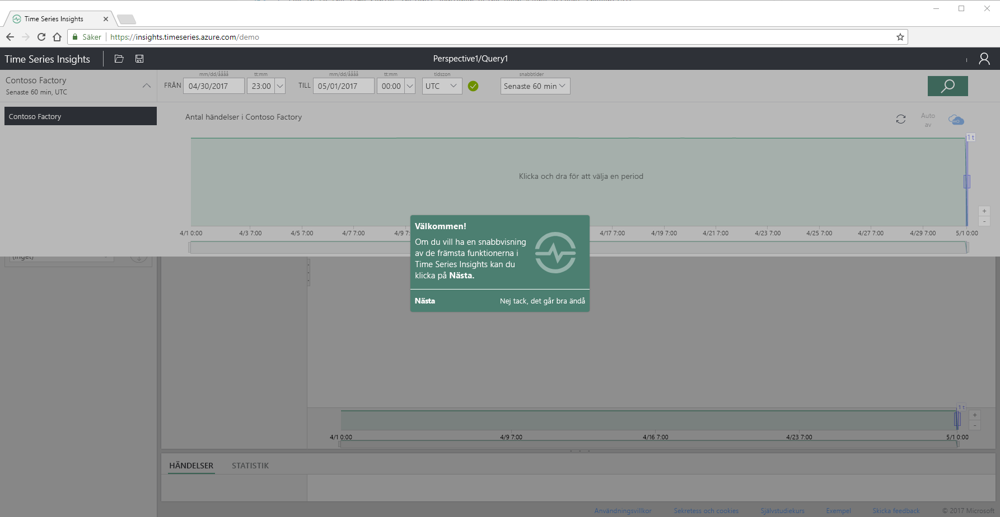
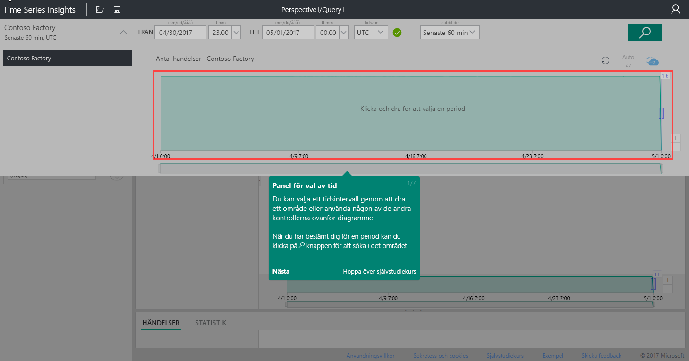
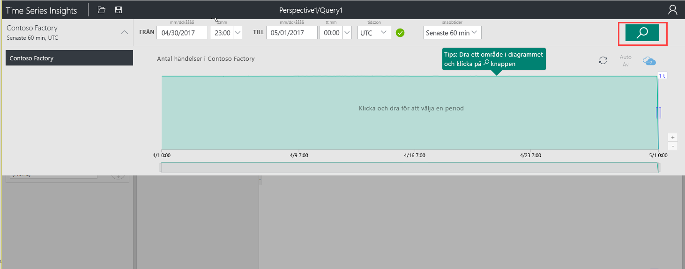
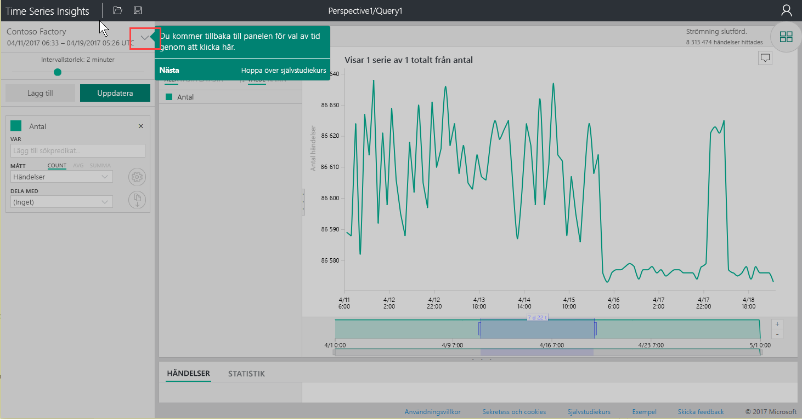
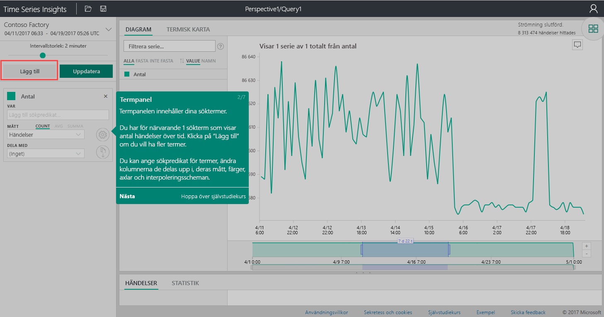
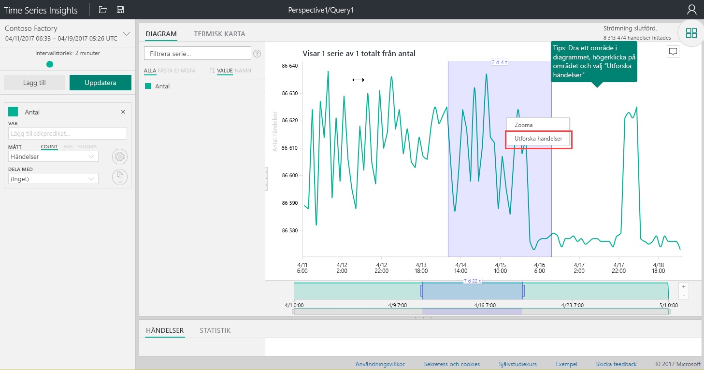
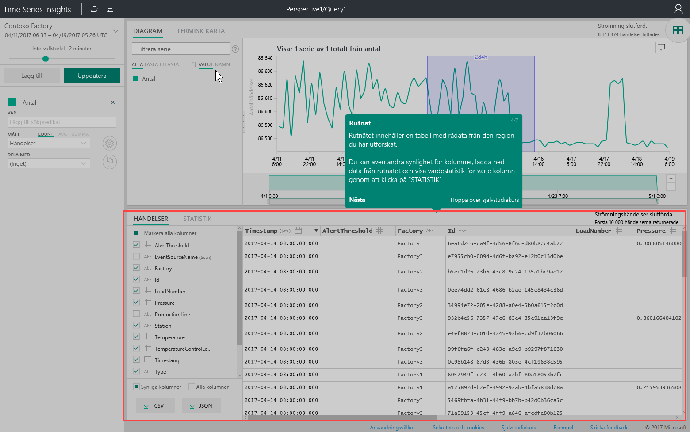
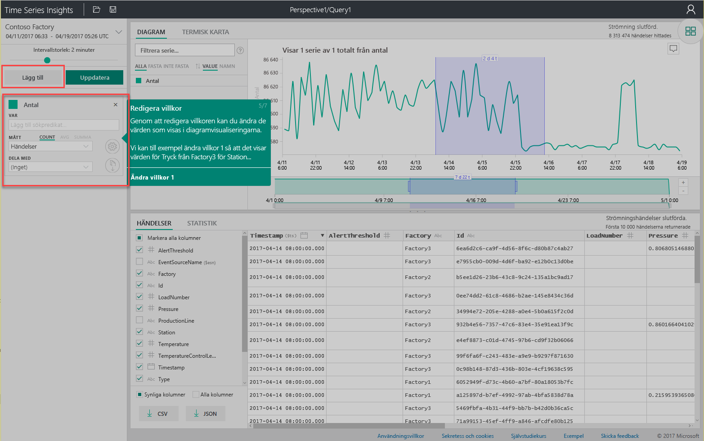
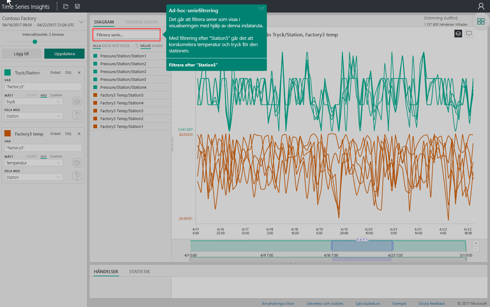

# Snabbstart: Utforska Azure tid serien insikter
Denna Snabbstart visar hur du kommer igång med Azure tid serien Insights explorer i en miljö med ledigt demonstrationen. Du lär dig hur du använder du webbläsare för att visualisera stora volymer av IoT-data och rundtur huvudfunktionerna i Utforskaren tid serien insikter. 

Azure Time Series Insights är en fullständigt hanterad tjänst för analys, lagring och visualisering som gör det enkelt att utforska och analysera miljarder IoT-händelser samtidigt. Den ger dig en global vy över dina data, så att du snabbt kan validera IoT-lösningen och undviker dyrbar avbrottstid för verksamhetskritiska enheter genom att hjälpa dig att identifiera dolda trender upptäcka avvikelser och utföra grundläggande orsaken analyser i nära realtid.  Om du skapar ett program som behöver store eller fråga tid series-data, kan du utveckla med hjälp av den tid serien insikter REST API: er.

Om du inte har en Azure-prenumeration kan du skapa ett [kostnadsfritt Azure-konto](https://azure.microsoft.com/free/?ref=microsoft.com&utm_source=microsoft.com&utm_medium=docs&utm_campaign=visualstudio) innan du börjar.

## Utforska tid serien insikter explorer i en miljö för demonstration

1. I din webbläsare, navigerar du till [https://insights.timeseries.azure.com/demo](https://insights.timeseries.azure.com/demo). 

2. Om du uppmanas logga in i tid serien insikter explorer med hjälp av dina Azure-autentiseringsuppgifter. 
 
3. Tid serien insikter guidad sidan visas. Klicka på **nästa** ska börja guidad.

   

4. Den **tid markeringen panelen** visas. Använd den här panelen för att välja en tidsram för att visualisera.

   

5. Klicka och dra i region, och klicka sedan på **Sök** knappen.
 
    

   Tid serien insikter visar ett diagram visualiseringen för den tidsperiod som du angav. Du kan utföra olika åtgärder i med linjediagrammet, till exempel filtrering, fästning sorterings- och stapling. 

   Återgå till den **tid markeringen panelen**, klickar du på nedpilen som visas:

   

6. Klicka på **Lägg till** i den **villkoren panelen** att lägga till en ny sökterm.

   

7. I diagrammet du Välj en region, högerklicka på regionen och välj **utforska händelser**.
 
   

   Ett rutnät med dina rådata visas från den region du utforska:

   

8. Redigera dina villkor om du vill ändra värdena i diagrammet och Lägg till en annan term för cross-korrelera olika typer av värden:

   

9. Ange en filterterm som i den **filtrera serier...**  för ad hoc-serien filtrering. Snabbstart, ange **Station5** till mellan korrelera temperatur och tryck för den stationen.
 
   

När du har Snabbstart kan experimentera du med exempeldata för data att skapa olika visuella. 

### Nästa steg
Du är redo att skapa din egen tid serien insikter miljö:
> [!div class="nextstepaction"]
> [Planera din tid serien insikter-miljön](time-series-insights-environment-planning.md)
