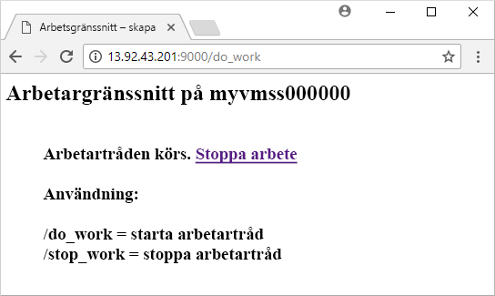
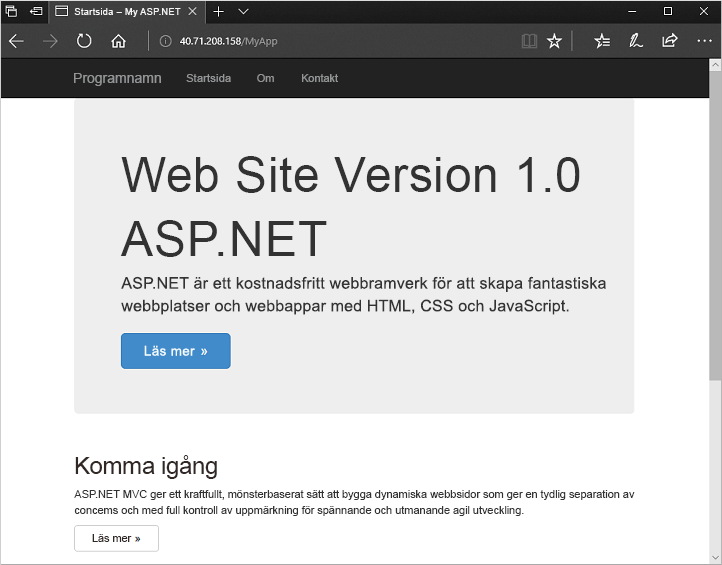

# <a name="create-a-virtual-machine-scale-set-with-the-azure-cli-20"></a>Skapa en VM-skalningsuppsättning med Azure CLI 2.0
Med en VM-skalningsuppsättning kan du distribuera och hantera en uppsättning identiska, virtuella datorer med automatisk skalning. Du kan skala antalet virtuella datorer i skalningsuppsättningen manuellt eller definiera regler för automatisk skalning baserat på resursanvändning, till exempel CPU, minneskrav eller nätverkstrafik. I den här artikeln skapar du en VM-skalningsuppsättning med en Azure Resource Manager-mall. Du kan också skapa en skalningsuppsättning med [Azure CLI 2.0](quick-create-cli.md), [Azure PowerShell](quick-create-powershell.md) eller [Azure Portal](quick-create-portal.md).


## <a name="overview-of-templates"></a>Översikt över mallar
Du kan distribuera grupper av relaterade resurser med hjälp av Azure Resource Manager-mallar. Mallarna är skrivna i JavaScript Object Notation (JSON) och definierar hela infrastrukturen i Azure-miljön för din app. Med en enda mall kan du skapa VM-skalningsuppsättningen, installera program och ange regler för automatisk skalning. Du kan återanvända mallen och använda variabler och parametrar till att uppdatera befintliga, eller skapa ytterligare, skalningsuppsättningar. Du kan distribuera mallar via Azure Portal, Azure CLI 2.0 eller Azure PowerShell och anropa dem från pipelines för kontinuerlig integrering/kontinuerlig leverans (CI/CD).

Mer information om mallar finns i [Översikt över Azure Resource Manager](https://docs.microsoft.com/azure/azure-resource-manager/resource-group-overview#template-deployment)


## <a name="define-a-scale-set"></a>Definiera en skalningsuppsättning
En mall definierar konfigurationen för varje resurstyp. Resurstypen för VM-skalningsuppsättning är ungefär samma som för en enskild virtuell dator. Huvuddelarna i resurstypen för VM-skalningsuppsättning:

| Egenskap                     | Egenskapsbeskrivning                                  | Exempelmallvärde                    |
|------------------------------|----------------------------------------------------------|-------------------------------------------|
| typ                         | Azure-resurstypen som ska skapas                            | Microsoft.Compute/virtualMachineScaleSets |
| namn                         | Namnet på skalningsuppsättningen                                       | myScaleSet                                |
| location                     | Platsen där skalningsuppsättningen skapas                     | Östra USA                                   |
| sku.name                     | VM-storleken för varje skalningsuppsättningsinstans                  | Standard_A1                               |
| sku.capacity                 | Antal VM-instanser som skapas inledningsvis           | 2                                         |
| upgradePolicy.mode           | Uppgraderingsläge för VM-instanser när ändringar sker              | Automatisk                                 |
| imageReference               | Plattform eller anpassad avbildning som ska användas för VM-instanserna | Canonical Ubuntu Server 16.04-LTS         |
| osProfile.computerNamePrefix | Namnprefix för varje VM-instans                     | myvmss                                    |
| osProfile.adminUsername      | Användarnamn för varje VM-instans                        | azureuser                                 |
| osProfile.adminPassword      | Lösenord för varje VM-instans                        | P@ssw0rd!                                 |

 Följande utdrag visar resursdefinitionen för skalningsuppsättningen i en mall. Av utrymmesskäl visas inte nätverkskortkonfigurationen. Om du vill anpassa en skalningsuppsättningsmall kan du ändra VM-storleken eller den inledande kapaciteten, eller använda en annan plattform eller en anpassad avbildning.

```json
{
  "type": "Microsoft.Compute/virtualMachineScaleSets",
  "name": "myScaleSet",
  "location": "East US",
  "apiVersion": "2016-04-30-preview",
  "sku": {
    "name": "Standard_A1",
    "capacity": "2"
  },
  "properties": {
    "upgradePolicy": {
      "mode": "Automatic"
    },
    "virtualMachineProfile": {
      "storageProfile": {
        "osDisk": {
          "caching": "ReadWrite",
          "createOption": "FromImage"
        },
        "imageReference":  {
          "publisher": "Canonical",
          "offer": "UbuntuServer",
          "sku": "16.04-LTS",
          "version": "latest"
        }
      },
      "osProfile": {
        "computerNamePrefix": "myvmss",
        "adminUsername": "azureuser",
        "adminPassword": "P@ssw0rd!"
      }
    }
  }
}
```


## <a name="install-an-application"></a>Installera en app
När du distribuerar en skalningsuppsättning kan du använda VM-tillägg för att utföra konfigurations- och automatiseringsåtgärder efter distributionen, till exempel installera en app. Skript kan laddas ned från Azure Storage eller GitHub, eller tillhandahållas via Azure Portal vid tilläggskörning. Om du vill använda ett tillägg för skalningsuppsättningen lägger du till avsnittet *extensionProfile* i föregående resursexempel. Tilläggsprofilen definierar vanligtvis följande egenskaper:

- Tilläggstyp
- Tilläggsutgivare
- Tilläggsversion
- Plats för konfiguration eller installation av skript
- Kommandon för att köra VM-instanserna

Nu ska vi titta på två sätt att installera en app med tillägg. Vi använder tillägget för anpassat skript för att installera en Python-app i Linux och använder tillägget PowerShell DSC för att installera en ASP.NET-app i Windows.

### <a name="python-http-server-on-linux"></a>Python-HTTP-servern på Linux
[Python-HTTP-servern på Linux](https://github.com/Azure/azure-quickstart-templates/tree/master/201-vmss-bottle-autoscale) använder tillägget för anpassat skript för att installera [Bottle](http://bottlepy.org/docs/dev/) (ett Python-webbramverk) och en enkel HTTP-server. 

Två skript definieras i *fileUris* - *installserver.sh* och *workserver.py*. De här filerna laddas ned från GitHub. Sedan definierar *commandToExecute* `bash installserver.sh` för den app som ska installeras och konfigureras:

```json
"extensionProfile": {
  "extensions": [
    {
      "name": "AppInstall",
      "properties": {
        "publisher": "Microsoft.Azure.Extensions",
        "type": "CustomScript",
        "typeHandlerVersion": "2.0",
        "autoUpgradeMinorVersion": true,
        "settings": {
          "fileUris": [
            "https://raw.githubusercontent.com/Azure/azure-quickstart-templates/master/201-vmss-bottle-autoscale/installserver.sh",
            "https://raw.githubusercontent.com/Azure/azure-quickstart-templates/master/201-vmss-bottle-autoscale/workserver.py"
          ],
          "commandToExecute": "bash installserver.sh"
        }
      }
    }
  ]
}
```

### <a name="aspnet-application-on-windows"></a>ASP.NET-app i Windows
Exempelmallen [ASP.NET-app i Windows](https://github.com/Azure/azure-quickstart-templates/tree/master/201-vmss-windows-webapp-dsc-autoscale) använder tillägget PowerShell DSC för att installera en ASP.NET MVC-app som körs i IIS. 

Ett installationsskript hämtas från GitHub enligt definitionen i *url*. Tillägget kör sedan *InstallIIS* från skriptet *IISInstall.ps1* enligt definitionen i *funktion* och *Skript*. Själva ASP.NET-appen tillhandahålls som ett webbdistributionspaket, vilket också hämtas från GitHub enligt definitionen i *WebDeployPackagePath*:

```json
"extensionProfile": {
  "extensions": [
    {
      "name": "Microsoft.Powershell.DSC",
      "properties": {
        "publisher": "Microsoft.Powershell",
        "type": "DSC",
        "typeHandlerVersion": "2.9",
        "autoUpgradeMinorVersion": true,
        "forceUpdateTag": "1.0",
        "settings": {
          "configuration": {
            "url": "https://raw.githubusercontent.com/Azure/azure-quickstart-templates/master/201-vmss-windows-webapp-dsc-autoscale/DSC/IISInstall.ps1.zip",
            "script": "IISInstall.ps1",
            "function": "InstallIIS"
          },
          "configurationArguments": {
            "nodeName": "localhost",
            "WebDeployPackagePath": "https://raw.githubusercontent.com/Azure/azure-quickstart-templates/master/201-vmss-windows-webapp-dsc-autoscale/WebDeploy/DefaultASPWebApp.v1.0.zip"
          }
        }
      }
    }
  ]
}
```

## <a name="deploy-the-template"></a>Distribuera mallen
Det enklaste sättet att distribuera [Python HTTP-servern på Linux](https://github.com/Azure/azure-quickstart-templates/tree/master/201-vmss-bottle-autoscale) eller mallen [ASP.NET MVC-app i Windows](https://github.com/Azure/azure-quickstart-templates/tree/master/201-vmss-windows-webapp-dsc-autoscale) är att använda knappen **Distribuera till Azure** som finns i readme-filerna i GitHub.  Du kan också använda PowerShell eller Azure CLI för att distribuera exempelmallarna.

### <a name="azure-cli-20"></a>Azure CLI 2.0
Du kan använda Azure CLI 2.0 för att installera Python-HTTP-servern på Linux enligt följande:

```azurecli-interactive
# Create a resource group
az group create --name myResourceGroup --location EastUS

# Deploy template into resource group
az group deployment create \
    --resource-group myResourceGroup \
    --template-uri https://raw.githubusercontent.com/Azure/azure-quickstart-templates/master/201-vmss-bottle-autoscale/azuredeploy.json
```

Om du vill testa din app i praktiken erhåller du den offentliga IP-adressen för belastningsutjämnaren med [az network public-ip list](/cli/azure/network/public-ip#az_network_public_ip_show) på följande sätt:

```azurecli-interactive
az network public-ip list \
    --resource-group myResourceGroup \
    --query [*].ipAddress -o tsv
```

Ange den offentliga IP-adressen för belastningsutjämnaren i en webbläsare i formatet *http://<publicIpAddress>:9000/do_work*. Belastningsutjämnaren distribuerar trafik till en av dina VM-instanser enligt följande exempel:




### <a name="azure-powershell"></a>Azure PowerShell
Du kan använda Azure PowerShell för att installera ASP.NET-app i Windows på följande sätt:

```azurepowershell-interactive
# Create a resource group
New-AzureRmResourceGroup -Name myResourceGroup -Location EastUS

# Deploy template into resource group
New-AzureRmResourceGroupDeployment `
    -ResourceGroupName myResourceGroup `
    -TemplateFile https://raw.githubusercontent.com/Azure/azure-quickstart-templates/master/201-vmss-windows-webapp-dsc-autoscale/azuredeploy.json
```

Om du vill testa appen hämtar du den offentliga IP-adressen för belastningsutjämnaren med [Get-AzureRmPublicIpAddress](/powershell/module/azurerm.network/get-azurermpublicipaddress) enligt följande:

```azurepowershell-interactive
Get-AzureRmPublicIpAddress -ResourceGroupName myResourceGroup | Select IpAddress
```

Ange den offentliga IP-adressen för belastningsutjämnaren i en webbläsare i formatet *http://<publicIpAddress>/MyApp*. Belastningsutjämnaren distribuerar trafik till en av dina VM-instanser enligt följande exempel:




## <a name="clean-up-resources"></a>Rensa resurser
När resurserna inte behövs längre kan du använda [az group delete](/cli/azure/group#az_group_delete) för att ta bort resursgruppen, skalningsuppsättningen och alla relaterade resurser:

```azurecli-interactive 
az group delete --name myResourceGroup
```


## <a name="next-steps"></a>Nästa steg
