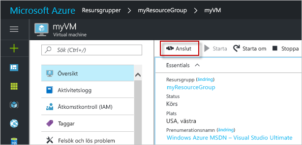

# <a name="create-a-linux-virtual-machine-with-the-azure-portal"></a>Skapa en virtuell Linux-dator med Azure Portal

Det går att skapa virtuella datorer via Azure Portal. Den här metoden ger ett webbläsarbaserat användargränssnitt för att skapa och konfigurera virtuella datorer och alla relaterade resurser. I den här snabbstarten beskrivs hur du skapar en virtuell dator och installerar en webbserver på den.

Om du inte har en Azure-prenumeration kan du skapa ett [kostnadsfritt konto](https://azure.microsoft.com/free/?WT.mc_id=A261C142F) innan du börjar.

## <a name="create-ssh-key-pair"></a>Skapa SSH-nyckelpar

Du behöver ett SSH-nyckelpar för att slutföra den här snabbstarten. Om du har ett befintligt SSH-nyckelpar kan du hoppa över det här steget.

Kör det här kommandot från ett Bash-kommandogränssnitt och följ instruktionerna på skärmen. Kommandoutdata innehåller filnamnet för den offentliga nyckeln. Kopiera innehållet i en fil för offentlig nyckel (`cat ~/.ssh/id_rsa.pub`) till Urklipp. Om du använder Windows-undersystemet för Linux ser du till att du inte kopierar radbrytningstecken från utdata. Notera filnamnet på den privata nyckelfilen för senare användning.

```bash
ssh-keygen -t rsa -b 2048
```

Du hittar mer detaljerad information om den här processen [här](https://docs.microsoft.com/azure/virtual-machines/linux/mac-create-ssh-keys)

## <a name="log-in-to-azure"></a>Logga in på Azure 

Logga in på Azure Portal på http://portal.azure.com.

## <a name="create-virtual-machine"></a>Skapa en virtuell dator

1. Klicka på knappen **New** (Nytt) i det övre vänstra hörnet i Azure Portal.

2. Välj **Compute** och välj sedan **Ubuntu Server 16.04 LTS**. 

3. Ange informationen för den virtuella datorn. Välj **Offentlig SSH-nyckel** som **Autentiseringstyp**. När du klistrar in den offentliga SSH-nyckeln ska du tänka på att ta bort eventuella inledande eller avslutande blanksteg. När du är klar klickar du på **OK**.

    

4. Välj en storlek för den virtuella datorn. Om du vill se fler storlekar väljer du **Visa alla** eller så ändrar du filtret för **disktyper som stöds**. 

      

5. Under **Inställningar** behåller du standardvärdena och klickar på **OK**.

6. På sammanfattningssidan klickar du på **Ok** för att starta distributionen av den virtuella datorn.

7. Den virtuella datorn fästs på Azure Portals instrumentpanel. När distributionen är klar öppnas sammanfattningen för den virtuella datorn automatiskt.


## <a name="connect-to-virtual-machine"></a>Ansluta till den virtuella datorn

Skapa en SSH-anslutning med den virtuella datorn.

1. Klicka på knappen **Anslut** på den virtuella datorns egenskaper. Anslutningsknappen visar en SSH-anslutningssträng som kan användas för att ansluta till den virtuella datorn.

     

2. Kör följande kommando för att skapa en SSH-session. Ersätt anslutningssträngen med den som du kopierade från Azure Portal.

```bash 
ssh azureuser@40.112.21.50
```

## <a name="install-nginx"></a>Installera NGINX

Använd följande bash-skript för att uppdatera paketkällor och installera det senaste NGINX-paketet. 

```bash 
#!/bin/bash

# update package source
sudo apt-get -y update

# install NGINX
sudo apt-get -y install nginx
```

När det är klart avslutar du SSH-sessionen och återgår till VM-egenskaperna i Azure Portal.


## <a name="open-port-80-for-web-traffic"></a>Öppna port 80 för webbtrafik 

En nätverkssäkerhetsgrupp (NSG) säkrar ingående och utgående trafik. När en VM skapas från Azure Portal skapas en regel för inkommande trafik på port 22 för SSH-anslutningar. Eftersom denna VM är värd för en webbserver måste du skapa en NSG-regel för port 80.

1. Klicka på namnet på den virtuella datorns **resursgrupp**.
2. Välj **nätverkssäkerhetsgruppen**. Du kan identifiera NSG med kolumnen **Typ**. 
3. På menyn till vänster under inställningarna klickar du på **Ingående säkerhetsregel**.
4. Klicka på **Lägg till**.
5. Skriv **http** i fältet **Namn**. Kontrollera att **Källportsintervall** är inställt på `*`, **Målportsintervall** är inställt på *80* och **Åtgärd** är inställt på *Tillåt*. 
6. Klicka på **OK**.


## <a name="view-the-nginx-welcome-page"></a>Visa NGINX-välkomstsidan

När NGINX är installerat och port 80 är öppen för din VM kan webbservern nu nås från internet. Öppna en webbläsare och ange den virtuella datorns offentliga IP-adress. Den offentliga IP-adressen finns bland VM-egenskaperna i Azure Portal.

 

## <a name="clean-up-resources"></a>Rensa resurser

Ta bort resursgruppen, den virtuella datorn och alla relaterade resurser när de inte längre behövs. Om du vill göra det väljer du resursgruppen för den virtuella datorn och klickar på **Ta bort**.

## <a name="next-steps"></a>Nästa steg

I den här snabbstarten har du distribuerat en virtuell dator och en regel för nätverkssäkerhetsgrupp samt installerat en webbserver. Om du vill veta mer om virtuella Azure-datorer fortsätter du till självstudien för virtuella Linux-datorer.

> [!div class="nextstepaction"]
> [Självstudier om virtuella Azure Linux-datorer](./tutorial-manage-vm.md)
