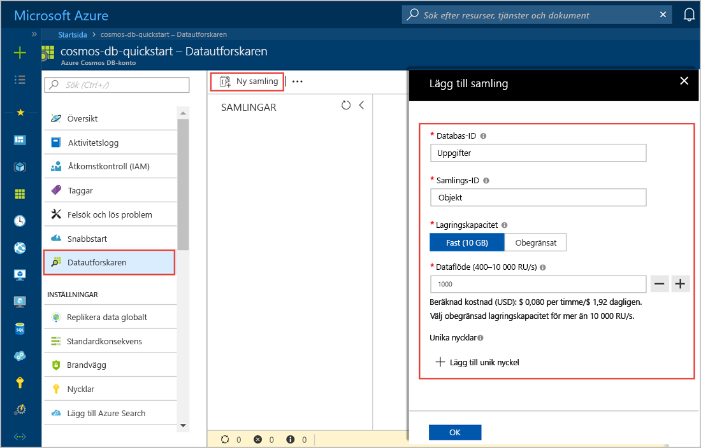

Nu kan du använda datautforskarverktyget i Azure Portal för att skapa en databas och samling. 

1. Klicka på **Data Explorer (förhandsversion)** på den vänstra navigeringsmenyn i Azure Portal. 

2. Klicka på **Ny samling** på bladet **Data Explorer (förhandsversion)** och ange sedan följande information:

    

    Inställning|Föreslaget värde|Beskrivning
    ---|---|---
    Databas-id|Uppgifter|Namnet på din nya databas. Databasnamn måste innehålla mellan 1 och 255 tecken och får inte innehålla /, \\, #, ? eller avslutande blanksteg.
    Samlings-id|Objekt|Namnet på din nya samling. Samma teckenkrav gäller för samlingsnamn som databas-ID:n.
    Lagringskapacitet| Fast (10 GB)|Använd standardvärdet. Det här värdet är databasens lagringskapacitet.
    Dataflöde|400 RU|Använd standardvärdet. Du kan skala upp dataflödet senare om du vill minska svarstiden.
    RU/m|Av|Låt standardvärdet vara kvar. Om du behöver hantera toppar i arbetsbelastningar senare kan du aktivera funktionen [RU/m](../articles/cosmos-db/request-units-per-minute.md) då.
    Partitionsnyckeln|/category|En partitionsnyckel som distribuerar data jämnt till varje partition. Det är viktigt att välja rätt partitionsnyckel när man skapar en performant samling. Mer information finns i [Designing for partitioning](../articles/cosmos-db/partition-data.md#designing-for-partitioning) (Utforma för partitionering).    
3. När du har fyllt i formuläret klickar du på **OK**.

Datautforskaren visar den nya databasen och samlingen. 