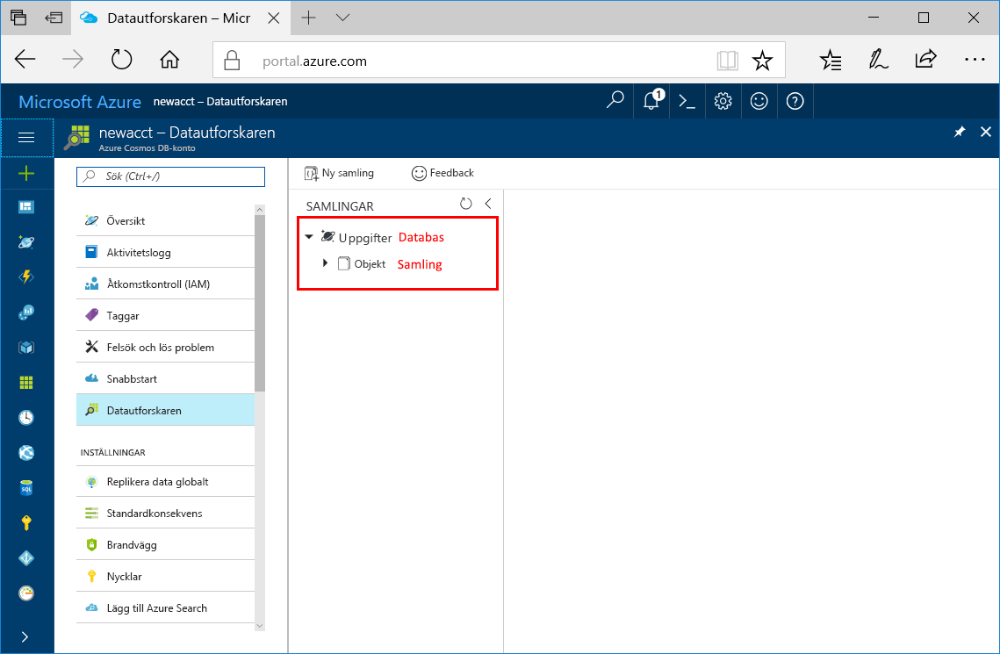

Nu kan du använda datautforskarverktyget i Azure Portal för att skapa en databas och samling. 

1. Klicka på **Datautforskaren** > **Ny samling**. 
    
    Området **Lägg till samling** visas längst till höger, du kan behöva bläddra åt höger för att se det.

    

2. På sidan **Lägg till samling** anger du inställningarna för den nya samlingen.

    Inställning|Föreslaget värde|Beskrivning
    ---|---|---
    Databas-id|Uppgifter|Ange *Uppgifter* som namn på den nya databasen. Databasnamn måste innehålla mellan 1 och 255 tecken och får inte innehålla /, \\, #, ? eller avslutande blanksteg.
    Samlings-id|Objekt|Ange *Objekt* som namnet på din nya samling. Samma teckenkrav gäller för samlings-ID:n som databasnamn.
    Lagringskapacitet| Fast (10 GB)|Ändra värdet till **Fast (10 GB)**. Det här värdet är databasens lagringskapacitet.
    Dataflöde|400 RU|Ändra genomflödet till 400 begäransenheter per sekund (RU/s). Lagringskapaciteten måste anges till **Fast (10 GB)** för att kunna ställa in dataflöde på 400 RU/s. Du kan skala upp dataflödet senare om du vill minska svarstiden. 
    Partitionsnyckeln|/category|Ange */category* som partitionsnyckel. En partitionsnyckel distribuerar data jämnt till varje partition i databasen. Mer information om partitionering finns i [Designing for partitioning](../articles/cosmos-db/partition-data.md#designing-for-partitioning) (Utforma för partitionering).

    Klicka på **OK**.

    Datautforskaren visar den nya databasen och samlingen.

    