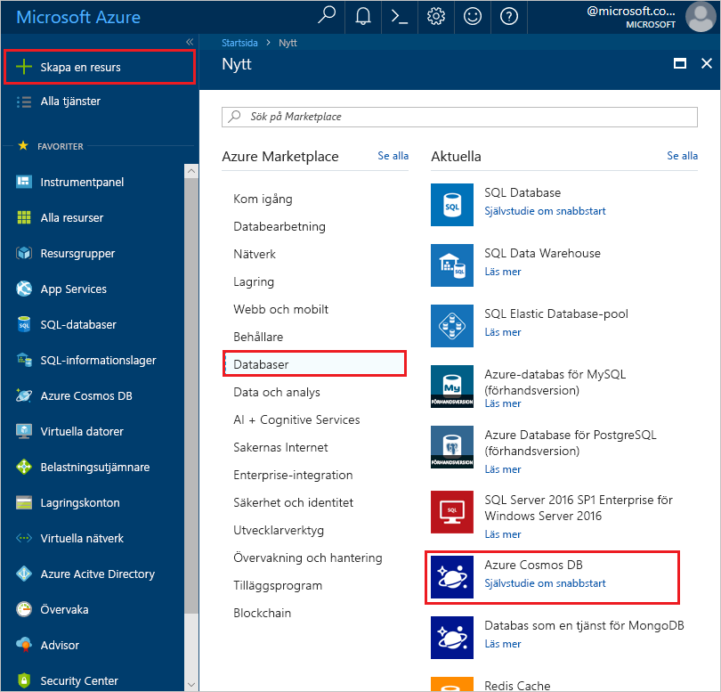

1. Logga in på [Azure Portal](https://portal.azure.com/) i ett nytt fönster.
2. Klicka på **Nytt** på menyn till vänster. Klicka på **Databaser** och sedan på **Azure Cosmos DB**.
   
   

3. På bladet **Nytt konto** anger du önskad konfiguration för det här Azure Cosmos DB-kontot. 

    Med Azure Cosmos DB kan du välja någon av fyra programmeringsmodeller: Gremlin (graf), MongoDB, SQL (DocumentDB) och Tabell (nyckelvärde), som var och en kräver ett separat konto.
    
    I den här snabbstarten kommer vi att programmera mot DocumentDB-API:t, så du väljer **SQL (DocumentDB)** när du fyller i formuläret. Om du har grafdata för en app för sociala medier, nyckel/värde-data (tabell) eller data som har migrerats från en MongoDB-app, ska du tänka på att Azure Cosmos DB kan vara en mycket tillgänglig och globalt distribuerad plattform för databastjänster i alla dina verksamhetskritiska program.

    På bladet **Nytt konto** fyller du i fälten med informationen i följande skärmbild som vägledning. Dina värden kan vara helt olika dem på skärmbilden.
 
    

    Inställning|Föreslaget värde|Beskrivning
    ---|---|---
    ID|*Unikt värde*|Ett unikt namn du väljer för att identifiera Azure Cosmos DB-kontot. Eftersom*documents.azure.com* läggs till det ID du anger för att skapa din URI ska du använda ett unikt men identifierbart ID. Ditt id får bara innehålla gemener, siffror och bindestreck och måste innehålla mellan 3 och 50 tecken.
    API|SQL (DocumentDB)|Vi kommer att programmera mot [DocumentDB-API:t](../articles/documentdb/documentdb-introduction.md) längre ned i den här artikeln.|
    Prenumeration|*Din prenumeration*|Den Azure-prenumeration som ska användas för det här Azure Cosmos DB-kontot. 
    Resursgrupp|*Samma värde som ID*|Namnet på den nya resursgruppen för kontot. För enkelhetens skull kan du använda samma namn som för ditt ID. 
    Plats|*Regionen som ligger närmast dina användare*|Den geografiska plats som ska vara värd för ditt Azure Cosmos DB-konto. Välj den plats som är närmast dina användare så att de får så snabb åtkomst till data som möjligt.
4. Skapa kontot genom att klicka på **Skapa**.
5. Klicka på **Aviseringar**  i det översta verktygsfältet för att övervaka distributionsprocessen.

    

6.  När aviseringsfönstret visar att distributionen har slutförts stänger du fönstret och öppnar det nya kontot från panelen **Alla resurser** på instrumentpanelen. 

    
 
