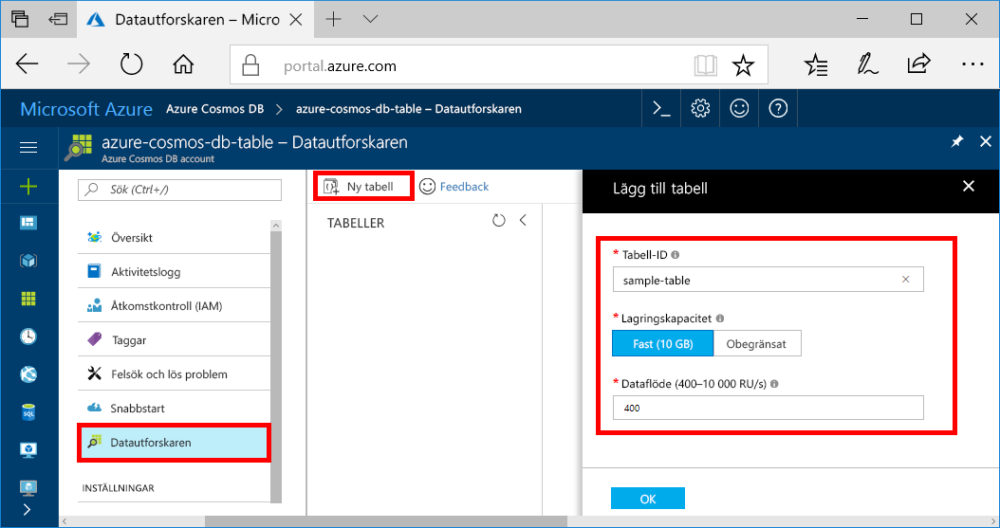

Du kan nu använda datautforskaren för att skapa en tabell och lägga till data i databasen. 

1. Klicka på **Data Explorer (förhandsversion)** på navigeringsmenyn i Azure Portal. 
2. På bladet Datautforskaren klickar du på **Ny tabell** och fyller sedan i sidan med följande information.

    

    Inställning|Föreslaget värde|Beskrivning
    ---|---|---
    Tabell-id|sample-table|ID för din nya tabell. Samma teckenkrav gäller för tabellnamn som databas-id. Databasnamn måste innehålla mellan 1 och 255 tecken och får inte innehålla `/ \ # ?` eller avslutande blanksteg.
    Lagringskapacitet| 10 GB|Låt standardvärdet vara kvar. Det här är databasens lagringskapacitet.
    Dataflöde|400 RU:er|Låt standardvärdet vara kvar. Du kan skala upp [dataflödet](../articles/cosmos-db/request-units.md) senare om du vill minska svarstiden.
    RU/m|Av|Använd standardvärdet. Du kan aktivera funktionen [RU/m](../articles/cosmos-db/request-units-per-minute.md) senare om du behöver hantera toppar i arbetsbelastningar.

3. När formuläret är ifyllt klickar du på **OK**.