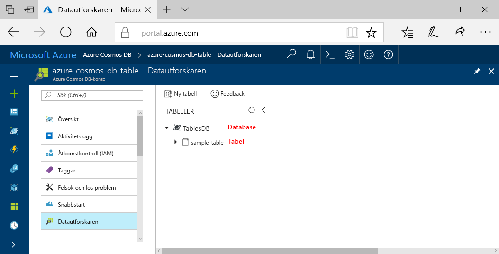

Du kan nu använda verktyget Data Explorer för att skapa en databas och tabell i Azure-portalen. 

1. Klicka på **Data Explorer** > **ny tabell**. 
    
    Den **Lägg till tabell** området visas längst till höger kan du behöva rulla för att se den.

    

2. I den **Lägg till tabell** anger du inställningarna för den nya tabellen.

    Inställning|Föreslaget värde|Beskrivning
    ---|---|---
    Tabell-id|sample-table|ID för din nya tabell. Samma teckenkrav gäller för tabellnamn som databas-id. Databasnamn måste innehålla mellan 1 och 255 tecken och får inte innehålla `/ \ # ?` eller avslutande blanksteg.
    Lagringskapacitet| Fast (10 GB)|Ändra värdet till **fast (10 GB)**. Det här värdet är databasens lagringskapacitet.
    Dataflöde|400 RU:er|Ändra genomflödet till 400 frågeenheter per sekund (RU/s). Du kan skala upp dataflödet senare om du vill minska svarstiden.

    Klicka på **OK**.

    Data Explorer visar den nya databasen och tabellen.

    