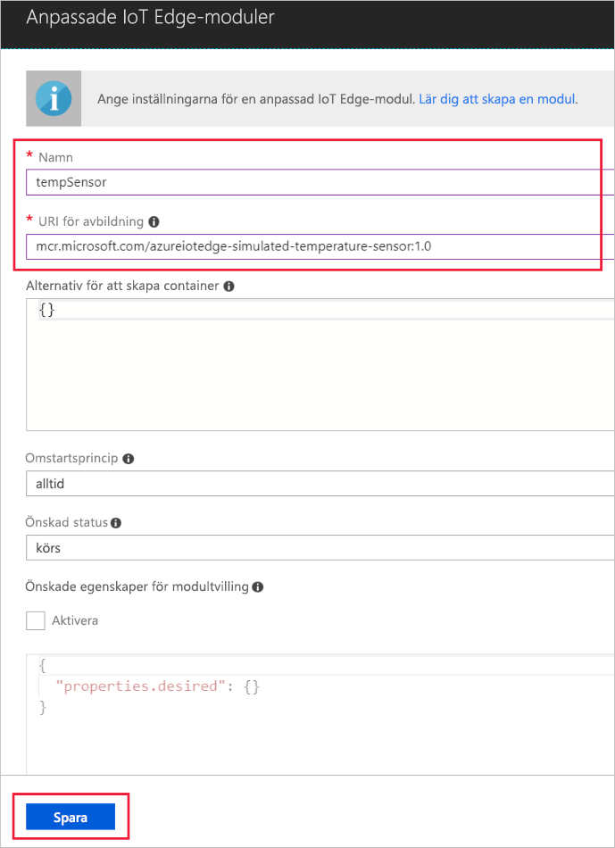

En av de viktigaste funktionerna i Azure IoT Edge är möjligheten att distribuera moduler till IoT Edge-enheter från molnet. En IoT Edge-modul är ett körbart paket som implementeras som en behållare. I det här avsnittet ska du distribuera en modul som genererar telemetri för din simulerade enhet. 

1. Gå till din IoT-hubb på Azure Portal.
1. Gå till **IoT Edge** och välj din IoT Edge-enhet.
1. Välj **Ange moduler**.
1. I avsnittet **Distributionsmoduler** på sidan klickar du på **Lägg till** och väljer **IoT Edge-modul**.
1. I **Namn**-fältet skriver du `tempSensor`. 
1. I **URI för avbildning**-fältet skriver du `mcr.microsoft.com/azureiotedge-simulated-temperature-sensor:1.0`. 
1. Lämna de andra inställningarna som de är och välj **Spara**.

   

1. När du är tillbaka i steget **Lägg till moduler** väljer du **Nästa**.
1. I steget **Ange rutter** ska du ha en standardväg som skickar alla meddelanden från alla moduler till IoT Hub. Om du inte har det lägger du till följande kod och väljer sedan **Nästa**.

   ```json
   {
       "routes": {
           "route": "FROM /* INTO $upstream"
       }
   }
   ```

1. Välj **Skicka** i steget **Granska distribution**.
1. Återgå till informationssidan om enheten och välj **Uppdatera**. Förutom edgeAgent-modulen som skapades när du startade tjänsten för första gången ska du även se en annan körningsmodul med namnet **edgeHub** och modulen **tempSensor**. 

   
