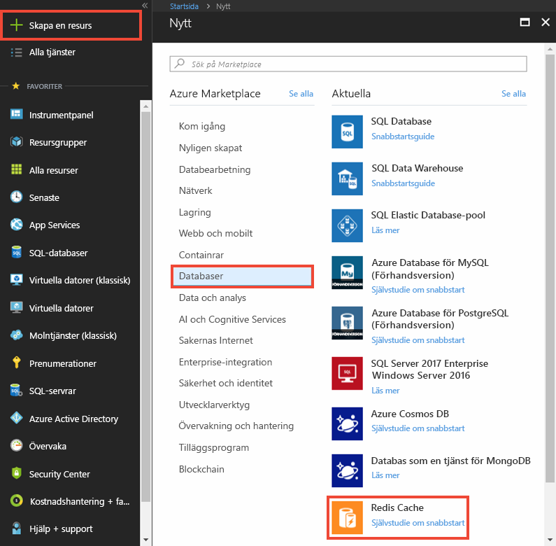
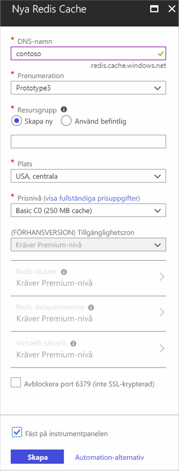

Om du vill skapa ett cacheminne loggar du först in på [Azure Portal](https://portal.azure.com) och klickar på **Ny**, **Data + lagring**, **Redis-cache**.

> [!NOTE]
> Om du inte har något Azure-konto så kan du [registrera ett kostnadsfritt Azure-konto](https://azure.microsoft.com/pricing/free-trial/?WT.mc_id=redis_cache_hero) på bara några minuter.
> 
> 

> [!NOTE]
> Förutom att skapa cacheminnen i Azure Portal, kan du också skapa dem med hjälp av Resource Manager-mallar, PowerShell eller Azure CLI.
> 
> * Information om att skapa ett cacheminne med hjälp av Resource Manager-mallar finns i[Skapa ett Redis-cache med hjälp av en mall](../articles/redis-cache/cache-redis-cache-arm-provision.md).
> * Information om att skapa ett cacheminne med hjälp av Azure PowerShell finns i[Hantera Azure Redis-cache med hjälp av Azure PowerShell](../articles/redis-cache/cache-howto-manage-redis-cache-powershell.md).
> * Information om att skapa ett cacheminne med hjälp av Azure CLI finns i [Skapa och hantera Azure Redis-cache med hjälp av Azure-kommandoradsgränssnittet (Azure CLI)](../articles/redis-cache/cache-manage-cli.md).
> 
> 

På **Nytt Redis-cache**-bladet, anger du önskad konfiguration för cacheminnet.

 

* I **Dns-namn** anger du ett cachenamn att använda för cache-slutpunkten. Cachenamnet måste vara en sträng mellan 1 och 63 tecken och får endast innehålla siffror, bokstäver och `-`-tecknet. Cachenamnet får inte inledas eller avslutas med `-`-tecknet eller ha flera `-`-tecken i följd.
* Som **prenumeration** anger du den Azure-prenumeration som du vill använda för cacheminnet. Om ditt konto bara har en prenumeration, kommer den att väljas automatiskt och listrutan **Prenumeration** visas inte.
* I **Resursgrupp** väljer eller skapar du en resursgrupp för ditt cacheminne. Mer information finns i [Använda resursgrupper för att hantera Azure-resurser](../articles/azure-resource-manager/resource-group-overview.md). 
* Använd **Plats** för att ange den geografiska plats där du vill ha ditt cacheminne. För bästa prestanda rekommenderar Microsoft att du skapar cacheminnet i samma region som cacheklientprogrammet.
* Använd **Prisnivå** för att välja önskad cachestorlek och funktioner.
* **Redis-kluster** låter dig skapa cacheminnen större än 53 GB och fragmentera data över flera Redis-noder. Mer information finns i [Konfigurera klustring för premium Azure Redis-cache](../articles/redis-cache/cache-how-to-premium-clustering.md).
* **Redis-persistence** låter dig spara ditt cacheminne till ett Azure Storage-konto. Instruktioner om hur du konfigurerar persistence finns i [Konfigurera persistence för premium Azure Redis-cache](../articles/redis-cache/cache-how-to-premium-persistence.md).
* **Virtuella nätverk** ger förbättrad säkerhet och isolering genom att begränsa åtkomsten till cacheminnet till de klienter som befinner sig inom angivet Azure Virtual Network. Du kan använda alla VNet-funktioner, till exempel undernät, principer för åtkomstkontroll och andra funktioner för att ytterligare begränsa åtkomsten till Redis. Mer information finns i [Konfigurera Virtual Network-stöd för premium Azure Redis-cache](../articles/redis-cache/cache-how-to-premium-vnet.md).

När de nya cachealternativen har konfigurerats klickar du på **Skapa**. Det kan ta några minuter för cacheminnet att skapas. Du kan kontrollera statusen genom att övervaka förloppet på Startsidan. När cachen har skapats, har ditt nya cacheminne statusen **Körs** och är redo för användning med [standardinställningarna](../articles/redis-cache/cache-configure.md#default-redis-server-configuration).

<!--HONumber=Nov16_HO2-->

