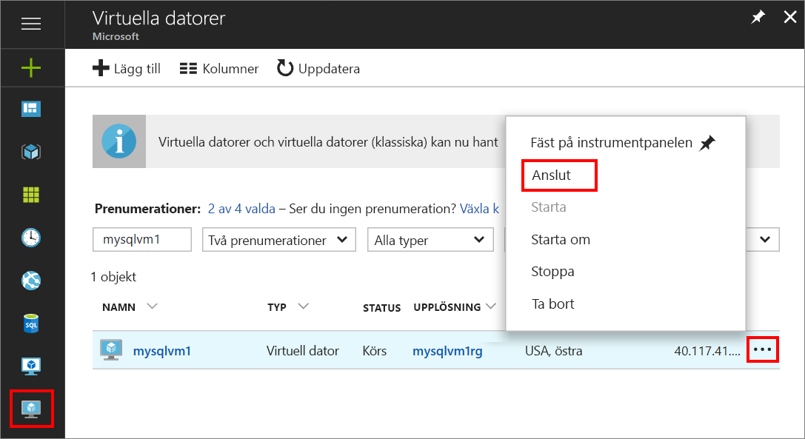
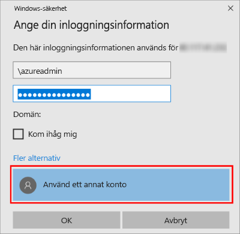

Använd följande anvisningar för att ansluta till den virtuella SQL Server-datorn med Fjärrskrivbord:

1. När den virtuella Azure-datorn har skapats och körs klickar du på symbolen för virtuella datorer på Azure Portal för att visa dina virtuella datorer.

1. Klicka på de tre punkterna **...** vid den nya virtuella datorn.

1. Klicka på **Anslut**.

   

1. Öppna **RDP**-filen som du har laddat ned för den virtuella datorn.

1. Anslutning till fjärrskrivbord meddelar dig att det inte går att identifiera utgivaren av fjärranslutningen. Anslut genom att klicka på **Anslut**.

1. I dialogrutan **Windows-säkerhet** klickar du på **Använd ett annat konto**. Du måste kanske klicka på **Fler alternativ** för att se det här. Ange det användarnamn och lösenord du ställde in när du skapade den virtuella datorn. Du måste lägga till ett omvänt snedstreck framför användarnamnet.

   

När du ansluter till den virtuella SQL Server-datorn kan du starta SQL Server Management Studio och ansluta med Windows-autentisering med hjälp av dina autentiseringsuppgifter som lokal administratör. Om du har aktiverat SQL Server-autentisering kan du också ansluta med SQL-autentisering med hjälp av SQL-inloggningsnamnet och SQL-lösenordet som du konfigurerade under etableringen.

När du har anslutit till datorn kan du direkt ändra inställningarna för datorn och SQL Server efter behov. Du kan till exempel konfigurera brandväggsinställningarna eller ändra konfigurationsinställningarna för SQL Server.